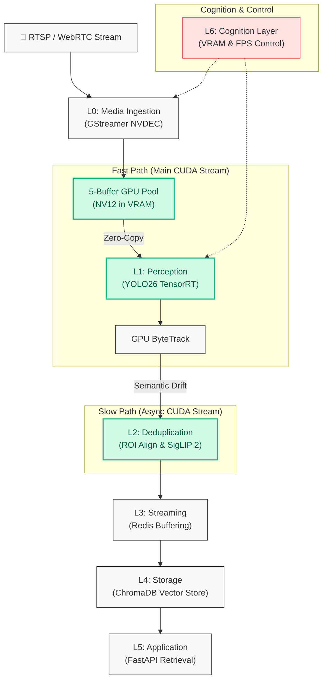

# Saccade: A High-Efficiency Dual-Path Visual Perception System

**Continuous visual reasoning and semantic indexing at the edge.**

---

> **🌍 [繁體中文版 (Traditional Chinese)](README_tw.md)**

---

## 1. Project Motivation & Problem Statement

### The Problem
Traditional video surveillance systems are primarily designed for real-time monitoring but lack **long-term semantic memory**. This results in several critical bottlenecks:
*   **Query Inefficiency**: Searching for a specific historical event (e.g., "Find the red truck from yesterday") requires hours of manual playback.
*   **Computational Waste**: Running heavy Vision-Language Models (VLMs) continuously on every frame is computationally prohibitive for edge devices.
*   **Storage Bloat**: Saving every frame results in massive redundancy and storage costs without providing meaningful insights.

### Our Goal
Saccade aims to transform raw video streams into a **searchable visual memory system**. By mimicking the human visual system's "saccades," we decouple high-speed perception from deep semantic understanding to enable natural language retrieval on constrained edge hardware.

## 2. Proposed Solution: Dual-Track Perception

To address the trade-off between real-time performance and semantic depth, Saccade employs a **Vision-Vector Pipeline** across six logical layers (L1-L6):

### System Architecture (Mermaid)


### Core Data Flow Interaction
1.  **L0 Media Ingestion**: RTSP streams are hardware-decoded via `nvh264dec` into a **5-Buffer GPU Pool**, ensuring frames stay in VRAM.
2.  **L1 Perception (Fast Path)**: YOLO26 performs NMS-free inference directly on GPU pointers. Objects are tracked using GPU ByteTrack.
3.  **L2 Deduplication (Slow Path)**: If an object moves or appears, `roi_align` crops the target, and **SigLIP 2** extracts a 768-dim feature. A **Semantic Drift** check (Cosine Similarity) filters out visually redundant data.
4.  **L3-L4 Persistence**: Filtered events are pushed to **Redis Streams** and micro-batched into **ChromaDB** for long-term memory.
5.  **L5-L6 Governance**: **FastAPI** provides natural language search, while the **Cognition Layer** monitors VRAM usage to dynamically throttle FPS or unload models.

## 3. Design Rationale

### Why Decouple?
Decoupling allows the system to maintain a high frame rate (**120+ FPS**) regardless of the complexity of the semantic extraction. The heavy embedding process is moved to an asynchronous CUDA stream, triggered only by significant visual events.

### Why Zero-Copy?
Moving data between CPU and GPU is the #1 bottleneck in edge AI. Saccade implements a strict **Zero-Copy pipeline**: from hardware decoding to cropping and inference, image data remains entirely within GPU VRAM, reducing PCIe bandwidth usage and CPU load by >85%.

### Why Semantic Drift?
Storing every detection is redundant. We use a **Semantic Drift Handler** (Cosine Similarity < 0.95) to filter out visually similar frames, ensuring the Vector DB only stores unique, high-value visual memories.

## 4. Performance Evaluation

*Tested on NVIDIA GeForce RTX 5070 Ti Laptop GPU (12GB), 1080p @ 30fps RTSP input.*

| Metric | Result | Engineering Impact |
| :--- | :--- | :--- |
| **End-to-End Latency** | **8.31 ms** | Guaranteed real-time response |
| **Pipeline Throughput** | **120.2 FPS** | Handles high-resolution, high-FPS streams |
| **VRAM Footprint** | **1.42 GB** | Fits within constrained 4GB edge devices |
| **Storage Efficiency** | **> 90% Save** | Drastically reduces vector database bloat |

## 5. Limitations & Future Work

*   **Current Limitations**: 
    *   Performance is highly dependent on TensorRT optimization for specific hardware.
    *   Single-camera focus; multi-camera orchestration is not yet implemented.
*   **Future Directions**:
    *   Implementing **Temporal Reasoning** to detect actions (e.g., "running," "falling") rather than just static objects.
    *   Distributed vector querying for cross-camera re-identification.

## 6. Getting Started

```bash
# 1. Start Environment
docker-compose up -d --build
docker-compose exec saccade bash

# 2. Compile Optimized Engines
uv run python scripts/build_yolo_engine.py --onnx models/yolo/yolo26n.onnx --engine models/yolo/yolo26n_native.engine
uv run python scripts/build_siglip_engine.py

# 3. Launch Saccade
./scripts/saccade up
```

---
*This project demonstrates a biologically-inspired approach to bridge the gap between edge perception and semantic reasoning.*
