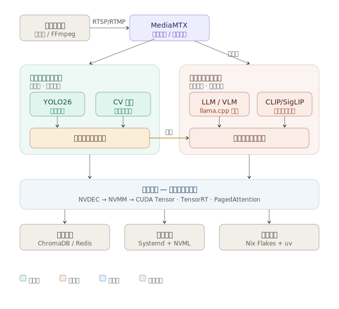

``` txt
yolo-llm/
├── flake.nix                  # Nix Flakes：鎖定 CUDA / GStreamer
├── pyproject.toml             # uv 管理的 Python 依賴
├── .env                       # VRAM 上限、MediaMTX URL 等環境變數
│
├── perception/                # 快路徑 — 持續運行
│   ├── detector.py            # YOLO26 推理封裝（TensorRT 優先）
│   ├── tracker.py             # CV 多目標追蹤
│   ├── entropy.py             # 資訊熵評估，決定是否觸發慢路徑
│   └── zero_copy.py           # NVDEC → NVMM → CUDA Tensor 零拷貝
│
├── cognition/                 # 慢路徑 — 按需啟動
│   ├── llm_engine.py          # llama.cpp 封裝，動態調整 -c / -ngl
│   ├── vlm_engine.py          # Qwen-3.5 / CLIP / SigLIP 視覺推理
│   ├── frame_selector.py      # 從 MediaMTX 拉取高價值關鍵幀
│   └── resource_manager.py    # VRAM / 主記憶體 offload 調度
│
├── media/                     # 媒體閘道層
│   ├── mediamtx_client.py     # RTSP / WebRTC 串流接取
│   └── ffmpeg_utils.py        # NVENC / NVDEC 轉碼工具函式
│
├── storage/                   # 無狀態推理的外部狀態層
│   ├── chroma_store.py        # ChromaDB 向量記憶體
│   └── redis_cache.py         # Redis 即時狀態與事件佇列
│
├── infra/                     # 維運配置
│   ├── systemd/               # .service 單元檔（熱切換用）
│   └── mediamtx.yml           # 串流路徑與緩衝設定
│
└── tests/
    ├── test_pipeline.py       # 端到端整合測試
    ├── test_zero_copy.py      # GPU 零拷貝路徑驗證
    └── benchmarks/            # 延遲 / VRAM 壓力測試
```