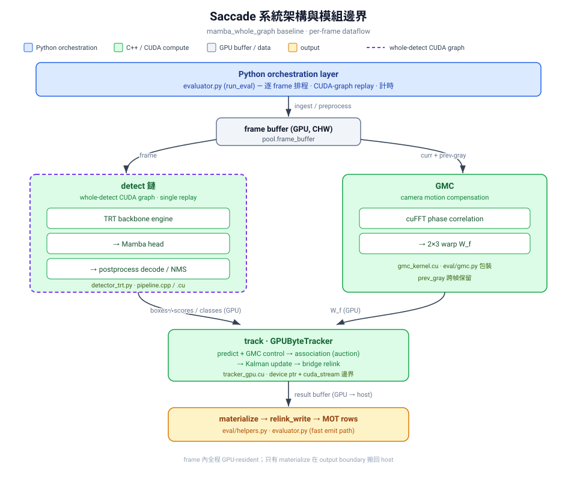

# Saccade 專題展示文件：GPU-first 即時多目標追蹤

> **用途**：本文件是專題簡報、口試與作品展示的主敘事，不取代開發文件。它把
> Saccade 的研究問題、技術貢獻、可驗證結果、展示流程與限制收斂成一份可直接
> 使用的說明。
>
> **數字來源**：現行 headline 以 2026-06-21 的 `frozen_v2` 為準；實驗範圍、
> preset 與評測協定見 [MOT17 Evaluation Configuration](reference/mot17_default_config.md)。
> 歷史 benchmark 或舊 preset 僅用來說明演進，不能與 headline 混合比較。

<!-- fact-owner: current-baseline = docs/TODO.md -->
> baseline 指標的唯一事實來源是 [TODO.md](TODO.md)「當前 Baseline」節；本文件為展示敘事，內含之數字與 ablation 為引用鏡射，不另立事實。

## 30 秒版本

Saccade 是一個以 GPU 為資料面中心的即時多人追蹤系統。它將 YOLO26 TensorRT
backbone 與可替換的 Mamba SSM-FPN detection head 解耦，並以 C++/CUDA 實作
GPUByteTracker，將 GMC、Kalman prediction、Sinkhorn-Auction association、遮擋處理
與雙向軌跡重連維持在 GPU hot path。研究重點不是堆疊更多 ReID 模型，而是先用
ablation 與訊號可分性分析淘汰無效方案，再保留能同時改善身份一致性與延遲的設計。

現行 `mamba_whole_graph` preset 在 MOT17 train / SDP 的七個 sequence 內部評測取得
HOTA **70.2**、IDF1 **78.2**、MOTA **78.4**、AssA **69.7**、413 IDs 與 **269.47
Eval FPS**。

> **⚠️ 數字邊界（必讀，見 [Limitations](#專題範圍與誠實邊界)）**：detection head 的訓練資料
> **涵蓋這同一批 7 個評測序列（in-sample / 全吃）**，因此 **78.2 是 training-set 表現，
> 系統性高估泛化能力，不是 held-out 成績，更不是 MOTChallenge test-server 排行榜成績。**
> 本專題**可主張的核心不是這個絕對值**，而是 **tracker 在固定 detector 上回收的貢獻**
> （bare → full：IDF1 **+6.8** / AssA **+7.3** / IDs −53%）與 **per-mechanism 訊號可分性
> 歸因**——這些 delta 因 tracker 無在評測序列上訓練的權重，leakage 遠輕於絕對值
> （殘留為超參數在同序列上 sweep,亦於 Limitations 揭露）。**leakage-free 泛化數字已補上：
> PersonPath22-trained / MOT17-tested held-out = IDF1 50.2**（vs in-sample 78.2）；該實驗並反證
> 「域差」假說、指出真瓶頸是偵測器 recall（見 [held-out plan](modules/detection/research/holdout_generalization_plan.md)）。

## 專題要解決的問題

一般多目標追蹤常同時面臨三個衝突：

1. 攝影機平移或震動使 motion prediction 偏移。
2. 人群遮擋與交叉容易造成 ID switch，特別是短暫重疊後的錯接。
3. 把 ReID、CPU association 或大量 post-processing 放到每一幀，會破壞即時性與尾延遲。

本專題的問題定義是：

> 在不依賴每幀 ReID 的前提下，如何以 GPU-first pipeline 同時提升多目標追蹤的
> 身份一致性與端到端即時性？

這個問題可分成兩條互相驗證、但責任不同的研究線：

| 線路 | 問題 | 在系統中的角色 | 主要驗證 |
|---|---|---|---|
| SSM-FPN detection head | 如何讓解耦後的 detector head 提供足夠穩定的框與分數？ | 上游感知品質 | DetA、Recall、MOTA、對 tracker 的下游影響 |
| GPU tracker / association | 如何在遮擋、鏡頭運動與斷鏈後維持 identity？ | **主要演算法貢獻** | IDF1、AssA、HOTA、IDs、逐序列一致性 |
| GPU runtime | 如何使前兩者不以延遲交換準確率？ | 共同的實作與部署約束 | profile、FPS、latency、GPU/CPU materialization |

因此，這不是「換一個 detection head」的專題；tracker 是核心研究對象，SSM-FPN 是
可拆解、可量測的協同上游模組。

## 系統概觀



```text
video / MOT17 frame
  └─ GPU ingest + reusable buffers
       └─ TensorRT YOLO26 backbone
            └─ Mamba SSM-FPN head
                 └─ native postprocess (filter / NMS)
                      └─ GPU phase-correlation GMC
                           └─ GPUByteTracker
                                ├─ Kalman prediction and update
                                ├─ Sinkhorn-Auction association
                                ├─ occlusion state + duration-ramp penalty
                                └─ bidirectional bridge relink
                                     └─ MOT output / metrics

optional slow path: event → Redis → Chroma → cognition / API
```

主評測路徑由 [`scripts/eval/mot17.py`](../scripts/eval/mot17.py) 啟動，實際
orchestration 在 [`evaluator.py`](../src/saccade/perception/eval/evaluator.py)。它依序
執行 `fetch → ingest_preprocess → detect → postprocess → GMC → track → materialize →
emit`；ReID 是受 budget 控制的可選分支，而現行 headline preset 明確關閉它。

系統其餘的 streaming、storage、cognition 與 resource 模組是完整 edge-system
展示能力，但不應被包裝成演算法主貢獻：它們負責把慢速 I/O、長期記憶與 RAG 從
perception hot path 解耦。

## 核心技術與可主張的貢獻

### 1. 可替換、解耦的 SSM-FPN detection head

YOLO26 backbone 由 TensorRT 提供多尺度特徵，Mamba head 則在 P3/P4/P5 特徵尺度上
做 cross-scan state-space processing，搭配 gated FPN、PixelShuffle upsample 與
分類／回歸輸出。這種拆法讓 backbone、head 與 tracker 可以分開替換和測試，而不必
把所有改動埋在單一 end-to-end detector 裡。

現行線上 lineage 為 **Option F / v14-replica T3→T1**，使用 `native_640`、
`preprocess: none` 與 whole-detect CUDA Graph。重點不是宣稱 SSM 天生勝過所有
detector，而是有明確的工程與實驗結論：

- SSM head 的訓練、checkpoint lineage、失敗的 temporal 變體與 kernel 注意事項均可
  追溯至 [Option F 設計](modules/detection/option-f-mamba-head.md)。
- T3→T1 GT2 curriculum 的增益以 box/score 穩定性傳導到 tracker；它不是額外 ReID。
- temporal SSM blocks、per-channel SSM A 與 MOT20 mix 等方案已做 NO-GO 歸因，沒有
  被選入 headline。這能說明專題有「假說 → 實驗 → 淘汰」的研究閉環。
- whole-detect CUDA Graph 將 TensorRT backbone、Mamba head 與 decode/postprocess
  launch 集合為可重播圖，減少 Python/launch overhead；詳細 profile 與限制見
  [whole-graph 分析](modules/detection/mamba_whole_graph_analysis.md)。

### 2. GPUByteTracker：專題的主要演算法貢獻

追蹤器以 [`tracker_gpu.cu`](../src/tracking/tracker_gpu.cu) 為核心，將狀態 prediction、
cost construction、Sinkhorn-Auction matching、track lifecycle、GPU buffer 管理及
relink kernels 放在 native CUDA 路徑。Python wrapper
[`tracker_gpu.py`](../src/saccade/perception/tracking/tracker_gpu.py) 負責配置與
orchestration，而不是承接大規模每幀資料面工作。

目前保留的 tracker 設計如下：

| 元件 | 解決的問題 | 為何保留 |
|---|---|---|
| GPU phase-correlation GMC | 攝影機移動使預測位置整體偏移 | 累積貢獻中最顯著：IDF1 +2.8pp、IDs −133 |
| Kalman + GPU Sinkhorn-Auction | 兼顧 motion prediction 與可平行化的 assignment | 關聯延遲記錄約 0.67 ms；避免 CPU association round-trip |
| 同高遮擋 gate | 交叉、重疊後的錯接 | 純幾何修復，改善 crossing-swap；不依賴 appearance |
| OAO duration-ramp | 長時間遮擋與短暫交叉不應使用同一懲罰 | 以重疊持續時間調節 penalty，避免只改善單一高密度 sequence |
| bidirectional bridge relink | lost track 與新 detection 的候選生成受 age gate 限制 | farewell archive + 雙向外推改變候選生成；IDF1 +2.1、AssA +2.8、IDs −13.6% |
| interpolation | 短 gap 的輸出連續性 | 回收 FN，但明確記錄其 FP 代價與上游限制 |

這些模組並非任意堆疊。它們共用一個乘法式 association cost，並在同一個指數項上掛載
各種幾何 penalty/reward；以下是最值得在口試展示的核心公式，完整推導與 source 對照
見 [全局數學模型](reference/math_model.md)。

**關聯成本（主線核心，§7）**——track `i` 與 detection `j` 的成本為
base quality `A_ij` 經一組 penalty 的乘法衰減：

$$
c_{ij} = \mathrm{clamp}\left(1 - A_{ij}\,e^{-\Pi_{ij}},\; 0,\; 1\right),
\qquad
\Pi_{ij} = P_{\mathrm{OAO}} + P_{\mathrm{vel}} + P_{\mathrm{occ}} - R_{\mathrm{stab}}
$$

baseline 為 ReID-free，故 $A_{ij} = \mathrm{IoU}(B(\tilde{x}_i), b_j)$（$\tilde{x}_i$ 是
已套 GMC control input 並完成 Kalman predict 的 state）。乘法形式的好處是 penalty
不會把成本推成負值或無界，且各項在 $\exp$ 內可解釋為對 IoU 的折扣。

**OAO duration-ramp（§7.4）**——以重疊「持續時間」而非單一瞬時重疊調節懲罰，讓短暫
crossing 不被過早壓制：

$$
o_i = o_i^{\mathrm{base}}\min\!\left(1, \frac{d_i}{N_{\mathrm{ramp}}}\right),
\qquad
P_{\mathrm{OAO}}(i,j) = \tau_{\mathrm{OAO}}\, o_i
$$

其中 $o_i^{\mathrm{base}}=\max_{k\ne i}\mathrm{IoU}(B(x_i),B(x_k))$ 是與其他 track 的最大
重疊，$d_i$ 是連續重疊幀數；baseline $\tau_{\mathrm{OAO}}=0.50$、$N_{\mathrm{ramp}}=25$。

**GMC control input（§5）**——phase-correlation 估出 frame-to-frame 平移 $W_f$，在
Kalman predict **之前**作為 deterministic control input 加到位置，使 velocity state
只學物件殘差運動而非相機運動：

$$
W_f =
\begin{bmatrix}
1 & 0 & t_x \\
0 & 1 & t_y
\end{bmatrix},
\qquad
(t_x, t_y) = (p_x, p_y)\, d\, \gamma_{\mathrm{gmc}}
$$

$\gamma_{\mathrm{gmc}}\in[0,1]$ 是 phase-correlation 可信度（peak/RMS）的軟縮放。

**Auction value（§8）**——assignment 不做完整 Sinkhorn 迭代，而是把成本經 softmin
溫度轉成 value，再跑單輪平行貪婪 auction 的多階段級聯：

$$
p_{ij} = e^{-\lambda c_{ij}}\, G_{\mathrm{aspect}}(b_j),
\qquad \lambda = 10
$$

**Bidirectional bridge relink（§10）**——lost track 與新 candidate 以速度加權
雙向 full-gap 外推的殘差判斷是否同一身份，殘差皆以 reference height 正規化：

$$
d_{\mathrm{bridge}} = w\,\frac{r_{\mathrm{fwd}} + r_{\mathrm{bwd}}}{2} + (1-w)\,d_h,
\qquad
\text{accept} \iff d_{\mathrm{bridge}} \le \tau_{\mathrm{bridge}}
\;\land\;
\frac{\bar h_\ell}{\bar h_c}\in[h_{\mathrm{lo}}, h_{\mathrm{hi}}]
$$

實際參數由 [`mamba_whole_graph.yaml`](../configs/presets/mamba_whole_graph.yaml) 固定，
並在 sequence setup 時下傳至 C++ tracker。

### 3. 以反證與 AUC 歸因管理演算法探索

專題的重要成果不只有「成功的模組」，還包括能說明為何不採用某些看似合理的方向。
專案保留 [NO-GO registry](reference/no_go_registry.md)，並區分三種結果：有害、訊號
結構天花板、以及受特定 blocker 遮蔽的中性結果。

最適合口試展示的三個例子：

1. **Appearance/ReID ceiling**：在 GMC 開啟後，Appearance Bank 零增益且 FPS
   −17.3；多個模型與訓練策略也未提供可靠長 gap identity 訊號。因此 headline 採
   ReID-free 設計，而不是把昂貴但不穩定的模組硬塞入流程。
2. **Motion relink 的復活**：原始 motion/semantic relink 因 age gate 擋下
   86–89% 候選而中性。雙向 bridge 改變候選生成後，同類 motion 訊號才轉化為可量測
   增益。這證明「訊號有效」與「機制讓訊號有機會作用」是兩件事。
3. **OAO 的重設計**：plain OAO 曾因只改整列 cost 而無法改變排序；後續發現高密度
   與短暫交叉的關鍵分離軸是重疊時間，才以 duration-ramp 得到 Pareto 改善。

這種做法比列出大量參數 sweep 更有說服力：每個保留的模組都能回答「訊號是什麼、
它在哪一個機制位置生效、若無效是否能歸因」。

### 4. GPU-first runtime 與系統工程

效能工程是本專題的第三支柱，但它服務於研究主線，而非取代研究問題：

- TensorRT backbone、native postprocess、GMC、tracker 和結果 buffer 優先留在 GPU。
- whole-detect 與 tracker CUDA Graph 降低固定 shape 路徑的 launch overhead。
- `--double-buffer` 將可重疊工作排程到相鄰 frame；因此 Eval FPS 與單幀 latency
  不是互為倒數，報告時不可自行用其中一個推導另一個。
- C++/CUDA 端包含 NMS、GMC、SSM scan、assignment、relink 與 result compaction；
  Python 負責實驗控制、評測與 fallback。

外圍系統採取不阻塞的設計：RTSP/DALI/零拷貝接入、Redis micro-batching、Chroma
long-term memory、事件觸發 RAG，以及依 VRAM 水位進行 NORMAL → REDUCED → FAST_PATH
→ EMERGENCY 的降級。它們適合 Demo 顯示「可部署性」，但不應和 tracker 研究成果混為
一談。

## 可驗證成果與數字紀律

### 現行 headline：`frozen_v2`

| 指標 | 值 |
|---|---:|
| 評測資料 | MOT17 train / SDP，七個 sequence，GT-weighted internal evaluation |
| ⚠️ leakage | **detection head + teacher + cache 全部在這 7 個序列上訓練（in-sample）→ 此為 training-set 表現，非泛化、非 held-out**；**leakage-free held-out（PersonPath22-trained）= IDF1 50.2**，見 [held-out 計畫](modules/detection/research/holdout_generalization_plan.md) |
| HOTA | **70.2** |
| IDF1 | **78.2** |
| MOTA | **78.4** |
| DetA / AssA | **70.9 / 69.7** |
| IDs | **413** |
| Recall / Precision | **81.0 / 97.2** |
| Eval FPS | **269.47** |
| mean latency | **7.42 ms** |
| 環境 | RTX 5070 Ti Laptop GPU 12 GB、Driver 610.62、CUDA UMD 13.3 |

重現命令：

```bash
uv run python scripts/eval/mot17.py \
  --preset mamba_whole_graph \
  --detector SDP \
  --double-buffer \
  --output out/frozen_v2
```

嚴格表述規則：

- 只能稱為「MOT17 train/SDP 內部評測結果」，不可稱 public test leaderboard 或
  official SOTA。
- 不把不同 GPU、不同輸入解析度、不同 sequence subset 或不同 profiling 模式的 FPS
  並列成同一張比較表。
- `frozen_v1`、舊 `mamba_optimal` 與 legacy `speed` / `baseline` 是演進證據；若使用，
  必須標出日期、preset、資料範圍與量測協定。
- 若新增目前結果，先以同一個 frozen run 產出 metrics、per-sequence 結果和 profile，
  再更新本文件與 README。

### 可直接放入報告的已驗證增益

下表的 delta 是各自文件所記錄的累積／對照實驗，**不是**可以相加回推
`frozen_v2` 的公式。其用途是解釋設計選擇，而不是取代一次完整消融重跑。

| 設計 | 已記錄的效益 | 展示意義 |
|---|---|---|
| GPU GMC | IDF1 +2.8pp；IDs −133 | 首先解決相機運動，避免後續用昂貴 ReID 補救 |
| bidirectional bridge relink | IDF1 +2.1；AssA +2.8；IDs −13.6%；FP −14% | 候選生成比單純調 gate 更關鍵 |
| same-height occlusion gate | IDF1 +0.5；AssA +0.4 | 可解釋的幾何式 crossing-swap 修復 |
| OAO duration-ramp | 在其對照中 IDF1 75.9→77.6、HOTA 68.1→69.9、AssA 66.2→69.1 | 從失敗的 plain penalty 推導出時間條件化設計 |
| Option F Mamba lineage | legacy baseline 約 IDF1 52 → v14 lineage 70+；現行由 `frozen_v2` 統一驗證 | detector/head 改良與 tracker 改良需分開說明 |

資料來源分別為 [Pipeline Distilled](PIPELINE.md)、[MOT17 設定](reference/mot17_default_config.md)、
[current TODO baseline](TODO.md) 與 [NO-GO registry](reference/no_go_registry.md)。

## 實驗設計：如何讓評審看見因果

完整實驗不應只放「最終版 vs baseline」。建議使用下列四格矩陣分離 detector 與 tracker
的貢獻；每一格在相同 data split、sequence、warm-up、GPU 與 output protocol 下測試。

| | baseline tracker | full GPU tracker |
|---|---|---|
| baseline detector | A：共同基準 | C：tracker 的獨立貢獻 |
| Mamba SSM-FPN | B：head 的獨立貢獻 | D：完整系統 |

每格至少報告 HOTA、DetA、AssA、IDF1、MOTA、IDs、FPS 與 profile。解讀方式：

- B − A：改善 detection 輸入後，追蹤自然得到多少收益。
- C − A：不改 detector 時，tracker 的 association/relink 是否仍然有效。
- D − B 與 D − C：兩條線是否互補，而不是其中一者掩蓋另一者。
- 每個 delta 再拆 per-sequence，避免單一 showcase sequence 拉高總分。

tracker 內部的最小消融序列可採：`bare → +GMC → +bridge relink → +same-height gate →
+duration-ramp`。若時間只夠展示少數表格，優先顯示 GMC、bridge 與 duration-ramp；它們
最能說明「問題、機制、結果」的因果鏈。

> **這些模組並非彼此獨立，必須以累積序列（而非「單獨加到 bare」）評估。** 實測
> （7-seq MOT17/SDP、同 preset）顯示：在 bare tracker 上單獨開啟時，GMC（+4.5 IDF1）
> 與 bridge relink（+1.6）為正，但 same-height occ gate（−1.2）與 OAO duration-ramp
> （−1.3）反而為負；bridge 的增益在 GMC 之上也由 +1.6 縮為 +0.8（次可加）。根因是
> **這兩個幾何／時序 gate 需要較高的幀間（前後）一致性**——occ gate 比較同高足點
> 幾何、OAO 累積連續重疊幀數，兩者都假設框在相鄰 frame 間位置一致。相機運動未經
> GMC 補償時，框帶著相機平移抖動，足點幾何與重疊持續時間的訊號被污染，gate 因此
> 誤觸發。**GMC 先建立前後一致性，這些 gate 才有乾淨訊號可用**；因此它們的貢獻只
> 在 GMC（及其餘關聯機制）已在場的累積上下文中才成立。這也解釋了為何
> 「已驗證增益」表的 delta 來自各自的累積／對照實驗，不能相加回推 `frozen_v2`。

## 8–10 分鐘展示腳本

### 0:00–1:00：問題與成績

- 先播固定的 MOT17-04／遮擋影片片段，讓觀眾看到 ID label 在交叉或鏡頭移動時的難點。
- 一句話定義：在不依賴每幀 ReID 下，同時追求 identity consistency 與 real-time。
- 顯示 `frozen_v2` 表格，同時說清楚這是 MOT17 train 的 internal evaluation。

### 1:00–3:00：系統資料流

- 以本文件的資料流圖說明 detector、GMC、tracker、relink 的順序。
- 只提一次外圍 Redis/Chroma/RAG：它們是慢路徑，設計目的就是不干擾主迴圈。
- 點出資料面留在 GPU；Python 主要做 orchestration 和評測。

### 3:00–5:30：tracker 深度（主段落）

- GMC：相機移動是一階問題，先消除共同偏移。
- GPU association：為何選 Sinkhorn-Auction，而不把偵測框送回 CPU 做 Hungarian。
- bridge relink：原本的 age gate 為何讓 motion signal 沒有機會作用；如何以 archive +
  雙向外推改變候選生成。
- duration-ramp：為何「遮擋」不是單一條件，而要區分短 crossing 和長人群重疊。

### 5:30–7:00：SSM-FPN 與 runtime

- 說明 YOLO backbone/head 解耦；SSM head 是可被單獨消融的上游改良。
- 顯示 whole-detect CUDA Graph 的目的：降低 launch overhead，不把速度建立在犧牲 tracker
  或刪除必要 stage 上。
- 執行或展示 stage profile，證明瓶頸落點，而不是只報單一 FPS。

### 7:00–8:30：研究嚴謹性

- 選 ReID ceiling 或 OAO revival 一例，說明「有直覺不等於有可分訊號」。
- 顯示 NO-GO registry：負結果被保留以避免重複探索，也能指導下一輪工作。

### 8:30–10:00：結論與下一步

- 收斂為三件事：高品質可替換感知、GPU tracker identity recovery、可重現 runtime。
- 下一步先針對低 AssA sequence 進行 per-sequence error budget，而不是加入更大的模型或
  無限制掃參數。

## 建議展示操作

### 已完成結果的重播

```bash
uv run python scripts/eval/mot17.py \
  --preset mamba_whole_graph --detector SDP --double-buffer \
  --output out/frozen_v2
```

### 只展示 latency stage

```bash
uv run python scripts/eval/mot17.py \
  --preset mamba_whole_graph --detector SDP \
  --profile-stages --latency-only \
  --sequences MOT17-04-SDP --max-frames 150 --warmup-frames 50 \
  --output runs/showcase_profile

uv run python scripts/eval/latency_report.py runs/showcase_profile
```

### 重新產生消融與模組貢獻

```bash
uv run python scripts/eval/ablation_mot17.py --category detection,geometry
uv run python scripts/eval/pipeline_contribution.py --detector SDP
```

模型、TensorRT engine、native extension、CUDA hardware 與 local MOT17 datasets 是上述命令
的前置條件。若現場硬體不確定，應預先錄製固定 input/output 影片、stage profile 與
metrics artifact；不要在口試現場首次 build TensorRT engine。

## 常見口試問題與可回答的重點

| 問題 | 回答要點 |
|---|---|
| 這是 detector 專題還是 tracker 專題？ | tracker 是主演算法貢獻；SSM-FPN 是可分離驗證的上游改善。四格實驗矩陣區分兩者。 |
| 為何不用 ReID？ | 不是沒有實作，而是在 GMC 開啟的此資料設定中，Appearance Bank 零增益且 FPS −17.3；因此 headline 選擇 ReID-free。 |
| 269 FPS 是否等於 3.71 ms？ | 不可直接換算。`--double-buffer` 使工作重疊，Eval throughput 與單幀 latency 是不同量測；須附帶 protocol。 |
| 結果是否可和公開 leaderboard 比？ | 不可直接比。結果是 MOT17 train/SDP 的 internal evaluation，未送官方 test server。 |
| 78.2 是泛化成績嗎？ | **不是。** detection head + teacher + feature cache 全部在這同一批 7 個序列上訓練，故 78.2 是 training-set（in-sample）表現，系統性高估泛化。可主張的核心是 **tracker 在固定 detector 上的貢獻 delta**（+6.8 IDF1，無在評測序列上訓練的權重，leakage 輕）；leakage-free 的 detector 泛化數字已實測：全鏈在 PersonPath22 訓練、MOT17 完全不進訓練 → **held-out IDF1 50.2**（且實驗反證域差、指出瓶頸為偵測器 recall），見 [held-out plan](modules/detection/research/holdout_generalization_plan.md) §6。 |
| 為何不持續加入更多 tracker heuristic？ | 每個候選先看 AUC／候選攔截率／逐序列影響；NO-GO registry 已證明許多直覺模組會傷 recall 或只在單一 sequence 有效。 |
| 外圍 RAG 是否干擾即時追蹤？ | 不會作為主路徑依賴。它由 Redis/Chroma 異步連接，資源層在 FAST_PATH／EMERGENCY 時可跳過慢路徑。 |

## 專題範圍與誠實邊界

**⚠️ 首要誠實邊界 — train/eval leakage：** detection head、gated teacher（MOT17-finetuned
YOLO backbone）與 feature cache **全部在這同一批 7 個評測序列上訓練**，因此 78.2 / 70.2 等
**絕對指標是 training-set（in-sample）表現，系統性高估泛化，不是 held-out、更非 test-server
成績**。主動揭露這點是方法論誠信的一部分，不是弱點。應對方式：
- **可主張的核心改以 tracker 貢獻 delta 表述**（bare → full：IDF1 +6.8 / AssA +7.3 / IDs −53%）。
  tracker（GMC / bridge / occ-gate / OAO）無在評測序列上訓練的權重，配置間的 delta leakage 遠輕於
  絕對值；殘留為其常數在同序列上 sweep（超參數 leakage，較輕，一併揭露）。最 leakage-robust 的
  是 per-mechanism 訊號可分性（AUC）歸因。
- **leakage-free 的 detector 泛化數字已實測**（2026-06-22）：全鏈在 **PersonPath22** 訓練、MOT17 完全
  不進訓練 → **held-out IDF1 50.2 / HOTA 42.7 / AssA 46.6**（vs in-sample 78.2，−28pp = head 洩漏 −14
  + backbone 洩漏 −14）。三個歸因實驗的收穫：(a) **association 增強會 transfer**（GMC-only vs full 僅
  −1.2 IDF1，relink/OAO/stability 在沒看過的域仍 +2.8 AssA → 非 MOT17 過擬合）；(b) **PP22 in-domain
  test 反證域差假說**（自己的域 recall 42.8% 反而 < MOT17 cross 53.5%）→ 真瓶頸是**偵測器 recall 弱**
  （sparse keyframe + lr-yolo 太小、LR schedule 把學習掐死），不是域 / tracker / 訓練長度。詳見
  [held-out generalization plan](modules/detection/research/holdout_generalization_plan.md) §6。

接著把其餘範圍切成三層：

1. **要答辯的核心**：SSM-FPN head、GPUByteTracker、GMC、association、occlusion、bridge
   relink、端到端 GPU runtime。
2. **展示系統能力**：RTSP/DALI、Redis/Chroma、API、cognition、VRAM degradation。
3. **不該過度主張**：**把 in-sample 78.2 當泛化/SOTA-adjacent 成績**、跨攝影機 long-term ReID、
   官方 MOTChallenge 排名、任意硬體上相同 FPS，以及歷史實驗數字可直接代表現行 preset。

目前最大的風險不是技術深度不足，而是內容過多導致主貢獻失焦。報告與簡報的篇幅建議
約 55% tracker/recovery、25% SSM-FPN、15% GPU runtime、5% 外圍部署；所有其他實驗
放附錄並由本文件的 source map 回溯。

## 附錄：單機可重現的累積消融

下表是 2026-06-21 在本機（RTX 5070 Ti Laptop GPU）以 `mamba_whole_graph` preset、
MOT17 train / SDP 七序列實跑的**累積消融**：從全關 bare tracker 開始，依
`+GMC → +bridge relink → … → full headline` 逐步開啟。它是「已驗證增益」表的**單機
可重現佐證**，不取代各模組自有文件的對照實驗。完整數據（per-seq、模組非獨立性矩陣、
double-buffer bit-exact 證據、兩操作點延遲）見
[frozen_v2 ablation benchmark](reference/benchmarks/frozen_v2_ablation.md)。

| 配置 | IDF1 | MOTA | HOTA | AssA | IDs | Rcll | FP |
|---|---:|---:|---:|---:|---:|---:|---:|
| bare（GMC / bridge / occ-gate / OAO 全關） | 71.4 | 75.3 | 65.0 | 62.4 | 888 | 79.3 | 3581 |
| + GMC | 75.9 | 77.7 | 67.9 | 66.4 | 445 | 81.3 | 3616 |
| + GMC + bridge relink | 76.7 | 78.2 | 68.5 | 67.2 | 406 | 81.5 | 3284 |
| **full headline `frozen_v2`**（+ occ-gate + OAO 等全開） | **78.2** | **78.4** | **70.2** | **69.7** | **413** | **81.0** | **2589** |

bare → full：IDF1 **+6.8**、HOTA **+5.2**、AssA **+7.3**、IDs 888→413（**−53%**）。

數字紀律與解讀注意：

- **品質指標 run-to-run bit-exact**：同一配置重跑，per-sequence MOT result 檔
  md5 完全一致（此 preset `reid_mode: off` + GMC graph path 不觸發 GPU-decode /
  pipeline-relink 的 shared-buffer race）。FPS / latency 仍為 timing 量測，會有
  ±1 FPS 的系統噪聲。
- **`--double-buffer` 只影響速度，對品質 bit-exact**：full preset 開 / 關
  double-buffer，raw MOT result 檔 md5 完全相同（IDF1/HOTA/MOTA/IDs 一字不差），
  但 throughput 143.8 → 270.4 FPS（**+88%**）。它把 detect(N) 與 tracker(N−1) 排到
  相鄰 frame 並發，不改變任何追蹤決策。注意這是**吞吐量**提升，不是單幀延遲下降——
  no-double-buffer 的單幀 mean latency 反而較低（6.34 vs 7.39 ms）；throughput 與
  single-frame latency 是不同量測，不可互推。因此附錄表 `+GMC+bridge`(76.7) →
  `full`(78.2) 的 +1.5 IDF1 全部來自 occ-gate + OAO，double-buffer 不貢獻品質。
- **模組彼此不獨立**：各步驟的 delta 不可加，也不可拆成「單獨加到 bare」。實測
  same-height occ-gate 與 OAO duration-ramp **單獨加到 bare 時為負**（各約
  −1.2 / −1.3 IDF1），只有在 GMC 先建立幀間（前後）一致性後才轉為增益；bridge 的
  增益也由單獨 +1.6 在 GMC 之上縮為 +0.8（次可加）。原因見「實驗設計」節的前後
  一致性說明。
- 因此這張表只能讀成**累積因果鏈**（每一列在前一列之上的邊際效果），不能與
  「已驗證增益」表的 delta 互相加減。

重現：`bare` 用
`--no-gmc --no-relink-bridge-enabled --no-occ-state-enabled --oao-tau 0`，再逐項改回
preset 預設；full headline 即本文件「現行 headline」節的 `--double-buffer` 命令。

## 證據與延伸閱讀

| 要查的事 | 權威來源 |
|---|---|
| 現行 metrics、protocol、preset 形狀 | [reference/mot17_default_config.md](reference/mot17_default_config.md) |
| 累積消融、模組非獨立性、double-buffer bit-exact、延遲兩操作點 | [reference/benchmarks/frozen_v2_ablation.md](reference/benchmarks/frozen_v2_ablation.md) |
| 全局數學模型、公式與符號對照 | [reference/math_model.md](reference/math_model.md) |
| 演算法主線、GO / NO-GO 與主路徑 | [PIPELINE.md](PIPELINE.md) |
| 當前 baseline 與 backlog | [TODO.md](TODO.md) |
| SSM-FPN 設計與訓練／失敗實驗 | [modules/detection/option-f-mamba-head.md](modules/detection/option-f-mamba-head.md) |
| whole-graph runtime 分析 | [modules/detection/mamba_whole_graph_analysis.md](modules/detection/mamba_whole_graph_analysis.md) |
| GPU tracker 架構與資料面 | [architecture/README.md](architecture/README.md)、[`src/tracking/tracker_gpu.cu`](../src/tracking/tracker_gpu.cu) |
| 負結果與訊號歸因 | [reference/no_go_registry.md](reference/no_go_registry.md) |
| 評測、profile、ablation 指令 | [../scripts/eval/README.md](../scripts/eval/README.md) |
| 測試與驗證範圍 | [TESTING.md](TESTING.md) |

---

**展示前檢查**：確認 GPU／driver／engine／dataset 路徑，重跑或保留 `frozen_v2` artifact；
確認簡報每個數字均註明資料範圍與量測協定；只選 4–6 組能回答因果問題的消融，其餘
放在附錄。
