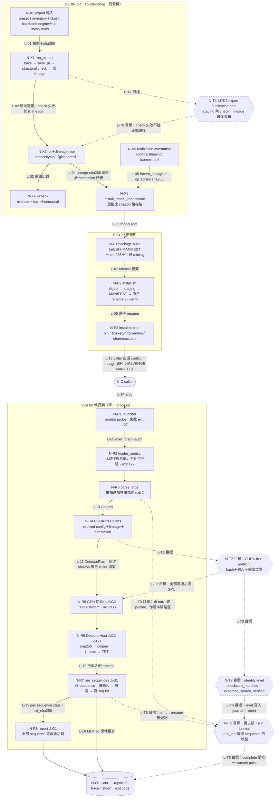

<!-- doc-status: proposed -->
<!-- doc-promotion: none -->
<!-- doc-date: 2026-10-09 -->
<!-- doc-module: cross -->

# S-SHIP／S-EXPORT 架構圖與接口契約（#536 第一批）

本稿是 [#536](https://github.com/raylei50653/saccade/issues/536) B0／B1 的第一批設計，只處理三列已批准的需求：[REQ-535-01-01](capability_requirements_535.md#req-535-01-01)、[REQ-535-01-02](capability_requirements_535.md#req-535-01-02)、[REQ-535-08-02](capability_requirements_535.md#req-535-08-02)。適用範圍是 ledger 的 [S-SHIP](capability_requirements_535.md#scope-535-shipping) 與 [S-EXPORT](capability_requirements_535.md#scope-535-export)，決策邊界依 [第一切片決策](capability_requirements_535.md#decision-535-first-slice)；本稿不重述也不擴大。

**狀態用語**：`observed as-is` 是在 source baseline `c45a24da953ffd16d3b98478cae79954a45204f4` 讀原始碼得到的現況，沒有跑 runtime、GPU 或 package；`proposed target` 是本稿提出、**尚未批准**的設計。本稿沒有任何 `accepted target` 或 `implemented` 項目。需求批准不等於設計批准，設計批准也不等於實作已驗證。

**本稿不擁有的內容**（只引用）：CAP／REQ 與支持裁決歸 [#535 ledger](capability_requirements_535.md)；run 狀態的 transition 語義與 failure／degradation 狀態機歸 [#537](https://github.com/raylei50653/saccade/issues/537)；模型 bundle schema、trusted expected identity 的來源、ABI／SM／TRT pairing 歸 [#549](https://github.com/raylei50653/saccade/issues/549) S1；requirement↔check 對應與 as-built 驗收歸 [#541](https://github.com/raylei50653/saccade/issues/541)；發行權利歸 #547。既有 #465 契約（[shipping boundary](../reference/native_runtime_shipping_boundary.md)、[resolved config](../reference/native_runtime_resolved_config.md)、[closeout](../reference/native_runtime_closeout.md)）不重開。

## 1. 總圖

同一個圖源同時畫現況和目標。圖例不只靠顏色：

| 標記 | 意思 |
|:--|:--|
| 方框 `N-…`、實線 `L-01…L-16` | observed as-is（source-inspected） |
| 六角框 `N-T…`、虛線 `L-T…`、標籤以「目標」開頭 | proposed target，未批准、未實作 |
| 標籤中的 `⚠G1`／`⚠G2`／`⚠G3` | 第 3 節的現況差距落在這裡 |

**為什麼這樣分**：執行期的判斷全部在一個 process 裡，所以總圖按「安裝期／執行期／export 期」三個信任與時間邊界切，不按目錄切。三個目標節點都是在現有路徑上加檢查點，不新增層或框架：N-T2 把已存在的 CUDA-free plan 階段（N-R4）擴成完整 preflight；N-T1 只是替 N-R7／N-R8 已在產生的資料加上 run identity、逐檔 temp→rename 與單一 commit point（整個 run 仍不是原子交易）；N-T4 把 exporter 已有的 check 改成發布條件。Python library、eval、online-service 的路徑不在本圖，也不從本圖繼承任何保證。

## 2. 現況追查（observed as-is）

### 2.1 S-EXPORT

1. [`run_export`](../../scripts/model/export_headline_mamba_head_torchscript.py)：`.pt` 或 `.lineage.json` 已存在且未給 `--overwrite` 就拒絕。之後依序載入 `build/libsaccade_scan_torchop.so`（DT_NEEDED 有 libpython／libtorch_python 即拒絕），經 [`resolve_inputs`](../../scripts/model/export_headline_mamba_head.py) 把 preset 與 inventory 綁定（ckpt sha256 不符就拒絕；backbone 不符只記成 `backbone_engine_sha256_match=false`），trace（遇到 Python op 或不在 allowlist 的 tracer warning 就拒絕）。
2. `save` 以 `torch.jit.save` 直接寫到正式路徑，然後跑 structural check（合成輸入，與 eager head 逐位元比對；不是 parity）。**不論 check 結果都寫 lineage**，check 失敗時 exit 1。
3. `--check` 重新 trace，比對 `content_sha256`、檔案 sha256、op library sha256、ckpt sha256，再跑一次 structural check，不寫任何檔案。
4. Shipping 取用 export 產物的唯一入口是 [install_model_root.cmake](../../shipping/cmake/install_model_root.cmake)：lineage 的 sha256 必須等於 committed [attestation](../../configs/shipping/mamba_head_realization.attestation.json) 的 `frozen_lineage.sha256`；head、engine 比對 lineage 記的 sha256，op library 比對 attestation 記的 sha256，都相符才複製。所以實際上的「shipping 接受」紀錄是那份 committed attestation，exporter 本身沒有接受狀態。

### 2.2 S-SHIP

1. **安裝期**：[install.sh](../../shipping/package/install.sh) 依序檢查 digest、在 staging 解開、比對 MANIFEST 的完整清單、size、sha256、mode，最後原子 rename；`--verify` 用 tree 內的 MANIFEST 重新檢查。digest 不是簽章，minisign 由使用者在安裝器之外驗證（[package README](../../shipping/package/README.txt)）。
2. **launcher**：[saccade_track.sh](../../shipping/launcher/saccade_track.sh) prefix 含 `:`／`;` 時 exit 2；清掉 `LD_PRELOAD`／`LD_AUDIT`／`LD_LIBRARY_PATH`；auditor probe 沒有回 ready 就 exit 127；之後 exec 系統 loader，帶 `--library-path lib/vendor --audit`。
3. **auditor**：[loader_audit.c](../../shipping/src/loader_audit.c) 在 `la_objsearch`／`la_objopen` 執行。bundled 名稱只能來自 `lib/vendor/`，operator library 只能來自 `<prefix>/share/saccade/build/`，否則 `_exit(127)`。它比的是路徑和 SONAME family，不比位元組，而且在**任何**後續的 object load 都可能觸發。
4. **CLI**：[saccade_track.cpp](../../shipping/tools/saccade_track.cpp) `parse_args` 在讀任何檔案前拒絕未知選項或不完整的介面；`run` 先 `require_distinct_sequences`，再用 strict loader 讀 resolved config，然後建立 Serial／DoubleBuffer runtime。`main` 把所有 `std::exception` 轉成 stderr 訊息與 exit 2。
5. **Runtime 建構順序**（[serial_runtime.hpp](../../shipping/include/saccade_shipping/serial_runtime.hpp)、[double_buffer_runtime.hpp](../../shipping/include/saccade_shipping/double_buffer_runtime.hpp) 的成員宣告順序）：
   - ingest／detector／output／schedule plans 都不碰 CUDA。[`plan_detector_files`](../../shipping/src/detector_plan.cpp) 在這一步讀 lineage 與 attestation，檢查欄位與 config 是否一致、attestation 是否綁到這份 lineage 的 sha256；
   - 接著 `Stream` 成員呼叫 `cudaStreamCreateWithFlags`，`JpegDecoder` 建立 nvJPEG handle（**GPU 初始化**）；
   - 再來是 [`DetectorHost`](../../shipping/src/detector_host.cpp)：先算三個檔案的 sha256，再 `dlopen`，設定 runtime requirements 並讀回，`torch::jit::load`，檢查 graph，最後建 TRT engine 並檢查 I/O。
   這些檢查都在第一個 sequence 之前完成，但檔案 hash 是在 GPU 初始化**之後**才做。
6. **Sequence loop**：[track_driver.hpp](../../shipping/tools/track_driver.hpp) `run_sequences` 先 `create_directories(out)`，再逐個 sequence 執行 `read_sequence_input`（seqinfo.ini／img1 的檢查在**這時**才做）→ 推論 → `write_text(<out>/<seq>.txt)`。`write_text` 用 `ofstream` 直接截斷正式路徑再寫入，不經 temp 檔。全部 sequence 完成後才寫 `--report`（`saccade.native_track_report/v2`，內容有 plan bindings、load report、每個 sequence 的 stats 與 `txt_sha256`），寫完回傳 0。
7. **期望值從哪裡來**：DetectorHost 比對的期望 sha256 全部來自 caller 指定的 `--lineage`／`--attestation`；`--attestation` 在 CLI 上是可選的。執行期不讀 MANIFEST，也不比對 committed attestation 或簽章。report 只記錄 `lineage`／`attestation` 的路徑字串，沒有記錄這兩個檔案本身的 sha256。

## 3. 差距與發現

三項差距沿用 [ledger](capability_requirements_535.md) requirement matrix 下「三列 delta 的現況差距」段的記錄，這裡只補上 source 位置：

| ID | 差距 | 落點 | 對應卡 |
|:--|:--|:--|:--|
| G1 | 沒有 completion 關聯：run 沒有 identity；MOT txt 原地覆寫；report 只在成功時寫。nonzero 結束後，已完成、寫到一半、上一輪留下的 txt 和舊 report 無法區分。舊 report 和舊 txt 的 `txt_sha256` 彼此吻合，看起來就像一次完整的成功 | N-R7、N-R8、L-16 | [CC-536-01-01](#cc-536-01-01) |
| G2 | artifact hash 在 CUDA stream 與 nvJPEG 建立之後才做；sequence 輸入與 `--out` 在 GPU 初始化之後、甚至前面的 sequence 已寫出之後才檢查 | N-R5、N-R6、N-R7 | [CC-536-01-02](#cc-536-01-02)、[CC-536-01-01](#cc-536-01-01) |
| G3 | 輸出沒有區分「與 supplied checksum 相符」和「已對認可的 expected 來源驗證」；目前執行期最多只能證明前者 | N-R6、L-11、L-15 | [CC-536-01-02](#cc-536-01-02) |

本次追查另外找到幾點，依 #536 B3 分類（都是 source-inspected，沒有重現）：

| ID | 發現 | 分類 | 去向 |
|:--|:--|:--|:--|
| F1 | exporter 在 structural check 失敗時仍把 lineage 寫到正式路徑；對預設 stem 使用 `--overwrite`，會覆蓋 attestation 綁定的那份 frozen lineage。`models/yolo/` 是 gitignored，被覆蓋後無法從 git 取回 | contract-gap | CC-536-08-02；實作 PR 待定 |
| F2 | 不給 `--attestation` 時，installed tree 的 op library（attested build）與 lineage 記的 sha256 不同，會在 N-R6 失敗。結果是 fail-closed，但失敗點在 GPU 初始化之後 | already-covered（fail-closed）＋G2 | CC-536-01-02 |
| F3 | auditor 的 exit 127 可能在任何後續的 object load 發生；有沒有任何 load 發生在第一個 txt 寫出之後，沒有追查（[resolved config](../reference/native_runtime_resolved_config.md) §17 的 N3 曾觀察到執行中 lazy `dlopen` `libnvrtc`） | unverified | CC-536-01-01 limit；#541 |
| F4 | sha256 檢查與實際載入分開開檔（hash 之後才 `dlopen`／`jit::load`／讀 engine），兩次開檔之間檔案可能被換 | unverified（known limit） | #549 S1 trust boundary |
| F5 | `run_sequences` 是 shipping 與 `saccade_track_measurement` 共用的程式碼；改 completion 行為也會改到 measurement build | contract-gap（實作範圍注意） | 實作 PR 須保留 [measurement surface](../../tests/unit/test_shipping_measurement_surface.py) 檢查 |

## 4. 接口契約卡（proposed target）

以下三張卡都是**未批准**的設計。欄位依 #536 B1。實作 PR 的切法等本稿批准後再定。

### CC-536-01-01：completion／diagnostic

- **REQ／scope／owner**：[REQ-535-01-01](capability_requirements_535.md#req-535-01-01) × shipping／S-SHIP；decision owner 依 ledger。
- **Producer → consumer**：`saccade_track`（N-R3…N-R8）→ caller 或 caller 的工具（讀 `--out` 內的 txt、report、exit code）。
- **現況**：exit 0 代表所有 sequence 已寫出、report（若有要求）已寫出；exit 2 代表 launcher prefix 不合法、參數被拒，或任何被捕捉的錯誤；exit 127 代表 auditor 沒有初始化或拒絕載入；signal 結束是 128+N；未捕捉的 abort 沒有定義。沒有 run identity，沒有逐 sequence 的狀態紀錄，txt 不是原子寫入。
- **目標接口**：
  1. **Run identity**：解析參數後立刻產生 `run_id`（每次 invocation 都不同的隨機值），stderr 第一行印出，journal 與 report 都帶它。MOT txt 的位元組不變，所以既有的 MOT parity 證據不受影響。
  2. **`<out>` 的獨占權**：建立或改寫任何東西之前，先對 `<out>` 內一個固定的 lock 檔取得非阻塞的獨占 `flock`。已經被另一個 process 持有時，立刻 exit 2，不建 journal，也不作廢或改寫任何檔案。lock 由 process 一直持有到結束（被 kill 時由 kernel 釋放），lock 檔本身不刪除，避免刪檔與重建之間的 race。這是同一 `--out` 並行執行時的明確拒絕機制，不是通用的交易框架。
  3. **Run journal（N-T1）**：`<out>` 內一個小 JSON 檔（名稱在實作 PR 定，有自己的 format 字串），每次都用 temp 檔加 rename 改寫。內容：`run_id`、`state`（`running`／`failed`／`complete`）、依 argv 順序列出每個 sequence 的 `pending`／`written`（`written` 帶 txt 路徑與 sha256）、`identity`（見 CC-536-01-02），失敗時另記失敗的 sequence（可為 null）與 stderr 的同一則訊息。這只是逐 run 的完成紀錄，不是統一的 failure-report schema。各 state 之間怎麼轉換、失敗怎麼分類，由 #537 擁有，本卡只要求這些值可以被觀察到。
  4. **順序**：解析參數 → 取得 `<out>` 的 lock → 建立 journal（`state=running`、所有 sequence `pending`、`identity.level=null`）→ 作廢本輪會覆寫的路徑，**只限**舊 journal、`--report` 路徑、本輪各 sequence 的 `<seq>.txt` 與 trace 檔，`<out>` 內其他檔案不動 → CUDA-free preflight（N-T2）→ GPU 初始化與載入 → 每個 sequence 寫 temp 檔、rename 成 `<seq>.txt`，再把 journal 的該 sequence 改成 `written` → 全部完成後，report 一樣用 temp 加 rename 寫出（沿用「全部完成後才寫」）→ journal 改成 `complete`，**這是唯一的 commit point**。被捕捉的錯誤會盡力寫成 `failed` 後 exit 2；被 kill 或 abort 時 journal 會停在 `running`，caller 應視為未完成。
  5. **Exit code**：沿用 0／2／127／128+N，不新增。exit 0 必須同時有 `state=complete` 的 journal；非零代表本輪未完成，哪些 sequence 已確認提交以 journal 為準。
  6. **Report schema**：report 加上 `run_id` 與 `identity` 後，format 改成新版本（例如 `saccade.native_track_report/v3`），不在 v2 名下改語義。[native_track_parity](../../scripts/eval/diagnostics/native_track_parity.py) 把 format 釘死在 v2，所以要在同一個實作 PR 更新；已歸檔的 v2 report 維持原本的意思。
- **Caller 判讀規則**：只有 journal 的 `run_id` 等於這次 invocation、而且 `state=complete`，才算本輪完整成功。只有 `written`、且檔案 sha256 等於 journal 所記值的 txt，才算本輪已提交的輸出。`pending` 的意思是**尚未確認提交**，不是「沒有本輪檔案」：rename 成功、journal 還沒改成 `written` 時被中斷，`<seq>.txt` 可能已經是本輪的完整檔案，但它不能當作本輪完成的證據。
- **取捨**：
  - *作廢舊產物 vs 保留舊檔、只靠 journal 判斷*：作廢。下游計分工具是按檔名讀 txt，不會讀 journal。代價是：重跑如果失敗，先前同名的輸出也會沒有；要保留舊輸出，caller 應換一個 `--out`。這是行為變更，實作 PR 要把它寫進 CLI 說明與 package README。
  - *並行保護用 lock vs 不處理*：沒有 lock 時，兩個 process 會互相作廢、改寫 journal 與 txt，`run_id` 擋不住，所以需要 lock。
  - *要求 `--out` 必須是空目錄*：比較簡單，但會破壞「重跑到同一個目錄」的既有用法，而且失敗時仍然沒有診斷檔，所以不建議。
  - *新增 exit 3 表示部分完成*：會改到 inherited 的 exit 契約，ledger 已把這類 schema 列為非目標，所以不建議。
- **State writer**：只有 `run_sequences` 與 `main` 的錯誤處理會寫 journal，其他元件不得寫。
- **允許的依賴**：只用 C++ std filesystem、POSIX `flock`／`rename`，以及既有的 `strict_json`／`sha256`，不新增第三方依賴。
- **副作用**：`<out>` 會多一個 journal 檔與一個 lock 檔；開頭會刪除本輪會覆寫的舊產物（範圍見順序第 4 步）。
- **Evidence（現有 check pointers）**：[saccade_track schedule CLI](../../tests/unit/test_saccade_track_schedule_cli.py)（在載入模型前拒絕）、[serial](../../tests/native/test_shipping_serial_runtime.cpp)、[double-buffer](../../tests/native/test_shipping_double_buffer_runtime.cpp)。目前沒有任何檢查涵蓋 completion。新的正控制與負控制（例如在第 k 個 sequence 注入失敗、mid-write kill、rename 與 journal 更新之間 kill、舊 report 存在時的失敗 run、同一 `--out` 的第二個 process）交給 #541 對應。實作時也要確認 `saccade_track_measurement` 的介面沒有因為共用 `run_sequences` 而改變（F5）。
- **Known limits**：rename 只在同一個檔案系統內是原子的；`flock` 是 advisory lock，只約束同樣會取 lock 的 `saccade_track`，在網路檔案系統或 WSL 掛載的 Windows 磁碟上的行為沒有驗證；放在 `<out>` 以外的 `--report`／`--trace` 不受這個 lock 保護，實作 PR 要決定是否也鎖它們，或把這點寫成限制；拿不到 lock 或 `<out>` 無法寫入時，只能 exit 2，此時目錄內若有舊 journal，它的 `run_id` 不會等於本輪；F3 的 127 可能發生在任何時點，這時 journal 會停在 `running`；不提供 whole-run rollback／resume（ledger 非目標）。

### CC-536-01-02：identity 與 fail-closed 點

- **REQ／scope／owner**：[REQ-535-01-02](capability_requirements_535.md#req-535-01-02) × shipping／S-SHIP；decision owner 依 ledger。trusted identity 的來源與 pairing 歸 #549 S1。
- **Producer → consumer**：caller 給的 config、lineage、attestation、model root（L-14）→ N-R4／N-R6 的檢查 → journal 與 report 的 `identity` 欄位 → caller 或 reviewer。
- **現況**：config 走 strict loader；lineage 與 config 的欄位一致性、attestation 是否綁到這份 lineage 的 sha256，都在 CUDA-free 階段檢查；三個 artifact 的 sha256 在 GPU 初始化之後才比對；期望值全部來自 caller 檔案（2.2 第 7 點）。report 沒有「驗證等級」欄位。
- **目標接口**：
  1. **兩級驗證輸出（N-T3）**：journal 與 report 都帶 `identity.level`，再加上每個 bound 檔案（config、lineage、attestation、op library、head、engine）的 `{path, expected_sha256, observed_sha256, status}`，其中 `status` 是 `matched`／`mismatch`／`missing`／`unchecked`。
     - `null`：journal 建立時的初值，代表還沒驗證，不代表任何等級。Gate A 失敗時，level 維持 `null`，但各 binding 的 `status` 保留已經檢查到的範圍。
     - `checksum_matched`：每個 bound 檔案的位元組都與 supplied lineage／attestation 記的值相符，在 Gate A 全部通過後才寫入。這是現行行為的明確化，可以直接實作。它只說明位元組，不說明載入相容性：Gate B 失敗時，level 仍是 `checksum_matched`，但 run 是 `failed`。
     - `expected_source_verified`：此外，supplied 的 config、lineage、attestation 的 sha256 也等於某個**認可 expected 來源**的值，並在 `identity.expected_source` 寫出來源名稱。哪個來源算數由 #549 S1 決定，本卡不定義判準；判準至少要回答，那個來源能不能和模型被同一個 caller 一起替換。例如 installed MANIFEST 和模型在同一個 caller 可寫的 tree 裡時，它本身不構成獨立的 trust anchor。在 #549 S1 決定之前，這一級不可能出現。
     - 兩級都要固定寫出 `publisher_authentication: not_checked_by_runtime`。執行期不驗簽章，任何一級都不得寫成「原 bundle」、「authenticated」或「signed」。
  2. **Fail-closed 點**：
     - **Gate A（N-T2，CUDA-free，第一個 CUDA API 呼叫之前）**：strict config、lineage 與 attestation 的一致性（沿用 N-R4）、三個 artifact 的存在性與 sha256（從 N-R6 移過來）、所有 sequence 的 seqinfo.ini 與 img1 frame 清單（從 N-R7 移過來）、`--out`／`--report`／`--trace` 可以寫入。任何一項失敗：exit 2，journal 記 `failed`，不呼叫 CUDA。
     - **Gate B（N-R6，GPU，第一個 sequence 之前）**：`dlopen`、runtime requirements 讀回、`jit::load` 與 graph 檢查、TRT engine 的反序列化與 I/O。這些本質上需要 GPU，所以留在原地；它們已經在任何推論之前。
     - **分階段強制**：現階段允許以 `checksum_matched` 執行，但輸出不得宣稱可信來源；#549 S1 批准 expected 來源之後，正式 shipping policy 才要求 `expected_source_verified`，那是另一個實作 PR。
- **取捨**：把 hash 移到 Gate A 的代價，是在 CUDA 初始化之前同步讀完整個 engine 與 head 檔（現在也會讀，只是順序不同）。移動 sequence 輸入檢查的代價，是在開頭多走訪一次各個 img1 目錄；frame 的解碼錯誤仍然只能在執行時發現。不在 runtime 內驗 minisign，因為那會引入新的 crypto 依賴，而且 local-only package 不要求簽章（#546）。
- **State writer**：`identity` 只由 Gate A 寫入（`null` → 各 binding 的 status → level），之後不再改變；Gate B 的結果記在 run 的 `state`，不改 identity。
- **Evidence**：[detector plan](../../tests/native/test_shipping_detector_plan.cpp)、[resolved config](../../tests/unit/test_resolved_shipping_config.py)、[bundle](../../tests/unit/test_shipping_bundle_checks.py)、[package](../../tests/unit/test_shipping_package.py)、[signature](../../tests/unit/test_package_signature.py)。新的負控制（替換 head、替換 lineage 但仍自洽、缺 attestation、不可讀的 sequence）都應該在 Gate A 失敗，而且不呼叫 CUDA；這部分交給 #541 對應。
- **Known limits**：F4 的 TOCTOU；auditor 只比路徑與名稱（F3）；`checksum_matched` 不保證來源，一份自洽但被換掉的 lineage＋attestation 也能達到這一級；本卡不定義 bundle schema。

### CC-536-08-02：export → shipping-accepted

- **REQ／scope／owner**：[REQ-535-08-02](capability_requirements_535.md#req-535-08-02) × build-debug／S-EXPORT；只裁決 headline TorchScript producer 與它的 S-SHIP 配對。ABI／pairing 的完整核對歸 #549，lineage 歸 #421。
- **Producer → consumer**：`run_export`（N-X1）→ `.pt`＋lineage（N-X3）→ committed attestation（N-X5）→ install_model_root（N-X6）→ runtime 的 plan 與 load（N-R4／N-R6）。
- **狀態**（只有前一級成立，後一級才可能成立）：
  1. `exported`：檔案已在磁碟上，check 還沒過或已經失敗；
  2. `check_passed`：export 或 `--check` exit 0。這代表 structural check 逐位元相等、`backbone_engine_sha256_match`、`git_dirty=false`，也就是 consumer 會拒絕的條件，在 producer 端就先擋下；
  3. `shipping_accepted`：有一份 committed 的接受紀錄（目前是 realization attestation，未來可能是 #549 的 bundle manifest）綁定這份 lineage 的 sha256，而且 N-X6 與 runtime 都會驗證這個綁定。**exporter 不得自己寫出這一級**：自己宣稱接受等於讓 caller 控制的 lineage 替自己背書，而且改動 lineage 的位元組會讓 attestation 綁定失效。
- **目標接口（N-T4）**：
  1. **Staging**：exporter 把 `.pt` 與 lineage 寫到正式路徑同一個檔案系統上、帶版本的 staging 位置（例如 `<stem>.staging-<id>/`），structural check 與 `check_passed` 的條件都在 staging 內判定。任何一項不成立：exit 非零，**正式路徑完全不碰**；staging 內的產物要刪掉或標成 rejected，由實作 PR 決定。
  2. **單一 publication commit**：兩次 rename 不是原子交易，所以把 lineage 定為唯一的發布標記：先 rename `.pt`，**最後**才 rename lineage。lineage 的 `torchscript.sha256` 綁定 `.pt` 的位元組，所以兩次 rename 之間中斷時，正式路徑會出現新 `.pt` 配舊 lineage（或沒有 lineage）的半發布狀態。
  3. **Consumer 規則**：只有 lineage 存在、且其 `torchscript.sha256` 等於正式路徑上 `.pt` 的 sha256，才算一組已發布的配對；不符就拒絕。N-X6、N-R6、`--check` 目前都已經比對這個 hash，所以半發布會被拒絕；但這需要負控制證明（交 #541）。半發布發生在覆寫既有 stem 時，舊配對也一起失效，所以本卡**不**宣稱正式路徑永遠保持原狀。
  4. **Frozen stem 保護（處理 F1）**：預設輸出改用新的 stem。目標 stem 已經存在時，沒有 `--overwrite` 就拒絕；目標 stem 是 committed attestation 綁定的那一個時，只有 `--overwrite` 仍然拒絕，必須再加上一個專門指名 frozen stem 的維護旗標。
- **Producer → consumer 綁定欄位**（lineage `saccade.head_artifact_lineage_torchscript/v1`）：

| lineage 欄位 | 誰讀 | 怎麼檢查 |
|:--|:--|:--|
| `torchscript.{path, sha256}`、`content_sha256` | attestation、N-X6、N-R6 | file sha256 比對；content sha256 綁定 attestation |
| `torchscript.{inputs, outputs, dtype, batch, native_scan_calls}` | `plan_detector`、N-R6 | shape／名稱／float32／batch 1；graph 內的 native scan 呼叫次數 |
| `op_library.{path, sha256, op, needed}` | attestation、N-X6、N-R2、N-R6 | sha256（經 attestation 換成 realized build）、op 名稱、不得連到 Python |
| `runtime_requirements`（4 項） | N-R6 | 設定後讀回，必須一致 |
| `companions.backbone_engine.{path, sha256}` | N-X6、N-R6 | path 等於 config 的 `trt_backbone_engine`；sha256 |
| `preset.{path, sha256}`、`source.mamba_ckpt.path`、`builder_inputs`、`mamba_args`、`head_load` | `plan_detector` | 與 resolved config 一致；不支援的 head 形式就拒絕 |
| `inventory.*_match`、`structural_check.bitwise_equal_all`、`tool.git_dirty` | `plan_detector` | 必須為 true／true／false |

- **取捨**：沒有選擇在 lineage 內加 `accepted` 欄位，理由見上面的 `shipping_accepted`。每次重新 export，`.pt` 的檔案位元組都會不同（serialization id），所以新的 export 一定需要新的接受紀錄，並依 op library 重新 attest 的規則送 owner review；可攜的 identity 是 `content_sha256`。
- **State writer**：`exported`／`check_passed` 由 exporter 寫；`shipping_accepted` 只由 committed 接受紀錄的 PR 寫。
- **Evidence**：[TorchScript export](../../tests/unit/test_headline_head_torchscript_export.py)、[export binding](../../tests/unit/test_headline_head_export_binding.py)、[detector plan](../../tests/native/test_shipping_detector_plan.cpp)。目前沒有任何檢查涵蓋「check 失敗時不碰正式路徑」、半發布被拒絕、frozen stem 保護；這些交給 #541。
- **Known limits**：structural check 只用合成輸入，不是 MOT parity；本卡不涵蓋 ONNX、TRT、ReID 或其他 export；SM、TRT、ABI 的相容性由 #549 定。

## 5. ID 索引

Owner 欄寫的是 ledger 的 CAP accountable owner，以及語義的去向。evidence 欄只放 pointer，不代表已驗證。

| ID | 標籤 | REQ | contract | entrypoint | evidence／limit | owner／route |
|:--|:--|:--|:--|:--|:--|:--|
| N-X1、L-01、L-02 | exporter | 08-02 | CC-536-08-02 | `run_export` | export tests；F1 | CAP-08；#421 |
| N-X3、L-03、L-04 | export 產物 | 08-02 | CC-536-08-02 | `models/yolo/<stem>.*` | content vs file sha | CAP-08；#549 |
| N-X4 | `--check` | 08-02 | CC-536-08-02 | `run_check` | 不寫檔 | CAP-08 |
| N-X5、L-05 | 接受紀錄 | 08-02、01-02 | CC-536-08-02 | attestation JSON | 重新 attest 需 owner review | CAP-08；#549 |
| N-X6、L-06 | model root 安裝 | 08-02、01-02 | CC-536-08-02 | install_model_root.cmake | 安裝期才檢查 | CAP-01 |
| N-P1…N-P3、L-07、L-08 | package／install | 01-02 | 既有 #465 C3／C4 | install.sh | package／signature tests；簽章可選 | CAP-01；#547 |
| L-15 | caller 選路徑 | 01-02 | CC-536-01-02 | CLI argv | G3 | CAP-01；#549 S1 |
| N-R1、N-R2、L-09 | launcher／auditor | 01-01、01-02 | 既有 #465 C1 | saccade_track.sh、loader_audit.c | bundle tests；F3 | CAP-01；#541 |
| N-R3、L-10 | parse_args | 01-01 | CC-536-01-01 | `parse_args` | schedule CLI test | CAP-01 |
| N-R4、L-11 | CUDA-free plans | 01-02 | CC-536-01-02 Gate A | `plan_detector_files` | detector plan test | CAP-01；#549 S1 |
| N-R5 | GPU 初始化 | 01-02 | CC-536-01-02 | runtime ctor | G2 | CAP-01 |
| N-R6、L-12 | load 與 hash | 01-02 | CC-536-01-02 Gate B | `DetectorHost` | G2、G3、F2、F4 | CAP-01；#549 S1 |
| N-R7、L-13、L-16 | sequence loop | 01-01 | CC-536-01-01 | `run_sequences` | serial／DB tests；G1、F5 | CAP-01；#537 |
| N-R8 | report | 01-01 | CC-536-01-01 | `run_sequences` 結尾 | report v2；G1 | CAP-01；#537 |
| N-T1、L-T0、L-T4…L-T6 | 目標：lock＋journal | 01-01 | CC-536-01-01 | 未實作 | 未驗證 | CAP-01；狀態語義 #537；check #541 |
| N-T2、L-T1、L-T2 | 目標：preflight | 01-02、01-01 | CC-536-01-02 Gate A | 未實作 | 未驗證 | CAP-01；check #541 |
| N-T3、L-T3 | 目標：identity level | 01-02 | CC-536-01-02 | 未實作 | expected source 待 #549 S1 | CAP-01；#549 S1 |
| N-T4、L-T7、L-T8 | 目標：export publication gate | 08-02 | CC-536-08-02 | 未實作 | 未驗證 | CAP-08；check #541 |

## 6. 本稿之後

- **批准時要確認的三項決策**（PR #558 review 建議的方向已寫進上面三張卡；本稿批准前仍是 proposed）：
  1. CC-536-01-01：作廢舊產物，只限本輪會覆寫的路徑，而且要先取得 `<out>` 的獨占權並建立 journal；
  2. CC-536-01-02：分階段強制，現階段允許 `checksum_matched` 但不宣稱可信來源，#549 S1 批准後才要求 `expected_source_verified`；
  3. CC-536-08-02：保護 frozen stem，`--overwrite` 不能單獨覆寫，預設改用新 stem。
- **候選的實作切法**（批准後再定案，一次一個 PR）：
  1. Export safety：F1、frozen stem 保護、staging 與 publication commit、失敗注入測試；
  2. Completion：`run_id`、lock、journal、逐檔 temp→rename 的 txt、report 新 format，MOT 位元組不變，並檢查 `saccade_track_measurement`；狀態轉換的細節由 #537 擁有；
  3. Preflight：sha256 與輸入檢查移到 GPU 初始化之前，並用負控制證明不碰 CUDA；
  4. Identity integration：等 #549 S1 決定可信來源後，才加上 `expected_source_verified` 與強制 policy。
- 除了第 4 項，這一批不需要等其餘 19 項 REQ，也不需要先完成 #549 S1。
- 其他 profile（public-library、eval、online-service）、B2 設定與控制面、C／D／E 的視圖，之後沿用同一份圖源與 ID 規則擴充，不另開一份總圖。
