<!-- doc-status: proposed -->
<!-- doc-promotion: none -->
<!-- doc-date: 2026-10-10 -->
<!-- doc-module: cross -->

# ADR 028: 模型 bundle 與 native runtime 分離：可信 expected identity 與發行責任

## Status

**Proposed**（2026-10-10）。對應 [#549](https://github.com/raylei50653/saccade/issues/549) S1。

本 ADR 只是設計提案，還沒有實作或驗證。它不批准 S2 實作、模型替換、新 repository、公開發行或 merge。介面契約、fail-closed 規則、G01–G07 處置與控制矩陣放在 [model bundle 契約](../architecture/model_bundle_contract_549.md)，本文不重述。owner 裁決之前，任何段落都不得被引用成 implemented、verified 或 accepted。

Source baseline 是 `46ab79c1785b85f8afbef1d43909f1a7cb2eff23`（[#570](https://github.com/raylei50653/saccade/pull/570) 合併 S0 後的 main）。本文的現況描述都是讀原始碼得到的（source-inspected），沒有跑 runtime、GPU 或 package。事實來源只引用、不複製：模型 bytes、producer 與權利未知項見 [S0 inventory](../reference/model_runtime_inventory_549.md)；#536 的節點與邊 ID 見 [S-SHIP／S-EXPORT 總圖](../architecture/ship_export_contracts_536.md#1-總圖)；訓練血統見 [#421 inventory](../research/training/training_lineage_inventory.md)；權利與發行門檻見 [#547](https://github.com/raylei50653/saccade/issues/547) 和 [license audit](../../shipping/license_audit.json)。

---

## 1. Context

S0 盤點留下三個結構事實：

1. **期望值由 caller 提供。** 安裝後的 `saccade_track` 會比對三個載入檔的 sha256，但期望值來自 caller 指定的 lineage，attestation 則是選用的（[CC-536-01-02](../architecture/ship_export_contracts_536.md#cc-536-01-02)）。如果有人同時換掉 engine、lineage 和 attestation，並讓三者彼此一致，Gate A 一樣會通過。在執行期，resolved config 本身的 bytes 沒有被任何 hash 綁住，只有欄位要和 lineage 一致（安裝期的 `install_model_root.cmake` 只比對 attestation／lineage 綁定的檔案，config 與 attestation 原樣複製）。
2. **模型和程式放在同一個 model root。** `share/saccade/` 底下同時有 weights（N01、N02）、operator（N03）、config（N04）和兩份 metadata（N05、N06）。路徑解析接受絕對路徑，`..` 和 symlink 也都沒有限制（[S0 §5 G03](../reference/model_runtime_inventory_549.md#5-existing-vs-missing交給-s1-的缺口)）。
3. **權利和工程是兩條獨立的 gate。** #547 M-1 只涵蓋 N01、N02、N05。只要 model root 隨 package 出貨，整個 package 就受 M-1 阻擋。但把模型移到外面，也不會解決 M-1 或 L-4 的任何問題（[#549](https://github.com/raylei50653/saccade/issues/549) 的 boundaries 一節）。

S1 要回答三件事：可信的 expected identity 從哪裡來、bundle 契約長什麼樣子、模型和 runtime 要不要拆開發行。

## 2. 現況架構與信任邊界

圖中節點 ID 沿用 #536（`N-X*` 是 export，`N-P*` 是安裝，`N-R*`／`N-T*` 是執行期）。`⚠Gxx` 標出 S0 缺口落在哪裡。實線代表已存在的行為。

```mermaid
flowchart LR
  subgraph DEV["開發機：repository／release authority"]
    X1["N-X1 exporter＋N-X5 attestation<br/>產生 claims（lineage、realization）"]
    X6["N-X6 install_model_root.cmake<br/>比對 lineage／attestation 綁定檔的 sha256；config、attestation 原樣複製"]
    P1["N-P1 package build<br/>MANIFEST＋digest＋（選用）minisign"]
  end
  subgraph USER["使用者系統：caller 可寫"]
    P2["N-P2 install.sh<br/>digest → staging → MANIFEST → RENAME_NOREPLACE"]
    P3["N-P3 installed tree<br/>bin／lib/vendor／share/saccade<br/>N01–N06 與 runtime 同一棵樹 ⚠G05 ⚠G06"]
    C(["N-C caller<br/>--config／--lineage／--attestation／--model-root"])
    subgraph PROC["saccade_track process"]
      GA["Gate A（N-T2）CUDA-free<br/>caller 檔案彼此一致＋三檔 sha256 ⚠G01 ⚠G02 ⚠G03"]
      GB["Gate B（N-R6）<br/>以路徑重新開檔 → dlopen／jit::load／TRT<br/>shape 檢查，不查 dtype ⚠G03 ⚠G04"]
      OUT["journal／report<br/>identity.level = null ⚠G07"]
    end
  end
  X1 -->|"L-04／L-05 sha256"| X6
  X6 -->|"L-06"| P1
  P1 -->|"信任邊界 A：release 檔案"| P2
  P2 -->|"L-08"| P3
  P3 -->|"L-15 caller 自選路徑；runtime 不讀 MANIFEST"| C
  C -->|"L-14 argv"| GA
  GA -->|"期望值＝caller 檔案"| GB
  GB --> OUT
```

| 邊界 | 現在由誰認證什麼 | 沒有被認證的部分 |
|:--|:--|:--|
| A：release 檔案離開開發機 | digest 加 MANIFEST 保證完整性；有簽章時，用 repository 公鑰認證發行者（使用者手動執行 `minisign -V`） | 沒有簽章時，沒有任何東西認證發行者；release key 尚未建立（#547） |
| 安裝後的樹 | `install.sh --verify` 重新比對 tree 內的 MANIFEST | MANIFEST 和模型放在同一棵 caller 可寫的樹，它不是獨立的 trust anchor |
| caller → process | 只檢查 caller 檔案之間是否一致，以及 bytes 是否等於 caller 宣稱的值 | 期望值本身的來源；config 的 bytes；路徑是否限制在 root 內；hash 之後到載入之前的 TOCTOU |
| launcher → loader | auditor 只比路徑和名稱（F3） | 不比 bytes |

## 3. 目標架構（提案）

六角框是新的目標節點，虛線是目標邊，ID 前綴 `N-M*`／`L-M*`。`N-T3` 是 #536 已批准的 identity level 節點。本 ADR 提議它的 expected source。

```mermaid
flowchart LR
  subgraph DEV["開發機"]
    M1{{"N-M1 model producer<br/>exporter：members＋lineage＋manifest 草稿（claim）"}}
    M3{{"N-M3 release authority<br/>owner 審查 manifest sha256 → allowlist entry"}}
    M4{{"N-M4 runtime package build（model-free）<br/>entrypoint 內建 allowlist 的 sha256"}}
    M2{{"N-M2 model bundle build（private）<br/>manifest＋members＋digest＋簽章"}}
    R547["#547 rights／channel gate<br/>不進 runtime"]
  end
  subgraph USER["使用者系統"]
    RI["runtime install<br/>既有 install.sh 語義"]
    BI{{"N-M5 bundle install<br/>不可變目錄、可並存；rollback＝選舊目錄"}}
    C(["N-C caller<br/>--model-bundle DIR"])
    subgraph PROC["saccade_track process"]
      GA2{{"Gate A（N-T2 擴充）CUDA-free<br/>manifest schema＋R-01..R-09＋路徑限制<br/>size／sha256（含 config、lineage、attestation）"}}
      T3{{"N-T3 identity level<br/>allowlist 比對 manifest sha256"}}
      GB2{{"Gate B 強化<br/>載入已 hash 的 bytes＋SM／TRT／dtype"}}
    end
  end
  M1 -.->|"L-M1 bundle members"| M2
  M1 -.->|"L-M2 manifest sha256 送審"| M3
  M3 -.->|"L-M3 allowlist 進 runtime build"| M4
  R547 -.->|"L-M4 channel 決策"| M2
  R547 -.->|"L-M4 channel 決策"| M4
  M4 -.-> RI
  M2 -.->|"L-M5 bundle release files"| BI
  RI -.-> C
  BI -.-> C
  C -.-> GA2
  GA2 -.->|"L-M6"| T3
  T3 -.->|"L-M7 level 寫入 journal／report；policy 不符就 exit 2"| GB2

  classDef target stroke-dasharray: 5 5
  class M1,M2,M3,M4,BI,GA2,T3,GB2 target
```

**目標的信任根（D2）**：可信的 expected identity 是 allowlist 中 state 為 `approved` 的 entry，以 bundle manifest 檔案的 sha256 為鍵。allowlist 檔隨 runtime package 出貨，它的 sha256 在建置時編進 entrypoint。entrypoint 由 [entrypoint pin](../../shipping/entrypoint_pin.json) 釘住，並納入 runtime package 的 digest 和簽章。要讓 runtime 對替換的模型報出 `expected_source_verified`，就得連 pinned entrypoint 一起換掉，光換模型 bundle 做不到。這回答了 CC-536-01-02 要求的判準：expected 來源能不能和模型被同一個 caller 一起替換。

**仍然成立的限制**：caller 如果能寫 runtime prefix，就能直接換掉 entrypoint，runtime 無法自我防禦。這種情況只能靠重新驗證 runtime package 的 digest 和簽章發現。執行期仍然不驗簽章，所以 `publisher_authentication: not_checked_by_runtime` 照舊。allowlist 只認證工程上的 identity，不代表權利批准。

## 4. 責任分工

| 角色 | 產出／擁有 | 可以宣稱 | 不可以宣稱 |
|:--|:--|:--|:--|
| Model producer（S-EXPORT，開發者） | members、frozen lineage、realization attestation、manifest 草稿 | 「我產生了這些 bytes，記錄的來源如下」 | 來源已認證、可以散佈、可以引用 benchmark |
| Release authority（repository owner，透過 reviewed PR） | allowlist entry（approve／revoke）、runtime 與 bundle 的 release、簽章 key | 這份 manifest 是這個 runtime build 認可的 engineering identity | 權利已批准（那屬於 #547） |
| Rights／release owner（#547） | channel 決策（private／public）、M-1／L-1..L-4、`distribution.status` | 某個 channel 的散佈決定 | 工程相容性 |
| Consumer runtime（`saccade_track`） | 驗證 manifest、限制路徑、比對 bytes、報告 identity level、fail-closed | 驗證到哪一級 | 簽章、權利、性能 |
| Caller／operator | 選 bundle 目錄和 policy flag | 自己的執行結果 | 用未列入 allowlist 的 bundle 跑出的結果，引用已發表的 IDF1／HOTA／MOTA／FPS |
| Reviewer（#541） | requirement↔check 對應、as-built 驗收 | 檢查有沒有接上 | 設計批准 |

## 5. 方案比較

| | A：維持現有 bundled model | B：model-free runtime＋private bundle（推薦） | C：改用獨立授權的模型 |
|:--|:--|:--|:--|
| 工程量 | 只需補 identity 與路徑規則（S2-1、S2-2） | S2-1、S2-2，再加上 package 拆分（S2-3）和雙 MANIFEST／簽章 | 等於 B 的全部工作，再加上重新訓練或替換 backbone、新的 export、attestation 與 parity |
| 已量測的性能 | 不變，原 A_L／七序列 EXACT 證據仍有效 | 載入的 bytes 相同，預期不變；但 loader 改了，必須重跑 A_L parity 才能沿用（MB-52） | 原本的 HOTA、IDF1、MOTA、FPS 全部失效，需要全新評測 |
| #547 法律 gate | 只要 package 帶模型，就被 M-1 阻擋；L-1..L-4 也照樣適用 | runtime package 不帶模型，不再落在 M-1 scope，但 L-1..L-4 仍然 OPEN；runtime 能載入 AGPL 血統模型，這和 L-4 C3 的關係仍要法律判斷；private bundle 需要 channel grant，**拆分本身不解決 M-1** | 需要新模型與資料（例如 MOT17 fine-tune）的權利證據；如果仍在 MOT17 上 fine-tune，資料條款問題還在 |
| 對 #549 目標 | 不達成分離 | 達成邏輯和發行上的分離，模型可以先留在同一個 repository | 達成分離，同時改變模型 |
| 風險 | 繼續混合發行 | TR-1b 讓每次 bundle approve 都要重建 runtime（見第 7 節） | 品質和時程都未知，而且 #549 明列不立即替換 YOLO26s |

**推薦 B**：B 在不改模型、不改性能宣稱的前提下，讓 runtime 和模型有各自的 identity、MANIFEST 和發行 gate，使 #547 可以分開裁決兩個 channel。C 是 M-1 的選項之一，由 #547 owner 決定，需要時可以接在 B 之後，因為 B 的 bundle 契約本來就允許換模型。**最終裁決保留給 owner。**

## 6. 提議的決策（待 owner 裁決）

| ID | 決策 | 推薦 | 其他選項與取捨 |
|:--|:--|:--|:--|
| D1 | 發行架構 | B（第 5 節） | A、C |
| D2 | 可信 expected identity 的信任根 | **TR-1b**：runtime package 帶 `saccade.trusted_model_bundles/v1` allowlist，其 sha256 編進 entrypoint | TR-1a：allowlist 直接編進 binary（效果相同，但不易審查）。TR-2：runtime 用內建公鑰驗 bundle 簽章，可以解除 bundle 和 runtime 的耦合，但要在 runtime 加 crypto 依賴（新的 #547 稽核物件），而且 CC-536-01-02 已決定執行期不驗 minisign，列為延後的 S2-4。TR-3：installed MANIFEST 或 bundle 自帶的 sidecar，因為和模型在同一棵 caller 可寫的樹而**拒絕**。TR-4：caller 的 lineage／attestation，因為自我認證而**拒絕**。TR-5：環境變數或 CLI 指定 expected sha，因為 caller 可控而**拒絕** |
| D3 | member 由誰攜帶 | N01、N02、N05 和 binding members N04、N06 放 bundle；N03（operator，專案程式碼）放 runtime package，bundle 用 `requires_operator` 綁它的 sha256 | 把 N04／N06 放 runtime：每換一次模型，runtime 都要跟著換。把 N03 放 bundle：bundle 會帶 native code，而且 operator 的 ABI 綁的是 runtime 的 LibTorch |
| D4 | 模式與預設 policy | legacy 模式（現行參數）和 manifest 模式（`--model-bundle`）互斥；legacy 最高只到 `checksum_matched`。policy 只有 `--require-identity {none,checksum_matched,expected_source_verified}`。S2-1 所有 entrypoint 預設 `none`（現行行為不變）；S2-3 package 拆分時 installed launcher 預設改成 `expected_source_verified`，此後 legacy 模式要明確加 `--require-identity checksum_matched`，結果不得引用已發表數字（[契約 3.4](../architecture/model_bundle_contract_549.md#modes)） | 一開始就讓 installed launcher 要求 VL2：現有 package 沒有 manifest 和 allowlist entry，等於立刻讓它無法執行。永遠只要求 `checksum_matched`：自洽替換照樣通過，G01 沒有解決 |
| D5 | 載入 bytes 與核對 bytes 一致（TOCTOU） | 只決定安全目標：每個載入檔的實際載入 bytes 必須就是核對過的 bytes，做到之前 `load_verification` 不得宣稱 `loaded_buffer`。engine 和 head 從已 hash 的記憶體 buffer 載入。operator 的做法**不在本決策內批准**：sealed memfd `dlopen` 只是候選，現行 auditor 的 `la_objopen` 要求 operator 的 `realpath` 等於設定的路徑，memfd 路徑會被拒絕；S2-2 必須先驗證 auditor、N03 RUNPATH 例外、依賴載入與真實 GPU 執行，且不得以放寬 auditor 取得通過，否則 operator 記成殘留風險 | 三個檔案都維持用路徑載入：G03 的 TOCTOU 就留著 |
| D6 | manifest 模式下 attestation 是否必填 | 必填（schema 的 `pairing.attestation`） | 和直接 CLI 一樣選用：operator realization 就沒有 binding |
| D7 | v1 是否允許 `engine_precision: unresolved` | 允許。N01 的 precision 在 S0 沒有記錄，而 runtime 不以它作為 gate | 要求必須是確定值：發行第一個 bundle 前得先量出 N01 的 precision |

#547 是否為 N04、N06、embedding 等目前沒有稽核項目的類別開立項目，由 #547 owner 決定，本 ADR 只把問題轉過去。

## 7. Consequences

- **Identity 與 pin**：allowlist 每改一次，entrypoint 的 bytes 就跟著變，需要重新 pin，並依 [republication runbook](../reference/runbooks/runtime_identity_republication.md) 重新發布 runtime coordinate，送 owner review。TR-1b 的代價是每次 approve 新 bundle 都要重建 runtime。bundle 發行頻率超過 runtime 時，再考慮 D2 的 TR-2。
- **模型座標**：模型的 identity 是 manifest 檔的 sha256。只要任何 member 的 sha 改變，就是新的模型座標。原 A_L 證據只在 member bytes 相同、且新 loader 的 parity 已重跑時才能沿用（S3）。
- **既有 frozen 檔不改寫**：N05 lineage v1 和 N06 attestation v1 由 manifest 包住、以 sha 綁定，不重新寫入。#465 C3/C4 的 digest、簽章、loader audit 都不放寬。
- **CLI**：`--model-bundle` 是新增、與舊參數互斥的模式，舊參數保留。installed launcher 的預設 policy 在 S2-3 才改變（D4），這要在 CLI 說明和 package README 中以版本化方式記錄。
- **Gate A → Gate B 的路徑**：拆成兩種 root 後，Gate B 不能再用單一 `model_root` 解析路徑，改為只吃 Gate A 的 resolved bindings；identity 只記 Gate A 核對過的 bytes；載入涵蓋範圍由 Gate B 另外寫在 `load_verification`，S2-2 之前最多是 `hashed_before_load`（[契約 4.1](../architecture/model_bundle_contract_549.md#load-verification)）。
- **沒有改變的事**：`distribution.status=local-only`、`owner_confirmation=null`、#547 的所有 OPEN 項目、#465 `ENGINEERING_COMPLETE`、required checks。

## 8. 本 ADR 不做的事

- 不改 runtime、模型 bytes、frozen evidence、runtime identity、CI required gates 或 `distribution.status`。
- 不建立 `saccade-models` repository 或任何遠端儲存，不公開任何東西。
- 不做法律結論，也不從 bundle 分離推論任何權利狀態。
- 不宣稱 `RUNTIME_PACKAGE_READY`、`MODEL_BUNDLE_READY` 或 `PUBLIC_DISTRIBUTION_READY`。
