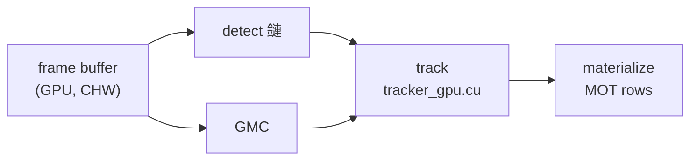
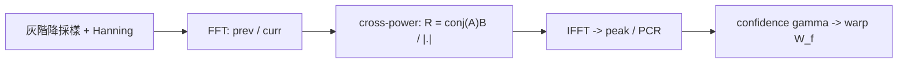

# Saccade 全局數學模型

> Markdown 版由 `docs/latex` 的 full 版 LaTeX source 轉換而來，包含 L3 實作補充。數學式與 TikZ 原始碼保留為 Markdown 可承載的 fenced block；共用架構圖與 GMC flow 轉成 Mermaid。

# 系統總覽

## 系統總覽

整條 pipeline 分兩層:**Python orchestration**(排程、buffer 管理、
CUDA graph replay、eval)與 **C++/CUDA compute**(detector、postprocess、
GMC、tracker association)。Python 不在 hot path 做數值計算,只在 output
boundary 把結果搬回 host。

關鍵:detect 與 GMC 是從**同一個 frame buffer 分岔的兩條平行支線**——
GMC 吃 frame 灰階(+上一幀),*不是* detect 的輸出;`track` 才把
兩條支線匯合。

### 架構地圖

全書各章開頭都會重畫這張圖、點亮當前模組(「你在這裡」)。總覽版全亮:



### 模組職責與 I/O

下表概括每個模組**吃什麼、吐什麼、解決什麼問題**,以及在 pipeline 中銜接誰。
逐項數學見 Part II 對應章;傳遞合約與 source 見 §tab:transfer。

| 模組 | 輸入 → 輸出 | 解決的問題 | 銜接 |
| --- | --- | --- | --- |
| detect | frame CHW tensor → raw boxes/scores/classes | 從單張影像偵測行人(TRT backbone + Mamba head,anchor-free decode) | → postprocess |
| postprocess | raw det → 過濾/NMS 後 boxes | 去除低分與重疊框,交給 tracker 乾淨的偵測集 | detect → track |
| GMC | prev+curr 灰階 → $2\times3$warp $W_f$ | 估相機運動補償平移,讓 Kalman 的 velocity 只學物體運動 | 與 detect 平行,補 track |
| track | boxes/scores/ $W_f$ → track states / IDs | 跨幀關聯與維持 ID(分解見 §tab:track-internal) | 匯合 → materialize |
| output | GPU state → MOT rows | 搬回 host、產生 MOT 結果(含 tracklet 內插後處理) | track → 終點 |

*表/圖：模組職責與輸入/輸出概覽。*

`track` 不是單一步驟,而由數個子機制串成,各為 Part II 的一章:

| 子機制 | 解決的問題 |
| --- | --- |
| Kalman 模型 | constant-velocity 運動模型;每幀 predict 再用 detection update track state |
| Association cost | 把 IoU、OAO/velocity penalty、stability reward 匯成單一配對成本 $c_{ij}$ |
| Auction 指派 | ByteTrack 風格分數級聯 + 單輪平行 auction,決定 track 與 detection 配對 |
| Track lifecycle | track 生死:tentative→confirmed 的 birth/confirm,與 lost/remove |
| Bridge relink | 找回短暫消失又重生的 ID(速度加權雙向 full-gap 外推,非 appearance ReID) |

*表/圖：`track` 內部子機制(Part II 逐章展開)。*

傳遞合約(誰留在 GPU、source 檔)另列:

| 模組 | 模組(Python facade / C++·CUDA core) | 傳遞方式 |
| --- | --- | --- |
| detect | `mamba_gated_detector.py` / TRT backbone + Mamba head | GPU tensor(whole-detect graph) |
| postprocess | `PerceptionPipeline` / `pipeline.cpp` | GPU buffer,留 device |
| GMC | `GMC` / `gmc_kernel.cu` (cuFFT) | GPU tensor, $2\times3$ warp |
| track | `GPUByteTracker` / `tracker_gpu.cu` | device pointer + stream |
| materialize | `materialize_gpu_track_results` | GPU→host,僅一次 copy |
| output | `relink_write` | host(fast MOT emit) |

*表/圖：傳遞合約與 source。*

### Frame-Level Dataflow

對每個 frame \(f\),no-ReID baseline 的主線是兩條同源分支在 tracker 匯合:

| frame tensor | $\to$| detect $\to$postprocess $\to$boxes |
| --- | --- | --- |
| frame tensor | $\to$| GMC warp $ W_f$ |
| boxes $+\ W_f$| $\to$| tracker update $\to$materialize |
| materialize | $\to$ | relink_write / MOT rows |

### Baseline 合約

本文以 `mamba_whole_graph` preset 為基準。關鍵啟用條件:

| 區域 | baseline 值 | 效果 |
| --- | --- | --- |
| Graph | `use_whole_graph: true` | whole detect graph 單次 replay |
| GMC | `gmc_downscale: 4` | GPU phase-correlation 估平移 |
| Appearance | `reid_mode: off` | headline 不用 appearance |
| Assoc | `match_thresh: 0.50` | ByteTrack-like 多階段 gate |
| Cost | `multiplicative_cost: true` | log-linear cost + stability reward |
| Relink | `relink_bridge_enabled: true` | 雙向 foot bridge |

*表/圖：Baseline 合約摘要。完整旋鈕表見附錄 A。*

# 模組細節

## Detection 與 Postprocess


> **模組合約：detect 鏈**

**輸入** frame $640\times640$ CHW tensor
**輸出** boxes / scores / classes(post-NMS)<br>
**方法** YOLO26s TRT backbone+neck $\to$Mamba head(per-level lane) $\to$anchor-free decode $\to$ NMS
**Source** `mamba_gated_detector.py`、`mamba_head.py`、
`mamba_gated_detector.cpp`、`pipeline.cpp`<br>
**Baseline** `tiling: native_640`、`preprocess: none`、
ckpt `mamba_gt_v14replica_t3_t1`;整段在 whole-detect CUDA graph 單次 replay

**演算法傳遞。** detect 鏈分兩段:detector(backbone+head,出 raw)與 native
postprocess(過濾/NMS)。邊上為各段傳遞的張量:

```latex
\begin{tikzpicture}[node distance=14mm]
  \node[step=Cdet] (n1) {frame\\$640^2$};
  \node[step=Cdet, right=of n1] (n2) {TRT backbone\\$+$ neck (FPN)};
  \node[step=Cdet, right=of n2] (n3) {Mamba head\\$\times(P_3,P_4,P_5)$};
  \node[step=Cdet, right=of n3] (n4) {decode\\anchor-free};
  \node[step=Cdet, right=of n4] (n5) {filter $+$ NMS};
  \draw[flowarr=Cdet] (n1) -- node[flowlbl,above]{image}              (n2);
  \draw[flowarr=Cdet] (n2) -- node[flowlbl,above]{$F_3,F_4,F_5$}       (n3);
  \draw[flowarr=Cdet] (n3) -- node[flowlbl,above]{$\mathrm{cls}_N,\mathrm{reg}_N$} (n4);
  \draw[flowarr=Cdet] (n4) -- node[flowlbl,above]{8400 anchors}        (n5);
\end{tikzpicture}
```

### 整體結構與三尺度

P3/P4/P5 三條 lane 結構完全相同,只差尺度常數(輸入固定 640):

| level $N$| stride $s_N$| $H_N{=}W_N{=}640/s_N$| channels $C_N$| tokens $L_N{=}(H_N/4)^2$|
| --- | --- | --- | --- | --- |
| P3 | 8 | 80 | 128 | 400 |
| P4 | 16 | 40 | 256 | 100 |
| P5 | 32 | 20 | 512 | 25 |

*表/圖：三尺度常數( $s_N{=}2^N,\ C_N{=}2^{N+4}$)。*

### 單一 Lane:Mamba Head(Flow B)

重點是 U-Net 式 skip: $X_N$一邊進 down $\to$Mamba $\to$ up,一邊**跳接**直接與
$U_N$concat,故 head 輸入是 256 ch。先 `Down4` 把序列壓到 $L_N\le400$
(控 scan 成本),上採樣後再補回細節:

```latex
\begin{tikzpicture}[node distance=11mm]
  \node[step=Cdet] (f)  {$F_N$\\$C_N{\times}H_N{\times}W_N$};
  \node[step=Cdet, right=of f]  (x)  {input\_proj\\$X_N$ (128)};
  \node[step=Cdet, right=of x]  (d)  {Down4\\stride-4};
  \node[step=Cdet, right=of d]  (z)  {flatten\\$Z_N$($L_N{\times}128$)};
  \node[step=Cdet, right=of z]  (m)  {MambaBlock\\$\times2$($d_{\mathrm{state}}{=}16$)};
  \node[step=Cdet, right=of m]  (u)  {Up4\\$U_N$ (128)};
  \node[step=Cdet, right=of u]  (c)  {concat\\$\to Y_N$ (256)};
  \draw[flowarr=Cdet] (f) -- (x);
  \draw[flowarr=Cdet] (x) -- (d);
  \draw[flowarr=Cdet] (d) -- node[flowlbl,above]{$\le400$ tok} (z);
  \draw[flowarr=Cdet] (z) -- (m);
  \draw[flowarr=Cdet] (m) -- (u);
  \draw[flowarr=Cdet] (u) -- (c);
  \draw[flowarr=Cdet, dashed] (x.north) |- ++(0,7mm) -| node[flowlbl,above,pos=0.25]{skip $X_N$} (c.north);
\end{tikzpicture}
```

### Head 與 Decode(Flow C/D)

**Head**(per level,純卷積): $Y_N(256)$ 分兩支,cls head
$\to\mathrm{cls}_N\,(80)$、reg head $\to\mathrm{reg}_N\,(4)$;輸出通道
$n_o=n_c+4\,r_{\max}=80+4=84$( $r_{\max}{=}1$,box 直接 4 維距離,無 DFL)。

**Decode**(anchor-free,跨三尺度合併, $N=80^2{+}40^2{+}20^2=8400$ anchors)。
anchor 為 grid 中心 $(x{+}0.5,y{+}0.5)$,每點帶 stride:

$$
\mathrm{reg}=(\ell t,rb)\ \xrightarrow{\text{dist2bbox}}\
  c=\mathrm{anchor}+\tfrac{rb-\ell t}{2},\quad
  wh=\ell t+rb\ \xrightarrow{\times s}\ \text{xyxy(像素)}.
$$

$$
\text{score},\ \text{class}=\max_{80},\ \arg\max_{80}\ \sigma(\mathrm{cls}).
$$

### Postprocess Contract

native postprocess(§ch:detect 第二段)的核心 contract:

```text
(raw boxes/scores/classes) → score/class/geometry filter → compact/gather → NMS → output
```

baseline 旗標全關:

| `track_person_only` | false | `person_geometry_prior` | false |
| --- | --- | --- | --- |
| `detection_quality_scaling` | false | `geometry_suspect_support` | false |

tracker 直接消費 post-NMS boxes,各 detection 進哪段 association 由 tracker
的 score gates( $\tau_{\mathrm{track/mid/high}}$ 、`new_track_thresh`)決定。

> **實作補充（L3）：Detection**

- **錨點**: $\mathrm{in_channels}{=}(128,256,512)$、 $\mathrm{strides}{=}(8,16,32)$:`mamba_head.py:1177/1225`。
- **lane 超參**: $d_{\mathrm{model}}{=}128$、 $\mathrm{spatial_reduction}{=}4$、 $\mathrm{num_blocks}{=}2$、 $d_{\mathrm{state}}{=}16$:`mamba_head.py:1220--1226`。
- **U-Net skip / down-up**: `mamba_head.py:1208--1211`
(Down4 壓序列、Up4 上採樣後 concat)。
- **Head 卷積**: cls/reg,Conv3 $\times$3 $\to$SiLU $\to$Conv1 $\times$ 1;
`mamba_head.py:1365--1385`。 $n_o{=}84$、 $r_{\max}{=}1$:
`mamba_head.py:1258`。
- **Decode**: `mamba_gated_detector.cpp:158`
`decode_feats`(dist2bbox + sigmoid)。NMS/filter:`pipeline.cpp`
(facade `pipeline.hpp`)。
- **checkpoint / ReID**: frozen Mamba head ckpt
`runs/mamba_gt_v14replica_t3_t1/best.ckpt`;ReID embedding 支線 $\mathrm{emb_dim}{=}0$ (off),故 head 只出 cls/reg 兩支。

## GMC:相機運動補償


> **模組合約：GMC**

**輸入** prev + curr 灰階(GPU tensor, CHW float $[0,1]$)
**輸出** $2\times3$translation warp $W_f$ <br>
**方法** phase correlation(cross-power spectrum + Hanning window)
**Source** `gmc_kernel.cu`(cuFFT)<br>
**Baseline** `gmc_downscale: 4`、translation-only、soft confidence gate

GPU GMC 用 phase correlation 估 frame-to-frame 平移,作為 deterministic control
input 送進 `track` 的 Kalman predict,讓 velocity state 只學物體
residual motion 而非相機運動。

**演算法傳遞。** 本章內部依序串接下列步驟,邊上標註各步之間傳遞的量
(對應 §sec:gmc-down,sec:gmc-cps,sec:gmc-warp):



### 灰階降採樣與窗函數

對 downscaled pixel $(x,y)$,floor-based 取樣:

$$
s_x=\Big\lfloor x\tfrac{W_{\mathrm{src}}}{W_{\mathrm{dst}}}\Big\rfloor,\qquad
  s_y=\Big\lfloor y\tfrac{H_{\mathrm{src}}}{H_{\mathrm{dst}}}\Big\rfloor,\qquad
  G=0.299R+0.587G_c+0.114B.

$$
FFT 前套 Hanning window$G_w(x,y)=G(x,y)\,w_x w_y $,其中$w_x=\tfrac12(1-\cos\tfrac{2\pi x}{W_{\mathrm{dst}}-1}) $(同理$w_y $)。

### Cross-Power Spectrum 與位移

令 $A=\mathrm{FFT}(\text{prev})$、 $B=\mathrm{FFT}(\text{curr})$:

$$
C(k)=\overline{A(k)}B(k),\qquad
  R(k)=\frac{C(k)}{|C(k)|+10^{-6}},\qquad
  r=\mathrm{IFFT}(R).

$$
$r$的 peak 給出 wrapped displacement( $\text{peak}>\text{dim}/2$ 時減去該維長度)。

### Confidence 與 Warp

phase-correlation 可信度與軟縮放:

$$
\mathrm{PCR}=\frac{\max r}{\mathrm{RMS}(r)},\qquad
  \gamma=\begin{cases}\mathrm{clamp}(\mathrm{PCR}/\tau,0,1),&\mathrm{PCR}<\tau\\1,&\text{otherwise.}\end{cases}
$$

位移超過 downscaled 尺寸 25% 視為不可信(退回 identity)。否則

$$
t_x=p_x d\,\gamma,\quad t_y=p_y d\,\gamma,\qquad
  W_f=\begin{bmatrix}1&0&t_x\\0&1&t_y\end{bmatrix}.

$$
**Sign convention**:positive$t_x$ 把 predicted track center 往
current frame 右方推。

> **實作補充（L3）：GMC**

**程式路徑差異**(§eq:gmc-final 的 25% cap 處置因 path 而異):

- C++ `peak_to_translation_warp_kernel`(graph path,經
`launch_phase_correlation_into_warp`):不可信 → identity warp。
- C++ `launch_phase_correlation`(standalone):kernel 回原始
wrapped displacement,由 host `GMC::estimate()` 二次檢查後回空 result。
- Python `PyGraphedGMC`:同套軟 confidence scaling(非 hard gate),
constructor `pcr_thresh` 預設 `5.0`;**不讀**
`SACCADE_GMC_PCR_THRESH`(僅 C++ path 可由該 env 調整)。
- Python `TilePhaseCorrAffineGMC`:無 fallback 時回 `None`。

**錨點**
$\tau_{\mathrm{PCR}}$: `SACCADE_GMC_PCR_THRESH`, `gmc_kernel.cu:169`
(py fallback `5.0`)。
control input 融合:`predict_gmc_sinv_fused_kernel`(`tracker_gpu.cu`)。<br>
**取樣一致性** C++ floor mapping(§eq:gmc-sample)與 Python
`F.interpolate(mode="nearest")` 在固定輸出尺寸下取樣座標一致。

## Kalman 運動模型


> **模組合約：Kalman(track 子機制)**

**輸入** 前一幀 track state $(x,P)$、GMC warp $W_f$ 、配對到的 detection
measurement $z$**輸出** predict 後 $\tilde{x}$(供 gate/cost)、update 後 $(x,P)$ <br>
**方法** SORT/DeepSORT 風格 constant-velocity filter,state
$(c_x,c_y,a,h,\dot{\cdot})$
**Source** `kalman_gpu.cuh`
**Baseline** `kalman_r_scale: 2.8`、NSA off

state 與 measurement:

$$
x=(c_x,c_y,a,h,v_x,v_y,v_a,v_h)^{\!\top},\qquad
  z=(c_x,c_y,a,h)^{\!\top}.
$$

**演算法傳遞。** 每幀對每個 track 依序:predict(先吃 GMC control)→ 算
innovation 協方差 → gate → 若入選則 update。邊上為各步傳遞的量:

```latex
\begin{tikzpicture}[node distance=14mm]
  \node[step=Ctrk] (n1) {GMC control\\$+$predict\\$x'{=}Fx,\ P'{=}FPF^{\!\top}{+}Q$};
  \node[step=Ctrk, right=of n1] (n2) {innovation cov\\$S{=}MP'M^{\!\top}{+}R$};
  \node[step=Ctrk, right=of n2] (n3) {gate\\$\mathrm{IoU}\,\lor\,d^2_{\mathrm{maha}}{<}\tau$};
  \node[step=Ctrk, right=of n3] (n4) {gain\\$K{=}P'M^{\!\top}S^{-1}$};
  \node[step=Ctrk, right=of n4] (n5) {update\\$x{+}Ky,\ (I{-}KM)P'$};
  \draw[flowarr=Ctrk] (n1) -- node[flowlbl,above]{$\tilde{x},P'$} (n2);
  \draw[flowarr=Ctrk] (n2) -- node[flowlbl,above]{$S^{-1}$}       (n3);
  \draw[flowarr=Ctrk] (n3) -- node[flowlbl,above]{候選 $z_j$}     (n4);
  \draw[flowarr=Ctrk] (n4) -- node[flowlbl,above]{$y{=}z{-}Mx$}   (n5);
\end{tikzpicture}
```

### Prediction

Transition 是 constant velocity,且 GMC translation 先以 control input 加到位置
(見 §ch:gmc),再做 predict:

$$
F=\begin{bmatrix}I_4 & I_4\\ 0 & I_4\end{bmatrix},\qquad
  x'=Fx,\qquad P'=FPF^{\!\top}+Q(h^-).

$$
process noise 隨 predict 後框高$h^-$ 縮放:
$$
\sigma_p=\tfrac{h^-}{20},\quad \sigma_v=\tfrac{h^-}{160},\quad
  \mathrm{diag}(Q)=(\sigma_p^2,\sigma_p^2,10^{-4},\sigma_p^2,
                    \sigma_v^2,\sigma_v^2,10^{-10},\sigma_v^2).
$$

### Measurement Update

measurement matrix $M=[\,I_4\ \ 0\,]$。noise 用 predict 後 $h^-$(非 detection
height);baseline 下亮度/NSA 調節關閉( $\lambda_{\mathrm{light}}{=}0,\ m_{\mathrm{NSA}}{=}1$),
故 $m_R=r_{\mathrm{scale}}$:

$$
\mathrm{diag}(R)=\Big(\big(\tfrac{h^-}{20}\big)^2 m_R,\ \big(\tfrac{h^-}{20}\big)^2 m_R,\
                      10^{-2}m_R,\ \big(\tfrac{h^-}{20}\big)^2 m_R\Big).
$$

更新方程:

$$
\begin{aligned}
  S&=MP'M^{\!\top}+R, & K&=P'M^{\!\top}S^{-1}, & y&=z-Mx',\\
  x&\leftarrow x'+Ky, & P&\leftarrow(I-KM)P'.
\end{aligned}
$$

### Mahalanobis Gate

即使 IoU 弱,只要 Mahalanobis 距離小於 $\tau_{\mathrm{maha}}$ 仍可入選 candidate
( $\tilde{x}_i$ 為已套 GMC control 並 predict 後的 state):

$$
d^2_{ij}=(z_j-M\tilde{x}_i)^{\!\top}S_i^{-1}(z_j-M\tilde{x}_i),\qquad
  \mathrm{cand}_{ij}\iff \mathrm{IoU}_{ij}>\tau_{\mathrm{iou}}\ \lor\ d^2_{ij}<\tau_{\mathrm{maha}}.

$$
IoU gate 與 cost(§ch:assoc)使用同一個$\tilde{x}_i$。

> **實作補充（L3）：Kalman**

**錨點**
$\sigma_p=h^-/20$、 $\sigma_v=h^-/160$ 為 hardcoded(`std_weight_position`
/ `_velocity`),`kalman_gpu.cuh:155/156`。
predict + GMC control 融合於 `predict_gmc_sinv_fused_kernel`;
gate 的 $S_i^{-1}$ 由 `compute_S_inv` 計算,Mahalanobis 由
`mahal_sq_det`(均在 `tracker_gpu.cu`)。<br>
**r_scale** $r_{\mathrm{scale}}$ 即 config `kalman_r_scale`(baseline 2.8),
§eq:kf-R 的 update 與 §eq:kf-maha 的 gate 共用同一個值
(由 `predict_gmc_sinv_fused_kernel` 傳入)。<br>
**NSA / 亮度** $m_{\mathrm{NSA}},\lambda_{\mathrm{light}}$ 為可配置分支;
MOT17 baseline 由 caller 傳 $0$,故 $m_R=r_{\mathrm{scale}}$。

## Association Cost


> **模組合約：Association cost(track 子機制)**

**輸入** predict 後 tracks $\{\tilde{x}_i\}$、detections $\{b_j,s_j\}$**輸出** 稀疏 candidate 上的成本 $c_{ij}$ (供 auction)<br>
**方法** IoU(+ReID)綜合質量 → 乘法式 cost,含 OAO/stability 調節
**Source** `stage1_cost_fused_kernel`(`tracker_gpu.cu`)<br>
**Baseline** `multiplicative_cost: true`、`sinkhorn_lambda: 10`、
`stability_cost_w: 0.20`、`reid_mode: off`

**演算法傳遞。** gate 過的 pair 先算 base quality,再匯入 penalty,經乘法式
轉成 cost,最後只把夠好的 enqueue 進稀疏 candidate list:

```latex
\begin{tikzpicture}[node distance=15mm]
  \node[step=Ctrk] (n1) {candidate gate\\$\mathrm{IoU}\,\lor\,\mathrm{Maha}$};
  \node[step=Ctrk, right=of n1] (n2) {base quality\\$A_{ij}{=}q^{\mathrm{iou}}_{ij}$};
  \node[step=Ctrk, right=of n2] (n3) {penalties\\$\Pi{=}P_{\mathrm{OAO}}{+}P_{\mathrm{vel}}{+}P_{\mathrm{occ}}{-}R_{\mathrm{stab}}$};
  \node[step=Ctrk, right=of n3] (n4) {mult.\ cost\\$c{=}1{-}A\,e^{-\Pi}$};
  \node[step=Ctrk, right=of n4] (n5) {sparse top-k\\enqueue};
  \draw[flowarr=Ctrk] (n1) -- node[flowlbl,above]{候選}        (n2);
  \draw[flowarr=Ctrk] (n2) -- node[flowlbl,above]{$A_{ij}$}     (n3);
  \draw[flowarr=Ctrk] (n3) -- node[flowlbl,above]{$\Pi_{ij}$}   (n4);
  \draw[flowarr=Ctrk] (n4) -- node[flowlbl,above]{$c_{ij}$}     (n5);
\end{tikzpicture}
```

### Candidate Gate 與 Base Quality

gate 同 §eq:kf-maha。兩 gate 皆不過時 $c_{ij}=1$。detection score fusion:

$$
q^{\mathrm{iou}}_{ij}=\mathrm{IoU}_{ij}\bigl(1-w_{\mathrm{fuse}}(1-s_j)\bigr),
  \qquad A_{ij}=q^{\mathrm{iou}}_{ij}\ \ (\text{no ReID}).

$$
baseline `fuse_score_weight`=0,故$q^{\mathrm{iou}}_{ij}=\mathrm{IoU}_{ij} $。
sparse list 只 enqueue 成本落在最寬鬆門檻內者:
$c_{\max}=\max(c_{\mathrm{DDA}},\tau_{\mathrm{match}},\tau_{\mathrm{stage2}})$,
$\mathrm{enqueue}_{ij}\iff c_{ij}\le c_{\max}$。

### Multiplicative Cost

active cost form 與 penalty 匯總:

$$
c_{ij}=\mathrm{clamp}\!\bigl(1-A_{ij}e^{-\Pi_{ij}},\,0,\,1\bigr),\qquad
  \Pi_{ij}=P_{\mathrm{OAO}}+P_{\mathrm{vel}}+P_{\mathrm{occ\_front}}-R_{\mathrm{stability}}.

$$
legacy additive path$c_{ij}=1-A_{ij}+\sum_k P_k $ 仍存在但 baseline 不用。
baseline 只有 $P_{\mathrm{OAO}}$與 $R_{\mathrm{stability}}$ 起作用;
$P_{\mathrm{vel}}$(`vel_dir_weight`)與 $P_{\mathrm{occ_front}}$
(`occ_state_enabled`)未啟用。

### OAO Penalty

依 predicted track-track overlap 計 occlusion 係數,並隨遮擋持續幀數 ramp:

$$
\begin{aligned}
  o^{\mathrm{base}}_i&=\max_{k\ne i}\mathrm{IoU}\!\bigl(B(x_i),B(x_k)\bigr),\qquad
  o_i=o^{\mathrm{base}}_i\min\!\Bigl(1,\tfrac{d_i}{N_{\mathrm{ramp}}}\Bigr),\\
  P_{\mathrm{OAO}}(i,j)&=\tau_{\mathrm{OAO}}\,o_i\,g_s(s_j).
\end{aligned}

$$
baseline$\tau_{\mathrm{OAO}}=0.50 $、$N_{\mathrm{ramp}}=25 $;score 調節$g_s\equiv1 $ (`oao_score_w` 未設)。

### Stability Reward

高度一致的 size-consistency reward(成本側, $\lambda_{\mathrm{eff}}=\max(\lambda,1)$):

$$
R_{\mathrm{stability}}(i,j)=
  \frac{w_{\mathrm{stab}}/\lambda_{\mathrm{eff}}}
       {1+|h_i-h_j|/\max(h_j,10^{-3})}.

$$
因 reward 除以$\lambda $,進入$e^{-\lambda c} $(§ch:auction)後其 boost 大致不隨$\lambda $ 失衡。baseline `stability_cost_w`=0.20。

> **實作補充（L3）：Association cost**

**錨點** cost/gate 一次完成於 `stage1_cost_fused_kernel`;
ReID 啟用時走 `compute_conditional_cost_kernel`。OAO 係數由
`compute_track_occlusion_kernel` 計算,crowd 分支 `/0.25`@`cu:500`。<br>
**fuse_score_weight 分支** 若 $w_{\mathrm{fuse}}{>}0$ 且 track 已 confirmed
(`hit_streak`$\ge$`confirm_streak`), $§eq:as-q$的 $(1-s_j)$
換成相對 score-drop $p_{\mathrm{rel}}=\max(0,\bar{s}_i-s_j)/\max(\bar{s}_i,0.01)$,
再乘 crowd damping $(1-\min(1,o_i/0.25))$。baseline $w_{\mathrm{fuse}}{=}0$不觸發。<br>
**baseline-off 項** $P_{\mathrm{vel}}$:`vel_dir_weight`;
$P_{\mathrm{occ_front}}$:`occ_state_enabled`(footline depth penalty)。
kernel 內保留,僅未配置。<br>
**ReID blend** `scripts/eval/config/reid.py` 預設
$w_{\cos}{=}0.55,w_{\mathrm{iou}}{=}0.30,w_s{=}0.15$;`reid_mode: off` 不使用。

## Sparse Top-K 與 Auction


> **模組合約：Auction(track 子機制)**

**輸入** 每個 track 的稀疏 cost candidates $c_{ij}$
**輸出** 配對 `trk_to_det` / `det_to_trk`<br>
**方法** ByteTrack 風格分數級聯 $\times$ 單輪平行 Bertsekas auction
**Source** `fused_sinkhorn_multistage_kernel`、
`parallel_auction_shmem_kernel`<br>
**Baseline** 5-stage 級聯;`sinkhorn_lambda` 僅作 $e^{-\lambda c}$ value,
*非*完整 Sinkhorn solve

**演算法傳遞。** cost candidates 先一次算出五個 stage 的 top-k,再依優先序
串行跑級聯;每個 stage reset 價格後跑單輪 auction 並 commit,未配掉的 track/det
流到下一 stage:

```latex
\begin{tikzpicture}[node distance=15mm]
  \node[step=Ctrk] (n1) {cost\\candidates};
  \node[step=Ctrk, right=of n1] (n2) {fused top-k\\(5 stages)};
  \node[step=Ctrk, right=of n2] (n3) {級聯\\S0$\to$S1$\to$S1b$\to$S1c$\to$S2};
  \node[step=Ctrk, right=of n3] (n4) {per-stage\\reset price $+$ auction};
  \node[step=Ctrk, right=of n4] (n5) {commit\\\texttt{trk\_to\_det}};
  \draw[flowarr=Ctrk] (n1) -- node[flowlbl,above]{$c_{ij}$} (n2);
  \draw[flowarr=Ctrk] (n2) -- node[flowlbl,above]{$p_{ij}$} (n3);
  \draw[flowarr=Ctrk] (n3) -- node[flowlbl,above]{逐 stage} (n4);
  \draw[flowarr=Ctrk] (n4) -- node[flowlbl,above]{winners}  (n5);
\end{tikzpicture}
```

這*不是* full dense Sinkhorn:每 stage 只跑一輪 bid+commit,price buffer 開頭
reset 為 0,沒有 price-raising 迭代到收斂——實質是單輪平行貪婪配對。

### Stage 級聯與 Value

五個 stage 依優先序貪婪,carry-over 只看前面沒配掉的 track/det:

| Stage | Track state | Detection score | Cost cap |
| --- | --- | --- | --- |
| S0 DDA | confirmed | $[\text{high},1.1)$| $c_{\mathrm{DDA}}$(0.12) |
| S1 high | confirmed | $[\text{high},1.1)$| $\tau_{\mathrm{match}}$|
| S1b mid | confirmed | $[\text{mid},\text{high})$| $\tau_{\mathrm{match}}$|
| S1c tentative | tentative | $[\text{mid},1.1)$| $\tau_{\mathrm{match}}$|
| S2 low | confirmed | $[\text{track},\text{mid})$| $\tau_{\mathrm{stage2}}$|

*表/圖：分數級聯(`run_stage` 0..4)。*

放入 top-k 的 value 與 aspect penalty:

$$
p_{ij}=e^{-\lambda c_{ij}}\,G_{\mathrm{aspect}}(b_j),\qquad
  r_j=\tfrac{\mathrm{width}_j}{\mathrm{height}_j},
$$

$$
G_{\mathrm{aspect}}=
  \begin{cases}
    \max(0.5,\,1-(r_j-0.8)), & r_j>0.8\\
    \max(0.5,\,1-5(0.15-r_j)), & r_j<0.15\\
    1, & \text{otherwise.}
  \end{cases}
$$

### Auction Bid

給定 detection 當前 price $\rho_j$,track $i$的 best/second 與 bid:

$$
v_{ij}=p_{ij}-\rho_j,\quad
  j^\ast=\arg\max_j v_{ij},\quad
  \Delta\rho_i=v_{ij^\ast}-v^{(2)}_i+\epsilon,\quad
  \mathrm{bid}_i=\rho_{j^\ast}+\Delta\rho_i.

$$
single-round 下$\Delta\rho$ 只用來決定同一輪內多 track 競標同一 detection 誰勝出。
兩個 bid bias(絕對相加):

$$
\mathrm{bid}_i \mathrel{+}=\frac{w_{\mathrm{fresh}}}{1+\mathrm{age}_i},\qquad
  \mathrm{bid}_i \mathrel{+}=\frac{w_{\mathrm{stab,bid}}}{1+|h_i-h_j|/h_j}.

$$
預設不一致,**勿一律當 off**:freshness$w_{\mathrm{fresh}}$
(`SACCADE_FRESHNESS_W`)預設 0(關);stability bid bias
$w_{\mathrm{stab,bid}}$(`SACCADE_STABILITY_W`)預設 $0.1$ (**開**)。

> **實作補充（L3）：Auction**

**錨點** top-k:`fused_sinkhorn_multistage_kernel`;auction:
`parallel_auction_shmem_kernel`;host driver `run_stage(0..4)`。
aspect peak/width 為 hardcoded `cu:186`(2.5 / 1.2)。<br>
**S0 DDA** `SACCADE_ENABLE_DDA` 開關; $c_{\mathrm{DDA}}$ 來自
`SACCADE_DDA_MAX_COST`(`cu:2404/2405`),未設為 0.12。<br>
**stage thresholds** `match_thresh`/`high_thresh`/`mid_thresh`/
`track_thresh`/`stage2_match_thresh` = 0.50/0.45/0.10/0.05/0.50。<br>
**bid bias env** $w_{\mathrm{fresh}}$:`SACCADE_FRESHNESS_W`@`cu:2650`;
$w_{\mathrm{stab,bid}}$:`SACCADE_STABILITY_W`@`cu:2666`
(comment 註 IDs $-42$/IDF1 neutral)。<br>
**dead param** 舊 `SACCADE_HISTORY_W`(hit-streak bias)body 從未讀取,
已整條移除(bit-exact no-op)。auction bid bias 現只有 freshness 與 stability。<br>
**determinism** shared-memory price cache 做 intra-block 衝突解析;block winner
用 `atomicMax`;packed `(bid_bits, tie)` key 確保 deterministic commit;
另用 commit kernel 避免 `trk_to_det`/`det_to_trk` race。

## Track Lifecycle 與 Birth


> **模組合約：Lifecycle(track 子機制)**

**輸入** assignment 結果(matched / unmatched track / unmatched detection)
**輸出** 更新後的 track 集合與狀態(tentative/confirmed/lost/removed)<br>
**方法** hit-streak 累積 confirm、age 計數 lost/remove
**Source** `tracker_gpu.cu`<br>
**Baseline** `new_track_thresh: 0.28`、`confirm_streak: 3`、
`confirm_score_thresh: 0.50`、`track_buffer: 30`、`per_seq_adapt: false`

**演算法傳遞。** assignment 後依配對狀態驅動 track 狀態機;下圖為主要轉移
(tentative 若連續未配會很快 drop,圖中略):

```latex
\begin{tikzpicture}[node distance=20mm]
  \node[step=Ctrk] (nw) {未配 det};
  \node[step=Ctrk, right=of nw] (te) {tentative};
  \node[step=Ctrk, right=of te] (co) {confirmed};
  \node[step=Ctrk, right=of co] (lo) {lost};
  \node[step=Ctrk, right=of lo] (rm) {removed};
  \draw[flowarr=Ctrk] (nw) -- node[flowlbl,above]{$s_j{\ge}$new\_thr} (te);
  \draw[flowarr=Ctrk] (te) -- node[flowlbl,above]{streak${\ge}3$}    (co);
  \draw[flowarr=Ctrk] (co) -- node[flowlbl,above]{unmatched}         (lo);
  \draw[flowarr=Ctrk] (lo) -- node[flowlbl,above]{age${>}$buffer}    (rm);
  \draw[flowarr=Ctrk] (lo) to[bend left=32] node[flowlbl,above]{re-match} (co);
\end{tikzpicture}
```

### State 轉移

assignment 後 tracker 更新 state:

- **matched**(confirmed/tentative):以 detection $z_j$ 做 Kalman update
(§ch:kalman),`hit_streak`$+1$,`age`/`time_since_update`
歸零。
- **unmatched active track**:`age`$\le$`track_buffer` 期間維持
active/lost,超過 max age 後 remove。
- **unmatched detection**( $s_j\ge$`new_track_thresh`):生成新的
tentative track。

### Birth 與 Confirm

新 tentative track 必須累積足夠連續 evidence 才會被視為 confirmed output:

$$
\begin{aligned}
  \text{confirmed}\iff{}&
  \texttt{hit\_streak}\ge\texttt{confirm\_streak}\\
  &{}\land\bar{s}\ge\texttt{confirm\_score\_thresh}.
\end{aligned}
$$

baseline:

| `confirm_streak` | 3 | `confirm_score_thresh` | 0.50 |
| --- | --- | --- | --- |
| `new_track_thresh` | 0.28 | `track_buffer` | 30 |

若干 birth-gate experiments 位於 `scripts/eval/config/lifecycle.py`,但目前
preset 未啟用(`per_seq_adapt: false`)。
普通新生 track 以 tentative 與 `hit_streak=1` 起跑;bridge relink 復活的
slot 會保留 lost id 並直接回到 confirmed,不再走 tentative confirm gate。

> **實作補充（L3）：Lifecycle**

**錨點** birth/confirm/lost/remove 狀態機在 `tracker_gpu.cu`。
config 欄位:`new_track_thresh`/`confirm_streak`/
`confirm_score_thresh`/`track_buffer`。<br>
**實驗分支** `scripts/eval/config/lifecycle.py` 含多個 birth-gate
experiments;baseline `per_seq_adapt: false` 不啟用 per-sequence 自適應。<br>
**與 relink 的關係** lost track 並非立即 remove,而在 `track_buffer`
期間保留,供 §ch:relink 的 bridge relink 在窗內找回 id。bridge 命中的
新 slot 直接寫回 lost id 並標成 confirmed;一般 unmatched detection 才建立
tentative slot。

## Bridge Relink


> **模組合約：Bridge relink(track 子機制)**

**輸入** 新穩定的 candidate track、窗內未配的 lost confirmed track
**輸出** candidate 採用 lost track 的 id(lost slot deactivate)<br>
**方法** 速度加權雙向 full-gap 外推(speed-weighted bidirectional extrapolation),*非* appearance ReID
**Source** `tracker_gpu.cu`( $\ne$`relink_gate.cu` 的 appearance gate)<br>
**Baseline** `relink_bridge_enabled: true`、`relink_bridge_px: 0.25`、
`margin: 0.05`、`h_lo/h_hi: 0.75/1.33`、`dir_bonus: 0.8`、
anchor `adaptive`

**演算法傳遞。** 對 candidate–lost pair,先取 anchor、做 4 點速度回歸,再雙向
外推算殘差,合成 $d_{\mathrm{bridge}}$,經 direction bonus 與多重 gate 後 commit:

```latex
\begin{tikzpicture}[node distance=12mm]
  \node[step=Ctrk] (n1) {candidate\\$+$ lost pair};
  \node[step=Ctrk, right=of n1] (n2) {anchor\\$(a_x,a_y)$};
  \node[step=Ctrk, right=of n2] (n3) {4-pt velocity\\$v_\ell,v_c$};
  \node[step=Ctrk, right=of n3] (n4) {外推殘差\\$r_{\mathrm{fwd}},r_{\mathrm{bwd}}$};
  \node[step=Ctrk, right=of n4] (n5) {$d_{\mathrm{bridge}}$\\$+$ dir bonus};
  \node[step=Ctrk, right=of n5] (n6) {gates\\$+$ commit};
  \draw[flowarr=Ctrk] (n1) -- (n2);
  \draw[flowarr=Ctrk] (n2) -- node[flowlbl,above]{$\ell,c$} (n3);
  \draw[flowarr=Ctrk] (n3) -- (n4);
  \draw[flowarr=Ctrk] (n4) -- node[flowlbl,above]{$d_h$} (n5);
  \draw[flowarr=Ctrk] (n5) -- node[flowlbl,above]{$d^{(1)}$} (n6);
\end{tikzpicture}
```

### History 與 Anchor

每個 observed slot(`age`=0)保存 center/height history ring,並對框高做 EMA:
$\bar{h}\leftarrow0.95\bar{h}+0.05h$。coasting lost track 保留最後 history。
baseline anchor `adaptive`: $x$永遠用 center; $y$ 候選為
$y^{\mathrm{top}}{=}c_y{-}h/2,\ y^{\mathrm{bot}}{=}c_y{+}h/2,\ y^{\mathrm{ctr}}{=}c_y$。
若平均相鄰 height 變化 $\le$`anchor_rate`(0.03)退化為 center;否則以 top/bottom
各自四點線性回歸殘差為權重選較穩的 edge:

$$
w_e=\frac{1}{\mathrm{RSS}_{\mathrm{line}}(y^e)/(\bar{h}^2+10^{-3})+0.01},\quad
  a_y=\frac{w_{\mathrm{top}}y^{\mathrm{top}}+w_{\mathrm{bot}}y^{\mathrm{bot}}}
           {w_{\mathrm{top}}+w_{\mathrm{bot}}}.
$$

### Candidate 條件

candidate 採用 lost id 的前置條件:

```text
candidate hit_streak == bridge_at candidate 有$\ge$4 history samples

lost active 但本幀未配 lost state == confirmed
bridge_min_lost$\le$lost_age$\le$bridge_ttl
```

### 速度回歸與 $d_{\mathrm{bridge}}$

對四個等時距 scalar anchor sample $(p_0,p_1,p_2,p_3)$,4 點回歸速度
$v=\tfrac{3p_3+p_2-p_1-3p_0}{10}$。令 $\ell$=lost exit anchor、 $c$=candidate
entry anchor、 $g$=`lost_age`、 $h_{\mathrm{ref}}=\max(\tfrac{\bar{h}_\ell+\bar{h}_c}{2},1)$:

$$
r_{\mathrm{fwd}}=\frac{\lVert(\ell+v_\ell g)-c\rVert}{h_{\mathrm{ref}}},\qquad
  r_{\mathrm{bwd}}=\frac{\lVert(c-v_c g)-\ell\rVert}{h_{\mathrm{ref}}}.
$$

以 lost 端速度大小決定外推 vs 純距離的權重:

$$
d_h&=\frac{\lVert\ell-c\rVert}{h_{\mathrm{ref}}},\\
  w&=\sqrt{\mathrm{clamp}\!\Bigl(\tfrac{\lVert v_\ell\rVert/h_{\mathrm{ref}}}{0.12},0,1\Bigr)},\\
  d_{\mathrm{bridge}}&=
  w\,\frac{r_{\mathrm{fwd}}+r_{\mathrm{bwd}}}{2}+(1-w)\,d_h.
$$

### Direction Bonus

`dir_bonus`>0 且方向相近( $\cos\theta>0.5$)時,向 cross-track 誤差 $d_{\mathrm{cross}}$blend:

$$
\alpha=\min\!\bigl(w_{\mathrm{dir}}\cos^2\theta\,\eta_v\,\eta_g,\,1\bigr),\qquad
  d_{\mathrm{bridge}}\leftarrow(1-\alpha)d_{\mathrm{bridge}}+\alpha\,d_{\mathrm{cross}},
$$

其中 \(_v=clamp(( v_, v_c)
(0.005h_ref,10^-3),0,1)\)、 $\eta_g=\mathrm{clamp}(g/30,0,1)$。
baseline `dir_bonus`=0.8。

### Gates 與 Commit

接受條件:

$$
d_{\mathrm{bridge}}\le\tau_{\mathrm{bridge}},\quad
  \frac{\bar{h}_\ell}{\bar{h}_c}\in[h_{\mathrm{lo}},h_{\mathrm{hi}}],\quad
  d^{(2)}_{\mathrm{bridge}}-d^{(1)}_{\mathrm{bridge}}\ge m_{\mathrm{bridge}}.
$$

注意 `relink_bridge_px`=0.25 是歷史命名,*非* 0.25 pixel——它與已除以
$h_{\mathrm{ref}}$的 $d_{\mathrm{bridge}}$ 比較,單位是 reference-height-normalized
distance。baseline `spatial_gate`=0.0(關),不啟用 occupancy expansion。
接受後 candidate 採用 lost id、lost slot deactivate;多 candidate 競爭同一 lost id 時,
較高 detection score 贏,candidate index 作 tie-breaker。

> **實作補充（L3）：Bridge relink**

- **錨點**: 實作於 `tracker_gpu.cu`;與
`relink_gate.cu` 的 appearance gate table **不同機制**。
- **effective default**: `relink_bridge_anchor: adaptive`、
`relink_bridge_anchor_rate: 0.03`。
- **config 對照**: $\tau_{\mathrm{bridge}}$ =
`relink_bridge_px`(0.25,已正規化); $\alpha$=`relink_bridge_dir_bonus`(0.8); $h_{\mathrm{lo/hi}}$ =`relink_bridge_h_lo/_h_hi`(0.75/1.33)。
- $m_{\mathrm{bridge}}$ =`relink_bridge_margin`(0.05);
spatial=`relink_bridge_spatial_gate`(0.0)。
- **anchor mode**: `anchor: center` 固定用 $y^{\mathrm{ctr}}$;
`anchor: foot` 固定用 $y^{\mathrm{bot}}$。§eq:rl-resid 的 $\ell,c,v_\ell,v_c$皆為 anchor transform 後的量。
- **relink_enabled vs bridge**: baseline 用 tracker-core bridge,*非*
birth-time appearance lost-bank relinker(兩者為不同 config)。

# 附錄

## 符號與 Config 對照

baseline 值對應 `mamba_whole_graph`(frozen_v2)。各機制的代碼錨點
(kernel 名、`cu:N` 行號)見對應章末的 L3 實作補充。

### 基本符號

| 符號 | 意義 |
| --- | --- |
| $f$| 目前 frame index |
| $I_f$| 目前 RGB/CHW frame tensor |
| $D_f=\{d_j\}$| frame $f$postprocess 後的 detection set |
| $b_j=(x_1,y_1,x_2,y_2)$| detection box(original-frame pixels) |
| $s_j,\ \mathrm{cls}_j$| detection score / class id |
| $T_f=\{t_i\}$| association 前 active 或 lost tracker slots |
| $x_i,\ P_i$| track slot $i$的 8D Kalman state / $8\times8$covariance |
| $W_f$| GMC $2\times3$camera warp;translation path $[1,0,t_x;0,1,t_y]$|
| $x=(c_x,c_y,a,h,\dot{\cdot})$| center、aspect、height 與對應速度 |
| $w=a\cdot h,\ B(x)$| state implied width / 還原的 box |
| $z=(c_x,c_y,a,h),\ M=[I_4\ 0]$| Kalman measurement / measurement matrix |
| $\mathrm{IoU}(i,j),\ c_{ij}$| $B(x_i)$與 $b_j$的 IoU / final association cost |
| $p_{ij},\ A_{ij},\ \Pi_{ij}$| auction value / base quality / penalty 總和 |

### GMC

| 符號 | 用途 | config / env | baseline |
| --- | --- | --- | --- |
| $W_f$| 相機運動補償 warp | — | trans-only |
| PCR | phase-corr 峰值可信度 | — | — |
| $\tau_{\mathrm{PCR}}$| 低可信度縮小位移 | `SACCADE_GMC_PCR_THRESH` | py $5.0$|

### Kalman

| 符號 | 用途 | config / env | baseline |
| --- | --- | --- | --- |
| $x,z,F,M$| 8D CV state / 4D measurement | — | — |
| $\sigma_p{=}h^-/20$| 位置過程噪聲 | hardcoded | 1/20 |
| $\sigma_v{=}h^-/160$| 速度過程噪聲 | hardcoded | 1/160 |
| $r_{\mathrm{scale}}$| 測量噪聲縮放 | `kalman_r_scale` | 2.8 |
| $m_{\mathrm{NSA}},\lambda_{\mathrm{light}}$| NSA/亮度調節 | — | 1 / 0 |
| $\tau_{\mathrm{maha}}$| Mahalanobis gate | `maha_gate` | 見實作 |

### Association Cost

| 符號 | 用途 | config / env | baseline |
| --- | --- | --- | --- |
| $A_{ij}$| IoU(+ReID)綜合質量 | — | = IoU |
| $w_{\mathrm{fuse}}$| 低分檢測降權 | `fuse_score_weight` | 0.0 |
| $c_{ij}$| 乘法式 cost | `multiplicative_cost` | true |
| $\lambda$| cost $\to$ value 溫度 | `sinkhorn_lambda` | 10 |
| $o_i,\tau_{\mathrm{OAO}}$| 遮擋配對抑制 | `oao_tau` /<br> `oao_ramp_frames` | 0.50 / 25 |
| $w_{\mathrm{vel}}$| 速度反向懲罰 | `vel_dir_weight` | 關 |
| $w_{\mathrm{occ}}$| front-occluder 懲罰 | `occ_cost_weight` | 關 |
| $w_{\mathrm{stab}}$| 高度一致 reward(成本側) | `stability_cost_w` | 0.20 |

### Auction

| 符號 | 用途 | config / env | baseline |
| --- | --- | --- | --- |
| $p_{ij}$| auction 概率值 | — | — |
| $G_{\mathrm{aspect}}$| 抑制異常長寬比 | hardcoded (0.8/0.15) | — |
| $w_{\mathrm{fresh}}$| 新鮮度 bid bias | `SACCADE_FRESHNESS_W` | 0.0 |
| $w_{\mathrm{stab,bid}}$| 高度一致 bid bias | `SACCADE_STABILITY_W` | 0.1(開) |
| S0 DDA | confirmed×high 更緊 stage | `SACCADE_ENABLE_DDA` /<br> `_DDA_MAX_COST` | on / 0.12 |
| stage thr | 分數級聯邊界 | `match` / `high` / `mid` /<br> `track` / `stage2` | .50/.45/<br>.10/.05/.50 |

### Lifecycle / Bridge / Semantic relink

| 符號 | 用途 | config / env | baseline |
| --- | --- | --- | --- |
| birth/<br> confirm | tentative $\to$ confirmed | `new_track_thresh` /<br> `confirm_streak` | 0.28 / 3 |
| $\tau_{\mathrm{bridge}}$| 雙向外推殘差門檻 | `relink_bridge_px` | 0.25 |
| $\alpha$| 方向一致偏移 | `relink_bridge_dir_bonus` | 0.8 |
| $h_{\mathrm{lo}},h_{\mathrm{hi}}$| 高度比 gate | `relink_bridge_h_lo` /<br> `_h_hi` | 0.75/1.33 |
| $m_{\mathrm{bridge}}$| best-vs-second margin | `relink_bridge_margin` | 0.05 |
| $w_{\mathrm{sim/iou}}$,<br> $w_{\mathrm{maha}}$| semantic joint 權重 | `semantic_w_*_base` | off |

### 方法出處 / 命名對照

- **GMC** = phase correlation(cross-power spectrum + Hanning window),translation-only warp。
- **Kalman** = SORT/DeepSORT 風格 constant-velocity filter。
- **Assignment** = Bertsekas auction(單輪平行貪婪)跑在 softmin-temperature top-k 上;
分數分段 = ByteTrack 風格 cascade。`sinkhorn_lambda` 為歷史命名——只用 $e^{-\lambda c}$ 當 value,**非**完整 Sinkhorn 迭代。
- **OAO** = occlusion-aware(track-track overlap)配對抑制 + duration ramp。
- **Bridge relink** = 速度加權雙向 full-gap 外推,項目自有機制,非標準 appearance ReID。
- **Semantic relink gate** = appearance + Mahalanobis + IoU joint gate(baseline 關)。

**提醒。** $w_{\mathrm{stab}}$ (§sec:as-stab,成本側 reward)與
$w_{\mathrm{stab,bid}}$ (§sec:au-bid,auction bid bias)是**兩個不同旋鈕**,
數值與作用點皆不同,雖都用高度一致性 $|h_i-h_j|/h_j$。
