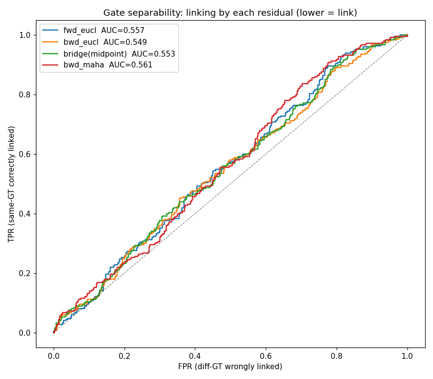
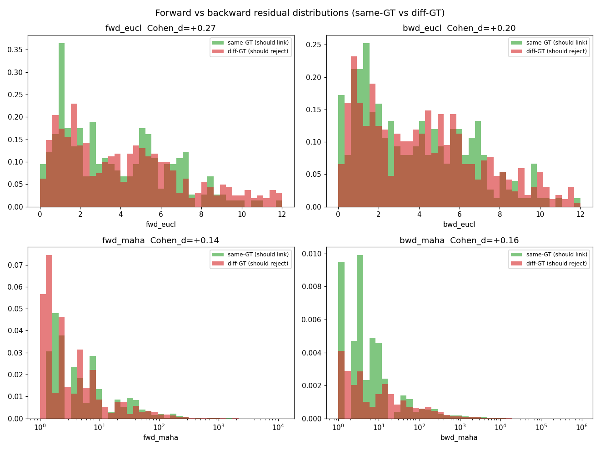
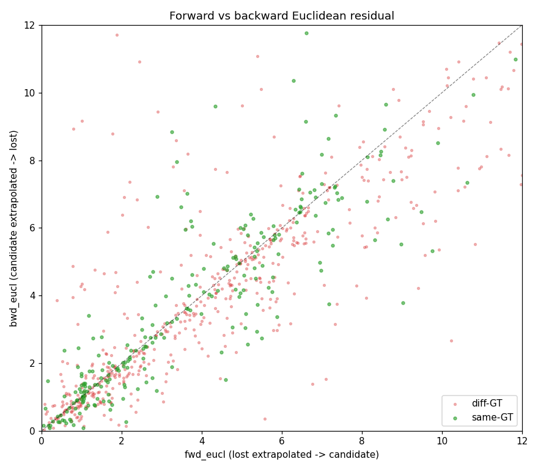
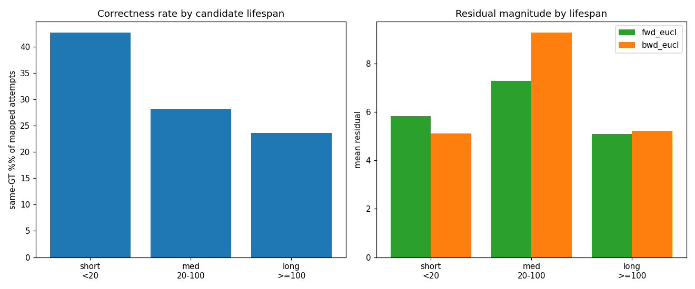

# Bidirectional Bridge-Relink — Data Analysis

Per-candidate analysis of the bidirectional bridge-relink attempts on **MOT17 train, SDP,
`mamba_whole_graph`** (IDF1 74.4 / HOTA 67.5 / AssA 65.3). See the roadmap in
[`bidirectional_relink_roadmap.md`](bidirectional_relink_roadmap.md) for the relink design.

- **Generator:** `scripts/tools/analyze_bidir_relink.py --plot`
- **Text report:** `scripts/tools/out/bidir_relink_report.txt`
- **Data source:** 14-column `datasets/MOT17/train/{seq}_raw_data.npy`, emitted by
  `relink_bidir_propose_kernel` (`src/tracking/tracker_gpu.cu`, `#define RAW_COLS 14`).
  Columns: `gap, bridge(midpoint), fwd_maha, dir_cos, speed, outcome, source, lost_id,
  cand_id, cand_hit_streak, lost_hit_streak, fwd_eucl, bwd_eucl, bwd_maha`.

Correctness label per attempt is derived by mapping `lost_id` / `cand_id` to GT IDs via the
MOT output (`map_track_to_gt`): **same-GT = should-link**, **diff-GT = should-reject**.

## Headline finding

**Pure geometry/motion cannot separate true from false bridge links.** Across 13 537
attempts (7 seqs), the ROC of every residual is barely above chance (AUC ≈ 0.55), and the
same-GT / diff-GT distributions overlap heavily. This is the AssA bottleneck made concrete:
in crowded scenes the *wrong* person is as kinematically close as the right one, so tuning a
motion threshold cannot close the gap — it needs **appearance / ReID or semantic features**.

Of the unhandled candidates (no accepted bridge proposal), **72 are genuine missed relinks**
(a same-GT lost track existed but was gated out, almost all by the mid-point `bridge_px`
gate) vs 60 correct rejects.

## Figures

### 1. Gate separability (ROC) — the decisive chart
Same-GT treated as positive, "small distance ⇒ predict link". Every feature is near the
diagonal: `bwd_maha` 0.561, `fwd_eucl` 0.557, `bridge(midpoint)` 0.553, `bwd_eucl` 0.549.
No residual is usable as a discriminating gate; `fwd_eucl` is **not** a meaningful
improvement over the current mid-point `bridge`.

### 2. Forward vs backward residual distributions
same-GT (green) and diff-GT (red) overlap heavily for all four residuals. `fwd_eucl` shows
the largest shift (Cohen's d = +0.27) but the ROC above shows it does not translate into
separability.

### 3. Forward vs backward Euclidean scatter
same-GT points cluster on the `fwd ≈ bwd` diagonal at low magnitude (forward and backward
extrapolation agree), while diff-GT scatters more — but the two classes are badly intermixed.
A faint lead worth testing: `|fwd_eucl − bwd_eucl|` *agreement* combined with low magnitude,
rather than either distance alone.

### 4. Behaviour by candidate lifespan
`hit_streak` is degenerate at bridge time (a candidate fires its single attempt exactly when
`hit_streak == bridge_at`, and a lost track's streak is reset by its miss), so "long vs short
ID" is bucketed by **track lifespan** (frames in the MOT output). same-GT rate falls as
lifespan grows — short tracks are where bridging both fires most and matters most.

## Caveats

- **Not bit-exact across recompiles.** The 14-column logging is read-only into a separate
  buffer and does not alter tracking logic, but recompiling the kernel shifts FMA
  contraction / scheduling, nudging a few borderline `bridge` decisions. Metrics moved
  within the documented 73.3–74.5 build/run noise band (here 73.5 → 74.4, an improvement).
  A single binary is internally deterministic (verified: MOT17-02 `bridge_revived = 14` on
  two runs).
- **GT mapping is approximate** (center-proximity within 2× height, ≥3 frames overlap),
  matching `analyze_missed_relinks.py`; "unmapped" attempts are excluded from same/diff stats.

## Next steps

1. Test the `|fwd − bwd|` agreement feature (add a column, re-ROC) to rule the last
   geometric lead in or out.
2. Otherwise pivot: wire an appearance/ReID or semantic embedding similarity onto the bridge
   candidates — that is where the AssA separability has to come from.
