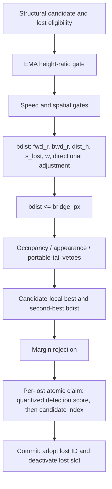

# H0 — headline-s full bridge-decision trace capture

<!-- doc-status: proposed -->
<!-- doc-promotion: none -->
<!-- doc-date: 2026-07-13 -->
<!-- doc-module: semantic -->

> **Status: proposed / draft-unsealed.** Trace instrumentation exists, but this
> declaration is not an execution seal. Until an owner seals the reviewed head,
> no Phase A/B capture, downstream claim study, preset change, or threshold study
> is authorized.

Research-wide type and upstream/downstream routing live in the
[research control plane](../../../research/README.md#research-control-plane). This
declaration owns only the H0 observability contract and its ordered terminal in
§7; it does not re-decide D0/R1 fidelity, S0 support, or any downstream claim.

## 1. Preconditions and authority

Before Phase A, the routing ledger is:

1. **Satisfied:** `P0_CAPTURE_SEMANTICS_INVALID` was accepted and P0 closed.
2. **Pending:** record a literal `SEALED` review against this declaration at the reviewed head, with the source and preset fingerprints in §2.

The seal authorizes only an observational H0 implementation and its Phase A/B unlabelled captures. It authorizes no GT/FP read, threshold variation, policy choice, registry/ledger modification, or production-preset change.

## 2. Frozen policy base, resolved configuration, and instrumentation provenance

The sole policy target is `configs/presets/mamba_whole_graph.yaml`:

| Setting | Required value |
| --- | ---: |
| `relink_bridge_enabled` | `true` |
| `relink_bridge_px` | `0.25` |
| `relink_bridge_margin` | `0.05` |
| `relink_bridge_h_lo`, `relink_bridge_h_hi` | `0.75`, `1.33` |
| `relink_bridge_spatial_gate`, `relink_bridge_max_speed` | `0`, `0` |
| `relink_bridge_dir_bonus` | `0.8` |
| `reid_mode` | `off` |

The sealed **policy base** is the pre-H0 decision path against which the H0
observer is assessed. It is deliberately distinct from the later
instrumented build: an observer necessarily changes source files and therefore
must not be required to have the same source-file hashes as its base.

| Policy-base item | SHA-256 / value |
| --- | --- |
| `policy_base_head` | `7581c9720569e17593d1844ad494253ce664fed8` |
| `policy_base_tree` | `2706ee3af0ddd6cd304f83289b575b2ae9b72fc6` |
| headline preset | `093b66ed124063f035ae9cf2a76e4f5426743cd819fb66e3e54994c97ea42cd1` |
| base `src/tracking/tracker_gpu.cu` | `36a0c7f952e99aee309c7fe4c9187852d070ee0ae600cd737a0beeeb55904e55` |
| base `include/tracking/tracker_gpu.hpp` | `b97a145a12a8f7ae3f6f055b210675f02d68d39a0d312f3e606a469d00272124` |

`resolved_bridge_policy_config_v1` is canonical UTF-8 JSON with lexicographic
keys, no insignificant whitespace, JSON `true`/`false`, and finite JSON
numbers. It contains exactly these post-preset, post-default, post-CLI
resolution fields:

```text
reid_mode
relink_enabled, relink_bank_cap, relink_sim_thresh, relink_lambda,
relink_spatial_gate, relink_max_age
relink_bridge_enabled, relink_bridge_px, relink_bridge_at,
relink_bridge_min_lost, relink_bridge_ttl, relink_bridge_max_speed,
relink_bridge_person_height, relink_bridge_fps, relink_bridge_margin,
relink_bridge_spatial_gate, relink_bridge_anchor,
relink_bridge_anchor_rate, relink_bridge_h_lo, relink_bridge_h_hi,
relink_bridge_dir_bonus, relink_bridge_occ_gate_cover,
relink_bridge_occ_gap_min, relink_bridge_occ_expand_px,
relink_bridge_occ_expand_cover, relink_bridge_app_veto
```

For the sole headline invocation (no module or CLI override), its canonical
SHA-256 is
`b1b78318ccbb87a701986f71c86147d83058e598ffd3b21e06f42d6116a51ae6`.
This includes disabled paths and their values; the short authority table above
is only a review aid, never the configuration fingerprint. H0 additionally
freezes `research_portable_or_tail_enabled=false`, a null portable-tail
threshold pointer, and `research_bridge_shadow=false`.

Each execution manifest must separately record all of the following:

- the preceding `policy_base_head`, base-tree, base-source, preset, and
  resolved-config fingerprints;
- `instrumentation_head`, its complete repository tree ID and canonical
  recursive tree-list SHA-256, and the complete binary/full-index repository
  diff from `policy_base_head` with its SHA-256;
- `runtime_policy_code_projection_v1`, its canonical diff and SHA-256, the
  excluded governance paths and blob SHA-256 values, and the sealed
  `h0_observational_diff_v1` admission result for that projection only; and
- CUDA build/compiler/extension identity, GPU identity, seven-sequence set,
  capture-schema version, and every instrumented kernel and host-helper
  SHA-256.

`instrumentation_head` must descend from `policy_base_head`. Repository
provenance is complete: no changed path is omitted from the recorded tree or
full diff. Policy admission is deliberately narrower. Construct
`runtime_policy_code_projection_v1` from that full diff by excluding **only**
the following `h0_governance_docs_allowlist_v1` paths:

```text
docs/modules/semantic/research/headline_bridge_full_decision_capture_declaration_20260713.md
docs/modules/semantic/research/headline_bridge_full_decision_capture_results_20260713.md
docs/modules/semantic/research/runtime_bridge_decision_path_identifiability_declaration_20260713.md
docs/modules/semantic/research/runtime_bridge_decision_path_identifiability_results_20260713.md
docs/modules/semantic/research/closed/runtime_bridge_decision_path_identifiability_results_20260713.md
docs/modules/semantic/research/evidence/p0_runtime_bridge_decision_path_20260713/manifest.json
docs/modules/semantic/research/evidence/p0_runtime_bridge_decision_path_20260713/field_sufficiency.json
docs/modules/semantic/research/evidence/p0_runtime_bridge_decision_path_20260713/decision_funnel.csv
docs/modules/semantic/research/evidence/p0_runtime_bridge_decision_path_20260713/metrics.json
docs/modules/semantic/README.md
docs/modules/semantic/TODO.md
docs/TODO.md
```

The manifest retains the excluded path list and each excluded blob hash, so the
allowlist does not hide a repository change. An excluded path must be
docs-only/non-executable content and must not alter or be consumed as a
resolved configuration, build input, runtime-policy source, executable
artifact, or production test. Every changed path outside this exact allowlist,
including any other document, remains in the runtime projection.

For the allowed P0 results rename from
`docs/modules/semantic/research/runtime_bridge_decision_path_identifiability_results_20260713.md`
to
`docs/modules/semantic/research/closed/runtime_bridge_decision_path_identifiability_results_20260713.md`,
the manifest emits one `governance_rename_v1` record with source and destination
paths plus `source_blob_before`, `source_blob_after`, `destination_blob_before`,
and `destination_blob_after`. Each blob slot is a tagged pair:
`{state: present, sha256: <hash>}` or `{state: absent, sha256: null}`; no side
may be omitted. For the normal move, source-after and destination-before are
`absent`/`null`, and destination-after equals the recorded source-before blob
hash.

`h0_observational_diff_v1` applies only to the runtime projection. It may add
only H0-owned trace schema/storage, deterministic instance-UID state,
trace-only allocation/clear/drain/serialization, and trace-pointer arguments
or writes at the observation points sealed in §4. It may also add only the
declared H0 export/replay verifier and its dedicated test:
`scripts/tools/export_headline_bridge_decision_trace.py`,
`scripts/tools/verify_headline_bridge_decision_trace.py`, and
`tests/unit/tracking/test_headline_bridge_decision_trace.py`; these must only
consume H0 trace outputs and never enter a production build or runtime path. It
may use atomics only on H0-owned cursors, overflow counters, or trace buffers.
It may not change an existing policy input, arithmetic operation, comparison,
branch predicate, loop/order used for policy selection, policy-state write,
launch geometry, or the values written to `track_ids`, `active`, claims,
proposals, debug counters, or MOT output. Trace-only source additions are not
policy-base drift.

Any base/config mismatch, non-descendant instrumentation head, missing complete
repository evidence or projection, a governance path outside the exact
allowlist, an allowlisted path that violates its docs-only restriction, or a
runtime projection outside `h0_observational_diff_v1` is
`H0_PROVENANCE_INVALID` before replay. A different instrumentation hash by
itself is expected and is not a provenance failure.

## 3. Canonical native decision graph



This is the control-flow target, not an after-the-fact sorting convention. The current fidelity event is insufficient because it is emitted after B/C/D and before E; the current shadow path also suppresses J. H0 must observe the real commit path and may not enable shadow mode.

## 4. Sealed capture ABI

H0 writes exactly four append-only physical streams: `pair_record`,
`candidate_record`, `claim_record`, and `commit_record`. Each has its own
capacity, cursor, overflow counter, schema, and canonical serialization.

Each raw stream envelope carries a capture-run UUID for provenance, but the UUID
is not a record field and is excluded from the semantic digest. CUDA append
order is non-authoritative. The verifier canonical-sorts each stream by its
sealed stable key and hashes only canonical semantic fields; the determinism bar
compares this canonical semantic SHA-256. Raw-stream hashes remain provenance
only and are not expected to agree across runs.

Every semantic record carries `seq`, `frame`, a schema version, and the stable
instance identity defined in §4.5. Visible `track_id` values are observations,
not identity keys: no record may use final MOT output or a local ID as its
cross-record identity.

### 4.1 Pair record

Key: `(seq, frame, cand_slot, cand_instance_uid, lost_slot, lost_instance_uid)`.

It is emitted after structural eligibility and **before** the height gate. It contains `la`, `bridge_at`, both ring lengths, EMA heights, height ratio and verdict; speed/spatial verdicts; anchors, velocities, `h_ref`, `fwd_r`, `bwd_r`, `dist_h`, `s_lost`, `w`, directional inputs, `bdist_before_direction`, `bdist_after_direction`; cutoff and all post-cutoff veto verdicts; final pair eligibility; and one ordered rejection reason. Values not reached because of an earlier rejection are a tagged `not_computed` value, never zero.

For both referenced instances it also records the visible pre-commit `track_id`.

### 4.2 Candidate-decision record

Key: `(seq, frame, cand_slot, cand_instance_uid)`. Native production-loop state,
not an offline sort, writes the candidate visible pre-commit `track_id`,
structural-competitor count, pre-score-pass count, cutoff/veto-pass count,
best/second lost instance UIDs, slots, and visible pre-commit `track_id`s,
native best/second `bdist` values, `no_second_competitor`, native margin,
margin verdict, proposal verdict, and proposal rejection reason.

### 4.3 Claim record

Key: `(seq, frame, proposing_cand_slot, proposing_cand_instance_uid,
proposed_lost_slot, proposed_lost_instance_uid)`. Each proposal and each
lost-claim outcome are linked by the pair/candidate key. The record preserves
the proposing and proposed-lost visible pre-commit `track_id`s, unquantized
detection score, `sq`, exact packed atomic key, candidate-index component,
winning candidate slot, instance UID, and visible pre-commit `track_id`, and
`claim_won` verdict.

### 4.4 Commit record

Key: the winning claim-record key. Each claim winner emits one commit record
with candidate and lost immutable instance UIDs; candidate and lost visible
pre-commit `track_id`s; candidate and lost visible post-commit `track_id`s;
candidate active state before/after; lost active state before/after; commit
verdict; and an explicit `lost_slot_deactivated` verdict. The verifier must
prove from these observations that
`candidate_postcommit_track_id == lost_precommit_track_id` and that the lost
slot changed `active: true -> false`. A non-winning claim emits no commit
record.

### 4.5 `track_instance_uid_v1` identity contract

`*_instance_uid` is a `uint64` `track_instance_uid_v1`, not a tracker local ID
and not a visible/MOT-output `track_id`. Its allocation is deterministic and
fixed before seal:

- Each sequence owns a `uint32` generation counter for every tracker slot,
  initialized to zero at sequence start.
- Immediately when a slot becomes a new track instance, before that instance
  can enter an H0 record, its own generation counter increments by one. The
  value must never wrap; a pending wrap is fail-closed.
- The UID is exactly `(uint64_t(slot_generation) << 32) | uint32_t(slot)`.
  Thus `(seq, track_instance_uid_v1)` is unique for the capture, nonzero for
  every allocated instance, and independent of GPU block scheduling or a
  global atomic allocator.
- A slot reuse receives its new generation and therefore a new UID even if the
  visible `track_id` repeats. The UID remains unchanged throughout that
  instance's lifetime.
- Relink commit changes only the candidate's visible `track_id`; it never
  overwrites candidate or lost instance UID. Every linked record retains both
  instance UIDs and records visible IDs in fields explicitly named
  `*_precommit_track_id` or `*_postcommit_track_id`.

The implementation may choose storage layout but not this allocator, allocation
event, formula, width, lifetime, or immutability. It may not reconstruct a UID
from final MOT output or substitute a local ID. If this contract cannot be
implemented, Phase A stops at `H0_CAPTURE_PARTIAL` without a capture packet.

### 4.6 Candidate-state and scalar encoding

Every candidate entering the structural loop emits exactly one candidate record,
including candidates with zero structural competitors or zero final-eligible
pairs. Candidate status is one of `no_structural_competitors`,
`all_rejected_pre_score`, `all_rejected_cutoff_or_veto`, `margin_rejected`, or
`proposal_emitted`, with this fixed precedence: zero structural competitors;
otherwise zero pre-score passes; otherwise zero final-eligible pairs; otherwise
margin rejection; otherwise proposal emitted.

Every scalar is serialized as raw IEEE-754 binary32 bits plus an explicit
status tag: `computed_finite`, `computed_pos_inf`, `computed_neg_inf`,
`computed_nan`, or `not_computed`. The special states are never inferred from
an IEEE payload; a `computed_nan` policy input invalidates the packet.

The native candidate-ranking initialization is preserved exactly:
`best_dist = second_dist = 1e30f`. Therefore a candidate with exactly one
selected best competitor records the native finite binary32 `1e30f` for
`second_best_bdist`, `no_second_competitor=true`, and the native float32 margin
subtraction used by the consumer. It must not substitute `+inf`. A candidate
with no selected best records both native initialized scalars, no best/second
lost identity, `no_second_competitor=false`, and `margin=not_computed` because
production returns before the margin branch. A candidate with two or more
selected competitors records the native runner-up scalar and
`no_second_competitor=false`.

## 5. Conservation and replay verifier

The four bounded streams require independent capacity, cursor, and overflow fields. Any overflow, duplicate key, identity collision, or failed conservation is `H0_PACKET_INVALID`.

The packet must prove:

```text
structural pairs = height rejects + speed rejects + spatial rejects + scored pairs
scored pairs = cutoff rejects + post-score veto rejects + final pair-eligible pairs
candidates with eligible pairs = margin rejects + proposals
proposals = claim losers + claim winners
claim winners = commits
structural candidates = no structural competitors + all-pre-score-rejected + all-cutoff-or-veto-rejected + margin rejects + proposals
```

The independent verifier consumes only these streams and frozen manifest values. It must replay each gate, float32-consistent scalar construction, best/second, margin, packed claim key, atomic winner, and commit with 100% decision agreement. Final-output similarity is not a substitute for per-stage agreement.

## 6. Non-perturbation protocol

For the same frozen input, capture-off and capture-on must have byte-identical MOT output, final IDs, bridge debug counters, proposal/commit counts, and zero overflow. Repeated capture-on runs must produce identical canonical semantic packet SHA-256 values; raw stream order and raw packet SHA-256 are provenance only. Any output, winner, scheduling, memory-state, or count discrepancy maps to `H0_CAPTURE_PERTURBS_POLICY`.

Phase A is one-sequence `MOT17-04-SDP` only and may repair instrumentation, not produce policy evidence. Phase B may run the frozen seven-sequence set only if all Phase A bars pass. Both phases are unlabelled and contain no threshold sweep.

The following changes require an amendment and owner reseal: moving an
observation point; changing any record ABI, stable key, or identity contract;
removing a DAG stage or replacing it with offline reconstruction; or changing a
conservation equation, replay bar, or terminal mapping. Only repairs that leave
all those semantics unchanged — compilation, capacity sizing, serialization, or
implementation bugs — may proceed under the same seal.

## 7. Terminal and post-terminal boundary

Terminals are evaluated in this exact order. The **first applicable terminal is
authoritative**; an executor may not select a later terminal when an earlier
condition holds.

1. `H0_PROVENANCE_INVALID` — any mismatch of `policy_base_head`, base tree or
   source fingerprint, resolved configuration fingerprint, preset, sequence
   authority, complete repository provenance, or
   `runtime_policy_code_projection_v1` / `h0_observational_diff_v1` admission;
   a governance path outside its exact allowlist or violating its docs-only
   restriction; a missing required instrumentation provenance field; or a
   non-descendant instrumentation head. Stop before replay.
2. `H0_CAPTURE_PERTURBS_POLICY` — capture-on/off differs in MOT output, final
   IDs, proposal or commit winner, bridge debug counters, proposal/commit
   counts, or scheduling-/memory-visible policy state.
3. `H0_PACKET_INVALID` — a produced packet has overflow, duplicate key,
   identity collision, a `computed_nan` policy input or other scalar invalidity,
   canonical semantic-digest mismatch across repeated capture-on runs, or any
   scalar, gate, ranking, margin, claim, or commit replay disagreement.
4. `H0_CAPTURE_PARTIAL` — with 1–3 false, Phase A proves that a required DAG
   stage cannot be observed by the sealed ABI without changing policy
   semantics. It must name the highest replay level and missing field(s); it
   produces no valid full packet and forbids Phase B.
5. `H0_FULL_COMMIT_CAPTURE_FAITHFUL` — only after Phase A passes and Phase B
   completes the frozen unlabelled seven-sequence capture, with all provenance,
   non-perturbation, capacity/conservation, canonical-determinism, and 100%
   full-commit replay bars passing for every sequence.

Phase A is a one-sequence preflight only: it may emit terminals 1–4, but never
`H0_FULL_COMMIT_CAPTURE_FAITHFUL`. `H0_FULL_COMMIT_CAPTURE_FAITHFUL` is
therefore unavailable until the seven-sequence Phase B evidence exists.

Only owner acceptance of `H0_FULL_COMMIT_CAPTURE_FAITHFUL` makes a separately declared B1 consumer-faithful operating-curve study a candidate. It is never a direct handoff.

## 8. Seal record

| Date | Reviewed head | Owner token | Transition |
| --- | --- | --- | --- |
| — | — | — | Draft only; execution prohibited |
