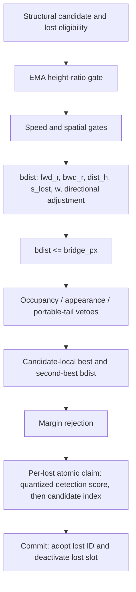

# H0 — headline-m full bridge-decision trace capture

<!-- doc-status: proposed -->
<!-- doc-promotion: none -->
<!-- doc-date: 2026-07-13 -->
<!-- doc-module: semantic -->

> **Status: proposed / draft-unsealed.** Trace instrumentation exists, but this
> declaration is not an execution seal. Until the declaration is repaired to the
> contract §20.2/§20.8 bar and an owner then seals the reviewed head, no
> Phase A/B capture, downstream claim study, preset change, or threshold study
> is authorized.

Research-wide type and upstream/downstream routing live in the
[research control plane](../../../research/README.md#research-control-plane). This
declaration owns only the H0 observability contract and its ordered terminal in
§7; it does not re-decide D0/R1 fidelity, S0 support, or any downstream claim.

## 1. Preconditions and authority

Before Phase A, the routing ledger is:

1. **Satisfied:** `P0_CAPTURE_SEMANTICS_INVALID` was accepted and P0 closed.
2. **Pending — declaration repair to the contract §20.2/§20.8 bar** (owner
   review, 2026-07-13):
   - declare typed κ = (quantification space, comparison relation, decision
     rule) for **every decidable unit** — this declaration contains at least
     pair-, candidate-, claim-, and commit-level units, and they are distinct;
   - replace the `H0_CAPTURE_PARTIAL` condition ("some DAG stage cannot be
     observed without changing policy semantics") with a **mechanically
     decidable criterion** — a fixed repair budget / attempt limit — so two
     implementers cannot diverge between "keep repairing instrumentation" and
     "declare partial";
   - make the terminal partition **exhaustive over execution-invalid
     outcomes** (build failure, runner crash, serialization failure — any run
     that produces no packet maps to a fail-closed terminal, not to an
     unmapped state).
3. **Pending:** record a literal `SEALED` review against this declaration at the reviewed head, with the source and preset fingerprints in §2.

The seal authorizes only an observational H0 implementation and its Phase A/B unlabelled captures. It authorizes no GT/FP read, threshold variation, policy choice, registry/ledger modification, or production-preset change.

## 2. Frozen policy base, resolved configuration, and instrumentation provenance

<!-- policy-target: headline -->

The sole policy target is `configs/presets/mamba_whole_graph_m.yaml` — the preset
the bridge-fidelity line is sealed on, and the one `HEADLINE_PRESET_REL`
(`src/saccade/perception/eval/consumer_a_bridge_fidelity.py`) names. It was
`mamba_whole_graph.yaml` (the `s` preset) until [Amendment 5](#amendment-5--policy-target-identity-2026-07-13-pre-seal).

| Setting | Required value |
| --- | ---: |
| `relink_bridge_enabled` | `true` |
| `relink_bridge_px` | `0.4` |
| `relink_bridge_margin` | `0.05` |
| `relink_bridge_h_lo`, `relink_bridge_h_hi` | `0.6`, `1.7` |
| `relink_bridge_spatial_gate`, `relink_bridge_max_speed` | `0`, `0` |
| `relink_bridge_dir_bonus` | `0.0` |
| `reid_mode` | `off` |

The sealed **policy base** is the pre-H0 decision path against which the H0
observer is assessed. It is deliberately distinct from the later
instrumented build: an observer necessarily changes source files and therefore
must not be required to have the same source-file hashes as its base.

| Policy-base item | SHA-256 / value |
| --- | --- |
| `policy_base_head` | `7581c9720569e17593d1844ad494253ce664fed8` |
| `policy_base_tree` | `2706ee3af0ddd6cd304f83289b575b2ae9b72fc6` |
| headline preset (`mamba_whole_graph_m.yaml`) | `496c4ec22b497c70bc8409227513939b4cd86834bf2210475d0ad655be6937af` |
| base `src/tracking/tracker_gpu.cu` | `36a0c7f952e99aee309c7fe4c9187852d070ee0ae600cd737a0beeeb55904e55` |
| base `include/tracking/tracker_gpu.hpp` | `b97a145a12a8f7ae3f6f055b210675f02d68d39a0d312f3e606a469d00272124` |

`resolved_bridge_policy_config_v1` is canonical UTF-8 JSON with lexicographic
keys, no insignificant whitespace, JSON `true`/`false`, and finite JSON
numbers. It contains exactly these post-preset, post-default, post-CLI
resolution fields:

```text
reid_mode
relink_enabled, relink_bank_cap, relink_sim_thresh, relink_lambda,
relink_spatial_gate, relink_max_age
relink_bridge_enabled, relink_bridge_px, relink_bridge_at,
relink_bridge_min_lost, relink_bridge_ttl, relink_bridge_max_speed,
relink_bridge_person_height, relink_bridge_fps, relink_bridge_margin,
relink_bridge_spatial_gate, relink_bridge_anchor,
relink_bridge_anchor_rate, relink_bridge_h_lo, relink_bridge_h_hi,
relink_bridge_dir_bonus, relink_bridge_occ_gate_cover,
relink_bridge_occ_gap_min, relink_bridge_occ_expand_px,
relink_bridge_occ_expand_cover, relink_bridge_app_veto
```

For the sole headline invocation (no module or CLI override), its canonical
SHA-256 is
`c7a6dbb35168cba75249b7f2c67d8455b6f634732493e455a4bb920aab6d7782`.
It is produced — and must be re-derivable — by
[`scripts/tools/resolved_bridge_policy_config.py`](../../../../scripts/tools/resolved_bridge_policy_config.py),
which reproduces the `s` fingerprint this declaration carried before
[Amendment 5](#amendment-5--policy-target-identity-2026-07-13-pre-seal)
(`b1b78318…`) from the same code path. Both values, and this declaration's
agreement with them, are pinned by
`tests/unit/test_resolved_bridge_policy_config.py`.
This includes disabled paths and their values; the short authority table above
is only a review aid, never the configuration fingerprint. H0 additionally
freezes `research_portable_or_tail_enabled=false`, a null portable-tail
threshold pointer, and `research_bridge_shadow=false`.

Each execution manifest must separately record all of the following:

- the preceding `policy_base_head`, base-tree, base-source, preset, and
  resolved-config fingerprints;
- `instrumentation_head`, its complete repository tree ID and canonical
  recursive tree-list SHA-256, and the complete binary/full-index repository
  diff from `policy_base_head` with its SHA-256;
- `runtime_policy_code_projection_v1`, its canonical diff and SHA-256, the
  excluded governance paths and blob SHA-256 values, and the sealed
  `h0_observational_diff_v1` admission result for that projection only; and
- CUDA build/compiler/extension identity, GPU identity, seven-sequence set,
  capture-schema version, and every instrumented kernel and host-helper
  SHA-256.

`instrumentation_head` must descend from `policy_base_head`. Repository
provenance is complete: no changed path is omitted from the recorded tree or
full diff. Policy admission is deliberately narrower. Construct
`runtime_policy_code_projection_v1` from that full diff by excluding **only**
the following `h0_governance_docs_allowlist_v1` paths:

```text
docs/modules/semantic/research/headline_bridge_full_decision_capture_declaration_20260713.md
docs/modules/semantic/research/headline_bridge_full_decision_capture_results_20260713.md
docs/modules/semantic/research/runtime_bridge_decision_path_identifiability_declaration_20260713.md
docs/modules/semantic/research/runtime_bridge_decision_path_identifiability_results_20260713.md
docs/modules/semantic/research/closed/runtime_bridge_decision_path_identifiability_results_20260713.md
docs/modules/semantic/research/evidence/p0_runtime_bridge_decision_path_20260713/manifest.json
docs/modules/semantic/research/evidence/p0_runtime_bridge_decision_path_20260713/field_sufficiency.json
docs/modules/semantic/research/evidence/p0_runtime_bridge_decision_path_20260713/decision_funnel.csv
docs/modules/semantic/research/evidence/p0_runtime_bridge_decision_path_20260713/metrics.json
docs/modules/semantic/README.md
docs/modules/semantic/TODO.md
docs/TODO.md
```

The manifest retains the excluded path list and each excluded blob hash, so the
allowlist does not hide a repository change. An excluded path must be
docs-only/non-executable content and must not alter or be consumed as a
resolved configuration, build input, runtime-policy source, executable
artifact, or production test. Every changed path outside this exact allowlist,
including any other document, remains in the runtime projection.

For the allowed P0 results rename from
`docs/modules/semantic/research/runtime_bridge_decision_path_identifiability_results_20260713.md`
to
`docs/modules/semantic/research/closed/runtime_bridge_decision_path_identifiability_results_20260713.md`,
the manifest emits one `governance_rename_v1` record with source and destination
paths plus `source_blob_before`, `source_blob_after`, `destination_blob_before`,
and `destination_blob_after`. Each blob slot is a tagged pair:
`{state: present, sha256: <hash>}` or `{state: absent, sha256: null}`; no side
may be omitted. For the normal move, source-after and destination-before are
`absent`/`null`, and destination-after equals the recorded source-before blob
hash.

`h0_observational_diff_v1` applies only to the runtime projection. It may add
only H0-owned trace schema/storage, deterministic instance-UID state,
trace-only allocation/clear/drain/serialization, and trace-pointer arguments
or writes at the observation points sealed in §4. It may also add only the
declared H0 export/replay verifier and its dedicated test:
`scripts/tools/export_headline_bridge_decision_trace.py`,
`scripts/tools/verify_headline_bridge_decision_trace.py`, and
`tests/unit/tracking/test_headline_bridge_decision_trace.py`; these must only
consume H0 trace outputs and never enter a production build or runtime path. It
may use atomics only on H0-owned cursors, overflow counters, or trace buffers.
It may not change an existing policy input, arithmetic operation, comparison,
branch predicate, loop/order used for policy selection, policy-state write,
launch geometry, or the values written to `track_ids`, `active`, claims,
proposals, debug counters, or MOT output. Trace-only source additions are not
policy-base drift.

Any base/config mismatch, non-descendant instrumentation head, missing complete
repository evidence or projection, a governance path outside the exact
allowlist, an allowlisted path that violates its docs-only restriction, or a
runtime projection outside `h0_observational_diff_v1` is
`H0_PROVENANCE_INVALID` before replay. A different instrumentation hash by
itself is expected and is not a provenance failure.

## 3. Canonical native decision graph



This is the control-flow target, not an after-the-fact sorting convention. The current fidelity event is insufficient because it is emitted after B/C/D and before E; the current shadow path also suppresses J. H0 must observe the real commit path and may not enable shadow mode.

## 4. Sealed capture ABI

H0 writes exactly four append-only physical streams: `pair_record`,
`candidate_record`, `claim_record`, and `commit_record`. Each has its own
capacity, cursor, overflow counter, schema, and canonical serialization.

Each raw stream envelope carries a capture-run UUID for provenance, but the UUID
is not a record field and is excluded from the semantic digest. CUDA append
order is non-authoritative. The verifier canonical-sorts each stream by its
sealed stable key and hashes only canonical semantic fields; the determinism bar
compares this canonical semantic SHA-256. Raw-stream hashes remain provenance
only and are not expected to agree across runs.

Every semantic record carries `seq`, `frame`, a schema version, and the stable
instance identity defined in §4.5. Visible `track_id` values are observations,
not identity keys: no record may use final MOT output or a local ID as its
cross-record identity.

### 4.1 Pair record

Key: `(seq, frame, cand_slot, cand_instance_uid, lost_slot, lost_instance_uid)`.

It is emitted after structural eligibility and **before** the height gate. It contains `la`, `bridge_at`, both ring lengths, EMA heights, height ratio and verdict; speed/spatial verdicts; anchors, velocities, `h_ref`, `fwd_r`, `bwd_r`, `dist_h`, `s_lost`, `w`, directional inputs, `bdist_before_direction`, `bdist_after_direction`; cutoff and all post-cutoff veto verdicts; final pair eligibility; and one ordered rejection reason. Values not reached because of an earlier rejection are a tagged `not_computed` value, never zero.

For both referenced instances it also records the visible pre-commit `track_id`.

### 4.2 Candidate-decision record

Key: `(seq, frame, cand_slot, cand_instance_uid)`. Native production-loop state,
not an offline sort, writes the candidate visible pre-commit `track_id`,
structural-competitor count, pre-score-pass count, cutoff/veto-pass count,
best/second lost instance UIDs, slots, and visible pre-commit `track_id`s,
native best/second `bdist` values, `no_second_competitor`, native margin,
margin verdict, proposal verdict, and proposal rejection reason.

### 4.3 Claim record

Key: `(seq, frame, proposing_cand_slot, proposing_cand_instance_uid,
proposed_lost_slot, proposed_lost_instance_uid)`. Each proposal and each
lost-claim outcome are linked by the pair/candidate key. The record preserves
the proposing and proposed-lost visible pre-commit `track_id`s, unquantized
detection score, `sq`, exact packed atomic key, candidate-index component,
winning candidate slot, instance UID, and visible pre-commit `track_id`, and
`claim_won` verdict.

### 4.4 Commit record

Key: the winning claim-record key. Each claim winner emits one commit record
with candidate and lost immutable instance UIDs; candidate and lost visible
pre-commit `track_id`s; candidate and lost visible post-commit `track_id`s;
candidate active state before/after; lost active state before/after; commit
verdict; and an explicit `lost_slot_deactivated` verdict. The verifier must
prove from these observations that
`candidate_postcommit_track_id == lost_precommit_track_id` and that the lost
slot changed `active: true -> false`. A non-winning claim emits no commit
record.

### 4.5 `track_instance_uid_v1` identity contract

`*_instance_uid` is a `uint64` `track_instance_uid_v1`, not a tracker local ID
and not a visible/MOT-output `track_id`. Its allocation is deterministic and
fixed before seal:

- Each sequence owns a `uint32` generation counter for every tracker slot,
  initialized to zero at sequence start.
- Immediately when a slot becomes a new track instance, before that instance
  can enter an H0 record, its own generation counter increments by one. The
  value must never wrap; a pending wrap is fail-closed.
- The UID is exactly `(uint64_t(slot_generation) << 32) | uint32_t(slot)`.
  Thus `(seq, track_instance_uid_v1)` is unique for the capture, nonzero for
  every allocated instance, and independent of GPU block scheduling or a
  global atomic allocator.
- A slot reuse receives its new generation and therefore a new UID even if the
  visible `track_id` repeats. The UID remains unchanged throughout that
  instance's lifetime.
- Relink commit changes only the candidate's visible `track_id`; it never
  overwrites candidate or lost instance UID. Every linked record retains both
  instance UIDs and records visible IDs in fields explicitly named
  `*_precommit_track_id` or `*_postcommit_track_id`.

The implementation may choose storage layout but not this allocator, allocation
event, formula, width, lifetime, or immutability. It may not reconstruct a UID
from final MOT output or substitute a local ID. If this contract cannot be
implemented, Phase A stops at `H0_CAPTURE_PARTIAL` without a capture packet.

### 4.6 Candidate-state and scalar encoding

Every candidate entering the structural loop emits exactly one candidate record,
including candidates with zero structural competitors or zero final-eligible
pairs. Candidate status is one of `no_structural_competitors`,
`all_rejected_pre_score`, `all_rejected_cutoff_or_veto`, `margin_rejected`, or
`proposal_emitted`, with this fixed precedence: zero structural competitors;
otherwise zero pre-score passes; otherwise zero final-eligible pairs; otherwise
margin rejection; otherwise proposal emitted.

Every scalar is serialized as raw IEEE-754 binary32 bits plus an explicit
status tag: `computed_finite`, `computed_pos_inf`, `computed_neg_inf`,
`computed_nan`, or `not_computed`. The special states are never inferred from
an IEEE payload; a `computed_nan` policy input invalidates the packet.

The native candidate-ranking initialization is preserved exactly:
`best_dist = second_dist = 1e30f`. Therefore a candidate with exactly one
selected best competitor records the native finite binary32 `1e30f` for
`second_best_bdist`, `no_second_competitor=true`, and the native float32 margin
subtraction used by the consumer. It must not substitute `+inf`. A candidate
with no selected best records both native initialized scalars, no best/second
lost identity, `no_second_competitor=false`, and `margin=not_computed` because
production returns before the margin branch. A candidate with two or more
selected competitors records the native runner-up scalar and
`no_second_competitor=false`.

## 5. Conservation and replay verifier

The four bounded streams require independent capacity, cursor, and overflow fields. Any overflow, duplicate key, identity collision, or failed conservation is `H0_PACKET_INVALID`.

The packet must prove:

```text
structural pairs = height rejects + speed rejects + spatial rejects + scored pairs
scored pairs = cutoff rejects + post-score veto rejects + final pair-eligible pairs
candidates with eligible pairs = margin rejects + proposals
proposals = claim losers + claim winners
claim winners = commits
structural candidates = no structural competitors + all-pre-score-rejected + all-cutoff-or-veto-rejected + margin rejects + proposals
```

The independent verifier consumes only these streams and frozen manifest values. It must replay each gate, float32-consistent scalar construction, best/second, margin, packed claim key, atomic winner, and commit with 100% decision agreement. Final-output similarity is not a substitute for per-stage agreement.

## 6. Non-perturbation protocol

For the same frozen input, capture-off and capture-on must have byte-identical MOT output, final IDs, bridge debug counters, proposal/commit counts, and zero overflow. Repeated capture-on runs must produce identical canonical semantic packet SHA-256 values; raw stream order and raw packet SHA-256 are provenance only. Any output, winner, scheduling, memory-state, or count discrepancy maps to `H0_CAPTURE_PERTURBS_POLICY`.

Phase A is one-sequence `MOT17-04-SDP` only and may repair instrumentation, not produce policy evidence. Phase B may run the frozen seven-sequence set only if all Phase A bars pass. Both phases are unlabelled and contain no threshold sweep.

The following changes require an amendment and owner reseal: moving an
observation point; changing any record ABI, stable key, or identity contract;
removing a DAG stage or replacing it with offline reconstruction; or changing a
conservation equation, replay bar, or terminal mapping. Only repairs that leave
all those semantics unchanged — compilation, capacity sizing, serialization, or
implementation bugs — may proceed under the same seal.

## 7. Terminal and post-terminal boundary

Terminals are evaluated in this exact order. The **first applicable terminal is
authoritative**; an executor may not select a later terminal when an earlier
condition holds.

1. `H0_PROVENANCE_INVALID` — any mismatch of `policy_base_head`, base tree or
   source fingerprint, resolved configuration fingerprint, preset, sequence
   authority, complete repository provenance, or
   `runtime_policy_code_projection_v1` / `h0_observational_diff_v1` admission;
   a governance path outside its exact allowlist or violating its docs-only
   restriction; a missing required instrumentation provenance field; or a
   non-descendant instrumentation head. Stop before replay.
2. `H0_CAPTURE_PERTURBS_POLICY` — capture-on/off differs in MOT output, final
   IDs, proposal or commit winner, bridge debug counters, proposal/commit
   counts, or scheduling-/memory-visible policy state.
3. `H0_PACKET_INVALID` — a produced packet has overflow, duplicate key,
   identity collision, a `computed_nan` policy input or other scalar invalidity,
   canonical semantic-digest mismatch across repeated capture-on runs, or any
   scalar, gate, ranking, margin, claim, or commit replay disagreement.
4. `H0_CAPTURE_PARTIAL` — with 1–3 false, Phase A proves that a required DAG
   stage cannot be observed by the sealed ABI without changing policy
   semantics. It must name the highest replay level and missing field(s); it
   produces no valid full packet and forbids Phase B.
5. `H0_FULL_COMMIT_CAPTURE_FAITHFUL` — only after Phase A passes and Phase B
   completes the frozen unlabelled seven-sequence capture, with all provenance,
   non-perturbation, capacity/conservation, canonical-determinism, and 100%
   full-commit replay bars passing for every sequence.

Phase A is a one-sequence preflight only: it may emit terminals 1–4, but never
`H0_FULL_COMMIT_CAPTURE_FAITHFUL`. `H0_FULL_COMMIT_CAPTURE_FAITHFUL` is
therefore unavailable until the seven-sequence Phase B evidence exists.

Only owner acceptance of `H0_FULL_COMMIT_CAPTURE_FAITHFUL` makes a separately declared B1 consumer-faithful operating-curve study a candidate. It is never a direct handoff.

## 8. Seal record

| Date | Reviewed head | Owner token | Transition |
| --- | --- | --- | --- |
| 2026-07-16 | `5996d83e2e79255c4ef7f596e622a64d612498fc` | `SEALED` | Draft → active |

## Amendment 1 — §20.2 / §20.8 sealability repair (2026-07-13; pre-seal)

This is an **append-only** correction to the draft declaration. It replaces
only the three pending conditions named in §1 item 2: the missing typed
\(\kappa\) declarations, the non-mechanical `H0_CAPTURE_PARTIAL` condition,
and the missing no-packet execution terminal. It changes no policy-base input,
observation point, physical stream, record ABI, stable key, identity contract,
conservation equation, replay bar, or authorized scope. It is not an execution
seal: the table above remains unsealed until an owner records a literal
`SEALED` review at a reviewed descendant head.

### A1. Required declaration block and typed \(\kappa\)

```text
Target decision layer   none (cross-layer substrate / observability work).
Study intent            boundary diagnostic. It determines whether the frozen
                        full native bridge-decision path can be observed and
                        replayed without changing that path.
Design objective        n/a. No policy, threshold, candidate, ranking, or
                        production action is selected or evaluated.
Selection rule          none. There are no competing candidates; the first
                        applicable ordered terminal in A3 is the result.
Validity gate           §2 provenance admission; A2 coverage admission;
                        capture-on/off non-perturbation (§6); zero stream
                        overflow, exact conservation (§5), and 100% replay.
Stop condition          exactly three Phase-A coverage attempts at most;
                        then one Phase-A capture only when A2 passes. Phase B
                        is available only after every Phase-A bar passes.
                        No retry, threshold sweep, policy change, or scope
                        expansion follows a terminal.
Output class            diagnostic result only. It cannot be promoted into a
                        design candidate or a policy claim.
Mainline transition     none / diagnostic-only. No H0 terminal occupies
                        mainline cadence. Only owner acceptance of
                        H0_FULL_COMMIT_CAPTURE_FAITHFUL makes a separately
                        declared B1 study a candidate; it is not a handoff.
```

Every comparison below consumes the canonical records or artifacts named in
this declaration, never final MOT output reconstructed offline. `exact` means
equality of keys, enum/status tags, integer fields, and raw IEEE-754 binary32
bits after the sealed canonical ordering. A scalar tagged `not_computed` is
compared as that tag, not as a numeric zero.

| Decidable unit | Quantification space | Comparison relation | Decision rule |
| --- | --- | --- | --- |
| Pair replay | Every `pair_record` key in the canonical Phase-A/B packet | Exact fieldwise equality between the native trace and independent replay, including the ordered gate/rejection result | Every record and gate agrees; any missing, extra, duplicate, or disagreeing pair is `H0_PACKET_INVALID`. |
| Candidate replay | Every `candidate_record` key in the canonical packet | Exact fieldwise equality of native loop state, best/second construction, margin, and proposal result | Every candidate agrees; any mismatch is `H0_PACKET_INVALID`. |
| Claim replay | Every `claim_record` key in the canonical packet | Exact fieldwise equality of proposal inputs, packed key, winner identity, and `claim_won` outcome | Every claim agrees; any mismatch is `H0_PACKET_INVALID`. |
| Commit replay | Every `commit_record` key in the canonical packet | Exact fieldwise equality of winning claim identity, visible IDs, active-state transition, and commit result | Every commit agrees and satisfies §4.4; any mismatch is `H0_PACKET_INVALID`. |
| Packet conservation | The four canonical streams as a single packet | Exact equality of the six §5 conservation equations and their keyed joins | All equations and joins hold with zero overflow and no identity collision; otherwise `H0_PACKET_INVALID`. |
| Capture non-perturbation | A capture-off / capture-on pair using the same frozen input and resolved configuration | Byte equality of MOT output and final IDs; exact equality of bridge debug counters, proposal/commit counts, winners, and scheduling-/memory-visible policy state | Every listed comparison agrees; any difference is `H0_CAPTURE_PERTURBS_POLICY`. |
| Coverage admission | The five required H0 components in A2, for each numbered coverage attempt | Exact equality of the sealed component set and the attempt's `h0_coverage_v1` Boolean map | All five values are `true` before capture; a remaining `false` after attempt 3 is `H0_CAPTURE_PARTIAL`. |
| Execution completion | Each invoked coverage, capture, verification, or serialization phase | The controller's frozen result enum and required artifact set | A non-success controller result or a missing/unreadable required phase artifact is `H0_EXECUTION_INVALID`. |
| Ordered terminal | One completed Phase-A or Phase-B attempt | First applicable predicate in A3, evaluated in order | Record exactly that terminal; no later terminal may be substituted. |

### A2. Mechanical coverage budget for `H0_CAPTURE_PARTIAL`

The required H0 component set is fixed as:

```text
track_instance_uid_v1
pair_record
candidate_record
claim_record
commit_record
```

Before any Phase-A capture, the sealed H0 controller writes one canonical
`h0_coverage_v1` artifact for each numbered coverage attempt. It contains
exactly the five names above as lexicographically ordered Boolean keys. A
`true` value means the admitted instrumentation build contains the sealed
writer and required field mapping for that component; it is a static capture
capability assertion, not a count of data-dependent runtime events. Thus an
otherwise valid sequence with zero commits does not by itself create a coverage
gap.

There are exactly three coverage attempts, `1`, `2`, and `3`. An attempt is
counted only after its controller exits successfully and emits a parseable,
complete `h0_coverage_v1` artifact. Between attempts, a repair may change only
trace-owned code allowed by `h0_observational_diff_v1`; every repair must again
pass the §2 provenance admission. No fourth attempt is permitted under this
declaration.

`H0_CAPTURE_PARTIAL` is mechanically selected only when attempts 1–3 all
complete, attempts 1–2 did not admit all five components, and attempt 3 still
has at least one `false` component. Its required terminal artifact is the three
coverage maps plus the lexicographically ordered set of false component names.
It produces no valid full-capture packet and forbids Phase B. This fixed
predicate replaces the earlier judgment phrased as a stage being impossible to
observe without changing policy semantics.

### A3. Exhaustive ordered terminal partition

For every controller invocation, the wall-clock deadline is 3,600 seconds from
process launch, measured by a monotonic clock. Its result enum is exactly
`success`, `build_failed`, `extension_load_failed`, `runner_nonzero`,
`runner_timeout`, `serialization_failed`, `artifact_missing_or_unreadable`, or
`unclassified_execution_failure`. The last value is mandatory for any
no-artifact failure not covered by a preceding value, so a failure can never be
left unmapped. A complete packet that is emitted but malformed is a packet
validity failure, not a serialization success.

The following order supersedes §7's draft list while preserving the meaning of
its existing terminals:

1. `H0_PROVENANCE_INVALID` — §2 provenance or projection admission fails.
   **Transition: none / diagnostic-only.** Stop before coverage, capture, or
   replay.
2. `H0_EXECUTION_INVALID` — after provenance passes, a required controller
   invocation has any non-`success` enum, exceeds its deadline, or fails to
   emit the required complete phase artifact. This includes build failure,
   runner crash/nonzero exit, and serialization failure that yields no complete
   artifact. **Transition: none / diagnostic-only.** Stop; do not reinterpret
   it as partial observability.
3. `H0_CAPTURE_PERTURBS_POLICY` — the §6 capture-on/off comparison differs.
   **Transition: none / diagnostic-only.** Stop before replay or Phase B.
4. `H0_PACKET_INVALID` — a complete emitted packet has overflow, duplicate
   key, identity collision, invalid scalar, canonical-digest mismatch, failed
   conservation, or any pair/candidate/claim/commit replay disagreement.
   **Transition: none / diagnostic-only.** Stop before Phase B.
5. `H0_CAPTURE_PARTIAL` — only the exact A2 three-attempt predicate holds,
   with terminals 1–4 false. **Transition: none / diagnostic-only.** Its
   coverage artifacts are diagnostic only; Phase B is forbidden.
6. `H0_FULL_COMMIT_CAPTURE_FAITHFUL` — Phase A and the frozen unlabelled
   seven-sequence Phase B both complete with every preceding predicate false
   and every §2, §5, §6, and A1 replay bar true. **Transition: none /
   diagnostic-only.** It may be owner-accepted, after which a new B1
   declaration is merely a candidate.

Phase A may emit only terminals 1–5. Terminal 6 is unavailable until the
seven-sequence Phase-B artifact exists. This amendment adds no policy evidence,
does not authorize Phase A or B, and leaves registry, ledger, preset, and
production behavior unchanged.

## Amendment 2 — pre-seal coverage and independent native completeness (2026-07-13; pre-seal)

This is an **append-only** correction to Amendment 1. Its A2 three-attempt
repair budget is not a sealable experiment: it lets an executor choose a new
trace implementation between attempts, and its Boolean map has no frozen
checker, field schema, or static evidence. Its packet-defined κ universes also
cannot detect a native candidate or pair that was never appended. Amendment 2
supersedes A1–A3 wherever they conflict. In particular, it retires
`H0_CAPTURE_PARTIAL` as an H0 execution terminal and replaces A1's
packet-derived pair/candidate/claim/commit quantification spaces.

For avoidance of doubt, this also supersedes the old `H0_CAPTURE_PARTIAL`
sentence in §4.5, the “Phase A may repair instrumentation” sentence in §6,
and §7 item 4. Those retained passages are historical draft text only; the
state effect, A2.1 progression, and A2.4 partition below are authoritative.

### Amendment state effect

- §1 item 2 is **satisfied by Amendment 2's declaration repair**. This is a
  statement about the executable contract, not an admission that a future
  instrumentation head has already passed it.
- §1 item 3 — a literal owner `SEALED` review — is now the sole pending gate.
  An owner may make that review only after the pre-seal freeze artifact in A2.2
  is complete and all of its coverage components are `true`.
- The §8 table remains unsealed. No pre-seal check, build, or dry run is a
  Phase-A/B capture or evidence. The TODO pointer must name owner seal as the
  sole pending gate and must retain the pre-seal-freeze condition on that gate.

### A2.1. Engineering boundary and coverage component/field authority

All instrumentation repair is **pre-seal engineering**, not a sealed Phase-A
activity. It has no fixed number of edits or attempts and may not emit an H0
terminal. The only permitted progression is:

```text
pre-seal engineering
  -> choose one fixed instrumentation head
  -> run the frozen static coverage checker and obtain all true
  -> record the schema/checker/source hashes in one freeze artifact
  -> owner reviews and writes SEALED for that exact head
  -> sealed Phase A, then (only if admitted) Phase B; no repair is permitted
```

Thus neither implementer discretion nor an engineering failure can determine a
research terminal. A failed or incomplete pre-seal checker result is simply
`H0_PRESEAL_COVERAGE_INCOMPLETE`, an engineering status that prohibits seal and
capture. It is not an H0 observability terminal and supplies no result. After
seal, a missing checker artifact, altered hash, false coverage value, build
failure, runner failure, timeout, unreadable artifact, or any attempted repair
is `H0_EXECUTION_INVALID`; it never becomes `H0_CAPTURE_PARTIAL`.

The frozen complete field authority is
`scripts/tools/h0_bridge_decision_trace_schema_v2.json`. It fixes the exact
field list (not merely stable keys) for each of `pair_records`,
`candidate_records`, `claim_records`, and `commit_records`; it also fixes all
five native-universe key schemas, their observed-stream relations, and this
lexicographically ordered component set:

```text
track_instance_uid_v1
pair_record
candidate_record
claim_record
commit_record
native_universe_v2
```

`scripts/tools/check_h0_bridge_decision_trace_contract.py` is the corresponding
frozen checker. It verifies every declared C++ record field and Python drain
field (except externally supplied `seq`), every CUDA writer/key-field mapping,
each native writer marker, independent native-universe cursor path, and
`track_instance_uid_v1` marker. It emits a
canonical `h0_coverage_v2` object with the ordered Boolean map, its own SHA-256,
the schema SHA-256, and SHA-256 values for the admitted H0 source files. The
exporter consumes the same schema and rejects a missing or unexpected record
field, so a coverage `true` is backed by static source evidence and by packet
admission rather than a self-declaration.

This amendment extends the §2 `h0_observational_diff_v1` offline-tool allowance
only with these non-production inputs:

```text
scripts/tools/h0_bridge_decision_trace_schema_v2.json
scripts/tools/check_h0_bridge_decision_trace_contract.py
```

They may read H0 source and trace-output schemas only; they may not be a build
input or runtime-policy path. The checker and schema are subject to the same
complete repository provenance and runtime-projection record as every other
non-governance changed path.

### A2.2. Freeze artifact and deterministic progression rule

Before owner seal, `h0_preseal_freeze_v2` must canonically record:

```text
instrumentation_head and complete tree/projection evidence
capture_schema_version = h0_bridge_decision_trace_v2
the complete h0_coverage_v2 object, with every component true
SHA-256 of h0_bridge_decision_trace_schema_v2.json
SHA-256 of check_h0_bridge_decision_trace_contract.py
the checker-recorded SHA-256 values of every admitted H0 source file
the exact command line and tool/runtime identity that produced the check
```

The `instrumentation_head` named by the freeze artifact is the only head that
an owner may seal. The owner review verifies that all listed hashes, the
checker object, the resolved configuration, and §2 provenance agree. Capture
does not begin otherwise. A head change, checker/schema change, source hash
change, absent field, or false component returns the work to pre-seal
engineering; it cannot be repaired within an execution or counted as a retry.

`seq` is an external immutable sequence authority, inserted once by the frozen
capture serializer into both the observed records and the native-universe keys.
It comes from the frozen manifest, never a stream row or final MOT output.

### A2.3. Native κ universes and completeness authority

The four semantic record streams remain append-only observations. Amendment 2
adds a separate, H0-owned **native-universe sidecar** with its own five buffers,
capacities, cursors, and overflow counters. Its append paths are independent
of all four record cursors: a dropped semantic record leaves its expected
native key present, while an exhausted sidecar buffer fails closed by overflow.
The sidecar is an expected-key authority, not a fifth semantic replay stream.

| Decidable unit | Native quantification space and observation point | Comparison relation and decision rule |
| --- | --- | --- |
| Candidate completeness | Every native structural candidate instance entering the production candidate loop, keyed by `(seq, frame, cand_slot, cand_instance_uid)` before the candidate-record append | `native_candidate_keys` equals the canonical candidate-record key set exactly. Missing, extra, duplicate, or sidecar overflow is `H0_PACKET_INVALID`. |
| Pair completeness | Every native candidate–lost structural evaluation after the production structural filters and before the pair-record append, keyed by `(seq, frame, cand_slot, cand_instance_uid, lost_slot, lost_instance_uid)` | `native_pair_keys` equals the canonical pair-record key set exactly. Any inequality or overflow is `H0_PACKET_INVALID`. |
| Proposal completeness | Every native proposal that passes native best/second/margin selection, immediately before claim-record append and `atomicMax`, keyed by the claim key | `native_proposal_keys` equals the canonical claim-record key set exactly. Any inequality or overflow is `H0_PACKET_INVALID`. |
| Claim-winner completeness | Every native winner after atomic-claim resolution and before the commit-record append or policy-state write, keyed by the winning claim key | `native_claim_winner_keys` equals precisely the canonical claim keys with `claim_won=pass`. Any inequality or overflow is `H0_PACKET_INVALID`. |
| Commit completeness | Every native winner entering the actual commit branch immediately before the production `track_ids`/`active` writes, keyed by the commit key | `native_commit_keys` equals the canonical commit-record key set exactly. Any inequality or overflow is `H0_PACKET_INVALID`. |

The native sidecar is therefore the κ quantification space. The packet does
not enumerate its own universe. Only after these five exact expected-versus-
observed comparisons pass does the existing fieldwise replay quantify over the
observed record at every expected native key. The four replay units from A1
(pair, candidate, claim, commit), §5 conservation, and §6 non-perturbation
remain required, but their old phrase “every `*_record` key in the packet” is
replaced by “every observed record at every expected native-universe key.”

### A2.4. Sealed terminal partition replacement

For a sealed invocation, the ordered partition is:

1. `H0_PROVENANCE_INVALID` — any §2 or A2.2 provenance/freeze mismatch. Stop
   before capture.
2. `H0_EXECUTION_INVALID` — any non-success controller result, deadline,
   incomplete required artifact, altered checker/schema/source hash, false
   coverage value, or attempted trace repair after seal. Stop; there is no
   partial-capture reinterpretation.
3. `H0_CAPTURE_PERTURBS_POLICY` — the §6 capture-off/on comparison differs.
4. `H0_PACKET_INVALID` — any packet/schema violation, native-universe or
   observed-stream inequality, duplicate, overflow, identity collision,
   scalar invalidity, conservation failure, canonical-digest mismatch, or
   pair/candidate/claim/commit replay disagreement.
5. `H0_FULL_COMMIT_CAPTURE_FAITHFUL` — Phase A then the frozen unlabelled
   seven-sequence Phase B complete with every preceding predicate false and
   every replay bar true.

The first applicable terminal remains authoritative. Phase A may emit only
1–4. Terminal 5 remains unavailable until the seven-sequence Phase-B artifact
exists. This amendment changes no policy selection or production write and
does not itself authorize Phase A, Phase B, or any downstream claim.

## Amendment 3 — fail-closed envelope and mechanical writer admission (2026-07-13; pre-seal)

This is an **append-only** correction to Amendment 2. Amendment 2 fixed the
native κ universe but still allowed an unarmed native drain to be rewritten by
the Python wrapper into an apparently complete all-zero v2 packet. It also
described a mechanical writer checker whose earlier implementation could accept
a stale occurrence of a buffer name, a comment about cursor independence, or a
field assignment outside the actual writer. Amendment 3 supersedes A2.1–A2.4
where they conflict and makes these admission and execution predicates
fail-closed.

### A3.1. Complete capture envelope and production exposure authority

`h0_bridge_decision_trace_schema_v2.json`'s ordered `envelope_fields` list is
the complete top-level packet ABI. Every listed record/native stream, every
total and overflow counter, `identity_uid_wrap_events`, `trace_armed`,
`processed_frame_count`, `bridge_attempt_count`, `bridge_commit_count`,
`capture_phase`, and both exposure requirements must be present. A wrapper,
exporter, or verifier may not synthesize a missing field, stream, total, or
overflow value. In particular, it may not interpret an absent cursor as the
number of drained rows or an absent overflow counter as zero.

`trace_armed` is native provenance, not a Python convenience flag. It is true
only when H0 tracing is enabled and all semantic/native buffers, capacities,
cursors, overflow counters, identity state, claim-index state, and the native
bridge-debug authority are allocated. An unarmed or partly allocated native
drain is not a capture packet: the wrapper rejects it before adding the v2
envelope. `processed_frame_count > 0` is mandatory invocation provenance.
`complete` is a derived convenience value only and has no terminal authority.
The manifest preserves this provenance field, but the semantic digest excludes
it so CUDA-graph bookkeeping cannot make otherwise equal decision packets
non-deterministic.

The native bridge debug counter `dbg[2]`, incremented before the candidate
sidecar append, is the independent candidate-exposure authority:

```text
bridge_attempt_count == len(native_candidate_keys)
```

Likewise `dbg[3]`, incremented on the actual commit path, is the independent
commit-exposure authority:

```text
bridge_commit_count == len(native_commit_keys)
```

Both equalities are exact and are checked in the wrapper and exporter in
addition to all native-sidecar comparisons. Phase A must declare and satisfy
nonzero candidate exposure. Phase B must declare and satisfy nonzero candidate
and commit exposure. Thus a Phase-B artifact with no actual commit path cannot
support `H0_FULL_COMMIT_CAPTURE_FAITHFUL`; any missing, unarmed, malformed,
truncated, or zero-required-exposure packet is `H0_PACKET_INVALID` (after the
earlier partition predicates).

### A3.2. Mechanical writer and cursor proof

The frozen checker parses whitespace-tolerant `h0_append_record(...)` calls;
it does not treat a broad source-string occurrence as evidence. For all four
semantic and five native append paths it must prove, in the named production
propose or commit kernel, the exact five-argument tuple:

```text
(buffer, capacity, cursor, overflow, local record/key)
```

It then limits field evidence to the local record/key construction through the
matching append call. Each frozen field (other than serializer-owned `seq` and
the fixed record schema tag) must have an assignment in that slice. The native
key cursor in the checked tuple must be the named native cursor rather than the
paired observed-record cursor; a prose comment cannot establish independence.
The checker also verifies the native binding/wrapper envelope gate, exporter
absence of `capture.get(...)` fallbacks, exact exposure comparisons, and that
the verifier enters through canonical fail-closed packet validation.

The checker-recorded source set explicitly includes
`scripts/tools/verify_headline_bridge_decision_trace.py` as well as the header,
CUDA source, Python binding, wrapper, and exporter. Its mutation tests are part
of the pre-seal admission proof: deleting the claim append, substituting the
record cursor for a native cursor, or moving a native key-field assignment
after its append must each make the relevant coverage component false.

### A3.3. State effect

§1 item 2 remains satisfied by the repaired executable declaration. The sole
pending gate remains §1 item 3: an owner may write `SEALED` only after one
complete `h0_preseal_freeze_v2` artifact records the amended schema, checker,
all admitted source hashes, and all-true coverage. This amendment neither
authorizes capture nor changes policy behavior, and it creates no new
observability terminal.

## Amendment 4 — comment-free static evidence (2026-07-13; pre-seal)

This is an **append-only** correction to Amendment 3's mechanical-admission
implementation. All CUDA evidence used by `kernel_scopes()`,
`h0_append_record(...)` parsing, local construction-to-append slicing, and
pre-append field-assignment matching is taken from a comment-masked analysis
source. The mask replaces every `//...` and `/*...*/` non-newline character
with whitespace while preserving total length and each newline offset. It does
not alter string, character, or raw-string literal contents.

Consequently a commented-out append, a stale commented field assignment, or a
commented kernel-boundary marker cannot be writer evidence, while every parsed
offset still identifies the same location in the frozen source. Pre-seal
mutation tests must demonstrate both of these cases:

```text
live claim append replaced by an exact commented append -> claim_record = false
native key assignment only commented before append, live only after append
    -> native_universe_v2 = false
```

This correction changes neither the envelope/exposure predicates nor any
policy behavior. §1 item 2 remains satisfied; §1 item 3 owner `SEALED` after a
complete freeze artifact remains the sole pending gate.

---

## Amendment 5 — policy-target identity (2026-07-13; pre-seal)

This is an **append-only** correction to the frozen policy target of § 2. It
changes which preset H0 observes. It changes no capture ABI, no κ, no coverage
budget, no terminal partition, and no envelope predicate: Amendments 1–4 are
untouched.

### A5.1 The error

The declaration froze `configs/presets/mamba_whole_graph.yaml` (the **`s`**
preset) and called it *"the current headline runtime path"*. `headline` is
overloaded in this repository — `docs/research/tracker-decision/status_2026-07-09.md`
keeps **both** an `s` (primary) and an `m` (capacity) track — but the
bridge-fidelity line H0 continues is sealed on **`m`**:

| Authority | Says |
| --- | --- |
| `src/saccade/perception/eval/consumer_a_bridge_fidelity.py` (`HEADLINE_PRESET_REL`) | `configs/presets/mamba_whole_graph_m.yaml` |
| same file, production constants | `PRODUCTION_BRIDGE_PX = 0.4` — *"must match headline preset"* |
| [Step-0 production substrate audit](production_substrate_mapping_20260711.md) § wiring | `configs/presets/mamba_whole_graph_m.yaml` |
| [D0](d0_bridge_estimator_fidelity_20260711.md) | headline preset = `mamba_whole_graph_m.yaml` |

An H0 capture on `s` would therefore have produced a trace comparable to **no
existing packet** — not D0's, not R1's, not S0's — while claiming to observe the
headline path.

### A5.2 What changed, exactly

Resolved through the runtime's own parser, `s → m` moves **four** fields and
nothing else (verified by
[`scripts/tools/resolved_bridge_policy_config.py`](../../../../scripts/tools/resolved_bridge_policy_config.py)):

| Field | was (`s`) | now (`m`) |
| --- | ---: | ---: |
| `relink_bridge_px` | `0.25` | `0.4` |
| `relink_bridge_h_lo` | `0.75` | `0.6` |
| `relink_bridge_h_hi` | `1.33` | `1.7` |
| `relink_bridge_dir_bonus` | `0.8` | `0.0` |

| Fingerprint | was | now |
| --- | --- | --- |
| preset bytes | `093b66ed…` | `496c4ec2…` |
| `resolved_bridge_policy_config_v1` | `b1b78318…` | `c7a6dbb3…` |

`policy_base_head`, `policy_base_tree`, and the base `tracker_gpu.cu` / `.hpp`
hashes are **unchanged**: they fingerprint source, not policy.

### A5.3 Pre-declared consequences of observing `m`

These follow from the `m` policy and are declared **now**, before capture, so
that they cannot later be reported as findings:

1. **The directional branch is inert.** `m` runs `relink_bridge_dir_bonus = 0.0`
   (its preset states explicitly that `m` does not inherit `s`'s `0.8`). The
   pair record still carries the directional scalar, but it is identically zero
   for every observed pair. **H0-on-`m` yields no evidence about the directional
   path**, and an all-zero column is the expected result, not an anomaly.
2. **The height gate is the wider `[0.6, 1.7]`.** The pre-cutoff funnel — the
   population H0 exists to observe, because D0 could not see height-gate
   rejects — is shaped by these bounds. The reject counts are `m`'s, and are
   not comparable to any `s`-gated quantity.
3. **Only `m` connects to the sealed line.** H0's motivating finding (field
   insufficiency: no `frame`, no slot ids, no detection score ⇒ margin,
   `atomicMax` claim, and commit are unreplayable, capping replay at L1) was
   established on the **`m`** packets. On `m`, H0's trace closes exactly those
   fields.

### A5.4 Effect on the § 1 routing ledger

§ 1 item 1 reads *"Satisfied: `P0_CAPTURE_SEMANTICS_INVALID` was accepted and P0
closed."* P0 remains closed, and its sealed terminal is **correct for the `s`
scope it declared** — but that is not this line's scope. An append-only
[Correction 1](runtime_bridge_decision_path_identifiability_declaration_20260713.md)
records that P0 audited the `s` policy against `m`-sealed evidence: the `px` /
`dir_bonus` delta it read as a foreign capture is simply `m`'s correct values.
Re-run against **`m`**, with contradiction and absence held apart, the terminal
becomes **`P0_CAPTURE_SEMANTICS_UNVERIFIABLE`** — nothing is contradicted; four
policy knobs are simply **never stamped**.

So the defect H0 inherits is **provenance incompleteness, not capture
corruption**: the D0/R1/S0 evidence is sound but under-documented. H0 is built on
that plus P0's surviving **field-sufficiency** finding (L1 replay cap), and it
closes both — it stamps the unstamped gates and records the fields whose absence
caps replay. H0 must **not** be sealed on the strength of the foreign-capture
framing.

### A5.5 State effect

Still pre-seal. § 1 item 2 remains satisfied; § 1 item 3 — owner `SEALED` after a
complete freeze artifact — remains the sole pending gate, and the freeze artifact
must now be produced against `m`.

---

## Amendment 6 — runtime-projection admission classifier (2026-07-16; pre-seal)

This is an **append-only** correction to §2's `h0_observational_diff_v1`
admission as consumed by A2.2's freeze artifact. It changes no observation
point, record ABI, coverage component, terminal partition, or policy behavior.

### A6.1 The defect

§2 constructs `runtime_policy_code_projection_v1` by excluding only the fixed
twelve-path governance allowlist and then admits the projection only if it adds
nothing beyond the enumerated H0-owned trace surface. That enumeration was
written against an instrumentation head expected to sit near
`policy_base_head`. Since then the repository has accumulated non-runtime
progress — governance and research documents outside the fixed allowlist,
documentation tooling, CI workflows, and tests belonging to other sealed
studies. Read literally, every such path makes every descendant of current
`main` inadmissible, permanently: the projection can never again be clean, and
the only textual escape is sealing an untested cherry-picked side branch. That
outcome weakens provenance — capture would run on a tree no CI has exercised —
while hiding nothing, so the admission rule, not the provenance record, is what
must be repaired.

### A6.2 Frozen path classifier `h0_projection_path_class_v1`

Admission of the runtime projection is now evaluated through a frozen,
mechanical, fail-closed path classifier:

```text
runtime_build_consumable:
    prefix src/ | include/ | configs/ | cmake/
    or exact root build/dependency manifest:
       pyproject.toml, uv.lock, CMakeLists.txt, setup.py, setup.cfg, Makefile
    or ANY path matching no rule (fail-closed default)
non_runtime_recorded:
    prefix docs/ | .github/ | tests/ | scripts/
```

- Every `runtime_build_consumable` changed path must be a member of the frozen
  admitted set `h0_admitted_runtime_paths_v1`:

```text
include/tracking/tracker_gpu.hpp
src/tracking/tracker_gpu.cu
src/tracking/tracker_gpu_python.cpp
src/saccade/perception/tracking/tracker_gpu.py
src/saccade/perception/eval/stages.py
```

  Their content restrictions are unchanged: exactly the trace-only additions
  §2 already admits, never a policy input, comparison, branch predicate,
  ordering, launch geometry, or policy-state change. Any other
  `runtime_build_consumable` changed path makes the projection **not
  admitted** — a pre-seal engineering status that prohibits seal, of the same
  kind as `H0_PRESEAL_COVERAGE_INCOMPLETE`; it is not an observability
  terminal.

- `non_runtime_recorded` paths stay **in** both the full diff and the
  projection diff and are each recorded with before/after content SHA-256
  (`absent`/`null` when a side does not exist). Classification records; it
  never excludes or hides. The governance allowlist and its blob-hash record
  are unchanged.

- Paths classified `non_runtime_recorded` under `tests/` and `scripts/` must
  not be consumed by the production build or runtime import graph. The
  production build consumes only the `runtime_build_consumable` surface;
  introducing a new build edge from a `non_runtime_recorded` path is a
  classifier-breaking change: it requires amending this classifier, changes
  the assembler hash recorded in the freeze artifact, and returns the work to
  pre-seal engineering.

### A6.3 Freeze assembler and artifact extension

`scripts/tools/build_h0_preseal_freeze.py` is the frozen assembler that
implements `h0_projection_path_class_v1` and emits `h0_preseal_freeze_v2`. It
joins the A2.1 offline-tool allowance (schema + checker) as a non-production
input: it may read git history, H0 sources, and the trace schema; it may not
be a build input or runtime-policy path. The artifact additionally records:

```text
full-diff SHA-256 and projection-diff SHA-256
    (git diff --no-color --binary --full-index --no-renames)
per-path projection classification with before/after content SHA-256
excluded governance allowlist paths with blob SHA-256 values
the governance_rename_v1 record of §2
projection_admitted verdict (false prohibits seal; engineering status only)
the A3.2/A4 mutation admission results — all five named cases must flip
    their coverage component to false against an all-true baseline
the resolved policy identity for the sole target m: preset SHA-256 and
    resolved_bridge_policy_config_v1 fingerprint
the assembler's own SHA-256
```

The artifact is produced at the exact `instrumentation_head` it names, with a
clean working tree, and is committed afterward; it is not required to be
reachable from that head's tree. A2.2's rule is unchanged: that head is the
only head an owner may seal, and any head, checker, schema, source, or
classifier change returns the work to pre-seal engineering.

### A6.4 State effect

§1 item 2 remains satisfied by the repaired executable declaration. The sole
pending gate remains §1 item 3: owner literal `SEALED` for the exact head named
by one complete freeze artifact whose coverage components are all true, whose
projection is admitted, and whose mutation admission passes. This amendment
authorizes no capture and creates no observability terminal.

---

## Amendment 7 — Phase-A execution ABI closure and return to pre-seal engineering (2026-07-16)

This is an **append-only execution-authority correction**. It changes no policy
target, record or observer ABI, native universe, runtime policy, threshold,
projection classifier, mutation admission, terminal partition, registry, or
contract. It supplies the missing sealed-invocation choices needed to make one
Phase-A implementation possible without executor discretion.

### A7.1 Seal disposition and state effect

The §8 row for instrumentation head
`5996d83e2e79255c4ef7f596e622a64d612498fc` remains verbatim as the historical
owner event that occurred. It is not deleted, rewritten, or relabelled. A first
read-only pre-execution preflight, performed before build or capture, found that
the declaration sealed no Phase-A controller, exact invocation, run order or
cardinality, fixed Phase-A commit-exposure value, controller artifact set, or
evidence destination. Therefore that historical seal is **not execution
authority** for Phase A or Phase B and must not be used to launch either phase.

No sealed invocation had started: no controller was launched, no build or
capture occurred, no packet was produced, no GT/FP label source was read, and no
Phase B work occurred. This is `PRE-EXECUTION AMBIGUITY`, not
`H0_EXECUTION_INVALID`, and it emits **no H0 terminal**. Routes in A2.4 apply
only after a valid sealed invocation has actually begun.

H0 returns to **pre-seal engineering**. The next execution authority requires,
in this order:

```text
implement the A7 controller/schema/verifier without changing A7 choices
  -> choose a new instrumentation_head descending from 5996d83e...
  -> produce one new complete h0_preseal_freeze_v3 for that exact head
  -> owner reviews that head and records a new literal SEALED
  -> invoke Phase A exactly as A7.3--A7.8 prescribe
```

The old `h0_preseal_freeze_v2` and old §8 seal cannot be supplemented or paired
with the new controller. Neither is reusable as execution authority. This
amendment itself is not a reseal, does not create a freeze artifact, and
authorizes no build or capture.

### A7.2 Three authority layers; no runtime rule completion

The following layers are disjoint:

1. **Frozen declaration choices** are all values, orderings, command vectors,
   result mappings, artifact names, and path derivations in A7. They may change
   only by another append-only amendment followed by a new freeze and owner
   reseal.
2. **Controller implementation** is repository code that implements those
   choices. Its sole controller path and schema/version are
   `scripts/tools/run_h0_phase_a.py` / `h0_phase_a_controller_v1`. Its complete
   execution-artifact schema is
   `scripts/tools/h0_phase_a_execution_schema_v1.json` /
   `h0_phase_a_execution_v1`. Its independent aggregate verifier is
   `scripts/tools/verify_h0_phase_a.py` / `h0_phase_a_verifier_v1`. Packet export
   and packet replay remain owned by the existing
   `scripts/tools/export_headline_bridge_decision_trace.py` and
   `scripts/tools/verify_headline_bridge_decision_trace.py` paths.
3. **Execution-produced evidence** is the immutable output tree in A7.8. It
   records what the sealed controller did; it is never a source of missing
   execution rules.

`h0_preseal_freeze_v3` is the sole hash authority for the implementation layer.
It retains every complete v2 provenance, policy, coverage, projection, mutation,
schema, checker, and admitted-source field and additionally records the
repository-relative path, schema/version string, Git object ID, and file-byte
SHA-256 for the controller, execution schema, aggregate verifier, packet
exporter, packet verifier, and freeze assembler. It also records the literal
command vectors, build vectors, ordered run plan, result enum, artifact inventory,
and evidence-root derivation in A7.3--A7.8. Every recorded content hash must
equal both the blob at `instrumentation_head` and the file read at invocation.

The controller accepts **no positional arguments and no options**; `-h` and
`--help` are the only non-executing exceptions. Any other argument fails before
invocation. It must reject any environment value that attempts to select a
different preset, sequence, detector, data root, output root, capture order,
repeat count, exposure requirement, attempt count, deadline, build directory,
build target, verifier, or Phase B continuation. It may inspect the host only to
record or verify the frozen repository, dependency, dataset, build, runtime, and
GPU identities. It may not infer a rule, prompt for one, use a default not named
here, or accept a free CLI/environment override.

None of the three controller-layer paths exists as sealed authority until it is
implemented at the new instrumentation head and all three hashes are present in
a complete v3 freeze. Implementation is pre-seal engineering and cannot itself
emit an H0 terminal or Phase-A evidence.

### A7.3 Sole invocation, checkout, input, and runtime requirements

The sole Phase-A command is run once, from the repository root, exactly as this
single argv vector (no shell prefix, suffix, redirection, or additional token):

```text
uv run --frozen python scripts/tools/run_h0_phase_a.py
```

Immediately before process launch:

- `git rev-parse --show-toplevel` must equal the physical current directory;
- `git rev-parse HEAD` must equal the new `instrumentation_head` named by both
  the complete v3 freeze and the new literal `SEALED` owner event;
- `git status --porcelain=v1 --untracked-files=normal` must be empty, and the
  controller, schemas, verifiers, freeze assembler, admitted sources, preset,
  and lock file must byte-match the v3 freeze;
- the only sequence is the complete `datasets/MOT17/train/MOT17-04-SDP`
  sequence. `seqinfo.ini` fixes its full frame count; `max_frames=0` and
  `warmup_frames=0`. The v3 freeze pins a canonical sequence-input digest made
  from the UTF-8 POSIX relative path, decimal byte length, and SHA-256 of every
  regular input file except `gt/` and `det/`, sorted by relative-path bytes;
- `datasets/MOT17/train/MOT17-04-SDP/gt`, every MOT GT/FP label or annotation,
  MOTMetrics, and any label-derived cache are forbidden to the controller and
  all children. Detector input and frozen model/engine files are not labels;
  every loaded model/engine path and SHA-256 is recorded; and
- runtime selection is exactly preset `mamba_whole_graph_m`, detector `SDP`,
  split `train`, GPU decode enabled, double buffer enabled, detect barrier
  `event`, `processes=0`, no module file, no config file, no threshold or policy
  override, and the complete sequence. Every setting not enumerated here comes
  only from the sealed preset and code defaults at `instrumentation_head`; the
  controller records the fully resolved runtime configuration and verifies the
  existing `resolved_bridge_policy_config_v1` fingerprint.

An operator-side read-only check before this exact command is not a controller
invocation. Once the process above launches with a new valid freeze and seal,
the sealed invocation has begun and the A2.4 mapping applies.

### A7.4 Exact build and build-artifact identity

There is one build attempt. `build/h0_phase_a` must not exist at controller
launch. The controller executes these two argv vectors exactly once and in this
order, from the repository root:

```text
uv run --frozen cmake --fresh -S . -B build/h0_phase_a -DCMAKE_BUILD_TYPE=Release -DENABLE_NATIVE_TESTS=OFF -DSACCADE_ENABLE_NVTX=ON -DPython3_EXECUTABLE=.venv/bin/python
uv run --frozen cmake --build build/h0_phase_a --target saccade_tracking_ext saccade_scan_plugin --parallel 1
```

The required Python extension is exactly
`build/h0_phase_a/saccade_tracking_ext<EXT_SUFFIX>`, where `EXT_SUFFIX` is the
single value returned by the frozen `.venv/bin/python` `sysconfig` at runtime;
no glob or alternative build directory may select it. The required plugin is
exactly `build/h0_phase_a/libsaccade_scan_plugin.so`. Both must be regular files.
`build_identity.json` records, for each, the repository-relative path, byte
length, SHA-256, ELF GNU build ID, and dynamic dependency inventory; it also
records the two command vectors, CMake cache SHA-256, CMake/generator,
C/C++/CUDA compiler identities and versions, CUDA toolkit, Python ABI and
executable SHA-256, and `uv.lock` SHA-256. Import resolution must prove that
`saccade_tracking_ext.__file__` is the required extension path. Any absent,
ambiguous, stale, differently loaded, or identity-mismatched artifact is an
execution failure.

### A7.5 Cardinality, order, exposure gates, attempts, and deadline

After the sole successful build, the controller performs exactly four fresh
full-sequence processes, serially, in this immutable order:

```text
00_capture_off
01_capture_on_1
02_capture_on_2
03_capture_on_3
```

Each process starts from empty tracker/runtime state and consumes the same
frozen input in the same frame order. `00_capture_off` sets H0 trace capture
disabled. Each capture-on process enables the sealed H0 trace on the actual
commit path, clears it before frame 1, drains it exactly once after the final
frame, and fixes:

```text
capture_phase = phase_a
require_candidate_exposure = true
require_commit_exposure = false
```

Thus Phase A requires nonzero candidate exposure and does **not** require
nonzero commit exposure. A zero commit count is not by itself a Phase-A
failure; every commit that does occur remains subject to exact completeness,
comparison, conservation, and replay. Capture-on is repeated exactly three
times total, not three retries.

There is exactly **one controller invocation, one build attempt, one capture-off
run, and three capture-on runs**. The retry count for the controller, build, each
run, export, checksum, and verifier is zero. No failed or timed-out step may be
reissued, resumed, replaced, or skipped under the same seal.

One 3,600-second wall-clock deadline begins at controller process launch on a
monotonic clock and ends only after `result.json` and `checksums.sha256` are
closed and fsynced, the atomic evidence-root rename completes, and its parent
directory is fsynced. It includes preflight, configure, build, extension load,
all four runs, export, comparison, replay verification, checksum generation,
publication, and final serialization; it is not reset or paused between stages.
Every child is given only the remaining time. Exhaustion anywhere selects
`runner_timeout`.

### A7.6 Frozen policy-visible comparison inventory

For each run, `policy_inventory.json` has schema
`h0_phase_a_policy_inventory_v1` and exactly these decision-relevant members:

| Member | Canonical value | Required comparison |
| --- | --- | --- |
| `mot_output` | Complete `MOT17-04-SDP.txt` file bytes and SHA-256 | Capture-off equals each capture-on byte for byte. |
| `final_track_rows` | For every processed frame and evaluator output-row position: frame, row index, raw binary32 box/score bits, class, and final track ID, in emitted order | Capture-off equals each capture-on exactly. |
| `active_tid_slot_pairs` | After every frame: frame followed by the existing native `get_active_tid_slot_pairs()` integer pairs sorted by slot, with no omitted active slot | Capture-off equals each capture-on exactly. |
| `relink_debug_raw` | The complete existing 13-integer `get_relink_debug()` vector after the sequence; index 3 is bridge attempts and index 4 is bridge accepts/actual commits | Capture-off equals each capture-on exactly, including proposal/commit-visible counts. |
| `proposal_projection` | Capture-on canonical candidate keys with `proposal_emitted=pass`, joined exactly to native proposal keys and claim records | Capture-on runs 1--3 have identical count, keys, packed claim inputs, and SHA-256. Capture-off policy equivalence is decided by the preceding output/state/debug inventory; this trace-only projection may not be fabricated for capture-off. |
| `winner_commit_projection` | Capture-on canonical native winner and commit keys plus claim-winner and commit-record policy transitions | Capture-on runs 1--3 have identical count, keys, winner IDs, pre/post `track_id` and `active` values, and SHA-256; each projection must agree with its own final state and bridge-accept count. |
| `overflow_vector` | All four semantic and five native overflow counters in schema order | Every capture-on value is exactly zero. |

This table is the complete policy-visible non-perturbation inventory for Phase A.
No implementation-defined “similar output”, tolerance, extra counter, scheduling
proxy, memory snapshot, or unordered comparison may replace or weaken it. Raw
CUDA append order, elapsed time, log text, capture UUID, and raw packet hash are
provenance only and are not policy-equality fields. The packet verifier still
enforces the complete observer ABI, native-universe equality, conservation,
canonical determinism, scalar/gate/ranking/margin/claim/commit replay, and the
exposure equalities of A3.1.

### A7.7 Final controller result enum and A2.4 mapping

The controller writes exactly one final `result` value from this enum, applying
the rows top-to-bottom; the first applicable row is authoritative:

| Controller result | Exact condition | A2.4 disposition |
| --- | --- | --- |
| `provenance_invalid` | Any policy-base, checkout/head, freeze, seal, tree/projection, input digest, resolved configuration, schema/checker/controller/verifier/source hash, or admitted-path mismatch detected before the relevant execution step | `H0_PROVENANCE_INVALID` |
| `build_failed` | Either exact build vector exits nonzero or required build identity cannot be established | `H0_EXECUTION_INVALID` |
| `extension_load_failed` | The required extension/plugin cannot be loaded from the required paths and identities | `H0_EXECUTION_INVALID` |
| `runner_nonzero` | Any of the four ordered runtime processes exits nonzero | `H0_EXECUTION_INVALID` |
| `runner_timeout` | The single monotonic 3,600-second deadline is exhausted anywhere | `H0_EXECUTION_INVALID` |
| `serialization_failed` | A required artifact cannot be canonically serialized, closed, or fsynced | `H0_EXECUTION_INVALID` |
| `artifact_missing_or_unreadable` | A required A7.8 artifact is absent, unreadable, schema-invalid, or checksum-incomplete | `H0_EXECUTION_INVALID` |
| `unclassified_execution_failure` | Any execution/no-artifact failure not matched above; this catch-all is mandatory | `H0_EXECUTION_INVALID` |
| `capture_perturbs_policy` | Execution completed but any capture-off/on equality in A7.6 differs | `H0_CAPTURE_PERTURBS_POLICY` |
| `packet_invalid` | Non-perturbation passed but any capture-on packet, exposure, overflow, native-universe, conservation, cross-repeat canonical digest, or full replay predicate fails | `H0_PACKET_INVALID` |
| `phase_a_pass` | All preceding predicates are false and all three capture-on packets and all A7 verifications pass | **No H0 terminal; non-terminal progression only.** |

This enum replaces A3's generic Phase-A controller enum where the two conflict;
it does not alter A2.4's four negative terminals or their order. An execution
failure cannot be relabelled as pre-seal ambiguity, partial capture, packet
invalidity, or a retry after the sealed controller has launched.

`phase_a_pass` ends the process successfully only after evidence finalization.
The controller must contain no Phase-B dispatch, import, subprocess, queue
submission, or continuation flag. It exits after Phase A. Phase B remains a
separate later progression available only after Phase-A evidence is reviewed
under the governing declaration; Phase-A pass never starts it automatically and
never produces `H0_FULL_COMMIT_CAPTURE_FAITHFUL`.

### A7.8 Sole evidence directory, schema, and required artifact set

Let `<H>` be the exact 40-lowercase-hex `instrumentation_head`. The sole output
root is the repository-relative directory
`docs/modules/semantic/research/evidence/h0_phase_a_<H>/`. This substitution is
mechanical; timestamps, user-supplied tags, `/tmp`, `runs/`, a second root, and
overwriting a pre-existing root are forbidden. The root must not exist at
controller launch and is published once by atomic rename from the sibling
`h0_phase_a_<H>.incomplete/` directory. Any stale incomplete or final directory
is an execution failure, not permission to select another path.

A `phase_a_pass` tree contains exactly this required regular-file inventory
(directories are implicit):

```text
manifest.json
build_identity.json
runtime_identity.json
gpu_identity.json
comparison.json
result.json
checksums.sha256
logs/00_cmake_configure.stdout.log
logs/00_cmake_configure.stderr.log
logs/01_cmake_build.stdout.log
logs/01_cmake_build.stderr.log
runs/00_capture_off/invocation.json
runs/00_capture_off/policy_inventory.json
runs/00_capture_off/MOT17-04-SDP.txt
runs/00_capture_off/stdout.log
runs/00_capture_off/stderr.log
runs/01_capture_on_1/invocation.json
runs/01_capture_on_1/policy_inventory.json
runs/01_capture_on_1/MOT17-04-SDP.txt
runs/01_capture_on_1/packet.json
runs/01_capture_on_1/packet_verification.json
runs/01_capture_on_1/stdout.log
runs/01_capture_on_1/stderr.log
runs/02_capture_on_2/invocation.json
runs/02_capture_on_2/policy_inventory.json
runs/02_capture_on_2/MOT17-04-SDP.txt
runs/02_capture_on_2/packet.json
runs/02_capture_on_2/packet_verification.json
runs/02_capture_on_2/stdout.log
runs/02_capture_on_2/stderr.log
runs/03_capture_on_3/invocation.json
runs/03_capture_on_3/policy_inventory.json
runs/03_capture_on_3/MOT17-04-SDP.txt
runs/03_capture_on_3/packet.json
runs/03_capture_on_3/packet_verification.json
runs/03_capture_on_3/stdout.log
runs/03_capture_on_3/stderr.log
verification/aggregate.json
```

All JSON is canonical UTF-8 `h0_phase_a_execution_v1`: lexicographic object
keys, compact separators, finite JSON numbers, and one trailing LF. The root
manifest records the declaration and sidecar SHA-256, new seal and v3-freeze
identity, complete artifact inventory, all command vectors and stage results,
ordered run IDs, input/config identities, exposure values, packet canonical and
raw SHA-256 values, and references to the build/runtime/GPU identities.
`runtime_identity.json` records `uv`, Python, dependency lock, PyTorch, CUDA
runtime/driver, cuDNN, TensorRT, loaded shared libraries, and every loaded
model/engine identity. `gpu_identity.json` records the one selected device's
NVML UUID, PCI bus ID, name, VBIOS, compute capability, total memory, and driver;
multi-GPU execution or a device change between runs fails.

Each `packet_verification.json` is the complete output of the sealed packet
verifier for that packet. `comparison.json` contains every exact relation in
A7.6 and the three canonical semantic packet digests.
`verification/aggregate.json` is the independent A7 verifier's validation of the
manifest, ordered cardinality, exposure flags, build/runtime/GPU identity,
artifact schemas, packet verifier outputs, comparison, result mapping, and
checksums. `checksums.sha256` contains lowercase SHA-256, two spaces, and the
POSIX relative path for every other regular file in the tree, sorted by path
bytes; it does not list itself. No symlink, device, socket, or undeclared regular
file is allowed.

Negative results use the same root and common identity/result/checksum/log
locations, while each not-reached run or packet is represented in
`manifest.json` by the execution schema's explicit `not_run` / `not_produced`
tag; it may never be replaced by an empty packet or a fabricated success
artifact. The schema's result-specific required-file map is itself frozen in
the v3 artifact. A missing required failure artifact selects
`artifact_missing_or_unreadable` when the controller can still finalize, and
otherwise A2.4's fail-closed `H0_EXECUTION_INVALID` applies.

### A7.9 Amendment acceptance boundary

Before the next seal, two conforming controller implementers must have no choice
over command, checkout relation, build vectors or products, sequence, runtime
selection, run cardinality/order, repeat count, exposure gates, attempts,
deadline, result mapping, comparison inventory, artifact set, or output path.
The new freeze must mechanically prove those constants and hashes. Until then,
H0 remains in pre-seal engineering with no terminal and no execution authority.

---

## Amendment 7 Review Correction 1 — child execution, failure bundles, and input immutability (2026-07-16)

This is an **append-only sealability correction to Amendment 7** after its first
review. A7 correctly removed the old seal's execution authority, but still left
three implementation choices open: the runtime-child entry/environment, the
negative-result file set, and protection against bound-input drift after
controller launch. RC1 closes exactly those choices. Where RC1 conflicts with
A7.2--A7.9, RC1 is authoritative. It changes no H0 terminal, terminal order,
observer ABI, policy target, runtime threshold, instrumentation source,
registry, or contract, and it authorizes no implementation or execution.

### A7.RC1.1 Sole child entry and four literal child invocations

The controller implementation set gains exactly one repository path:
`scripts/tools/run_h0_phase_a_child.py`, schema/version
`h0_phase_a_child_v1`. The future `h0_preseal_freeze_v3` must bind its Git
object ID and file-byte SHA-256 in the same way as the controller, execution
schema, and verifiers. The child is an implementation artifact, not an operator
entry point. A7.2's no-argument rule continues to apply to the sole operator
command; it does not forbid the controller from launching the following four
internal argv vectors.

Let `<ROOT>` be the physical repository root established by A7.3. From
`cwd=<ROOT>`, after the one successful build, the controller calls
`subprocess.Popen` exactly four times with `shell=false`, `close_fds=true`,
`start_new_session=true`, stdin connected to `/dev/null`, separate binary
stdout/stderr files, and the exact environment in A7.RC1.2. The argv vectors,
in order, are:

```text
<ROOT>/.venv/bin/python -I -B <ROOT>/scripts/tools/run_h0_phase_a_child.py --run-id 00_capture_off
<ROOT>/.venv/bin/python -I -B <ROOT>/scripts/tools/run_h0_phase_a_child.py --run-id 01_capture_on_1
<ROOT>/.venv/bin/python -I -B <ROOT>/scripts/tools/run_h0_phase_a_child.py --run-id 02_capture_on_2
<ROOT>/.venv/bin/python -I -B <ROOT>/scripts/tools/run_h0_phase_a_child.py --run-id 03_capture_on_3
```

`<ROOT>` substitution is byte-for-byte the same absolute POSIX path in all four
vectors. `-I` isolates the interpreter from user-site and Python environment
configuration; `-B` forbids bytecode writes into the bound repository. No other
token, Python option, cwd, stdio mode, process-launch API, or child count is
permitted. The child parser accepts exactly the two-token suffix
`--run-id <one-enumerated-id>` and rejects duplicates, abbreviations, positional
arguments, response files, and every other option.

For each run ID, the child constructs this exact synthetic evaluator argv,
where `<RUN>` is the corresponding A7.8 run directory beneath the incomplete
evidence root:

```text
--preset mamba_whole_graph_m
--detector SDP
--data-root datasets/MOT17
--split train
--sequences MOT17-04-SDP
--max-frames 0
--warmup-frames 0
--latency-only
--gpu-decode
--double-buffer
--detect-barrier event
--main-nms-graphed
--processes 0
--output <RUN>/_runtime
```

The child passes that vector through the repository's existing MOT17 parser and
preset/default resolution, rejects unknown or residual arguments, verifies the
resolved `m` fingerprint from §2, and calls
`saccade.perception.eval.evaluator.run_eval` exactly once with that completely
resolved map. `latency_only=true` is literal and mandatory: `run_eval` must
return at its no-metrics boundary, and neither the child nor any imported code
may import/call `run_motmetrics_evaluation`, enumerate `gt/` or `det/`, or open a
GT/FP label or label-derived cache. Because the existing latency-only path does
not write a MOT file, the child supplies the existing
`sequence_result_callback`; it accepts exactly the sole sequence's complete
ordered tuple and writes `MOT17-04-SDP.txt` as UTF-8
`"\n".join(result_lines)` with no trailing newline. A missing, duplicate, or
second-sequence callback is `runner_nonzero`.

Before frame 1 the fresh child-owned tracker makes exactly one of these calls:

```text
00_capture_off:
  set_research_h0_bridge_trace(false, 65536, 16384, 16384, 16384)

01_capture_on_1 / 02_capture_on_2 / 03_capture_on_3:
  set_research_h0_bridge_trace(true, 65536, 16384, 16384, 16384)
  clear_research_h0_bridge_trace()
```

The five arguments are respectively enabled, pair capacity, candidate capacity,
claim capacity, and commit capacity. After the last frame and callback, capture
off performs no drain. Each capture-on child drains exactly once using:

```text
drain_research_h0_bridge_trace(
  seq="MOT17-04-SDP",
  capture_phase="phase_a",
  require_candidate_exposure=true,
  require_commit_exposure=false,
  capture_run_uuid=<controller-issued UUID for this run>)
```

It then invokes the frozen packet exporter once and packet verifier only when
the result matrix in A7.RC1.4 requires it. The controller-issued UUID is the
only per-run nondeterministic value; it is provenance-only as already declared.
The child API, capacities, evaluator vector, callback serialization, and H0
lifecycle calls are literal v3-freeze constants; the future child cannot replace
them with `scripts/eval/mot17.py`, another evaluator API, or a code-default
metrics choice.

### A7.RC1.2 Exact sanitized child environment

The controller constructs every child environment **from an empty mapping**;
it never copies, overlays, or passes through `os.environ`. Before any Python
module other than the standard library is imported, the child verifies that its
environment key set and values equal this table exactly:

| Key | Exact value / sole mechanical derivation |
| --- | --- |
| `CUDA_DEVICE_ORDER` | literal `PCI_BUS_ID` |
| `CUDA_VISIBLE_DEVICES` | NVML UUID of the physical NVIDIA GPU with lexicographically smallest normalized PCI bus ID; the controller records that ID/UUID before child launch |
| `HOME` | `<RUN_TMP>/home` |
| `LANG` | literal `C.UTF-8` |
| `LC_ALL` | literal `C.UTF-8` |
| `LD_LIBRARY_PATH` | colon-join, in this order and with no empty member: `<ROOT>/build/h0_phase_a`, the v3-bound TensorRT library directory, the v3-bound PyTorch library directory, the v3-bound CUDA toolkit `lib64` directory |
| `PATH` | literal `<ROOT>/.venv/bin:/usr/bin:/bin` |
| `PYTHONHASHSEED` | literal `0` |
| `PYTHONNOUSERSITE` | literal `1` |
| `SACCADE_BUILD_PATH` | literal `<ROOT>/build/h0_phase_a` |
| `SACCADE_DETECT_BARRIER` | literal `event` |
| `SACCADE_DOUBLE_BUFFER` | literal `1` |
| `SACCADE_GPU_DECODE` | literal `1` |
| `SACCADE_MAIN_NMS_GRAPHED` | literal `1` |
| `TMPDIR` | `<RUN_TMP>/tmp` |
| `TZ` | literal `UTC` |
| `XDG_CACHE_HOME` | `<RUN_TMP>/xdg-cache` |

`<RUN_TMP>` is the absolute `<RUN>/_env` path for that run. The controller
creates fresh `home`, `tmp`, and `xdg-cache` directories immediately before
each child; no child sees another run's writable home, temp, or cache. The three
library directories are canonical physical paths recorded, hashed, and
re-derived by v3; a missing, duplicate, symlink-substituted, or differently
ordered directory is `provenance_invalid`. Every unlisted key is absent,
including `PYTHONPATH`, `LD_PRELOAD`, all `MLFLOW_*`, all proxy variables,
`SACCADE_STREAM_MODE`, and every H0/config/output/sequence override. The child
does not consult a dotenv file, user/site customization, shell profile, network
service, or inherited cache. This exact key/value map and its placeholder
substitution algorithm are part of the v3 freeze.

### A7.RC1.3 Bound-input inventory and continuous drift admission

The controller creates one canonical `h0_bound_inputs_v1` inventory before any
build command. It has these exhaustive members:

1. **Repository:** every entry returned by
   `git ls-tree -r --full-tree -z <instrumentation_head>`, including mode, type,
   Git object ID, UTF-8 POSIX path bytes, file length, and file-byte SHA-256 (or
   symlink-target bytes for mode `120000`). Every working-tree entry must equal
   the named head. This includes CMake, Python, preset, controller/child,
   schemas, verifiers, and all admitted instrumentation sources; untracked
   build/evidence outputs are not repository inputs.
2. **Models/engines:** the complete path set produced by resolving the sole
   evaluator vector before launch, including every detector, Mamba, ReID, pose,
   plugin, weight, engine, or calibration file that any of the four children can
   open. Each record contains the logical path, `realpath`, symlink chain, byte
   length, and SHA-256. No lazy download, alternate cache hit, or new path may
   extend the set at runtime.
3. **Sequence:** exactly A7.3's sorted digest inventory for
   `datasets/MOT17/train/MOT17-04-SDP`, excluding the complete `gt/` and `det/`
   subtrees. The inventory records every allowed regular file individually as
   well as the aggregate digest; the child is denied every path not in it.
4. **Tool/runtime inputs:** the physical executable/library paths and SHA-256
   values for `uv`, `.venv/bin/python`, CMake, the selected generator, C/C++/CUDA
   compilers, `nvcc`, `uv.lock`, the four A7.RC1.2 library directories' loaded
   regular files, and every shared library actually resolved for the two build
   artifacts and child process. A runtime-loaded file absent from this frozen
   set is provenance failure.

Before the initial inventory hash, the controller starts a Linux inotify monitor
covering every bound file and its ancestor directories with
`IN_CLOSE_WRITE|IN_MODIFY|IN_ATTRIB|IN_DELETE_SELF|IN_MOVE_SELF|IN_CREATE|IN_DELETE|IN_MOVED_FROM|IN_MOVED_TO`.
Events are filtered to a bound path or an ancestor move/delete; reads and output
paths are ignored. Watch-install failure, queue overflow, ignored watch, or any
filtered mutation event is drift. The monitor remains live until T4, after all
bound-input consumption is complete.

The controller recomputes and byte-compares the entire inventory at these exact
checkpoints, never by `git status`:

```text
T0  after all watches are installed, before CMake configure
T1  after build identity is complete, before extension load
T2a immediately before each of the four child launches
T2b immediately after each corresponding child exits
T3  after the third capture-on packet closes, before comparison/verification
T4  after comparison/verification, before input_binding.json final close
```

At each checkpoint the repository object/mode/byte inventory, every model/engine
record, every allowed sequence file and aggregate digest, and every frozen
tool/runtime input must equal T0 and the v3 freeze. The controller also drains
the inotify queue before and after each hash pass. Any mismatch or monitor event
at any time kills the active child process group, forbids further build/run
steps, sets controller result `provenance_invalid`, and maps to the existing
first A2.4 terminal `H0_PROVENANCE_INVALID`. Modification followed by restoration
does not escape because the event itself fails admission. After T4 no bound input
may be read again; the controller stops/drains the monitor, closes
`input_binding.json`, then writes the result/checksum and publishes the already
decided bundle. Build outputs, controller logs, and the evidence tree are outside
the bound-input set and may appear without being mistaken for source drift.
`input_binding.json` records the complete T0 inventory digest, every checkpoint
digest/time, monitor status/events, and the final equality verdict.

### A7.RC1.4 Complete result-to-artifact matrix

This section replaces A7.8's open-ended negative-result paragraph. The future
execution schema may only encode this matrix; it may not add an optional,
required, or forbidden path.

Define these three disjoint path sets. `C` (control/failure envelope) is exactly:

```text
manifest.json
build_identity.json
runtime_identity.json
gpu_identity.json
input_binding.json
comparison.json
result.json
checksums.sha256
logs/00_cmake_configure.stdout.log
logs/00_cmake_configure.stderr.log
logs/01_cmake_build.stdout.log
logs/01_cmake_build.stderr.log
runs/00_capture_off/invocation.json
runs/00_capture_off/stdout.log
runs/00_capture_off/stderr.log
runs/01_capture_on_1/invocation.json
runs/01_capture_on_1/stdout.log
runs/01_capture_on_1/stderr.log
runs/02_capture_on_2/invocation.json
runs/02_capture_on_2/stdout.log
runs/02_capture_on_2/stderr.log
runs/03_capture_on_3/invocation.json
runs/03_capture_on_3/stdout.log
runs/03_capture_on_3/stderr.log
verification/aggregate.json
```

`D` (completed run data) is exactly:

```text
runs/00_capture_off/policy_inventory.json
runs/00_capture_off/MOT17-04-SDP.txt
runs/01_capture_on_1/policy_inventory.json
runs/01_capture_on_1/MOT17-04-SDP.txt
runs/01_capture_on_1/packet.json
runs/02_capture_on_2/policy_inventory.json
runs/02_capture_on_2/MOT17-04-SDP.txt
runs/02_capture_on_2/packet.json
runs/03_capture_on_3/policy_inventory.json
runs/03_capture_on_3/MOT17-04-SDP.txt
runs/03_capture_on_3/packet.json
```

`V` (packet-verifier data) is exactly:

```text
runs/01_capture_on_1/packet_verification.json
runs/02_capture_on_2/packet_verification.json
runs/03_capture_on_3/packet_verification.json
```

The complete published regular-file universe is `C union D union V`; any other
regular file, symlink, device, socket, or directory entry not implied by a
required path is forbidden. The result matrix is:

| Controller result | Required paths | Forbidden / not-produced paths |
| --- | --- | --- |
| `provenance_invalid` | exactly `C` | exactly `D union V` |
| `build_failed` | exactly `C` | exactly `D union V` |
| `extension_load_failed` | exactly `C` | exactly `D union V` |
| `runner_nonzero` | exactly `C` | exactly `D union V` |
| `runner_timeout` | exactly `C` | exactly `D union V` |
| `serialization_failed` | exactly `C` | exactly `D union V` |
| `artifact_missing_or_unreadable` | exactly `C` | exactly `D union V` |
| `unclassified_execution_failure` | exactly `C` | exactly `D union V` |
| `capture_perturbs_policy` | exactly `C union D` | exactly `V` |
| `packet_invalid` | exactly `C union D union V` | empty set |
| `phase_a_pass` | exactly `C union D union V` | empty set |

Every `C` path exists for every finalized controller result. A build log for a
command not reached and a run stdout/stderr log for a child not launched contain
the exact ASCII bytes `NOT_RUN\n`. Each `invocation.json` exists and has exactly
one state from `not_run`, `running_interrupted`, `failed`, or `completed`, plus
the frozen argv/environment digest; it never stands in for run data. An identity,
comparison, or aggregate JSON whose stage was not reached is a canonical status
object with `state="not_produced"` and the first blocking result; it cannot claim
successful identity or verification. Actual logs for a reached stage retain
their exact child/command bytes.

For any result requiring only `C`, all partial `D` or `V` files from the
incomplete workspace are removed before checksums and publication. For
`capture_perturbs_policy`, all four runs and `D` must be complete, the comparison
must name the first unequal A7.6 member, and packet replay `V` is not run. For
`packet_invalid`, every `V` file exists and records pass/fail for its packet;
the first A2.4 packet predicate remains authoritative. For `phase_a_pass`, every
`V` state is pass. `verification/aggregate.json` validates the applicable row,
including absence of every forbidden path. `checksums.sha256` lists every other
required regular file and no forbidden path.

If the controller cannot serialize and fsync the mandatory `C` failure envelope,
it must not publish the final evidence root: the `.incomplete` root remains,
the process exits nonzero, and the absence of the mandatory artifact is itself
fail-closed `H0_EXECUTION_INVALID`. An incomplete directory is never a second
evidence schema or a source of policy/packet evidence.

### A7.RC1.5 State effect

The three review blockers are declaration choices now: the child process/API and
no-metrics environment are literal; every controller result has a complete
required/forbidden file row; and bound inputs are monitored and reverified from
before build through publication. The v3 freeze must record the child hash,
four argv vectors, synthetic evaluator vector, exact environment table,
`h0_bound_inputs_v1` algorithm/checkpoints, inotify mask, `C`/`D`/`V` sets, and
result matrix. Until an implementation passes those frozen admissions at a new
instrumentation head and an owner records a new literal `SEALED`, H0 remains
pre-seal, unexecuted, and without an H0 terminal.

---

## Amendment 7 Review Correction 2 — landing topology for v3 freeze and owner seal (2026-07-17)

This is an **append-only sealability correction** to A7/RC1. A7.3 said that
the execution checkout, the instrumentation head named by v3, and the owner
event had to be the same commit. That cannot be committed: the v3 artifact and
the appended owner event necessarily create commits after the implementation
commit whose blobs they review. RC2 replaces only that impossible checkout
relation. It changes no executable/runtime-policy/controller implementation
authority, policy target, observer ABI, threshold, terminal, registry, or
execution choice, and authorizes neither a freeze, a seal, nor execution.

### A7.RC2.1 Four names and the sole non-self-referential chain

For one future invocation define these four distinct commit identities:

| Name | Meaning | May contain executable/runtime-policy/controller changes? |
| --- | --- | --- |
| `instrumentation_head` (`I`) | the reviewed implementation commit; every executable, runtime-policy, schema, controller, child, verifier, confinement, and admitted-source blob is read from this tree | yes, and it is the **only** such authority |
| `freeze_commit` (`F`) | the direct child of `I` that adds the canonical v3 artifact | no |
| `seal_commit` (`S`) | the direct child of `F` that appends the one owner event below | no |
| `execution_checkout` (`E`) | the clean checkout from which the sole operator argv is launched | `E` is exactly `S`; no |

The only admissible topology is:

```text
I --parent--> F --parent--> S (= E)
```

`F` and `S` are ordinary one-parent commits; `I` may be any reviewable commit
whose tree satisfies the frozen provenance rules. `F` and `S` are not stored
inside the v3 artifact as self-referential fields: they are derived mechanically
at execution as `F = S^` and `I = F^`. Thus the artifact can be serialized at
`I`, committed as `F`, and then reviewed/sealed in `S` without a commit-hash
fixed point. A missing object, merge parent, non-direct relation, ambiguous
parent, or any other topology is `provenance_invalid` before build.

### A7.RC2.2 Exact post-head delta and tracked artifact location

Let `<I>` be the 40-lowercase-hex `instrumentation_head`. The assembler's only
output path is:

```text
docs/modules/semantic/research/evidence/h0_preseal_freeze_<I>/h0_preseal_freeze_v3.json
```

It writes canonical UTF-8 JSON only when the checkout is clean at `I`; it never
chooses an output directory, emits a seal, or launches a controller. `F` differs
from `I` at exactly this one regular non-symlink tracked path, and `S` differs
from `F` at exactly this declaration path:

```text
docs/modules/semantic/research/headline_bridge_full_decision_capture_declaration_20260713.md
```

No other path, including a preset, lockfile, build manifest, controller path,
runtime path, schema, verifier, test, or governance path, is admitted in either
post-head delta. The production build, runtime import graph, preset resolution,
and controller executable path consume blobs from `I`; the two post-head paths
are read only by preflight to obtain the freeze and owner event. Any extra,
renamed, missing, symlinked, non-regular, or byte-drifting path fails closed.

### A7.RC2.3 Literal owner-event grammar and execution admission

`S` appends exactly one line (with a final LF) to the declaration bytes in `F`:

```text
| YYYY-MM-DD | `<I>` | `<F>` | `SEALED` |
```

`YYYY-MM-DD` is an ISO calendar date recorded for review provenance only; it
does not select an executable. The four cells, backticks, upper-case literal
`SEALED`, order, and the exact `I`/`F` values are mandatory. The declaration
must contain exactly one line matching this grammar for the derived pair.
The controller independently verifies the direct-parent chain, both exact diffs,
the tracked canonical v3 bytes at `F` and `S`, the line append, all v3 bindings,
and clean `HEAD == S` before it reads a build input. It derives `E == S`; it
must never compare `HEAD` to `I`.

The v3 artifact records `h0_authority_landing_v1`, its deterministic artifact
path, the declaration path, and the ordered two-path post-head allowlist, but
not `F` or `S`. Its controller input retains `I` as the repository/runtime
inventory authority. Preflight admits the two independently verified governance
records as the sole overlay; a change to either after validation is also a
bound-input mutation. Unknown members, duplicate events, a second v3 artifact,
a foreign artifact path, or a relation that cannot be derived from the current
checkout are all fail-closed.

### A7.RC2.4 State effect

This correction makes the future landing sequence mechanically satisfiable; it
does not select `I`, create `F`, write `S`, or grant Phase-A authority. Until
the unique v3 assembler and its independent verifier accept all admissions and
an owner subsequently commits the literal event in the exact chain above, H0
remains Route 0′ pre-seal engineering.

### A7.RC2.5 v3 implementation-binding universe

The v3 implementation-binding array is ordered and has exactly the following
repository-relative regular blobs. The identity cell is the schema/version
identity where the artifact has one; no other implementation path is admitted
or required by v3.

| Order | Path | Identity |
| --- | --- | --- |
| 1 | `scripts/tools/run_h0_phase_a.py` | `h0_phase_a_controller_v1` |
| 2 | `scripts/tools/run_h0_phase_a_child.py` | `h0_phase_a_child_v1` |
| 3 | `scripts/tools/h0_phase_a_execution_schema_v1.json` | `h0_phase_a_execution_v1` |
| 4 | `scripts/tools/h0_runtime_confinement.py` | `h0_runtime_confinement_plan_v1` |
| 5 | `scripts/tools/verify_h0_phase_a.py` | `h0_phase_a_verifier_v1` |
| 6 | `scripts/tools/export_headline_bridge_decision_trace.py` | `h0_bridge_decision_trace_v2` |
| 7 | `scripts/tools/verify_headline_bridge_decision_trace.py` | `h0_bridge_decision_trace_v2` |
| 8 | `scripts/tools/build_h0_preseal_freeze.py` | `h0_preseal_freeze_v3` |
| 9 | `scripts/tools/check_h0_bridge_decision_trace_contract.py` | `h0_bridge_decision_trace_contract_v1` |
| 10 | `scripts/tools/h0_bridge_decision_trace_schema_v2.json` | `h0_bridge_decision_trace_v2` |
| 11 | `scripts/tools/verify_h0_preseal_freeze.py` | `h0_preseal_freeze_v3_verifier_v1` |

For every row v3 records the path, identity, Git mode/type/object ID, byte
length, and file-byte SHA-256 from `I`. The independent verifier reconstructs
the table from the declaration literals, Git tree and filesystem and rejects a
missing, extra, reordered, symlinked, non-blob, or byte-drifting row. This table
does not elevate any confinement backend, ingress policy, or trace scope to a
declaration constant; those remain implementation mechanisms bound only through
these file records.
| 2026-07-17 | `42121c064cd1a3c4202e114cc6f4d8866a9e6af0` | `839c3909bfbbfe8aa074371a0b4966bcac0cdc76` | `SEALED` |
| 2026-07-18 | `1a8c13a890b3490bb7aa50dc2ab491db89b8b474` | `871c7013a85a3f8f0c6dcc52506f68bb92000479` | `SEALED` |
| 2026-07-18 | `6ed30243554edfc898de32916298aa863673fced` | `ab468cff1e2341611da30192113a574ca6b82da9` | `SEALED` |

## Prospective H0 repair and qualification gates

This section governs the next fresh reseal only. It does not alter a historical
packet, I/F/S relation, terminal, or owner event above.

1. **Repair + qualification.** A normal Repair PR may contain packet admission,
   controller/schema/verifier repairs, ordinary corrective commits, historical
   archive verification and host-independent CI. Before owner review it must
   pass `h0_repair_acceptance_matrix_v1`; a controlled host must run the
   non-authoritative qualification harness and retain its report as a CI
   artifact. The harness may exercise configure, build, identity, runtime
   closure, extension load, T1 verdict-producer semantics, synthetic runner
   launch and failure-envelope serialization, but must not read research inputs,
   capture scientific output, create an H0 terminal, run Phase B, or write an
   H0 evidence root. The dispatch `ref` is only an acquisition instruction:
   after checkout the harness records the resolved full 40-character
   `repository_head_sha`, `repository_tree_sha`, and requested ref in its
   report, and the artifact name and summary use that same resolved head SHA.
   A report qualifies only its literal recorded head SHA, never a movable branch
   name.
2. **One acceptance matrix.** Owner review evaluates the complete matrix once.
   At most one corrective batch may follow; it reruns the same matrix. A further
   blocker closes the Repair PR and starts a new Repair PR instead of creating a
   successor chain with partial re-acceptance.
3. **Seal.** Only a qualified repair head becomes I. The Seal input must cite
   the qualification report's full 40-character `repository_head_sha`, rather
   than a branch or another movable ref. A separate Seal PR creates F's sole
   freeze artifact and S's sole literal owner-event line, then lands linearly by
   fast-forward as I -> F -> S. GitHub's `merged` label is a hosting event;
   `SEALED` remains the literal S declaration event.
4. **Authoritative execution.** Only clean S may pass independent preflight and
   launch the controller exactly once. Qualification is never an authority
   substitute. Phase B remains fail-closed until a valid terminal admits it.
5. **Workflow bootstrap.** GitHub can dispatch this manual workflow only after
   its YAML exists on the default branch. The merge that first introduces this
   workflow is therefore a non-authoritative bootstrap: it cannot itself be an
   I candidate or claim a qualification result. Once the workflow is available,
   a controlled-host dispatch must check out the intended repair head and bind
   its artifact/report to that resolved SHA before a later normal Repair/Seal
   sequence may rely on it.

The execution implementation-binding universe remains the controller-facing
runtime authority. The versioned archive verifier is deliberately outside that
universe: it may add historical codecs or archive portability repairs without
invalidating a prospective execution seal. Any change to an execution-bound
controller, child, execution schema, confinement path, runtime packet verifier,
or controller preflight verifier still requires a fresh I -> F -> S sequence.

## Amendment 6 Correction 1 — admitted runtime surface after the frozen CUDA substrate (2026-07-19; pre-seal)

### A6.C1.1 The defect

Amendment 6 froze `h0_admitted_runtime_paths_v1` at exactly the five H0 trace
paths. The substrate-reproducibility repair (#214, landed through PR #216)
then had to change the build/dependency manifests to bind the build CUDA
toolchain to the frozen venv — `CMakeLists.txt`, `pyproject.toml`, `uv.lock`,
and `src/perception/preprocessor.cpp` (removal of the NPP includes) — and #217
edited the root documentation file `DEVELOPMENT.md`, which the fail-closed
classifier deliberately classifies `runtime_build_consumable` because root
paths match no non-runtime rule. Both landings were accepted on `main`, but no
admitted-surface extension accompanied them. As a result every descendant of
current `main` assembles `complete = false` (`projection not admitted`) and no
valid `F` can exist — the same defect class as §A6.1: the admission rule, not
the provenance record, is what must be repaired. The first head this blocked
was the #209 qualification candidate
`2702c932ef0c5192d05166de0a62642e2708e742` (qualified, then found unsealable
at seal assembly on 2026-07-19).

### A6.C1.2 Correction

The frozen membership set `h0_admitted_runtime_paths_v1` is **unchanged** —
it remains exactly the five §A6.2 trace paths. The correction adds two
narrower mechanisms instead of path exemptions:

**(a) Content-pinned admissions.** A second, separately transcribed table
`h0_admitted_runtime_blobs_v1` admits a `runtime_build_consumable` path only
while its after-blob SHA-256 at the instrumentation head equals the pinned
value exactly:

```text
CMakeLists.txt                    3d5a576d632109255c2f0537fbd9b302b66d69a61ee90759301ae4da3960890e
pyproject.toml                    85ec43e498adfdf0d433b6a8a621055a5b5232999ec8366e2616125d2cc8627b
uv.lock                           c45f37916351fd246eb54bb8bac7fd28df7816180b551c50574c189d85687923
src/perception/preprocessor.cpp   11aa959b94efc49e4bb4544beb1462757c229c2f5175980540636f61c1a98313
```

These are exactly the frozen-CUDA-substrate contents landed through PR #216
and its follow-ups (venv-bound CUDA toolchain resolution, the
`nvidia-cuda-nvcc-cu13` dependency pin, supported CUDA architecture
configuration, the NPP include removal). Any further change to any of these
files changes its after-blob SHA-256, makes the projection **not admitted**
again, and therefore requires a fresh append-only admission correction to
this declaration with new pinned values — an ordinary reviewed PR never
substitutes for the frozen projection boundary. The paths remain
`runtime_build_consumable` and remain recorded with before/after content
SHA-256; nothing here admits a policy input, comparison, branch predicate,
ordering, launch geometry, or policy-state change.

**(b) Root documentation classification.** `DEVELOPMENT.md` is documentation
only and becomes the sole explicit root-file exception inside
`h0_projection_path_class_v1`: it classifies `non_runtime_recorded` (recorded
with before/after content SHA-256, never excluded). It must not be consumed
by the production build or the runtime import graph; introducing such an edge
is a classifier-breaking change exactly as in §A6.2 for `tests/` and
`scripts/`. The classifier's fail-closed default for every other unmatched
path is unchanged.

The assembler and the independent verifier transcribe both mechanisms in the
same commit; the assembler byte-hash change this correction causes is
expected and, per §A6.2, returns the work to pre-seal engineering — which is
where it already is (#209, restart candidate).

### A6.C1.3 Qualification gate extension

The freeze assembler is split into two named halves:

1. `collect_static_evidence` / `check_preseal_sealability` — head-static
   sealability: projection classification and admission, implementation
   bindings, coverage, mutation admission, preset and resolved-policy
   fingerprints, and the working-tree agreement guards. It reads only git
   history, head blobs, and the checked-out working tree. It performs **no**
   controller-input derivation: no research sequence, model, engine, GPU
   probe, or runtime/tool library inventory is touched and no file is
   written.
2. `_derive_controller_input` and full artifact assembly — reached only
   through `build_artifact` at actual Seal (`F`) assembly.

The non-authoritative qualification harness gains a final required step
`preseal_freeze_assembly` that calls only half (1) and passes only when the
static sealability result is `sealable = true` with an empty problem list and
binds the resolved qualification head. The qualification report's
`research_inputs = forbidden` therefore remains literally true, and
"qualified but unsealable" becomes mechanically impossible for the static
sealability class of defects. A passing report must additionally carry
exactly the canonical step sequence (the harness's `STEP_NAMES`, ending in
`preseal_freeze_assembly`). The acceptance-matrix `required_steps` list and
its checker transcription are the same exact tuple as the canonical harness
sequence — including `cuda_runtime_confinement` — with no subsequence
tolerance.

### A6.C1.4 State effect

This correction alters no historical packet, freeze artifact, I/F/S relation,
terminal, or owner event. Historical v3 artifacts verify unchanged: their
projections contain none of the content-pinned paths and no `DEVELOPMENT.md`
entry, so their recorded classifications and admission verdicts are invariant
under both new mechanisms. No `I` is selected, no `F` or `S` is created, and
no execution authority is granted. H0 remains pre-seal engineering under
Issue #209.
| 2026-07-19 | `9712e951bd4b8ce5e5382f48cd0b7ca68686a720` | `41b03f1c36efcb212f8413366e7361f5bd18f140` | `SEALED` |

## Amendment 8 — build-tool provenance closure (2026-07-20; pre-seal)

### A8.1 Scope and historical boundary

Issue #224 is the sole active H0 repair. It remedies only the route-1 defect
recorded for the historical `I=9712e951bd4b8ce5e5382f48cd0b7ca68686a720`:
the frozen `h0_bound_inputs_v1` omitted the actual C++ and CMake build tools.
The historical I/F/S chain, its evidence root, its exactly-once invocation and
its owner-accepted `H0_PROVENANCE_INVALID` terminal remain immutable. This
amendment neither retries that S nor changes a historical freeze or packet.

The sole admissible repair unit is
`h0_build_tool_provenance_closure`. It is recorded as the one-member
`repair_units` registry in `h0_repair_acceptance_matrix_v1`; any second unit,
unlisted scope expansion, capture change, or Phase-B work is rejected. A fresh
Repair candidate must therefore complete a new I -> F -> S chain before any
future controller invocation.

### A8.2 Freeze-time build-tool binding

At F assembly the host-only, no-research producer
`derive_build_tool_bound_inputs(root, ldd)` calls the authoritative controller
resolver `h0_build_tool_binding_resolver_v1` and constructs one canonical
`h0_build_tool_binding_v1` object plus its canonical
`h0_build_tool_bound_inputs_v1.tool_runtime` contribution. It resolves exactly
the `c++` compiler driver and `cmake` through the build environment's literal
`<ROOT>/.venv/bin:/usr/bin:/bin` PATH, records their canonical physical paths,
lengths and SHA-256 values, and recursively records the actual `ldd`
loader/shared-library closure of both tools. Every primary and closure record
is a physical non-symlink file, is unique by realpath, and is also a member of
the canonical `h0_bound_inputs_v1.tool_runtime` universe. Missing records,
extra records, duplicate identities, unresolved dependencies, a path change,
or a length/hash mismatch makes the freeze incomplete.

`tool_paths.cxx` and `tool_paths.cmake` must equal the two primary records.
The controller rebuilds the same binding before build; any rolling-host change
(including `pacman -Syu`) is therefore `provenance_invalid` before either CMake
vector can run. After configure/build, `CMAKE_COMMAND` and
`CMAKE_CXX_COMPILER` from `CMakeCache.txt` must byte-identify the frozen CMake
and C++ records. The controller copies the same binding into
`build_identity.json`; the manifest's frozen controller input, packet
transcription and independent Phase-A verifier must agree exactly. The
independent preseal verifier transcribes the resolver and rebuilds the current
host binding without importing either the assembler or controller.

### A8.3 Qualification extension without a hidden step

The existing canonical `build_identity` qualification step now consumes that
same freezer producer (rather than rebuilding an equivalent inventory),
resolves the real CMake cache identities, and verifies both primary tools and
every loader-closure record are exactly the producer's canonical future
`h0_bound_inputs_v1.tool_runtime` contribution: no missing, extra, duplicate,
or identity-mismatched record is admitted. It retains the canonical binding,
producer contribution and generic qualification-input digest in the
non-authoritative qualification report. It performs no research input read,
capture, terminal emission, evidence-root write, or execution authorization.
There is no eleventh qualification step: `STEP_NAMES`, matrix JSON, matrix
checker and workflow retain the exact ten-step tuple, with the stronger
build-tool assertion inside `build_identity`. The acceptance matrix requires
the resulting `build_tool_binding_dry_run` in addition to its existing gates.

### A8.4 State effect

This is an append-only pre-seal engineering amendment, not an owner acceptance
of I, F, S or a terminal. #224 remains ACTIVE; GCTM #175 is PARKED; Phase B is
FORBIDDEN. A post-qualification commit invalidates qualification and any later
execution-bound change still requires a completely fresh I -> F -> S chain.
| 2026-07-20 | `6bc5192c228b752bce42173a058a24374180093c` | `4d3632c279112ad92d11c14ed36c0078b1b1b17f` | `SEALED` |
| 2026-07-20 | `31c9eee83fc46f34ab0fd9218c4e1ba2ed545636` | `46539a2d490aeed63b7c9cea8a10e9bf2819a364` | `SEALED` |

## Amendment 9 — one fresh re-entry of the build-tool provenance unit (2026-07-21; pre-seal)

### A9.1 Scope: re-admission of the sole sealed unit for one attempt

The sole admissible repair unit remains `h0_build_tool_provenance_closure`,
exactly as frozen by Amendment 8 (A8.1) and recorded as the one-member
`repair_units` registry in `h0_repair_acceptance_matrix_v1`. Its prior
exactly-once authorization was consumed at the owner-accepted
`H0_PROVENANCE_INVALID` terminal of the #224/#227 chain
(`I=31c9eee83fc46f34ab0fd9218c4e1ba2ed545636`), which failed the controller's
launch preflight on a pre-existing `build/h0_phase_a` tree before any capture
checkpoint ran. This amendment re-admits that same unit for **one fresh
`I -> F -> S` chain only**. It introduces no second unit and no scientific,
engineering, capture, qualification, or Phase-B scope change: the acceptance
matrix `h0_repair_acceptance_matrix_v1`, its checker and workflow step tuple,
the qualification semantics, every historical amendment, and every historical
sealed freeze and packet remain byte-unchanged. A further blocker after this
single attempt closes it and requires a new owner-scheduled re-entry, not a
partial re-acceptance.

### A9.2 Launch-hygiene gate as a mandatory pre-authorization and pre-execution condition

Both prior authorized invocations (#209 and #224/#227) spent their single
exactly-once authorization only to terminate at
`build/h0_phase_a exists at controller launch`, before any capture checkpoint.
This re-entry binds the committed non-authoritative launch-hygiene gate
`scripts/tools/h0_launch_hygiene_gate.py` as a mandatory condition that MUST
report `clear` immediately before the owner grants the exactly-once
authorization and again on the sealed checkout immediately before controller
launch. The gate is not a controller mode and holds no execution authority: it
reuses the controller's own single-source predicate
`run_h0_phase_a.assert_no_preexisting_build_tree` — the sole origin of that
preflight terminal, to which `preflight_controller_input` also delegates — so a
`clear` gate is the controller's own verdict on that predicate and cannot drift
from it. The gate consumes no authorization, reads no research input, writes no
evidence root, and emits no terminal. It adds no eleventh qualification step and
alters no matrix, checker, or workflow; it is a pre-authorization/pre-execution
screen only.

### A9.3 State effect

This is an append-only pre-seal engineering amendment, not an owner acceptance
of I, F, S or a terminal. It re-admits `h0_build_tool_provenance_closure` for a
single fresh chain and records the launch-hygiene pre-condition; it grants no
authorization, schedules nothing, and creates no S. GCTM #175 remains PARKED and
Phase B remains FORBIDDEN. A post-qualification commit invalidates
qualification, so `I` is the exact amended commit whose tree the final
non-authoritative qualification report binds, and any later execution-bound
change requires a completely fresh `I -> F -> S` chain. This amendment does not
change the route-1 permanent-ledger conclusion recorded in
`quantity.bridge_capture_provenance`: there is still no faithful capture, no
accepted runtime-fidelity edge, and no actual H0 guarantee envelope. The owner
records the sole `SEALED` event for this re-entry as the final appended row
below.
