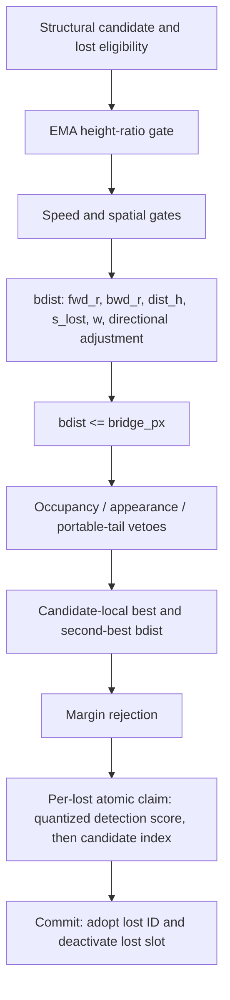

# H0 — headline-s full bridge-decision trace capture

<!-- doc-status: draft-unsealed -->
<!-- doc-promotion: none -->
<!-- doc-date: 2026-07-13 -->
<!-- doc-module: semantic -->

> **Status: declaration draft only.** This document is deliberately not an execution seal. It records the exact scope that the owner must seal before any instrumentation, build, smoke run, or capture. It does not accept P0, change a preset, authorize B1, or authorize a threshold study.

## 1. Preconditions and authority

Before Phase A, two distinct owner actions are required:

1. Accept and close `P0_CAPTURE_SEMANTICS_INVALID` separately.
2. Record a literal `SEALED` review against this declaration at the reviewed head, with the source and preset fingerprints in §2.

The seal authorizes only an observational H0 implementation and its Phase A/B unlabelled captures. It authorizes no GT/FP read, threshold variation, policy choice, registry/ledger modification, or production-preset change.

## 2. Frozen headline target and pre-seal fingerprint

The sole policy target is `configs/presets/mamba_whole_graph.yaml`:

| Setting | Required value |
| --- | ---: |
| `relink_bridge_enabled` | `true` |
| `relink_bridge_px` | `0.25` |
| `relink_bridge_margin` | `0.05` |
| `relink_bridge_h_lo`, `relink_bridge_h_hi` | `0.75`, `1.33` |
| `relink_bridge_spatial_gate`, `relink_bridge_max_speed` | `0`, `0` |
| `relink_bridge_dir_bonus` | `0.8` |
| `reid_mode` | `off` |

Pre-seal source fingerprint:

| Item | SHA-256 / value |
| --- | --- |
| Git head | `7581c9720569e17593d1844ad494253ce664fed8` |
| headline preset | `093b66ed124063f035ae9cf2a76e4f5426743cd819fb66e3e54994c97ea42cd1` |
| `src/tracking/tracker_gpu.cu` | `36a0c7f952e99aee309c7fe4c9187852d070ee0ae600cd737a0beeeb55904e55` |
| `include/tracking/tracker_gpu.hpp` | `b97a145a12a8f7ae3f6f055b210675f02d68d39a0d312f3e606a469d00272124` |

At execution, the manifest must additionally freeze the exact source commit, resolved effective bridge configuration, CUDA build/compiler/extension identity, GPU identity, seven-sequence set, capture schema version, and every kernel or host-helper SHA-256. A mismatch is `H0_PROVENANCE_INVALID` before replay.

## 3. Canonical native decision graph



This is the control-flow target, not an after-the-fact sorting convention. The current fidelity event is insufficient because it is emitted after B/C/D and before E; the current shadow path also suppresses J. H0 must observe the real commit path and may not enable shadow mode.

## 4. Sealed capture ABI

H0 writes exactly four append-only physical streams: `pair_record`,
`candidate_record`, `claim_record`, and `commit_record`. Each has its own
capacity, cursor, overflow counter, schema, and canonical serialization.

Each raw stream envelope carries a capture-run UUID for provenance, but the UUID
is not a record field and is excluded from the semantic digest. CUDA append
order is non-authoritative. The verifier canonical-sorts each stream by its
sealed stable key and hashes only canonical semantic fields; the determinism bar
compares this canonical semantic SHA-256. Raw-stream hashes remain provenance
only and are not expected to agree across runs.

Every semantic record carries `seq`, `frame`, a schema version, and the stable
pre-commit identity defined in §4.4. No record may use final MOT output or a
local ID as its identity.

### 4.1 Pair record

Key: `(seq, frame, cand_slot, cand_precommit_global_id, lost_slot, lost_precommit_global_id)`.

It is emitted after structural eligibility and **before** the height gate. It contains `la`, `bridge_at`, both ring lengths, EMA heights, height ratio and verdict; speed/spatial verdicts; anchors, velocities, `h_ref`, `fwd_r`, `bwd_r`, `dist_h`, `s_lost`, `w`, directional inputs, `bdist_before_direction`, `bdist_after_direction`; cutoff and all post-cutoff veto verdicts; final pair eligibility; and one ordered rejection reason. Values not reached because of an earlier rejection are a tagged `not_computed` value, never zero.

### 4.2 Candidate-decision record

Key: `(seq, frame, cand_slot, cand_precommit_global_id)`. Native production-loop state, not an offline sort, writes the structural-competitor count, pre-score-pass count, cutoff/veto-pass count, best/second lost pre-commit identities and slots, best/second `bdist`, margin, margin verdict, proposal verdict, and proposal rejection reason.

### 4.3 Claim record

Key: `(seq, frame, proposing_cand_slot, proposing_cand_precommit_global_id,
proposed_lost_slot, proposed_lost_precommit_global_id)`. Each proposal and each
lost-claim outcome are linked by the pair/candidate key. The record preserves
the unquantized detection score, `sq`, exact packed atomic key,
candidate-index component, proposed lost identity, winning candidate identity,
and `claim_won` verdict.

### 4.4 Commit record

Key: the winning claim-record key. Each claim winner emits one commit record with
the candidate and lost pre-commit identities, candidate post-commit global
identity, commit verdict, and lost-slot deactivation verdict. A non-winning
claim emits no commit record.

### 4.5 `track_instance_uid_v1` identity contract

`*_precommit_global_id` is a `uint64` `track_instance_uid_v1`, not a tracker
local ID and not a MOT-output ID. The contract is fixed before seal:

- allocate a fresh nonzero UID when a slot first becomes a new track instance;
- allocate a fresh UID again on every slot reuse, even if its local `track_id`
  repeats;
- retain the UID unchanged for the entire instance lifetime;
- relink commit changes the visible track ID but never overwrites either the
  candidate or lost instance UID; and
- record both candidate and lost UIDs before commit in every linked record.

The allocator may choose storage layout, but not allocation event, lifetime,
width, or immutability. It may not reconstruct a UID from final MOT output or
substitute a local ID. If this contract cannot be implemented, Phase A stops at
`H0_CAPTURE_PARTIAL` without a capture packet.

### 4.6 Candidate-state and scalar encoding

Every candidate entering the structural loop emits exactly one candidate record,
including candidates with zero structural competitors or zero final-eligible
pairs. Candidate status is one of `no_structural_competitors`,
`all_rejected_pre_score`, `all_rejected_cutoff_or_veto`, `margin_rejected`, or
`proposal_emitted`, with this fixed precedence: zero structural competitors;
otherwise zero pre-score passes; otherwise zero final-eligible pairs; otherwise
margin rejection; otherwise proposal emitted.

`not_computed`, `+inf`, and `NaN` are distinct tagged encodings, never inferred
from an IEEE payload: `not_computed` means an earlier gate prevented evaluation;
`+inf` is the sealed `second_best_bdist` when exactly one final-eligible
competitor exists; `NaN` is forbidden in all semantic scalar fields. The margin
verdict for a singleton is therefore computed using `second_best_bdist=+inf` and
passes whenever the candidate has a best pair.

## 5. Conservation and replay verifier

The four bounded streams require independent capacity, cursor, and overflow fields. Any overflow, duplicate key, identity collision, or failed conservation is `H0_PACKET_INVALID`.

The packet must prove:

```text
structural pairs = height rejects + speed rejects + spatial rejects + scored pairs
scored pairs = cutoff rejects + post-score veto rejects + final pair-eligible pairs
candidates with eligible pairs = margin rejects + proposals
proposals = claim losers + claim winners
claim winners = commits
structural candidates = no structural competitors + all-pre-score-rejected + all-cutoff-or-veto-rejected + margin rejects + proposals
```

The independent verifier consumes only these streams and frozen manifest values. It must replay each gate, float32-consistent scalar construction, best/second, margin, packed claim key, atomic winner, and commit with 100% decision agreement. Final-output similarity is not a substitute for per-stage agreement.

## 6. Non-perturbation protocol

For the same frozen input, capture-off and capture-on must have byte-identical MOT output, final IDs, bridge debug counters, proposal/commit counts, and zero overflow. Repeated capture-on runs must produce identical canonical semantic packet SHA-256 values; raw stream order and raw packet SHA-256 are provenance only. Any output, winner, scheduling, memory-state, or count discrepancy maps to `H0_CAPTURE_PERTURBS_POLICY`.

Phase A is one-sequence `MOT17-04-SDP` only and may repair instrumentation, not produce policy evidence. Phase B may run the frozen seven-sequence set only if all Phase A bars pass. Both phases are unlabelled and contain no threshold sweep.

The following changes require an amendment and owner reseal: moving an
observation point; changing any record ABI, stable key, or identity contract;
removing a DAG stage or replacing it with offline reconstruction; or changing a
conservation equation, replay bar, or terminal mapping. Only repairs that leave
all those semantics unchanged — compilation, capacity sizing, serialization, or
implementation bugs — may proceed under the same seal.

## 7. Terminal and post-terminal boundary

The ordered terminal is one of `H0_FULL_COMMIT_CAPTURE_FAITHFUL`, `H0_CAPTURE_PARTIAL`, `H0_CAPTURE_PERTURBS_POLICY`, `H0_PROVENANCE_INVALID`, or `H0_PACKET_INVALID`.

Only owner acceptance of `H0_FULL_COMMIT_CAPTURE_FAITHFUL` makes a separately declared B1 consumer-faithful operating-curve study a candidate. It is never a direct handoff.

## 8. Seal record

| Date | Reviewed head | Owner token | Transition |
| --- | --- | --- | --- |
| — | — | — | Draft only; execution prohibited |
