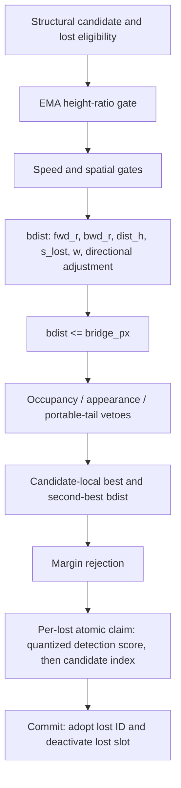

# H0 — headline-m full bridge-decision trace capture

<!-- doc-status: proposed -->
<!-- doc-promotion: none -->
<!-- doc-date: 2026-07-13 -->
<!-- doc-module: semantic -->

> **Status: proposed / draft-unsealed.** Trace instrumentation exists, but this
> declaration is not an execution seal. Until the declaration is repaired to the
> contract §20.2/§20.8 bar and an owner then seals the reviewed head, no
> Phase A/B capture, downstream claim study, preset change, or threshold study
> is authorized.

Research-wide type and upstream/downstream routing live in the
[research control plane](../../../research/README.md#research-control-plane). This
declaration owns only the H0 observability contract and its ordered terminal in
§7; it does not re-decide D0/R1 fidelity, S0 support, or any downstream claim.

## 1. Preconditions and authority

Before Phase A, the routing ledger is:

1. **Satisfied:** `P0_CAPTURE_SEMANTICS_INVALID` was accepted and P0 closed.
2. **Pending — declaration repair to the contract §20.2/§20.8 bar** (owner
   review, 2026-07-13):
   - declare typed κ = (quantification space, comparison relation, decision
     rule) for **every decidable unit** — this declaration contains at least
     pair-, candidate-, claim-, and commit-level units, and they are distinct;
   - replace the `H0_CAPTURE_PARTIAL` condition ("some DAG stage cannot be
     observed without changing policy semantics") with a **mechanically
     decidable criterion** — a fixed repair budget / attempt limit — so two
     implementers cannot diverge between "keep repairing instrumentation" and
     "declare partial";
   - make the terminal partition **exhaustive over execution-invalid
     outcomes** (build failure, runner crash, serialization failure — any run
     that produces no packet maps to a fail-closed terminal, not to an
     unmapped state).
3. **Pending:** record a literal `SEALED` review against this declaration at the reviewed head, with the source and preset fingerprints in §2.

The seal authorizes only an observational H0 implementation and its Phase A/B unlabelled captures. It authorizes no GT/FP read, threshold variation, policy choice, registry/ledger modification, or production-preset change.

## 2. Frozen policy base, resolved configuration, and instrumentation provenance

<!-- policy-target: headline -->

The sole policy target is `configs/presets/mamba_whole_graph_m.yaml` — the preset
the bridge-fidelity line is sealed on, and the one `HEADLINE_PRESET_REL`
(`src/saccade/perception/eval/consumer_a_bridge_fidelity.py`) names. It was
`mamba_whole_graph.yaml` (the `s` preset) until [Amendment 5](#amendment-5--policy-target-identity-2026-07-13-pre-seal).

| Setting | Required value |
| --- | ---: |
| `relink_bridge_enabled` | `true` |
| `relink_bridge_px` | `0.4` |
| `relink_bridge_margin` | `0.05` |
| `relink_bridge_h_lo`, `relink_bridge_h_hi` | `0.6`, `1.7` |
| `relink_bridge_spatial_gate`, `relink_bridge_max_speed` | `0`, `0` |
| `relink_bridge_dir_bonus` | `0.0` |
| `reid_mode` | `off` |

The sealed **policy base** is the pre-H0 decision path against which the H0
observer is assessed. It is deliberately distinct from the later
instrumented build: an observer necessarily changes source files and therefore
must not be required to have the same source-file hashes as its base.

| Policy-base item | SHA-256 / value |
| --- | --- |
| `policy_base_head` | `7581c9720569e17593d1844ad494253ce664fed8` |
| `policy_base_tree` | `2706ee3af0ddd6cd304f83289b575b2ae9b72fc6` |
| headline preset (`mamba_whole_graph_m.yaml`) | `496c4ec22b497c70bc8409227513939b4cd86834bf2210475d0ad655be6937af` |
| base `src/tracking/tracker_gpu.cu` | `36a0c7f952e99aee309c7fe4c9187852d070ee0ae600cd737a0beeeb55904e55` |
| base `include/tracking/tracker_gpu.hpp` | `b97a145a12a8f7ae3f6f055b210675f02d68d39a0d312f3e606a469d00272124` |

`resolved_bridge_policy_config_v1` is canonical UTF-8 JSON with lexicographic
keys, no insignificant whitespace, JSON `true`/`false`, and finite JSON
numbers. It contains exactly these post-preset, post-default, post-CLI
resolution fields:

```text
reid_mode
relink_enabled, relink_bank_cap, relink_sim_thresh, relink_lambda,
relink_spatial_gate, relink_max_age
relink_bridge_enabled, relink_bridge_px, relink_bridge_at,
relink_bridge_min_lost, relink_bridge_ttl, relink_bridge_max_speed,
relink_bridge_person_height, relink_bridge_fps, relink_bridge_margin,
relink_bridge_spatial_gate, relink_bridge_anchor,
relink_bridge_anchor_rate, relink_bridge_h_lo, relink_bridge_h_hi,
relink_bridge_dir_bonus, relink_bridge_occ_gate_cover,
relink_bridge_occ_gap_min, relink_bridge_occ_expand_px,
relink_bridge_occ_expand_cover, relink_bridge_app_veto
```

For the sole headline invocation (no module or CLI override), its canonical
SHA-256 is
`c7a6dbb35168cba75249b7f2c67d8455b6f634732493e455a4bb920aab6d7782`.
It is produced — and must be re-derivable — by
[`scripts/tools/resolved_bridge_policy_config.py`](../../../../scripts/tools/resolved_bridge_policy_config.py),
which reproduces the `s` fingerprint this declaration carried before
[Amendment 5](#amendment-5--policy-target-identity-2026-07-13-pre-seal)
(`b1b78318…`) from the same code path. Both values, and this declaration's
agreement with them, are pinned by
`tests/unit/test_resolved_bridge_policy_config.py`.
This includes disabled paths and their values; the short authority table above
is only a review aid, never the configuration fingerprint. H0 additionally
freezes `research_portable_or_tail_enabled=false`, a null portable-tail
threshold pointer, and `research_bridge_shadow=false`.

Each execution manifest must separately record all of the following:

- the preceding `policy_base_head`, base-tree, base-source, preset, and
  resolved-config fingerprints;
- `instrumentation_head`, its complete repository tree ID and canonical
  recursive tree-list SHA-256, and the complete binary/full-index repository
  diff from `policy_base_head` with its SHA-256;
- `runtime_policy_code_projection_v1`, its canonical diff and SHA-256, the
  excluded governance paths and blob SHA-256 values, and the sealed
  `h0_observational_diff_v1` admission result for that projection only; and
- CUDA build/compiler/extension identity, GPU identity, seven-sequence set,
  capture-schema version, and every instrumented kernel and host-helper
  SHA-256.

`instrumentation_head` must descend from `policy_base_head`. Repository
provenance is complete: no changed path is omitted from the recorded tree or
full diff. Policy admission is deliberately narrower. Construct
`runtime_policy_code_projection_v1` from that full diff by excluding **only**
the following `h0_governance_docs_allowlist_v1` paths:

```text
docs/modules/semantic/research/headline_bridge_full_decision_capture_declaration_20260713.md
docs/modules/semantic/research/headline_bridge_full_decision_capture_results_20260713.md
docs/modules/semantic/research/runtime_bridge_decision_path_identifiability_declaration_20260713.md
docs/modules/semantic/research/runtime_bridge_decision_path_identifiability_results_20260713.md
docs/modules/semantic/research/closed/runtime_bridge_decision_path_identifiability_results_20260713.md
docs/modules/semantic/research/evidence/p0_runtime_bridge_decision_path_20260713/manifest.json
docs/modules/semantic/research/evidence/p0_runtime_bridge_decision_path_20260713/field_sufficiency.json
docs/modules/semantic/research/evidence/p0_runtime_bridge_decision_path_20260713/decision_funnel.csv
docs/modules/semantic/research/evidence/p0_runtime_bridge_decision_path_20260713/metrics.json
docs/modules/semantic/README.md
docs/modules/semantic/TODO.md
docs/TODO.md
```

The manifest retains the excluded path list and each excluded blob hash, so the
allowlist does not hide a repository change. An excluded path must be
docs-only/non-executable content and must not alter or be consumed as a
resolved configuration, build input, runtime-policy source, executable
artifact, or production test. Every changed path outside this exact allowlist,
including any other document, remains in the runtime projection.

For the allowed P0 results rename from
`docs/modules/semantic/research/runtime_bridge_decision_path_identifiability_results_20260713.md`
to
`docs/modules/semantic/research/closed/runtime_bridge_decision_path_identifiability_results_20260713.md`,
the manifest emits one `governance_rename_v1` record with source and destination
paths plus `source_blob_before`, `source_blob_after`, `destination_blob_before`,
and `destination_blob_after`. Each blob slot is a tagged pair:
`{state: present, sha256: <hash>}` or `{state: absent, sha256: null}`; no side
may be omitted. For the normal move, source-after and destination-before are
`absent`/`null`, and destination-after equals the recorded source-before blob
hash.

`h0_observational_diff_v1` applies only to the runtime projection. It may add
only H0-owned trace schema/storage, deterministic instance-UID state,
trace-only allocation/clear/drain/serialization, and trace-pointer arguments
or writes at the observation points sealed in §4. It may also add only the
declared H0 export/replay verifier and its dedicated test:
`scripts/tools/export_headline_bridge_decision_trace.py`,
`scripts/tools/verify_headline_bridge_decision_trace.py`, and
`tests/unit/tracking/test_headline_bridge_decision_trace.py`; these must only
consume H0 trace outputs and never enter a production build or runtime path. It
may use atomics only on H0-owned cursors, overflow counters, or trace buffers.
It may not change an existing policy input, arithmetic operation, comparison,
branch predicate, loop/order used for policy selection, policy-state write,
launch geometry, or the values written to `track_ids`, `active`, claims,
proposals, debug counters, or MOT output. Trace-only source additions are not
policy-base drift.

Any base/config mismatch, non-descendant instrumentation head, missing complete
repository evidence or projection, a governance path outside the exact
allowlist, an allowlisted path that violates its docs-only restriction, or a
runtime projection outside `h0_observational_diff_v1` is
`H0_PROVENANCE_INVALID` before replay. A different instrumentation hash by
itself is expected and is not a provenance failure.

## 3. Canonical native decision graph



This is the control-flow target, not an after-the-fact sorting convention. The current fidelity event is insufficient because it is emitted after B/C/D and before E; the current shadow path also suppresses J. H0 must observe the real commit path and may not enable shadow mode.

## 4. Sealed capture ABI

H0 writes exactly four append-only physical streams: `pair_record`,
`candidate_record`, `claim_record`, and `commit_record`. Each has its own
capacity, cursor, overflow counter, schema, and canonical serialization.

Each raw stream envelope carries a capture-run UUID for provenance, but the UUID
is not a record field and is excluded from the semantic digest. CUDA append
order is non-authoritative. The verifier canonical-sorts each stream by its
sealed stable key and hashes only canonical semantic fields; the determinism bar
compares this canonical semantic SHA-256. Raw-stream hashes remain provenance
only and are not expected to agree across runs.

Every semantic record carries `seq`, `frame`, a schema version, and the stable
instance identity defined in §4.5. Visible `track_id` values are observations,
not identity keys: no record may use final MOT output or a local ID as its
cross-record identity.

### 4.1 Pair record

Key: `(seq, frame, cand_slot, cand_instance_uid, lost_slot, lost_instance_uid)`.

It is emitted after structural eligibility and **before** the height gate. It contains `la`, `bridge_at`, both ring lengths, EMA heights, height ratio and verdict; speed/spatial verdicts; anchors, velocities, `h_ref`, `fwd_r`, `bwd_r`, `dist_h`, `s_lost`, `w`, directional inputs, `bdist_before_direction`, `bdist_after_direction`; cutoff and all post-cutoff veto verdicts; final pair eligibility; and one ordered rejection reason. Values not reached because of an earlier rejection are a tagged `not_computed` value, never zero.

For both referenced instances it also records the visible pre-commit `track_id`.

### 4.2 Candidate-decision record

Key: `(seq, frame, cand_slot, cand_instance_uid)`. Native production-loop state,
not an offline sort, writes the candidate visible pre-commit `track_id`,
structural-competitor count, pre-score-pass count, cutoff/veto-pass count,
best/second lost instance UIDs, slots, and visible pre-commit `track_id`s,
native best/second `bdist` values, `no_second_competitor`, native margin,
margin verdict, proposal verdict, and proposal rejection reason.

### 4.3 Claim record

Key: `(seq, frame, proposing_cand_slot, proposing_cand_instance_uid,
proposed_lost_slot, proposed_lost_instance_uid)`. Each proposal and each
lost-claim outcome are linked by the pair/candidate key. The record preserves
the proposing and proposed-lost visible pre-commit `track_id`s, unquantized
detection score, `sq`, exact packed atomic key, candidate-index component,
winning candidate slot, instance UID, and visible pre-commit `track_id`, and
`claim_won` verdict.

### 4.4 Commit record

Key: the winning claim-record key. Each claim winner emits one commit record
with candidate and lost immutable instance UIDs; candidate and lost visible
pre-commit `track_id`s; candidate and lost visible post-commit `track_id`s;
candidate active state before/after; lost active state before/after; commit
verdict; and an explicit `lost_slot_deactivated` verdict. The verifier must
prove from these observations that
`candidate_postcommit_track_id == lost_precommit_track_id` and that the lost
slot changed `active: true -> false`. A non-winning claim emits no commit
record.

### 4.5 `track_instance_uid_v1` identity contract

`*_instance_uid` is a `uint64` `track_instance_uid_v1`, not a tracker local ID
and not a visible/MOT-output `track_id`. Its allocation is deterministic and
fixed before seal:

- Each sequence owns a `uint32` generation counter for every tracker slot,
  initialized to zero at sequence start.
- Immediately when a slot becomes a new track instance, before that instance
  can enter an H0 record, its own generation counter increments by one. The
  value must never wrap; a pending wrap is fail-closed.
- The UID is exactly `(uint64_t(slot_generation) << 32) | uint32_t(slot)`.
  Thus `(seq, track_instance_uid_v1)` is unique for the capture, nonzero for
  every allocated instance, and independent of GPU block scheduling or a
  global atomic allocator.
- A slot reuse receives its new generation and therefore a new UID even if the
  visible `track_id` repeats. The UID remains unchanged throughout that
  instance's lifetime.
- Relink commit changes only the candidate's visible `track_id`; it never
  overwrites candidate or lost instance UID. Every linked record retains both
  instance UIDs and records visible IDs in fields explicitly named
  `*_precommit_track_id` or `*_postcommit_track_id`.

The implementation may choose storage layout but not this allocator, allocation
event, formula, width, lifetime, or immutability. It may not reconstruct a UID
from final MOT output or substitute a local ID. If this contract cannot be
implemented, Phase A stops at `H0_CAPTURE_PARTIAL` without a capture packet.

### 4.6 Candidate-state and scalar encoding

Every candidate entering the structural loop emits exactly one candidate record,
including candidates with zero structural competitors or zero final-eligible
pairs. Candidate status is one of `no_structural_competitors`,
`all_rejected_pre_score`, `all_rejected_cutoff_or_veto`, `margin_rejected`, or
`proposal_emitted`, with this fixed precedence: zero structural competitors;
otherwise zero pre-score passes; otherwise zero final-eligible pairs; otherwise
margin rejection; otherwise proposal emitted.

Every scalar is serialized as raw IEEE-754 binary32 bits plus an explicit
status tag: `computed_finite`, `computed_pos_inf`, `computed_neg_inf`,
`computed_nan`, or `not_computed`. The special states are never inferred from
an IEEE payload; a `computed_nan` policy input invalidates the packet.

The native candidate-ranking initialization is preserved exactly:
`best_dist = second_dist = 1e30f`. Therefore a candidate with exactly one
selected best competitor records the native finite binary32 `1e30f` for
`second_best_bdist`, `no_second_competitor=true`, and the native float32 margin
subtraction used by the consumer. It must not substitute `+inf`. A candidate
with no selected best records both native initialized scalars, no best/second
lost identity, `no_second_competitor=false`, and `margin=not_computed` because
production returns before the margin branch. A candidate with two or more
selected competitors records the native runner-up scalar and
`no_second_competitor=false`.

## 5. Conservation and replay verifier

The four bounded streams require independent capacity, cursor, and overflow fields. Any overflow, duplicate key, identity collision, or failed conservation is `H0_PACKET_INVALID`.

The packet must prove:

```text
structural pairs = height rejects + speed rejects + spatial rejects + scored pairs
scored pairs = cutoff rejects + post-score veto rejects + final pair-eligible pairs
candidates with eligible pairs = margin rejects + proposals
proposals = claim losers + claim winners
claim winners = commits
structural candidates = no structural competitors + all-pre-score-rejected + all-cutoff-or-veto-rejected + margin rejects + proposals
```

The independent verifier consumes only these streams and frozen manifest values. It must replay each gate, float32-consistent scalar construction, best/second, margin, packed claim key, atomic winner, and commit with 100% decision agreement. Final-output similarity is not a substitute for per-stage agreement.

## 6. Non-perturbation protocol

For the same frozen input, capture-off and capture-on must have byte-identical MOT output, final IDs, bridge debug counters, proposal/commit counts, and zero overflow. Repeated capture-on runs must produce identical canonical semantic packet SHA-256 values; raw stream order and raw packet SHA-256 are provenance only. Any output, winner, scheduling, memory-state, or count discrepancy maps to `H0_CAPTURE_PERTURBS_POLICY`.

Phase A is one-sequence `MOT17-04-SDP` only and may repair instrumentation, not produce policy evidence. Phase B may run the frozen seven-sequence set only if all Phase A bars pass. Both phases are unlabelled and contain no threshold sweep.

The following changes require an amendment and owner reseal: moving an
observation point; changing any record ABI, stable key, or identity contract;
removing a DAG stage or replacing it with offline reconstruction; or changing a
conservation equation, replay bar, or terminal mapping. Only repairs that leave
all those semantics unchanged — compilation, capacity sizing, serialization, or
implementation bugs — may proceed under the same seal.

## 7. Terminal and post-terminal boundary

Terminals are evaluated in this exact order. The **first applicable terminal is
authoritative**; an executor may not select a later terminal when an earlier
condition holds.

1. `H0_PROVENANCE_INVALID` — any mismatch of `policy_base_head`, base tree or
   source fingerprint, resolved configuration fingerprint, preset, sequence
   authority, complete repository provenance, or
   `runtime_policy_code_projection_v1` / `h0_observational_diff_v1` admission;
   a governance path outside its exact allowlist or violating its docs-only
   restriction; a missing required instrumentation provenance field; or a
   non-descendant instrumentation head. Stop before replay.
2. `H0_CAPTURE_PERTURBS_POLICY` — capture-on/off differs in MOT output, final
   IDs, proposal or commit winner, bridge debug counters, proposal/commit
   counts, or scheduling-/memory-visible policy state.
3. `H0_PACKET_INVALID` — a produced packet has overflow, duplicate key,
   identity collision, a `computed_nan` policy input or other scalar invalidity,
   canonical semantic-digest mismatch across repeated capture-on runs, or any
   scalar, gate, ranking, margin, claim, or commit replay disagreement.
4. `H0_CAPTURE_PARTIAL` — with 1–3 false, Phase A proves that a required DAG
   stage cannot be observed by the sealed ABI without changing policy
   semantics. It must name the highest replay level and missing field(s); it
   produces no valid full packet and forbids Phase B.
5. `H0_FULL_COMMIT_CAPTURE_FAITHFUL` — only after Phase A passes and Phase B
   completes the frozen unlabelled seven-sequence capture, with all provenance,
   non-perturbation, capacity/conservation, canonical-determinism, and 100%
   full-commit replay bars passing for every sequence.

Phase A is a one-sequence preflight only: it may emit terminals 1–4, but never
`H0_FULL_COMMIT_CAPTURE_FAITHFUL`. `H0_FULL_COMMIT_CAPTURE_FAITHFUL` is
therefore unavailable until the seven-sequence Phase B evidence exists.

Only owner acceptance of `H0_FULL_COMMIT_CAPTURE_FAITHFUL` makes a separately declared B1 consumer-faithful operating-curve study a candidate. It is never a direct handoff.

## 8. Seal record

| Date | Reviewed head | Owner token | Transition |
| --- | --- | --- | --- |
| — | — | — | Draft only; execution prohibited |

## Amendment 1 — §20.2 / §20.8 sealability repair (2026-07-13; pre-seal)

This is an **append-only** correction to the draft declaration. It replaces
only the three pending conditions named in §1 item 2: the missing typed
\(\kappa\) declarations, the non-mechanical `H0_CAPTURE_PARTIAL` condition,
and the missing no-packet execution terminal. It changes no policy-base input,
observation point, physical stream, record ABI, stable key, identity contract,
conservation equation, replay bar, or authorized scope. It is not an execution
seal: the table above remains unsealed until an owner records a literal
`SEALED` review at a reviewed descendant head.

### A1. Required declaration block and typed \(\kappa\)

```text
Target decision layer   none (cross-layer substrate / observability work).
Study intent            boundary diagnostic. It determines whether the frozen
                        full native bridge-decision path can be observed and
                        replayed without changing that path.
Design objective        n/a. No policy, threshold, candidate, ranking, or
                        production action is selected or evaluated.
Selection rule          none. There are no competing candidates; the first
                        applicable ordered terminal in A3 is the result.
Validity gate           §2 provenance admission; A2 coverage admission;
                        capture-on/off non-perturbation (§6); zero stream
                        overflow, exact conservation (§5), and 100% replay.
Stop condition          exactly three Phase-A coverage attempts at most;
                        then one Phase-A capture only when A2 passes. Phase B
                        is available only after every Phase-A bar passes.
                        No retry, threshold sweep, policy change, or scope
                        expansion follows a terminal.
Output class            diagnostic result only. It cannot be promoted into a
                        design candidate or a policy claim.
Mainline transition     none / diagnostic-only. No H0 terminal occupies
                        mainline cadence. Only owner acceptance of
                        H0_FULL_COMMIT_CAPTURE_FAITHFUL makes a separately
                        declared B1 study a candidate; it is not a handoff.
```

Every comparison below consumes the canonical records or artifacts named in
this declaration, never final MOT output reconstructed offline. `exact` means
equality of keys, enum/status tags, integer fields, and raw IEEE-754 binary32
bits after the sealed canonical ordering. A scalar tagged `not_computed` is
compared as that tag, not as a numeric zero.

| Decidable unit | Quantification space | Comparison relation | Decision rule |
| --- | --- | --- | --- |
| Pair replay | Every `pair_record` key in the canonical Phase-A/B packet | Exact fieldwise equality between the native trace and independent replay, including the ordered gate/rejection result | Every record and gate agrees; any missing, extra, duplicate, or disagreeing pair is `H0_PACKET_INVALID`. |
| Candidate replay | Every `candidate_record` key in the canonical packet | Exact fieldwise equality of native loop state, best/second construction, margin, and proposal result | Every candidate agrees; any mismatch is `H0_PACKET_INVALID`. |
| Claim replay | Every `claim_record` key in the canonical packet | Exact fieldwise equality of proposal inputs, packed key, winner identity, and `claim_won` outcome | Every claim agrees; any mismatch is `H0_PACKET_INVALID`. |
| Commit replay | Every `commit_record` key in the canonical packet | Exact fieldwise equality of winning claim identity, visible IDs, active-state transition, and commit result | Every commit agrees and satisfies §4.4; any mismatch is `H0_PACKET_INVALID`. |
| Packet conservation | The four canonical streams as a single packet | Exact equality of the six §5 conservation equations and their keyed joins | All equations and joins hold with zero overflow and no identity collision; otherwise `H0_PACKET_INVALID`. |
| Capture non-perturbation | A capture-off / capture-on pair using the same frozen input and resolved configuration | Byte equality of MOT output and final IDs; exact equality of bridge debug counters, proposal/commit counts, winners, and scheduling-/memory-visible policy state | Every listed comparison agrees; any difference is `H0_CAPTURE_PERTURBS_POLICY`. |
| Coverage admission | The five required H0 components in A2, for each numbered coverage attempt | Exact equality of the sealed component set and the attempt's `h0_coverage_v1` Boolean map | All five values are `true` before capture; a remaining `false` after attempt 3 is `H0_CAPTURE_PARTIAL`. |
| Execution completion | Each invoked coverage, capture, verification, or serialization phase | The controller's frozen result enum and required artifact set | A non-success controller result or a missing/unreadable required phase artifact is `H0_EXECUTION_INVALID`. |
| Ordered terminal | One completed Phase-A or Phase-B attempt | First applicable predicate in A3, evaluated in order | Record exactly that terminal; no later terminal may be substituted. |

### A2. Mechanical coverage budget for `H0_CAPTURE_PARTIAL`

The required H0 component set is fixed as:

```text
track_instance_uid_v1
pair_record
candidate_record
claim_record
commit_record
```

Before any Phase-A capture, the sealed H0 controller writes one canonical
`h0_coverage_v1` artifact for each numbered coverage attempt. It contains
exactly the five names above as lexicographically ordered Boolean keys. A
`true` value means the admitted instrumentation build contains the sealed
writer and required field mapping for that component; it is a static capture
capability assertion, not a count of data-dependent runtime events. Thus an
otherwise valid sequence with zero commits does not by itself create a coverage
gap.

There are exactly three coverage attempts, `1`, `2`, and `3`. An attempt is
counted only after its controller exits successfully and emits a parseable,
complete `h0_coverage_v1` artifact. Between attempts, a repair may change only
trace-owned code allowed by `h0_observational_diff_v1`; every repair must again
pass the §2 provenance admission. No fourth attempt is permitted under this
declaration.

`H0_CAPTURE_PARTIAL` is mechanically selected only when attempts 1–3 all
complete, attempts 1–2 did not admit all five components, and attempt 3 still
has at least one `false` component. Its required terminal artifact is the three
coverage maps plus the lexicographically ordered set of false component names.
It produces no valid full-capture packet and forbids Phase B. This fixed
predicate replaces the earlier judgment phrased as a stage being impossible to
observe without changing policy semantics.

### A3. Exhaustive ordered terminal partition

For every controller invocation, the wall-clock deadline is 3,600 seconds from
process launch, measured by a monotonic clock. Its result enum is exactly
`success`, `build_failed`, `extension_load_failed`, `runner_nonzero`,
`runner_timeout`, `serialization_failed`, `artifact_missing_or_unreadable`, or
`unclassified_execution_failure`. The last value is mandatory for any
no-artifact failure not covered by a preceding value, so a failure can never be
left unmapped. A complete packet that is emitted but malformed is a packet
validity failure, not a serialization success.

The following order supersedes §7's draft list while preserving the meaning of
its existing terminals:

1. `H0_PROVENANCE_INVALID` — §2 provenance or projection admission fails.
   **Transition: none / diagnostic-only.** Stop before coverage, capture, or
   replay.
2. `H0_EXECUTION_INVALID` — after provenance passes, a required controller
   invocation has any non-`success` enum, exceeds its deadline, or fails to
   emit the required complete phase artifact. This includes build failure,
   runner crash/nonzero exit, and serialization failure that yields no complete
   artifact. **Transition: none / diagnostic-only.** Stop; do not reinterpret
   it as partial observability.
3. `H0_CAPTURE_PERTURBS_POLICY` — the §6 capture-on/off comparison differs.
   **Transition: none / diagnostic-only.** Stop before replay or Phase B.
4. `H0_PACKET_INVALID` — a complete emitted packet has overflow, duplicate
   key, identity collision, invalid scalar, canonical-digest mismatch, failed
   conservation, or any pair/candidate/claim/commit replay disagreement.
   **Transition: none / diagnostic-only.** Stop before Phase B.
5. `H0_CAPTURE_PARTIAL` — only the exact A2 three-attempt predicate holds,
   with terminals 1–4 false. **Transition: none / diagnostic-only.** Its
   coverage artifacts are diagnostic only; Phase B is forbidden.
6. `H0_FULL_COMMIT_CAPTURE_FAITHFUL` — Phase A and the frozen unlabelled
   seven-sequence Phase B both complete with every preceding predicate false
   and every §2, §5, §6, and A1 replay bar true. **Transition: none /
   diagnostic-only.** It may be owner-accepted, after which a new B1
   declaration is merely a candidate.

Phase A may emit only terminals 1–5. Terminal 6 is unavailable until the
seven-sequence Phase-B artifact exists. This amendment adds no policy evidence,
does not authorize Phase A or B, and leaves registry, ledger, preset, and
production behavior unchanged.

## Amendment 2 — pre-seal coverage and independent native completeness (2026-07-13; pre-seal)

This is an **append-only** correction to Amendment 1. Its A2 three-attempt
repair budget is not a sealable experiment: it lets an executor choose a new
trace implementation between attempts, and its Boolean map has no frozen
checker, field schema, or static evidence. Its packet-defined κ universes also
cannot detect a native candidate or pair that was never appended. Amendment 2
supersedes A1–A3 wherever they conflict. In particular, it retires
`H0_CAPTURE_PARTIAL` as an H0 execution terminal and replaces A1's
packet-derived pair/candidate/claim/commit quantification spaces.

For avoidance of doubt, this also supersedes the old `H0_CAPTURE_PARTIAL`
sentence in §4.5, the “Phase A may repair instrumentation” sentence in §6,
and §7 item 4. Those retained passages are historical draft text only; the
state effect, A2.1 progression, and A2.4 partition below are authoritative.

### Amendment state effect

- §1 item 2 is **satisfied by Amendment 2's declaration repair**. This is a
  statement about the executable contract, not an admission that a future
  instrumentation head has already passed it.
- §1 item 3 — a literal owner `SEALED` review — is now the sole pending gate.
  An owner may make that review only after the pre-seal freeze artifact in A2.2
  is complete and all of its coverage components are `true`.
- The §8 table remains unsealed. No pre-seal check, build, or dry run is a
  Phase-A/B capture or evidence. The TODO pointer must name owner seal as the
  sole pending gate and must retain the pre-seal-freeze condition on that gate.

### A2.1. Engineering boundary and coverage component/field authority

All instrumentation repair is **pre-seal engineering**, not a sealed Phase-A
activity. It has no fixed number of edits or attempts and may not emit an H0
terminal. The only permitted progression is:

```text
pre-seal engineering
  -> choose one fixed instrumentation head
  -> run the frozen static coverage checker and obtain all true
  -> record the schema/checker/source hashes in one freeze artifact
  -> owner reviews and writes SEALED for that exact head
  -> sealed Phase A, then (only if admitted) Phase B; no repair is permitted
```

Thus neither implementer discretion nor an engineering failure can determine a
research terminal. A failed or incomplete pre-seal checker result is simply
`H0_PRESEAL_COVERAGE_INCOMPLETE`, an engineering status that prohibits seal and
capture. It is not an H0 observability terminal and supplies no result. After
seal, a missing checker artifact, altered hash, false coverage value, build
failure, runner failure, timeout, unreadable artifact, or any attempted repair
is `H0_EXECUTION_INVALID`; it never becomes `H0_CAPTURE_PARTIAL`.

The frozen complete field authority is
`scripts/tools/h0_bridge_decision_trace_schema_v2.json`. It fixes the exact
field list (not merely stable keys) for each of `pair_records`,
`candidate_records`, `claim_records`, and `commit_records`; it also fixes all
five native-universe key schemas, their observed-stream relations, and this
lexicographically ordered component set:

```text
track_instance_uid_v1
pair_record
candidate_record
claim_record
commit_record
native_universe_v2
```

`scripts/tools/check_h0_bridge_decision_trace_contract.py` is the corresponding
frozen checker. It verifies every declared C++ record field and Python drain
field (except externally supplied `seq`), every CUDA writer/key-field mapping,
each native writer marker, independent native-universe cursor path, and
`track_instance_uid_v1` marker. It emits a
canonical `h0_coverage_v2` object with the ordered Boolean map, its own SHA-256,
the schema SHA-256, and SHA-256 values for the admitted H0 source files. The
exporter consumes the same schema and rejects a missing or unexpected record
field, so a coverage `true` is backed by static source evidence and by packet
admission rather than a self-declaration.

This amendment extends the §2 `h0_observational_diff_v1` offline-tool allowance
only with these non-production inputs:

```text
scripts/tools/h0_bridge_decision_trace_schema_v2.json
scripts/tools/check_h0_bridge_decision_trace_contract.py
```

They may read H0 source and trace-output schemas only; they may not be a build
input or runtime-policy path. The checker and schema are subject to the same
complete repository provenance and runtime-projection record as every other
non-governance changed path.

### A2.2. Freeze artifact and deterministic progression rule

Before owner seal, `h0_preseal_freeze_v2` must canonically record:

```text
instrumentation_head and complete tree/projection evidence
capture_schema_version = h0_bridge_decision_trace_v2
the complete h0_coverage_v2 object, with every component true
SHA-256 of h0_bridge_decision_trace_schema_v2.json
SHA-256 of check_h0_bridge_decision_trace_contract.py
the checker-recorded SHA-256 values of every admitted H0 source file
the exact command line and tool/runtime identity that produced the check
```

The `instrumentation_head` named by the freeze artifact is the only head that
an owner may seal. The owner review verifies that all listed hashes, the
checker object, the resolved configuration, and §2 provenance agree. Capture
does not begin otherwise. A head change, checker/schema change, source hash
change, absent field, or false component returns the work to pre-seal
engineering; it cannot be repaired within an execution or counted as a retry.

`seq` is an external immutable sequence authority, inserted once by the frozen
capture serializer into both the observed records and the native-universe keys.
It comes from the frozen manifest, never a stream row or final MOT output.

### A2.3. Native κ universes and completeness authority

The four semantic record streams remain append-only observations. Amendment 2
adds a separate, H0-owned **native-universe sidecar** with its own five buffers,
capacities, cursors, and overflow counters. Its append paths are independent
of all four record cursors: a dropped semantic record leaves its expected
native key present, while an exhausted sidecar buffer fails closed by overflow.
The sidecar is an expected-key authority, not a fifth semantic replay stream.

| Decidable unit | Native quantification space and observation point | Comparison relation and decision rule |
| --- | --- | --- |
| Candidate completeness | Every native structural candidate instance entering the production candidate loop, keyed by `(seq, frame, cand_slot, cand_instance_uid)` before the candidate-record append | `native_candidate_keys` equals the canonical candidate-record key set exactly. Missing, extra, duplicate, or sidecar overflow is `H0_PACKET_INVALID`. |
| Pair completeness | Every native candidate–lost structural evaluation after the production structural filters and before the pair-record append, keyed by `(seq, frame, cand_slot, cand_instance_uid, lost_slot, lost_instance_uid)` | `native_pair_keys` equals the canonical pair-record key set exactly. Any inequality or overflow is `H0_PACKET_INVALID`. |
| Proposal completeness | Every native proposal that passes native best/second/margin selection, immediately before claim-record append and `atomicMax`, keyed by the claim key | `native_proposal_keys` equals the canonical claim-record key set exactly. Any inequality or overflow is `H0_PACKET_INVALID`. |
| Claim-winner completeness | Every native winner after atomic-claim resolution and before the commit-record append or policy-state write, keyed by the winning claim key | `native_claim_winner_keys` equals precisely the canonical claim keys with `claim_won=pass`. Any inequality or overflow is `H0_PACKET_INVALID`. |
| Commit completeness | Every native winner entering the actual commit branch immediately before the production `track_ids`/`active` writes, keyed by the commit key | `native_commit_keys` equals the canonical commit-record key set exactly. Any inequality or overflow is `H0_PACKET_INVALID`. |

The native sidecar is therefore the κ quantification space. The packet does
not enumerate its own universe. Only after these five exact expected-versus-
observed comparisons pass does the existing fieldwise replay quantify over the
observed record at every expected native key. The four replay units from A1
(pair, candidate, claim, commit), §5 conservation, and §6 non-perturbation
remain required, but their old phrase “every `*_record` key in the packet” is
replaced by “every observed record at every expected native-universe key.”

### A2.4. Sealed terminal partition replacement

For a sealed invocation, the ordered partition is:

1. `H0_PROVENANCE_INVALID` — any §2 or A2.2 provenance/freeze mismatch. Stop
   before capture.
2. `H0_EXECUTION_INVALID` — any non-success controller result, deadline,
   incomplete required artifact, altered checker/schema/source hash, false
   coverage value, or attempted trace repair after seal. Stop; there is no
   partial-capture reinterpretation.
3. `H0_CAPTURE_PERTURBS_POLICY` — the §6 capture-off/on comparison differs.
4. `H0_PACKET_INVALID` — any packet/schema violation, native-universe or
   observed-stream inequality, duplicate, overflow, identity collision,
   scalar invalidity, conservation failure, canonical-digest mismatch, or
   pair/candidate/claim/commit replay disagreement.
5. `H0_FULL_COMMIT_CAPTURE_FAITHFUL` — Phase A then the frozen unlabelled
   seven-sequence Phase B complete with every preceding predicate false and
   every replay bar true.

The first applicable terminal remains authoritative. Phase A may emit only
1–4. Terminal 5 remains unavailable until the seven-sequence Phase-B artifact
exists. This amendment changes no policy selection or production write and
does not itself authorize Phase A, Phase B, or any downstream claim.

## Amendment 3 — fail-closed envelope and mechanical writer admission (2026-07-13; pre-seal)

This is an **append-only** correction to Amendment 2. Amendment 2 fixed the
native κ universe but still allowed an unarmed native drain to be rewritten by
the Python wrapper into an apparently complete all-zero v2 packet. It also
described a mechanical writer checker whose earlier implementation could accept
a stale occurrence of a buffer name, a comment about cursor independence, or a
field assignment outside the actual writer. Amendment 3 supersedes A2.1–A2.4
where they conflict and makes these admission and execution predicates
fail-closed.

### A3.1. Complete capture envelope and production exposure authority

`h0_bridge_decision_trace_schema_v2.json`'s ordered `envelope_fields` list is
the complete top-level packet ABI. Every listed record/native stream, every
total and overflow counter, `identity_uid_wrap_events`, `trace_armed`,
`processed_frame_count`, `bridge_attempt_count`, `bridge_commit_count`,
`capture_phase`, and both exposure requirements must be present. A wrapper,
exporter, or verifier may not synthesize a missing field, stream, total, or
overflow value. In particular, it may not interpret an absent cursor as the
number of drained rows or an absent overflow counter as zero.

`trace_armed` is native provenance, not a Python convenience flag. It is true
only when H0 tracing is enabled and all semantic/native buffers, capacities,
cursors, overflow counters, identity state, claim-index state, and the native
bridge-debug authority are allocated. An unarmed or partly allocated native
drain is not a capture packet: the wrapper rejects it before adding the v2
envelope. `processed_frame_count > 0` is mandatory invocation provenance.
`complete` is a derived convenience value only and has no terminal authority.
The manifest preserves this provenance field, but the semantic digest excludes
it so CUDA-graph bookkeeping cannot make otherwise equal decision packets
non-deterministic.

The native bridge debug counter `dbg[2]`, incremented before the candidate
sidecar append, is the independent candidate-exposure authority:

```text
bridge_attempt_count == len(native_candidate_keys)
```

Likewise `dbg[3]`, incremented on the actual commit path, is the independent
commit-exposure authority:

```text
bridge_commit_count == len(native_commit_keys)
```

Both equalities are exact and are checked in the wrapper and exporter in
addition to all native-sidecar comparisons. Phase A must declare and satisfy
nonzero candidate exposure. Phase B must declare and satisfy nonzero candidate
and commit exposure. Thus a Phase-B artifact with no actual commit path cannot
support `H0_FULL_COMMIT_CAPTURE_FAITHFUL`; any missing, unarmed, malformed,
truncated, or zero-required-exposure packet is `H0_PACKET_INVALID` (after the
earlier partition predicates).

### A3.2. Mechanical writer and cursor proof

The frozen checker parses whitespace-tolerant `h0_append_record(...)` calls;
it does not treat a broad source-string occurrence as evidence. For all four
semantic and five native append paths it must prove, in the named production
propose or commit kernel, the exact five-argument tuple:

```text
(buffer, capacity, cursor, overflow, local record/key)
```

It then limits field evidence to the local record/key construction through the
matching append call. Each frozen field (other than serializer-owned `seq` and
the fixed record schema tag) must have an assignment in that slice. The native
key cursor in the checked tuple must be the named native cursor rather than the
paired observed-record cursor; a prose comment cannot establish independence.
The checker also verifies the native binding/wrapper envelope gate, exporter
absence of `capture.get(...)` fallbacks, exact exposure comparisons, and that
the verifier enters through canonical fail-closed packet validation.

The checker-recorded source set explicitly includes
`scripts/tools/verify_headline_bridge_decision_trace.py` as well as the header,
CUDA source, Python binding, wrapper, and exporter. Its mutation tests are part
of the pre-seal admission proof: deleting the claim append, substituting the
record cursor for a native cursor, or moving a native key-field assignment
after its append must each make the relevant coverage component false.

### A3.3. State effect

§1 item 2 remains satisfied by the repaired executable declaration. The sole
pending gate remains §1 item 3: an owner may write `SEALED` only after one
complete `h0_preseal_freeze_v2` artifact records the amended schema, checker,
all admitted source hashes, and all-true coverage. This amendment neither
authorizes capture nor changes policy behavior, and it creates no new
observability terminal.

## Amendment 4 — comment-free static evidence (2026-07-13; pre-seal)

This is an **append-only** correction to Amendment 3's mechanical-admission
implementation. All CUDA evidence used by `kernel_scopes()`,
`h0_append_record(...)` parsing, local construction-to-append slicing, and
pre-append field-assignment matching is taken from a comment-masked analysis
source. The mask replaces every `//...` and `/*...*/` non-newline character
with whitespace while preserving total length and each newline offset. It does
not alter string, character, or raw-string literal contents.

Consequently a commented-out append, a stale commented field assignment, or a
commented kernel-boundary marker cannot be writer evidence, while every parsed
offset still identifies the same location in the frozen source. Pre-seal
mutation tests must demonstrate both of these cases:

```text
live claim append replaced by an exact commented append -> claim_record = false
native key assignment only commented before append, live only after append
    -> native_universe_v2 = false
```

This correction changes neither the envelope/exposure predicates nor any
policy behavior. §1 item 2 remains satisfied; §1 item 3 owner `SEALED` after a
complete freeze artifact remains the sole pending gate.

---

## Amendment 5 — policy-target identity (2026-07-13; pre-seal)

This is an **append-only** correction to the frozen policy target of § 2. It
changes which preset H0 observes. It changes no capture ABI, no κ, no coverage
budget, no terminal partition, and no envelope predicate: Amendments 1–4 are
untouched.

### A5.1 The error

The declaration froze `configs/presets/mamba_whole_graph.yaml` (the **`s`**
preset) and called it *"the current headline runtime path"*. `headline` is
overloaded in this repository — `docs/research/tracker-decision/status_2026-07-09.md`
keeps **both** an `s` (primary) and an `m` (capacity) track — but the
bridge-fidelity line H0 continues is sealed on **`m`**:

| Authority | Says |
| --- | --- |
| `src/saccade/perception/eval/consumer_a_bridge_fidelity.py` (`HEADLINE_PRESET_REL`) | `configs/presets/mamba_whole_graph_m.yaml` |
| same file, production constants | `PRODUCTION_BRIDGE_PX = 0.4` — *"must match headline preset"* |
| [Step-0 production substrate audit](production_substrate_mapping_20260711.md) § wiring | `configs/presets/mamba_whole_graph_m.yaml` |
| [D0](d0_bridge_estimator_fidelity_20260711.md) | headline preset = `mamba_whole_graph_m.yaml` |

An H0 capture on `s` would therefore have produced a trace comparable to **no
existing packet** — not D0's, not R1's, not S0's — while claiming to observe the
headline path.

### A5.2 What changed, exactly

Resolved through the runtime's own parser, `s → m` moves **four** fields and
nothing else (verified by
[`scripts/tools/resolved_bridge_policy_config.py`](../../../../scripts/tools/resolved_bridge_policy_config.py)):

| Field | was (`s`) | now (`m`) |
| --- | ---: | ---: |
| `relink_bridge_px` | `0.25` | `0.4` |
| `relink_bridge_h_lo` | `0.75` | `0.6` |
| `relink_bridge_h_hi` | `1.33` | `1.7` |
| `relink_bridge_dir_bonus` | `0.8` | `0.0` |

| Fingerprint | was | now |
| --- | --- | --- |
| preset bytes | `093b66ed…` | `496c4ec2…` |
| `resolved_bridge_policy_config_v1` | `b1b78318…` | `c7a6dbb3…` |

`policy_base_head`, `policy_base_tree`, and the base `tracker_gpu.cu` / `.hpp`
hashes are **unchanged**: they fingerprint source, not policy.

### A5.3 Pre-declared consequences of observing `m`

These follow from the `m` policy and are declared **now**, before capture, so
that they cannot later be reported as findings:

1. **The directional branch is inert.** `m` runs `relink_bridge_dir_bonus = 0.0`
   (its preset states explicitly that `m` does not inherit `s`'s `0.8`). The
   pair record still carries the directional scalar, but it is identically zero
   for every observed pair. **H0-on-`m` yields no evidence about the directional
   path**, and an all-zero column is the expected result, not an anomaly.
2. **The height gate is the wider `[0.6, 1.7]`.** The pre-cutoff funnel — the
   population H0 exists to observe, because D0 could not see height-gate
   rejects — is shaped by these bounds. The reject counts are `m`'s, and are
   not comparable to any `s`-gated quantity.
3. **Only `m` connects to the sealed line.** H0's motivating finding (field
   insufficiency: no `frame`, no slot ids, no detection score ⇒ margin,
   `atomicMax` claim, and commit are unreplayable, capping replay at L1) was
   established on the **`m`** packets. On `m`, H0's trace closes exactly those
   fields.

### A5.4 Effect on the § 1 routing ledger

§ 1 item 1 reads *"Satisfied: `P0_CAPTURE_SEMANTICS_INVALID` was accepted and P0
closed."* P0 remains closed, and its sealed terminal is **correct for the `s`
scope it declared** — but that is not this line's scope. An append-only
[Correction 1](runtime_bridge_decision_path_identifiability_declaration_20260713.md)
records that P0 audited the `s` policy against `m`-sealed evidence: the `px` /
`dir_bonus` delta it read as a foreign capture is simply `m`'s correct values.
Re-run against **`m`**, with contradiction and absence held apart, the terminal
becomes **`P0_CAPTURE_SEMANTICS_UNVERIFIABLE`** — nothing is contradicted; four
policy knobs are simply **never stamped**.

So the defect H0 inherits is **provenance incompleteness, not capture
corruption**: the D0/R1/S0 evidence is sound but under-documented. H0 is built on
that plus P0's surviving **field-sufficiency** finding (L1 replay cap), and it
closes both — it stamps the unstamped gates and records the fields whose absence
caps replay. H0 must **not** be sealed on the strength of the foreign-capture
framing.

### A5.5 State effect

Still pre-seal. § 1 item 2 remains satisfied; § 1 item 3 — owner `SEALED` after a
complete freeze artifact — remains the sole pending gate, and the freeze artifact
must now be produced against `m`.

---

## Amendment 6 — runtime-projection admission classifier (2026-07-16; pre-seal)

This is an **append-only** correction to §2's `h0_observational_diff_v1`
admission as consumed by A2.2's freeze artifact. It changes no observation
point, record ABI, coverage component, terminal partition, or policy behavior.

### A6.1 The defect

§2 constructs `runtime_policy_code_projection_v1` by excluding only the fixed
twelve-path governance allowlist and then admits the projection only if it adds
nothing beyond the enumerated H0-owned trace surface. That enumeration was
written against an instrumentation head expected to sit near
`policy_base_head`. Since then the repository has accumulated non-runtime
progress — governance and research documents outside the fixed allowlist,
documentation tooling, CI workflows, and tests belonging to other sealed
studies. Read literally, every such path makes every descendant of current
`main` inadmissible, permanently: the projection can never again be clean, and
the only textual escape is sealing an untested cherry-picked side branch. That
outcome weakens provenance — capture would run on a tree no CI has exercised —
while hiding nothing, so the admission rule, not the provenance record, is what
must be repaired.

### A6.2 Frozen path classifier `h0_projection_path_class_v1`

Admission of the runtime projection is now evaluated through a frozen,
mechanical, fail-closed path classifier:

```text
runtime_build_consumable:
    prefix src/ | include/ | configs/ | cmake/
    or exact root build/dependency manifest:
       pyproject.toml, uv.lock, CMakeLists.txt, setup.py, setup.cfg, Makefile
    or ANY path matching no rule (fail-closed default)
non_runtime_recorded:
    prefix docs/ | .github/ | tests/ | scripts/
```

- Every `runtime_build_consumable` changed path must be a member of the frozen
  admitted set `h0_admitted_runtime_paths_v1`:

```text
include/tracking/tracker_gpu.hpp
src/tracking/tracker_gpu.cu
src/tracking/tracker_gpu_python.cpp
src/saccade/perception/tracking/tracker_gpu.py
src/saccade/perception/eval/stages.py
```

  Their content restrictions are unchanged: exactly the trace-only additions
  §2 already admits, never a policy input, comparison, branch predicate,
  ordering, launch geometry, or policy-state change. Any other
  `runtime_build_consumable` changed path makes the projection **not
  admitted** — a pre-seal engineering status that prohibits seal, of the same
  kind as `H0_PRESEAL_COVERAGE_INCOMPLETE`; it is not an observability
  terminal.

- `non_runtime_recorded` paths stay **in** both the full diff and the
  projection diff and are each recorded with before/after content SHA-256
  (`absent`/`null` when a side does not exist). Classification records; it
  never excludes or hides. The governance allowlist and its blob-hash record
  are unchanged.

- Paths classified `non_runtime_recorded` under `tests/` and `scripts/` must
  not be consumed by the production build or runtime import graph. The
  production build consumes only the `runtime_build_consumable` surface;
  introducing a new build edge from a `non_runtime_recorded` path is a
  classifier-breaking change: it requires amending this classifier, changes
  the assembler hash recorded in the freeze artifact, and returns the work to
  pre-seal engineering.

### A6.3 Freeze assembler and artifact extension

`scripts/tools/build_h0_preseal_freeze.py` is the frozen assembler that
implements `h0_projection_path_class_v1` and emits `h0_preseal_freeze_v2`. It
joins the A2.1 offline-tool allowance (schema + checker) as a non-production
input: it may read git history, H0 sources, and the trace schema; it may not
be a build input or runtime-policy path. The artifact additionally records:

```text
full-diff SHA-256 and projection-diff SHA-256
    (git diff --no-color --binary --full-index --no-renames)
per-path projection classification with before/after content SHA-256
excluded governance allowlist paths with blob SHA-256 values
the governance_rename_v1 record of §2
projection_admitted verdict (false prohibits seal; engineering status only)
the A3.2/A4 mutation admission results — all five named cases must flip
    their coverage component to false against an all-true baseline
the resolved policy identity for the sole target m: preset SHA-256 and
    resolved_bridge_policy_config_v1 fingerprint
the assembler's own SHA-256
```

The artifact is produced at the exact `instrumentation_head` it names, with a
clean working tree, and is committed afterward; it is not required to be
reachable from that head's tree. A2.2's rule is unchanged: that head is the
only head an owner may seal, and any head, checker, schema, source, or
classifier change returns the work to pre-seal engineering.

### A6.4 State effect

§1 item 2 remains satisfied by the repaired executable declaration. The sole
pending gate remains §1 item 3: owner literal `SEALED` for the exact head named
by one complete freeze artifact whose coverage components are all true, whose
projection is admitted, and whose mutation admission passes. This amendment
authorizes no capture and creates no observability terminal.
