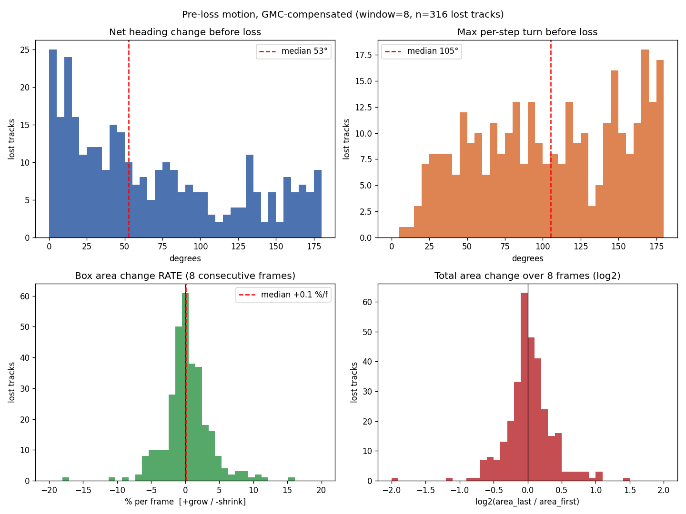
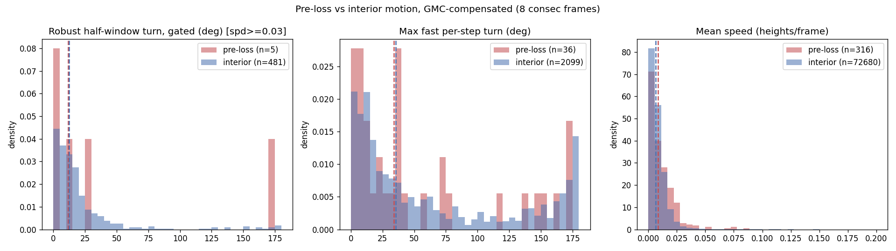
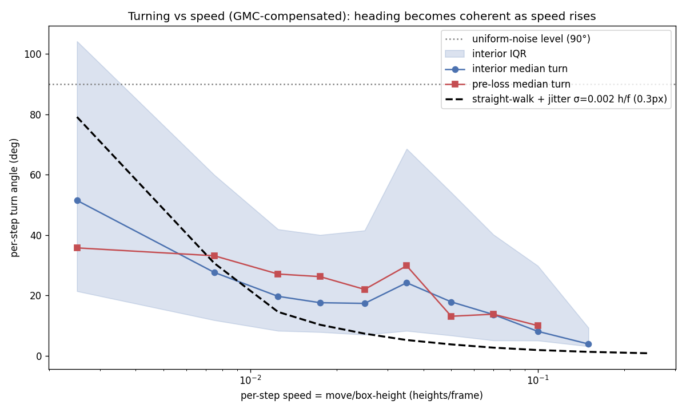
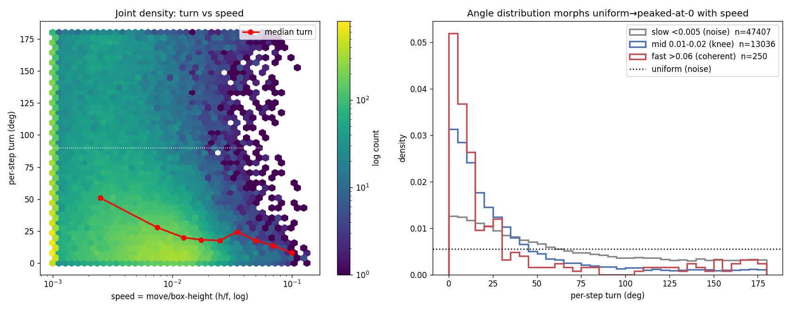

# Offline Relink-Candidate Analysis — discriminability & pre-loss kinematics

> **Status:** **s-line historical method hub** (as-of **2026-06-09**, preset
> `mamba_whole_graph`). **Method** (easy/hard pool, thr table, base rate, builder
> rules) remains the **style/method reference**. **Embedded tables/numbers are not
> the m fact-owner** — for `mamba_whole_graph_m` remeasures write
> `out/signal_study/<id>/{context,metrics_auc,metrics_thr}.*` via
> `scripts/tools/summarize_relink_pairs.py`. Writing style + caveats for new notes:
> [signal_table_schema.md](../../../research/eval/signal_table_schema.md) **§0.2–0.3**.
> Do not update this file’s thr/AUC tables as the live m baseline.

Offline study of relink discriminability on **MOT17 train, SDP, `mamba_whole_graph`**,
built from a **relink-OFF / interpolation-OFF** substrate so every track death and birth is
raw and every (lost → candidate) pair can be enumerated and GT-labelled.

This **reconciles** (does not simply overturn) the headline of
[`bidir_relink_data_analysis.md`](bidir_relink_data_analysis.md) ("pure geometry AUC ≈ 0.55").
The two numbers measure **different pools** and are both correct:

- On the **full** offline candidate pool, `bridge_dist` is a strong ranker (**AUC ≈ 0.895**) —
  but that power is almost entirely *rejecting candidates that are obviously too far away*.
- Restricted to the **gate's operating region** (`bridge_dist ≤ 1`, i.e. the spatially
  plausible candidates the online relink actually weighs), AUC collapses to **~0.65** (≤0.5 →
  0.64). Among genuine near look-alikes, geometry barely separates — exactly the old doc's
  point.

So: the full-pool AUC is useful for **negative-pool reduction (recall side)**, but the current
bridge is **not strong on the hard cases**, and the precision ceiling is **base rate**, not a
better residual. (An earlier draft of this doc over-claimed the 0.55 was pure "selection bias";
the honest framing is easy-pool vs hard-pool AUC.)

- **Date:** 2026-06-09
- **Substrate run:** `mamba_whole_graph --detector SDP --no-interpolate-tracklets`
- **Scripts:** `scripts/tools/build_relink_candidates.py`, `analyze_preloss_motion.py`,
  `analyze_turn_baseline.py`, `sweep_speed_turn.py`
- **Artifacts:** `scripts/tools/out/relink_candidates.csv`, `speed_turn_sweep.npz`, figures below.
- **Signal-study contract (B1):** universe `U_relink_pair`, full+hard-pool AUC, base rate —
  see [signal_table_schema.md](../../../research/eval/signal_table_schema.md) §0.1 / §4.3b
  and `saccade.perception.eval.signal_tables` (`hard_pool_rule`, `auc_full_and_hard_pool`).

---

## 0. Hub — the relink / crossing-swap / AssA investigations

This file is the **entry point** for the association-recovery (relink + crossing-swap)
bottleneck. It holds the offline discriminability + pre-loss kinematics study (§1–§8); the
sibling investigations below each own one thread and keep their own data/verdict. Read this
first, then follow out.

| investigation | doc | scope | verdict |
|---|---|---|---|
| **Experiment ↔ implementation crosswalk** | [`association_recovery_crosswalk_20260709.md`](association_recovery_crosswalk_20260709.md) | production stack sketch + doors, knobs, code paths, NO-GO, substrates | **research-synthesis map** (not sole active; not mainline prose) |
| **Scripts lookup index** | [`association_recovery_scripts_index_20260709.md`](association_recovery_scripts_index_20260709.md) | task→script, door tables, wrappers, CLI recipes | **lookup only** — no GO/NO-GO text |
| **Information source contract** | [`association_recovery_info_source_contract_20260709.md`](association_recovery_info_source_contract_20260709.md) | disk / registry / no_go / preset / ledger ownership; script non-goals | **Step 0** before yaml or checker |
| **Offline relink discriminability + kinematics** | *(this file)* | bridge AUC easy/hard pool, pre-loss motion, speed×turn, reach-gate, precision gate | geometry/motion **ceiling** (base-rate wall); one speed-weighted term survives (§6c GO) |
| **Bridge motion-residual AUC** | [`bidir_relink_data_analysis.md`](bidir_relink_data_analysis.md) | pure-geometry residual ranking on the bridge pool | AUC ≈ 0.55 (hard pool) — reconciled in this file's intro |
| **Bidirectional bridge relink** | [`bidirectional_relink_roadmap.md`](bidirectional_relink_roadmap.md) | mid-point bridge design + roadmap | default-on GO (+2.1 IDF1) |
| **Relink normalization gate** | [`relink_normalization_gate_analysis.md`](relink_normalization_gate_analysis.md) | scale/normalization gating | see doc |
| **Occlusion crossing-swap depth ordering** | [`depth_ordering_crossing_swap.md`](depth_ordering_crossing_swap.md) | foot_y/depth front-back signal (probe AUC **0.898** vs appearance ≈0.50), oracle, same-height gate | signal GO; production `occ_state_*` ON — re-read registry **#39** before reopening hooks |
| **Live-association crossing-swap quantification** | [`mamba-score-distribution-20260613.md`](../../detection/research/mamba-score-distribution-20260613.md) §7–8 | 109 swaps = 22% of IDs, the live counterpart | source of the §8 target |
| **Cheb-GR offline handover signal map** | [`chebgr_handover_signal_map_20260704.md`](chebgr_handover_signal_map_20260704.md) | post-hoc ID cleanup frontier (`best_cost`) | GO offline; live claims #56 NO-GO |
| **CleanFifoBank substrate** | [`clean_fifo_bank_substrate_20260704.md`](clean_fifo_bank_substrate_20260704.md) | shared bank API + hard constraints | reusable substrate; async C++ parked |
| **#55 occ-exit audit** | [`occ_exit_audit_p55_scope_20260709.md`](occ_exit_audit_p55_scope_20260709.md) (+ WP2/WP3) | post-exit identity cut / seq conditioning | WP3 net harm; promotion `split_feat_pr` only |

> The §3–§6 base-rate ceiling is specific to **bridge-relink / velocity-direction**, *not* a
> universal wall on the crossing-swap door — the depth-ordering channel cracks it (§8 + its
> doc). Keep that distinction when citing "the AssA ceiling."

## 1. The no-relink / no-interp substrate

All three relink paths are off by default in this preset and were confirmed inactive:
`reid_mode=off` ⇒ `use_semantic_mode=False` ⇒ no semantic/motion relinker is built;
`relink_enabled` and `relink_bridge_enabled` default `False`. Interpolation is additionally
disabled so short within-id gaps are *not* filled — exposing every real track break.

| Run | IDF1 | MOTA | HOTA | AssA | IDs | FP | FN |
|---|---|---|---|---|---|---|---|
| relink-off, **interp-on** | 73.0 | 76.8 | 66.5 | 63.8 | 558 | 4092 | 21387 |
| relink-off, **interp-off** (substrate) | 72.8 | 75.9 | 65.9 | 63.4 | **695** | 1166 | 25186 |

IDs **558 → 695**: turning interpolation off exposes ~137 extra death/birth events — exactly
the relink opportunities to study. Per-frame dump in `results/MOT17_eval/*.txt`.

## 2. Candidate dataset & rules

`build_relink_candidates.py` → `relink_candidates.csv` (**21,261 pairs, 27 cols**).
Per lost track A → candidate B:

1. **causality** — `B.first_frame > A.last_frame` (only link IDs born after A is lost)
2. **no temporal overlap** — `frames(A) ∩ frames(B) = ∅` (co-existing ⇒ different people)
3. **gap gate** — `1 ≤ gap ≤ 300` (wide)
4. **spatial gate** — foot-dist / mean-height (default off / wide)

**Uniqueness ("an ID cannot be linked twice")** is *not* a hard filter — it is two tag
columns `accepted` / `already_linked` from a greedy pass (smallest `bridge_dist` wins, which
mirrors `relink_bidir_propose_kernel`'s propose/commit semantics). Each pair carries GT labels
(`gt_lost/gt_cand/gt_match/gt_valid`) and geometric/motion features (`gap, dist_h, fwd_resid,
bwd_resid, bridge_dist, dir_cos, speed_h`).

> The main tracker association is an **auction** solver (`parallel_auction_shmem_kernel` /
> `AuctionAlgorithm::Solve`). The **bridge relink** is *not* auction — it is greedy
> highest-score propose/commit, so the offline uniqueness tag matches it intentionally.

## 3. Bridge discriminability — separates well, base-rate kills precision

On the 19,615 GT-valid pairs (**256 true relink chances** vs 19,359 false):

- **AUC(`bridge_dist`) = 0.895.** Positive median 0.79 vs negative median 4.90 — nearly
  disjoint. AUC by gap-bin: `1-10`→0.962, `11-30`→0.891, `31-60`→0.867, `61-150`→0.859,
  `151-300`→0.836 (velocity-extrapolation reliability decays with gap).
- **But base rate is 1.3%**, so precision is low at any useful recall:

  | thr (`bridge_dist≤`) | TP | FP | prec | recall |
  |---|---|---|---|---|
  | 0.15 | 23 | 40 | 36.5% | 9.0% |
  | 0.30 | 56 | 161 | 25.8% | 21.9% |
  | 0.50 | 93 | 425 | 18.0% | 36.3% |
  | 1.00 | 155 | 1355 | 10.3% | 60.5% |

- **The 0.895 is mostly easy far-away negatives.** Recomputing `bridge_dist` AUC on
  progressively tighter (spatially plausible) pools: `dist_h≤1`→0.826, `dist_h≤0.6`→0.813, but
  in the **gate's operating region** `bridge_dist≤1`→**0.675** and `bridge_dist≤0.5`→**0.644**.
  Among genuine near look-alikes the gate is only marginally better than chance.

**Conclusion:** geometry is a strong *ranker for rejecting impossible candidates* but is
**weak on the hard near cases** (~0.65) and cannot carry precision against a 98.7%-negative
pool. The lever is **shrinking the negative pool first** (tighter gap/spatial gate, or
appearance/ReID as the first gate) and using geometry only for coarse reachability.

## 4. Pre-loss kinematics (GMC-compensated)

Per-frame GMC affine (`SparseOpticalFlowGMC`, LK partial-affine) is composed into a
world→frame transform; every box is back-projected to a stabilized world frame before
measuring motion, so camera pan/rotation/zoom is removed. Tracks lost mid-sequence only.



**Box area is a robust gate.** Over the last 8 *consecutive* frames (316 lost tracks), the
area change rate (log-linear fit) has **|median| ≈ 1.6 %/frame**, p10–p90 = −3.5…+4.2 %/frame,
8-frame cumulative 0.78–1.48×, symmetric (no systematic grow/shrink before loss). ⇒ a tight
relink scale tolerance (≈ ±6 %/frame) costs almost no true candidates while cutting
scale-jumping false links.

**Turning before loss is NOT a signal — it is jitter.** Net heading change has median 53°,
max-per-step 105° — but these are *identical* (or higher) for interior "cruising" windows of
the same tracks. Root cause: MOT17 per-frame foot speed is tiny (median **0.01 heights/frame**
≈ 2 px), below the box-jitter floor, so the velocity *direction* is noise.



Gating per-step turns at speed ≥ 0.03 h/f leaves only **1–2 % of windows**; among those the
robust half-window turn collapses to **~12°** (interior ≈ pre-loss). People walk **near-straight**;
constant-velocity extrapolation is fine *directionally* provided velocity is estimated over a
multi-frame window, not per-frame. (An earlier in-analysis claim that "sharp pre-loss turning
breaks the bridge" is **retracted** — the opposite holds.)

## 5. Speed × turning sweep + the underlying distribution

Pooling all 84,163 GMC-compensated 3-frame triplets and binning by per-step speed
(= move / box-height):



| speed (h/f) | frames per body-height | n (interior) | median turn |
|---|---|---|---|
| <0.005 | >400 | 45,902 | 51.5° (≈ noise) |
| 0.01–0.015 | 80 | 8,704 | 19.7° |
| 0.02–0.03 | 40 | 2,245 | 17.3° |
| 0.08–0.12 | 10 | 52 | 8.1° |
| 0.12–0.18 | 6.7 | 10 | 3.9° (≈ straight) |

**Heading becomes usable at ≈ 0.01–0.02 h/f** (~2–4 px/frame for a 169 px-median person; one
body-height per 40–80 frames). Below ~0.005 h/f (57 % of all steps) it is noise. Only ~3.4 %
of steps clear 0.02 h/f, so heading helps only the fast-moving minority; the slow bulk must
rely on spatial proximity + area + appearance. **Pre-loss ≈ interior at every matched speed**
⇒ turning carries no extra pre-loss discriminability.



**Distribution family: speed-conditioned projected-normal (offset-normal), κ ∝ SNR = speed/σ.**
The turning angle is not uniform even when slow — it is forward-biased at all speeds and
sharpens with speed:

| regime | P(turn < 30°) | P(turn > 150°) | median |
|---|---|---|---|
| slow <0.005 | 0.34 | 0.10 | 50.9° |
| mid 0.01–0.02 | 0.64 | 0.03 | 19.5° |
| fast >0.06 | 0.74 | 0.08 | 11.8° |

(uniform would give P(<30°)=0.167.) Speed itself is heavily right-skewed (log-normal-like,
median 0.004 h/f). The pooled marginal turn is therefore a **scale-mixture** of projected-
normals — a 0° peak with a heavy tail to 180° — which is why the un-binned median (~53°) *looks*
uniform but is not. A single-σ "straight walk + Gaussian foot-jitter" Monte-Carlo only roughly
matches (weighted RMSE ≈ 21°, fit pinned at the σ floor), confirming the mechanism is
near-straight motion blurred by ~pixel-scale position noise, plus mild real persistence.

## 6. Implications for relink design

1. **Negative-pool reduction is the lever**, not a better geometric residual. Tighten gap +
   spatial gate to raise base rate, and/or use appearance/ReID as the first gate; let
   `bridge_dist` confirm.
2. **Adopt the area-rate gate** (≈ ±6 %/frame, or ≤ ~1.5× over the gap): near-free precision,
   negligible true-candidate loss.
3. **Make heading speed-adaptive.** Use the projected-normal κ(speed) as the directional
   tolerance: widen the `dir_cos` gate for slow targets (direction unreliable), tighten it for
   fast ones. Estimate velocity over a multi-frame anchor, never per-frame.
4. Heading is irrelevant for the slow majority — do not gate them on direction at all.

## 6b. Reach-gate model: velocity drift is dead weight (tested & rejected)

Tested the intuition **`reach R(G) = vector-length + search-distance`** with
`vector-length = s·G` (lost exit speed × gap). `validate_reach_gate.py` ranks each
formulation against `bridge_dist` / plain spatial `dist_h` on the GT-valid pairs:

| gate | AUC | recall @ FP 100/500/2000 |
|---|---|---|
| `bridge_dist` (online) | **0.895** | 16 / 39 / 68 % |
| `dist_h` (constant radius, no motion) | 0.868 | 13 / 39 / 64 % |
| additive `dist_h − s·G` | 0.504 | 0 / 0 / 1 % |
| `(dist_h − s·G)/√G` | 0.515 | 0 / 0 / — |
| inverse-weighted `(dist_h − s·G)·s·G` | 0.490 | 0 / 0 / 0 % |

**Every formulation that uses the velocity vector collapses to chance** (or below — fast
subset goes anti-correlated, AUC 0.40). Root cause is the section-4/5 finding: per-track exit
speed `s` is at the jitter floor, so `s·G` is noise × gap, and subtracting/weighting by it
destroys the otherwise-good spatial signal. Normalising `dist_h` by any positive power of gap
also hurts (`/√G` → 0.795, `/G` → 0.673): true relinks stay spatially close regardless of gap,
so a **constant search radius beats a growing one**.

**Verdict:** an *additive/multiplicative* drift term `s·G` carries zero information — `s` is at
the jitter floor so `s·G` is noise. Reappearance position is dominated by **where the track
vanished (spatial persistence)**, not blind velocity extrapolation.

## 6c. Speed-weighted velocity term — the one geometric gain that survives

§6b kills the *additive* drift, but the **velocity term earns its keep when, and only when,
the target is actually moving.** Per-speed AUC of `bridge_dist` vs pure-spatial `dist_h`
(Δ = velocity contribution), split by `min(lost_exit, cand_entry)` speed:

| min speed (h/f) | AUC bridge | AUC dist_h | Δ (velocity term) |
|---|---|---|---|
| <0.01 (slow) | 0.908 | 0.911 | **−0.002** |
| 0.01–0.02 | 0.882 | 0.865 | +0.017 |
| 0.02–0.05 | 0.883 | 0.815 | +0.068 |
| ≥0.05 (fast) | 0.927 | 0.846 | **+0.081** |

The velocity term's value rises monotonically with speed. Crucially, in the **gate operating
region** (`bridge_dist ≤ 1`) plain `dist_h` (0.775) **beats** `bridge_dist` (0.675) — the
online bridge **over-trusts velocity for slow/mid targets and injects noise**. A
speed-weighted blend `w(s)·(velocity score) + (1−w)·dist_h`, with
`w = clip(min_speed / 0.05, 0, 1)`, recovers it:

| score | AUC full | AUC hard (`bd≤1`) |
|---|---|---|
| `bridge_dist` (online) | 0.895 | 0.675 |
| `dist_h` (spatial only) | 0.868 | 0.775 |
| blend(`bridge`, `dist_h`) | 0.901 | **0.790** |
| blend(`fwd_resid`, `dist_h`) | 0.887 | **0.796** |

**Design rule:** always-on spatial proximity (`dist_h`) as the base, **plus** a velocity-
consistency term weighted by `w(s)` that grows with speed. Fast targets use the **full**
extrapolation, not the capped `gap/2` midpoint.

**Optimised config** (`optimize_relink_weight.py`, grid over residual × speed metric ×
saturation × shape × normalisation, ranked by AP, validated leave-one-sequence-out):

```
score = -( w·sym_fb + (1-w)·dist_h )
  sym_fb     = 0.5·(fwd_resid + bwd_resid)        # symmetric full extrapolation > gap/2 midpoint
  fwd_resid  = ‖(lx + vxl·G) − cx0‖ / h_ref       # lost fwd-extrapolated to cand head position
  bwd_resid  = ‖(cx0 − vxc·G) − lx‖ / h_ref        # cand bwd-extrapolated to lost tail position
  dist_h     = ‖(lx,ly) − (cx0,cy0)‖ / h_ref      # direct spatial distance, normalised
  h_ref      = avg(ema_h_lost, ema_h_cand)          # EMA box height of both endpoints (see §6e)
  w          = clip( sqrt(s_lost / 0.12), 0, 1 )   # sqrt ramp, saturates ~0.12–0.2 h/f
  s_lost     = ‖(vxl, vyl)‖ / h_ref                # lost-track exit speed in heights/frame
```

`h_ref` is the **reference scale** that converts all pixel distances into body-height units,
making the threshold `bridge_px` invariant to camera zoom and subject distance. Using the
average of the EMA heights of *both* endpoints rather than one alone keeps the normalisation
symmetric: if the candidate re-enters the frame closer (larger box), the shared scale still
reflects the true scene geometry at the gap midpoint rather than one extreme.

| gate | LOSO-CV AP (hard region, held-out) |
|---|---|
| **speed-weighted (per-fold tuned)** | **0.372 ± 0.144** |
| `bridge_dist` (online) | 0.345 ± 0.142 |
| `dist_h` (spatial only) | 0.201 ± 0.143 |

The config is stable (5/7 folds pick `sym_fb, s_lost, sat≈0.2, sqrt`). **Honest offline gain is
+0.027 AP (~+8 %)** — the in-sample AP (0.16→0.32) is optimistic; cross-validation is the real
number. Three data-chosen design points: (1) symmetric `0.5(fwd+bwd)` residual beats the
one-sided midpoint; (2) `sqrt` weight with a **high** saturation (~0.15 h/f) — use velocity
*sparingly*, only for clearly-fast tracks; (3) no normalisation needed.

## 6d. Online validation — the gain is real end-to-end

Wired into the GPU tracker-core bridge (`relink_bidir_propose_kernel` in
`src/tracking/tracker_gpu.cu` + the CPU `midpoint_bridge_dist` in `tracker_gpu_python.cpp`)
as the **sole** foot-bridge score — the legacy gap/2 midpoint is removed, not flagged (it is
strictly worse and preserved in git history + the A/B below). The bridge stays default-off, so
the tracking baseline is unaffected. `--relink-bridge-px` default is now **0.25**. MOT17 train
SDP, `mamba_whole_graph`, `--relink-bridge-enabled`, px swept:

| config | IDF1 | HOTA | AssA | IDs |
|---|---|---|---|---|
| relink OFF | 73.0 | 66.5 | 63.8 | 558 |
| bridge, legacy midpoint (px 0.3) | 74.2 | 67.5 | 65.2 | 497 |
| **bridge, speed-weighted (px 0.25)** | **74.8** | **68.0** | **66.2** | **483** |

px curve peaks on a 0.25–0.30 plateau (74.7–74.8); ≤0.2 over-tightens (rejects true bridges,
IDs rise), ≥0.4 over-admits. **Speed-weighted vs legacy bridge: IDF1 +0.6, HOTA +0.5, AssA
+1.0, IDs −14** — above the ±0.3 pp noise band, and AssA (the HOTA bottleneck) is where it lands.
mode-0 re-run reproduces 74.2 exactly (bit-identity confirmed). The offline analysis translated
cleanly to an online win; remaining headroom is base-rate (appearance).

## 6e. h_ref regression and revert (2026-06-11)

After §6d was validated, commit `b605ac3e` changed `h_ref` from `avg(ema_lost, ema_cand)` to
`ema_lost` only across all three bridge paths (GPU kernel, C++ semantic relinker, Python relinker).
The stated rationale was to prevent the candidate's size from inflating the gate when the two
tracks differ in scale. However this regressed online performance:

| h_ref formula | IDF1 | HOTA | AssA | IDs |
|---|---|---|---|---|
| avg (original) | **74.8** | **68.0** | **66.2** | **483** |
| lost-only (`b605ac3e`) | 74.4 | 67.6 | 65.5 | 495 |

Root cause: `bridge_px = 0.25` is a normalised threshold; switching from avg to lost-only shifts
the effective gate asymmetrically. When the candidate is *larger* than the lost track (person
walking toward camera during the gap), `h_ref` shrinks → normalised distances grow → some true
bridges are incorrectly rejected. When the candidate is *smaller*, `h_ref` grows → distances
shrink → the gate becomes slightly looser. The net effect is a precision drop (IDs +12) without
any recall benefit.

The "inflate" concern is also made redundant by the scale gate introduced later (§6f): if the
lost/cand height ratio falls outside [0.75, 1.33] the pair is already rejected before the
distance is computed.

**Revert:** `b605ac3e` was reverted in all three paths (`tracker_gpu.cu`, `relink_gate.cu`,
`relink.py`). Golden gate (`eval_golden.py check`) passes bit-exactly on the default-off path.

## 6f. Precision gate ablation (2026-06-11)

Three gates were tested on the speed-weighted bridge (h_ref = avg, `bridge_px = 0.25`):

**Scale gate** (`bridge_h_lo / bridge_h_hi`): rejects pairs whose lost/cand EMA-height ratio
falls outside `[h_lo, h_hi]`. Motivated by §4: 8-frame cumulative scale is 0.78–1.48×, so a
symmetric ±33 % tolerance `[0.75, 1.33]` matches the natural pre-loss range and cuts large
size-jumping false links. Offline simulation on live-accepted pairs: kills **53 % of false
bridges** at zero short-gap TP loss (rejected TPs all have gap ≥ 37 frames). Implemented in all
three bridge paths.

**Margin** (`bridge_margin`): rejects the best candidate when `second_best_dist − best_dist < margin`,
i.e. the match is ambiguous. Prevents committing to a bridge in crowded scenes where two lost
tracks are nearly equidistant. Analogous to `reciprocal_margin` in the semantic relinker.

**Spatial pre-filter** (`bridge_spatial_gate`): rejects pairs whose centre distance / `h_ref`
exceeds the threshold *before* computing the velocity-extrapolated score. Intended as a cheap
coarse filter to skip obviously-impossible pairs.

Online ablation results (MOT17 train SDP, `mamba_whole_graph`, h_ref = avg, all gates isolated
then combined):

| config | IDF1 | HOTA | AssA | IDs | FP | FN |
|---|---|---|---|---|---|---|
| bridge, speed-weighted (h_ref avg) | 74.8 | 68.0 | 66.2 | 483 | 3541 | 20994 |
| + scale gate [0.75, 1.33] only | 74.9 | 68.0 | 66.2 | 482 | 3516 | 21056 |
| + margin = 0.05 only | **75.1** | **68.2** | **66.6** | 483 | 3528 | 21040 |
| + spatial_gate = 3.0 | 74.8 | 68.0 | 66.2 | 483 | 3541 | 20994 |
| **+ scale + margin = 0.05 (combined)** | **75.1** | **68.2** | **66.6** | **482** | **3514** | 21082 |

Key findings:

- **Margin = 0.05** is the dominant gate with avg h_ref (+0.3 IDF1, +0.4 AssA, FP −13). Rejecting
  ambiguous bridges (second-best within 0.05 of best) directly reduces false relinks in crowded
  scenes. Values beyond 0.05 give identical metrics — the ambiguous-pair population is exhausted.
- **Scale gate [0.75, 1.33]** contributes a smaller but independent gain on top (IDs −1, FP −14
  vs margin-only). With avg h_ref the gate's marginal value is lower than with lost-only h_ref:
  avg normalization already partially penalises size-mismatched pairs, so fewer pairs survive to
  be killed by the explicit ratio check.
- **Spatial pre-filter** (`bridge_spatial_gate = 3.0` or `5.0`) is **bit-identical** to the
  baseline. `bridge_px = 0.25` is already a tight gate; any pair that passes the speed-weighted
  score also has a centre distance well within a few `h_ref` units.
- Combined (scale + margin): negligible over margin-only in IDF1/HOTA/AssA; FP −14 more vs
  margin-only. Kept as default because the scale gate is near-free and blocks a distinct failure
  mode (teleporting tracks) that the margin test does not cover.

**Defaults set to**: `bridge_margin = 0.05`, `bridge_h_lo = 0.75`, `bridge_h_hi = 1.33`.
`bridge_spatial_gate` left at 0 (disabled). These are in `lifecycle.py` and `eval/config.py`.

## 7. Artifacts & reproduction

| Output | Produced by |
|---|---|
| `results/MOT17_eval/*.txt` (substrate) | `mot17.py --preset mamba_whole_graph --detector SDP --no-interpolate-tracklets` |
| `scripts/tools/out/relink_candidates.csv` | `build_relink_candidates.py` |
| `figures/preloss_motion.png` | `analyze_preloss_motion.py --window 8` |
| `figures/turn_baseline.png` | `analyze_turn_baseline.py --min-speed 0.03` |
| `figures/speed_turn_sweep.png`, `out/speed_turn_sweep.npz` | `sweep_speed_turn.py` |
| `figures/speed_turn_dist.png` | npz post-plot (see script header) |
| `scripts/tools/out/reach_gate.png` | `validate_reach_gate.py` |
| speed-weight grid + LOSO CV (stdout) | `optimize_relink_weight.py` |

## 8. Same ceiling reconfirmed from live-association side: occlusion crossing-swaps (2026-06-13)

An independent probe from the live-association direction
([`mamba-score-distribution-20260613.md`](../../detection/research/mamba-score-distribution-20260613.md)
§7–8) quantified where the AssA bottleneck hits: **109 occlusion crossing-swaps =
22% of baseline IDs (496)**. Two confirmed tracks mutually occlude (track-track IoU ≥ 0.5)
producing only one surviving bounding box; when they separate 1–2 frames later the two ids
swap — a live-association counterpart to the bridge-relink hard pool.

An occlusion-gated velocity-direction lock that penalised detections inconsistent with the
frozen pre-occlusion motion was implemented and measured on the MOT17 train SDP
(`mamba_whole_graph`). Even with the correct speed-weighting from §6c (height-normalised,
sqrt-ramp saturating 0.12 h/f), the feature is **monotonically harmful** across all tested
weights (0.15–1.0): the smallest tested weight pushes IDF1 −0.1 / AssA −0.4, and higher
weights collapse AssA by −5.3.

**Root cause (already documented in §4/§5):** MOT17 per-frame foot speed is at the
box-jitter floor (median 0.01 h/f); velocity direction is noise for the slow bulk, and even
the fast minority's direction is not discriminative in the gate's operating region (§3,
§6c hard-pool AUC ~0.65). Only appearance can separate true/false identity matches at this
scale, and appearance in the MOT17 embedding space is a documented ceiling (registry
[#2](../../../reference/no_go_registry.md) / [#32](../../../reference/no_go_registry.md) /
[#35](../../../reference/no_go_registry.md)).

**Verdict:** the *velocity/motion-direction* ceiling identified in §3–§6b is **reconfirmed**
from the live crossing-swap door — same base-rate wall for that lever. The quantification
(109 swaps = 22% of IDs, 1–2 frame gap, 100% recoverable at reappearance) sharpens the
target. The velocity-lock C++ feature was implemented and reverted after measurement.

> **Update (2026-06-14) — "appearance-only headroom" was wrong; a *different* geometry
> channel cracks it.** This section concluded only appearance could separate the crossing-swap
> pool. That holds for *velocity direction*, but not for *depth ordering*. The follow-up
> probe ([`depth_ordering_crossing_swap.md`](depth_ordering_crossing_swap.md)) showed
> pre-occlusion `foot_y` discriminates GT-front from GT-back at **AUC 0.898** (area 0.827)
> vs the appearance hard-pool's **≈0.50** — geometry, not ReID, is the live lever here.
> Production presets enable **`occ_state_*`** (`occ_foot_gap=0.15`, etc.); peak aggregate
> gains were measured on occluder-side hooks, but registry **#39** records per-seq overfit
> risk on some formulations — re-read #39 + depth doc before reopening Door B. Experiment
> ↔ code map: [`association_recovery_crosswalk_20260709.md`](association_recovery_crosswalk_20260709.md).
> The base-rate wall in §3–§6 is specific to bridge-relink/velocity, not a universal ceiling
> on the crossing-swap door.

