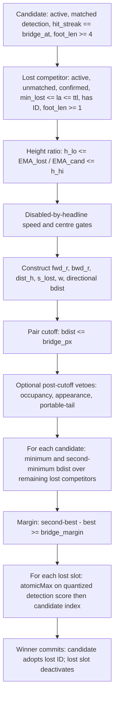

# P0 — runtime bridge decision-path identifiability and attribution

<!-- doc-status: sealed-execution -->
<!-- doc-promotion: none -->
<!-- doc-date: 2026-07-13 -->
<!-- doc-module: semantic -->

> **Execution authority.** The owner initiated P0 in the task instruction dated
> 2026-07-13.  This seal authorizes only the source and frozen-artifact audit
> declared below.  It is not terminal acceptance and authorizes neither a new
> capture, a sweep, a threshold choice, B1, nor a production change.

## 1. Frozen policy and sources

P0 audits only `configs/presets/mamba_whole_graph.yaml`, the current headline
runtime path.  The required effective bridge policy is:

| Knob | Frozen value |
| --- | ---: |
| `relink_bridge_enabled` | `true` |
| `relink_bridge_px` | `0.25` |
| `relink_bridge_margin` | `0.05` |
| `relink_bridge_h_lo`, `relink_bridge_h_hi` | `0.75`, `1.33` |
| `relink_bridge_spatial_gate`, `relink_bridge_max_speed` | `0`, `0` |
| `relink_bridge_dir_bonus` | `0.8` |
| ReID | off |

Frozen evidence under examination is D0's `capture.csv.gz` and its capture
manifest, the D0/S0 canonical packets, and R1's canonical packet.  No other
preset, capture, run, or historical ablation may supplement a missing field.

## 2. Canonical production decision DAG

The native `BridgeFidelityEvent` is written after C/D/E but before F.  Thus an
event record is an observation of an eligible, pre-score-gate-passing pair, not
of the complete raw pair universe and not of a proposal or commit.

## 3. Outcome-blind protocol

The runner reads source, manifests, SHA-256 values, and capture **headers** only
until the P4 funnel is frozen.  It never opens `pairs.csv` values and never
accesses `gt_*`, `accepted`, or any FP/GT label field.  If source/preset
alignment fails, P4 and P5 are marked `not entered`; no result is inferred from
downstream MOT output.

## 4. Replay-level rules

L0 requires a scalar observation. L1 additionally requires a replayable
`bdist <= px` predicate. L2 requires complete `(frame, candidate)` competitor
groups and the margin calculation. L3 additionally requires pre-score input
coverage, detection-score quantization, claim groups, and commit state. Missing
fields only lower the level; they are never reconstructed by approximation.

## 5. Ordered terminal and stop rule

`P0_CAPTURE_SEMANTICS_INVALID` takes precedence whenever the capture provenance
cannot be aligned to the frozen headline policy or source control flow.  The
runner then writes the field matrix and an explicitly unobserved funnel, stops
before label reveal, and awaits owner acceptance.  No terminal automatically
opens a capture, B1, score work, or a threshold study.

---

## Correction 1 — the frozen policy is not the audited evidence's policy (2026-07-13; append-only)

<!-- policy-target: non-headline; preset: mamba_whole_graph.yaml; reason: scope error, see Correction 1 -->

**Nothing above is rewritten.** This section is appended because § 1's frozen
policy and the terminal derived from it rest on a preset-identity error. The
accepted terminal is **not** re-decided here: that is the owner's to re-issue
(§ C1.4).

### C1.1 The error

§ 1 froze `configs/presets/mamba_whole_graph.yaml` (the **`s`** preset) and
called it *"the current headline runtime path"*. The evidence P0 audited —
D0's capture, D0/S0's canonical packets, R1's packet — is sealed on the **`m`**
preset. `headline` is overloaded (`status_2026-07-09.md` keeps both an `s`
primary and an `m` capacity track), but for the bridge-fidelity line it is `m`:
`HEADLINE_PRESET_REL` = `mamba_whole_graph_m.yaml`
(`src/saccade/perception/eval/consumer_a_bridge_fidelity.py`), whose production
constants (`PRODUCTION_BRIDGE_PX = 0.4`) are annotated *"must match headline
preset"*; [D0](d0_bridge_estimator_fidelity_20260711.md) declares the same.

P0's own test already asserted this: `tests/unit/tracking/test_runtime_bridge_decision_path.py`
requires `provenance["r1_frozen_preset"]` to end in `mamba_whole_graph_m.yaml`,
while `scripts/tools/audit_runtime_bridge_decision_path.py` hard-coded the `s`
policy it was compared against. The contradiction was internal to P0.

### C1.2 What this does to the terminal's stated cause

The results doc reports that *"D0's sealed capture provenance instead stamps
`px=0.4` and directional bonus `0.0`"*. Those are **`m`'s correct values** —
`m`'s preset states in terms that it does not inherit `s`'s `0.8`. The capture
stamped its policy faithfully.

> The `px` / `dir_bonus` delta is a **scope mismatch — P0 measured `m`-sealed
> evidence against the `s` policy — not capture corruption.**

The evidence packets are **not** amended: they are frozen and they were not
wrong. What is wrong is the yardstick § 1 chose.

### C1.3 The terminal survives — but it was over-determined

The audit runner now takes its policy target as a required parameter. Re-running
it against **`m`**, on the same D0 provenance, **does not flip the terminal**:

| Compared knob | expected (`m`) | actual (D0 provenance) | status |
| --- | ---: | ---: | --- |
| `relink_bridge_px` | `0.4` | `0.4` | **match** |
| `relink_bridge_dir_bonus` | `0.0` | `0.0` | **match** |
| `relink_bridge_h_lo` | `0.6` | *absent* | mismatch_or_absent |
| `relink_bridge_h_hi` | `1.7` | *absent* | mismatch_or_absent |
| `relink_bridge_spatial_gate` | `0.0` | *absent* | mismatch_or_absent |
| `relink_bridge_max_speed` | `0.0` | *absent* | mismatch_or_absent |

Four of the six compared knobs are **never stamped into capture provenance at
all**. Configuration alignment therefore fails for **every** preset, so
`P0_CAPTURE_SEMANTICS_INVALID` would have fired whichever preset § 1 had frozen.

> **The terminal is right; its published reason is wrong.** The capture is not
> foreign — it is **under-stamped**. The `px` / `dir_bonus` comparison that the
> results doc presents as the cause never carried the decision.

This matters because the two readings license opposite next moves. *"The evidence
is from a foreign config"* implies the D0/R1/S0 line is corrupt and must be
re-captured. *"The provenance does not stamp the height gate"* implies the
evidence is sound but under-documented, and the remedy is to stamp the missing
fields — which is exactly what
[H0](headline_bridge_full_decision_capture_declaration_20260713.md) does.

### C1.4 What survives, unchanged

Preset-independent, and unaffected by the above:

1. **Field insufficiency ⇒ replay capped at L1.** The D0 v2 export drops `frame`
   and slot ids and carries no detection score, so best/second-best margin, the
   `atomicMax` claim competition, and commit are unreplayable. This is the
   finding H0 is built on.
2. **`h_lo` / `h_hi` (and `spatial_gate` / `max_speed`) are never stamped** into
   capture provenance, so a packet cannot self-certify which gates were active.
3. **No capture-time `tracker_gpu.cu` file hash** is recorded — only a
   `git_commit`, which cannot prove identity with the audited source DAG.

(2) and (3) are real provenance gaps in the D0/R1/S0 line and are the parts of
this audit that should reach the claim-state registry.

### C1.5 What is submitted to the owner

`P0_CAPTURE_SEMANTICS_INVALID` was owner-accepted on 2026-07-13 and is **not**
rewritten here. It survives on the corrected reasoning (C1.3), so what the owner
is asked to re-issue is its **cause**, not its outcome:

- **the recorded cause becomes provenance incompleteness** (C1.4 (2)–(3)) — four
  policy knobs are unstamped — rather than a foreign capture configuration;
- **the scope error is recorded**: § 1 froze `s` while auditing `m`-sealed
  evidence, and no conclusion may be drawn from that comparison;
- **re-running P0 against `m` is not a remedy** and is not proposed: it has been
  run (C1.3) and returns the same terminal. The remedy is stamping the missing
  provenance fields, which H0 already covers.

No downstream unit may cite this terminal as evidence that the D0/R1/S0 capture
**semantics** are invalid — the demonstrated defect is in what the capture
**records about itself**.

### C1.6 Owner re-issue (2026-07-14; accepted)

The owner accepted the re-issued cause on 2026-07-14:

> **Cause of record: capture-provenance incompleteness.** `relink_bridge_h_lo`,
> `relink_bridge_h_hi`, `relink_bridge_spatial_gate` and `relink_bridge_max_speed`
> are never stamped into capture provenance, and no capture-time `tracker_gpu.cu`
> file hash is recorded, so no packet can self-certify the policy it ran under —
> under **any** preset. The superseded cause (a foreign capture configuration,
> inferred from a `px` / `dir_bonus` delta against the `s` preset) is
> **withdrawn**: those values are `m`'s correct ones.

This re-issue authorizes exactly one thing beyond the original terminal: the
corresponding **claim-state registry** update (the `open_limits` of the D0/R1/S0
line, and a record for this object). It authorizes no capture, sweep, threshold
study, B1, or production modification. The D0/R1/S0 states are **not** downgraded
— they never claimed the `s` policy.

### C1.7 The terminal is retyped, not merely re-caused (2026-07-14; owner review)

C1.6 as first written kept the label `P0_CAPTURE_SEMANTICS_INVALID` and changed
only its cause. That is incoherent, and owner review rejected it: a terminal is a
**typed proposition**, not a bookmark for wherever the study stopped. Asserting
*"the evidence is sound, merely under-stamped"* while the runner keeps emitting
`..._capture_semantics_invalid` means the artifacts **mechanically restate a
proposition that has been withdrawn**.

Missing provenance fields support exactly one inference — *the capture cannot be
verified against any policy* — and not the stronger one that its semantics are
wrong. So the terminal is **retyped**:

| | |
| --- | --- |
| **Terminal of record (corrected runs)** | **`P0_CAPTURE_SEMANTICS_UNVERIFIABLE`** |
| Cause | capture-provenance incompleteness (C1.6) |
| Supersedes (in type) | `P0_CAPTURE_SEMANTICS_INVALID` |

What is **unchanged** is § 5's stop rule and its ordering: provenance that cannot
be aligned to the frozen policy still halts the audit before any label is read,
and still takes precedence. Only the proposition that halt licenses is retyped.
The **2026-07-13 sealed packet keeps the superseded label** and is not edited —
it is the historical record of what was accepted then. A corrected run emits the
retyped terminal and carries `terminal_supersedes` so the two are never conflated.

The registry records the retyped terminal as this object's state, with the
superseded label named.
