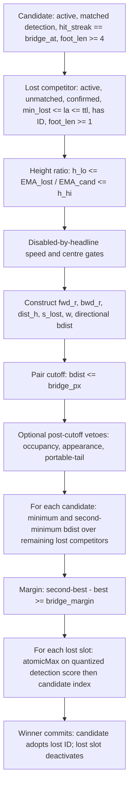

# P0 — runtime bridge decision-path identifiability and attribution

<!-- doc-status: sealed-execution -->
<!-- doc-promotion: none -->
<!-- doc-date: 2026-07-13 -->
<!-- doc-module: semantic -->

> **Execution authority.** The owner initiated P0 in the task instruction dated
> 2026-07-13.  This seal authorizes only the source and frozen-artifact audit
> declared below.  It is not terminal acceptance and authorizes neither a new
> capture, a sweep, a threshold choice, B1, nor a production change.

## 1. Frozen policy and sources

P0 audits only `configs/presets/mamba_whole_graph.yaml`, the current headline
runtime path.  The required effective bridge policy is:

| Knob | Frozen value |
| --- | ---: |
| `relink_bridge_enabled` | `true` |
| `relink_bridge_px` | `0.25` |
| `relink_bridge_margin` | `0.05` |
| `relink_bridge_h_lo`, `relink_bridge_h_hi` | `0.75`, `1.33` |
| `relink_bridge_spatial_gate`, `relink_bridge_max_speed` | `0`, `0` |
| `relink_bridge_dir_bonus` | `0.8` |
| ReID | off |

Frozen evidence under examination is D0's `capture.csv.gz` and its capture
manifest, the D0/S0 canonical packets, and R1's canonical packet.  No other
preset, capture, run, or historical ablation may supplement a missing field.

## 2. Canonical production decision DAG



The native `BridgeFidelityEvent` is written after C/D/E but before F.  Thus an
event record is an observation of an eligible, pre-score-gate-passing pair, not
of the complete raw pair universe and not of a proposal or commit.

## 3. Outcome-blind protocol

The runner reads source, manifests, SHA-256 values, and capture **headers** only
until the P4 funnel is frozen.  It never opens `pairs.csv` values and never
accesses `gt_*`, `accepted`, or any FP/GT label field.  If source/preset
alignment fails, P4 and P5 are marked `not entered`; no result is inferred from
downstream MOT output.

## 4. Replay-level rules

L0 requires a scalar observation. L1 additionally requires a replayable
`bdist <= px` predicate. L2 requires complete `(frame, candidate)` competitor
groups and the margin calculation. L3 additionally requires pre-score input
coverage, detection-score quantization, claim groups, and commit state. Missing
fields only lower the level; they are never reconstructed by approximation.

## 5. Ordered terminal and stop rule

`P0_CAPTURE_SEMANTICS_INVALID` takes precedence whenever the capture provenance
cannot be aligned to the frozen headline policy or source control flow.  The
runner then writes the field matrix and an explicitly unobserved funnel, stops
before label reveal, and awaits owner acceptance.  No terminal automatically
opens a capture, B1, score work, or a threshold study.

---

## Correction 1 — the frozen policy is not the audited evidence's policy (2026-07-13; append-only)

<!-- policy-target: non-headline; preset: mamba_whole_graph.yaml; reason: scope error, see Correction 1 -->

**Nothing above is rewritten.** This section is appended because § 1's frozen
policy and the terminal derived from it rest on a preset-identity error. The
accepted terminal is **not** re-decided here: that is the owner's to re-issue
(§ C1.4).

### C1.1 The error

§ 1 froze `configs/presets/mamba_whole_graph.yaml` (the **`s`** preset) and
called it *"the current headline runtime path"*. The evidence P0 audited —
D0's capture, D0/S0's canonical packets, R1's packet — is sealed on the **`m`**
preset. `headline` is overloaded (`status_2026-07-09.md` keeps both an `s`
primary and an `m` capacity track), but for the bridge-fidelity line it is `m`:
`HEADLINE_PRESET_REL` = `mamba_whole_graph_m.yaml`
(`src/saccade/perception/eval/consumer_a_bridge_fidelity.py`), whose production
constants (`PRODUCTION_BRIDGE_PX = 0.4`) are annotated *"must match headline
preset"*; [D0](d0_bridge_estimator_fidelity_20260711.md) declares the same.

P0's own test already asserted this: `tests/unit/tracking/test_runtime_bridge_decision_path.py`
requires `provenance["r1_frozen_preset"]` to end in `mamba_whole_graph_m.yaml`,
while `scripts/tools/audit_runtime_bridge_decision_path.py` hard-coded the `s`
policy it was compared against. The contradiction was internal to P0.

### C1.2 What this does to the terminal's stated cause

The results doc reports that *"D0's sealed capture provenance instead stamps
`px=0.4` and directional bonus `0.0`"*. Those are **`m`'s correct values** —
`m`'s preset states in terms that it does not inherit `s`'s `0.8`. The capture
stamped its policy faithfully.

> The `px` / `dir_bonus` delta is a **scope mismatch — P0 measured `m`-sealed
> evidence against the `s` policy — not capture corruption.**

The evidence packets are **not** amended: they are frozen and they were not
wrong. What is wrong is the yardstick § 1 chose.

### C1.3 The terminal partition had no cell for "cannot tell"

§ 5 offered one terminal for every way alignment could fail. But alignment fails
in two ways that mean opposite things:

| Evidence | Kind | What it licenses |
| --- | --- | --- |
| a stamped field **contradicts** the audited policy | ontic | the capture really did run another policy |
| a field is **never stamped** | epistemic | nothing — only that the check cannot be made |

The runner fused them into a single status (`mismatch_or_absent`) and a single
boolean, and the one available label was named after the **stronger** kind. So the
weaker evidence inherited the stronger claim, and an *absence of evidence* was
published as *evidence of invalidity*.

With the two held apart and the terminal **derived** from which kind was found,
the same frozen D0 provenance gives **different** answers for the two presets —
measured, on the real sealed artifacts:

| Policy target | mismatched (stamped, contradicts) | unstamped (cannot check) | Terminal |
| --- | --- | --- | --- |
| **`s`** (what § 1 froze) | `px`, `dir_bonus` | `h_lo`, `h_hi`, `spatial_gate`, `max_speed` | **`P0_CAPTURE_SEMANTICS_INVALID`** |
| **`m`** (what the evidence *is*) | *(none)* | same four | **`P0_CAPTURE_SEMANTICS_UNVERIFIABLE`** |

> **P0's terminal was correct for the preset it declared.** Against `s`, the
> capture genuinely contradicts the audited policy — `INVALID` is warranted. The
> error was never the inference. **It was the scope.**
>
> Against `m` — the preset the evidence is actually sealed on — nothing is
> contradicted. The capture is not foreign; it is **under-stamped**.

This matters because the two readings license opposite next moves. *"The evidence
is from a foreign config"* implies the D0/R1/S0 line is corrupt and must be
re-captured. *"The provenance does not stamp the height gate"* implies the
evidence is sound but under-documented, and the remedy is to stamp the missing
fields — which is exactly what
[H0](headline_bridge_full_decision_capture_declaration_20260713.md) does.

### C1.4 What survives, unchanged

Preset-independent, and unaffected by the above:

1. **Field insufficiency ⇒ replay capped at L1.** The D0 v2 export drops `frame`
   and slot ids and carries no detection score, so best/second-best margin, the
   `atomicMax` claim competition, and commit are unreplayable. This is the
   finding H0 is built on.
2. **`h_lo` / `h_hi` (and `spatial_gate` / `max_speed`) are never stamped** into
   capture provenance, so a packet cannot self-certify which gates were active.
3. **No capture-time `tracker_gpu.cu` file hash** is recorded — only a
   `git_commit`, which cannot prove identity with the audited source DAG.

(2) and (3) are real provenance gaps in the D0/R1/S0 line and are the parts of
this audit that should reach the claim-state registry.

### C1.5 What is submitted to the owner

`P0_CAPTURE_SEMANTICS_INVALID` was owner-accepted on 2026-07-13, is **correct
within the scope § 1 declared**, and is **not** rewritten here. What the owner is
asked to accept is the **scope-corrected terminal**:

- **the audit's scope was wrong**: § 1 froze `s` while auditing `m`-sealed
  evidence, so its verdict is a statement about `s`, not about the evidence's own
  policy;
- **against `m`, the terminal is `P0_CAPTURE_SEMANTICS_UNVERIFIABLE`** (C1.3),
  with cause **provenance incompleteness** (C1.4 (2)–(3));
- **re-capture is not the remedy and is not proposed** — an **owner disposition**
  (accepted 2026-07-14), *not* a consequence of the terminal. `..._UNVERIFIABLE`
  says only that the policy cannot be certified; it is equally compatible with
  re-capturing. The disposition rests on the capture's stamped fields agreeing with
  `m` and its bytes being hash-intact, and it elects the cheaper remedy: stamp the
  missing provenance fields, which H0 already covers. See C1.11.

No downstream unit may cite this study as evidence that the D0/R1/S0 capture
**semantics** are invalid — the demonstrated defect is in what the capture
**records about itself**.

### C1.6 Owner re-issue (2026-07-14; accepted)

The owner accepted the re-issued cause on 2026-07-14:

> **Cause of record: capture-provenance incompleteness.** `relink_bridge_h_lo`,
> `relink_bridge_h_hi`, `relink_bridge_spatial_gate` and `relink_bridge_max_speed`
> are never stamped into capture provenance, and no capture-time `tracker_gpu.cu`
> file hash is recorded, so no packet can self-certify the policy it ran under —
> under **any** preset. The superseded cause (a foreign capture configuration,
> inferred from a `px` / `dir_bonus` delta against the `s` preset) is
> **withdrawn**: those values are `m`'s correct ones.

This re-issue authorizes exactly one thing beyond the original terminal: the
corresponding **claim-state registry** update (the `open_limits` of the D0/R1/S0
line, and a record for this object). It authorizes no capture, sweep, threshold
study, B1, or production modification. The D0/R1/S0 states are **not** downgraded
— they never claimed the `s` policy.

### C1.7 The partition is completed, and the terminal becomes derived (2026-07-14; owner review)

C1.6 as first written kept the label `P0_CAPTURE_SEMANTICS_INVALID` and changed
only its cause. Owner review rejected that, and rightly: a terminal is a **typed
proposition**, not a bookmark for wherever the study stopped. Asserting *"the
evidence is sound, merely under-stamped"* while the runner keeps emitting
`..._capture_semantics_invalid` leaves the artifacts **mechanically restating a
proposition that has been withdrawn**.

But the deeper defect is not the label — it is that **§ 5's partition had no cell
for "cannot tell"** (C1.3). So the fix is not a rename. The terminal is now
**derived from the kind of evidence found**, over an ordered partition, and can no
longer be chosen in advance:

| Order | Terminal | Fires when |
| --- | --- | --- |
| 1 | `P0_CAPTURE_SEMANTICS_INVALID` | any **stamped** field contradicts the target, the R1 frozen preset differs, a packet hash is broken, or a source proof is missing |
| 2 | `P0_CAPTURE_SEMANTICS_UNVERIFIABLE` | nothing is contradicted, but a required field is **unstamped** (or no capture-time kernel hash exists) |
| 3 | `P0_PAIR_CUTOFF_ONLY` | everything stamped and matching |

Each run emits `terminal_basis`, from which a reader can recompute the verdict and
see **which kind of evidence carried it** — the thing the fused status destroyed.

§ 5's stop rule and its precedence are **unchanged**: provenance that cannot be
aligned still halts the audit before any label is read. What changed is that the
halt no longer has only one proposition available to it.

The **2026-07-13 sealed packet is not edited.** Its `P0_CAPTURE_SEMANTICS_INVALID`
is the correct terminal for the `s` scope it declared, and it stands as the record
of what was accepted then. The registry records the **scope-corrected** terminal
(`m` → `UNVERIFIABLE`) as this object's state.

### C1.8 How the proposition slipped (attribution)

The label overreached its evidence at a seam that was visible in § 5 all along:

> **Trigger** (epistemic): *"whenever the capture provenance **cannot be aligned**
> to the frozen policy"* — i.e. *I am unable to check*.
> **Label** (ontic): `P0_CAPTURE_**SEMANTICS_INVALID**` — i.e. *it is wrong*.

A halt condition was allowed to name a conclusion. Nothing in the artifacts could
object, because the runner had already fused the two kinds of evidence into one
boolean, so the distinction was **unrepresentable** by the time the terminal was
computed.

The vocabulary to prevent this **already existed in the contracts**: the
feasible-set framework's § 20.7 requires exactly this separation — *"it separates
'the experiment answered no' from 'the experiment could not answer the
question'"*, and reserves `UNRESOLVED / INVALID-STUDY` for the latter. P0's
partition simply had no such cell. The contract had the word; the study did not
use it.

### C1.9 Why nothing caught it: the seal is not auditable (2026-07-14)

The § 20.8 seal bar assumes a declaration is fixed **before** the result is known.
For P0 that cannot be checked from this repository: the declaration, the runner,
the results and the sealed evidence packet **all arrived in one commit**
(`b136437f`, 2026-07-13 14:32). Worse, the H0 draft (`392265e6`, 13:02 — ninety
minutes earlier) already names `P0_CAPTURE_SEMANTICS_INVALID` as a settled
outcome, so the terminal's name existed before the study that was to produce it
was committed.

This is not a P0 anomaly. Across every declaration/results pair in the module:

| Study | declaration | results | |
| --- | --- | --- | --- |
| D0 runtime shadow fidelity | 07-12 17:32 | 07-12 17:32 | same commit |
| frozen-packet key recoverability | 07-13 17:31 | 07-13 17:31 | same commit |
| **P0 decision path** | 07-13 14:32 | 07-13 14:32 | same commit |
| R1 temporal reduction | 07-12 19:17 | 07-12 20:41 | ✅ 84 min apart |

Git cannot see working-tree order, so the defensible claim is not *"the seal was
written afterwards"* but the more uncomfortable one: **nothing in the artifact
record proves it was not.** A seal that cannot be audited cannot stop a terminal
from being named after a result already in hand — which is precisely what has to
be ruled out here.

`tests/contract/test_declaration_seal_order.py` now requires a declaration to be
introduced in a strictly earlier commit than its results. The three studies above
are recorded there as **grandfathered, with their seals marked not auditable** —
an entry on the books, not an absolution.

### C1.10 The derived terminal was still floored by a constant (2026-07-14)

C1.7 made the terminal derived. Review of the runner that implements it found the
same defect one level down, in the code written to remove it:

```python
absences = {
    ...,
    "capture_kernel_source_hash_absent": True,  # only a git_commit is recorded
}
```

That `True` is a fact a reader observed in today's capture manifest and then
**transcribed into the audit** — the identical move that put the `s` preset's
knobs into § 1. Because `unverifiable = any(absences)`, it held under every
possible input, so row 3 of C1.7's partition (`P0_PAIR_CUTOFF_ONLY`) was
**unreachable from any evidence whatsoever**. A capture that *did* stamp its
kernel would have gone on being reported as uncertifiable, and nothing would have
said so. A partition with a dead cell is a verdict named in advance by omission.

The unit test did not see it because it exercised `derive_terminal` with a
hand-built `absences` dict — never the one `audit` actually passes.

Corrected: the runner reads `kernel_source_sha256` from capture provenance — the
key D0's own fidelity packet already stamps — and the evidence splits three ways,
as everywhere else in C1.7:

| capture provenance | kind | terminal row |
| --- | --- | --- |
| no `kernel_source_sha256` | **absence** (epistemic) | 2 |
| stamped, differs from the audited source | **contradiction** (ontic) | 1 |
| stamped, agrees | clean | 3 |

The stamped-but-differing case is new: it was previously unrepresentable, and it
is a positive fact about the capture, so it belongs in row 1 — C1.7's row-1 list
is extended by *"or the capture stamps a kernel hash that is not the audited
source's"*.

**The terminal of record does not move.** The D0 runtime capture stamps no kernel
hash, so the absence is real and `P0_CAPTURE_SEMANTICS_UNVERIFIABLE` still stands
— but it now stands *because the artifacts say so*, not because the audit could
return nothing else. R1's export carries the same four unstamped knobs, which is
what still holds row 3 shut; that, too, is now a readable fact in `terminal_basis`
rather than a constant.

### C1.11 The retype did not reach the whole packet (2026-07-14; owner review)

Owner review of C1.10 accepted the direction and found that the **implementation
had not caught up with the semantics it authorised**. A terminal is not a label on
one field; it types the whole packet. Three fields were still fixed strings:

| field | said | under terminal |
| --- | --- | --- |
| `decision_funnel.csv` `reason` | `headline provenance is invalid` | `..._UNVERIFIABLE` |
| `replay.observed_level` | `not_assignable_while_capture_provenance_is_incomplete` | *any* |
| `decision_funnel_status` | `not_entered_while_capture_provenance_is_incomplete` | *any* |

So one packet asserted both *"cannot be verified"* and *"is invalid"* — the
withdrawn proposition, still shipping in a file nobody re-read — and the clean
terminal was **only nominally** reachable: `audit()` could derive it while the rest
of the packet went on assuming incomplete provenance.

All three now derive from the terminal (`TERMINAL_NARRATIVE`), as does the field
matrix's `consequence`. Reaching `P0_PAIR_CUTOFF_ONLY` yields
`observability: PENDING_P4` — **not** `OBSERVABLE`: admission passing does not mean
this runner counted anything, and it must not claim figures it never computed.

#### The kernel-hash comparand was in the wrong time domain

C1.10 compared the capture's stamped kernel hash against **the `tracker_gpu.cu` in
the working tree at audit time**. That is a category error, and it cuts twice:

* any later edit to the kernel would make an *untouched* historical capture look
  like it stamped the wrong source — a **false `..._SEMANTICS_INVALID`**; and
* worse, the audit's static `SOURCE_PROOFS` were being grepped from HEAD, so it
  was **certifying a decision path the capture never executed**.

Not hypothetical. The 2026-07-12 capture ran at `b43772b7`, whose `tracker_gpu.cu`
is **a thousand lines removed from HEAD** (`3a58917c…` vs `e89934f6…`). The proofs
happened to still hold in both — luck, not soundness.

The comparand is now the source at the **capture's own commit**
(`git cat-file blob <capture git_commit>:src/tracking/tracker_gpu.cu`), and the
proofs are read from it. Drift against HEAD is reported
(`kernel_source_drifted_since_capture`) and **never drives a verdict**. If the
capture's commit cannot be resolved, that is an *absence* — nothing to compare —
never a contradiction.

**The terminal of record still does not move**: `P0_CAPTURE_SEMANTICS_UNVERIFIABLE`
for `m`. All seven source proofs hold against the capture-time kernel.

#### "The evidence is sound" is an owner decision, not a derived result

§ C1.5 and C1.6 state that **re-capture is not the remedy**. `..._UNVERIFIABLE`
does not entail that: "cannot be certified" is compatible with both *"stamp the
four fields"* and *"re-capture"*. Choosing the former is an **owner disposition**
(accepted 2026-07-14), taken on the grounds that the capture's stamped fields
agree with `m` and its bytes are hash-intact — not a conclusion the audit derives.
It is recorded as a decision, and the audit does not assert it.

### C1.12 Admission is not observability (2026-07-14; owner review)

C1.11 derived the packet's narrative from the terminal. Owner review found that
the *clean* branch of that narrative over-claimed, and that the test guarding it
never ran.

**The over-claim.** `P0_PAIR_CUTOFF_ONLY` was narrated as *"provenance is complete
and the funnel is computable"*, and `write_packet` wrote that one string to all
seven funnel stages — `eligible_raw_pairs`, `claim_winners`, `final_commits`
included. But the field matrix in the **same packet** says those stages are
unobservable, and says so for a reason provenance cannot touch: the capture never
recorded a frame column, a candidate slot, or the quantized atomicMax key. So the
clean terminal reintroduced the very defect C1.11 removed — a packet at war with
itself — merely in the opposite direction.

The error is a conflation. **Admission passing is not observability.** Stamping the
four missing knobs licenses P4 to compute *the stratum the replay level names* —
L1, the pair cutoff — and nothing beyond it. Six of the seven stages remain shut
whatever the provenance says.

Corrected: the funnel's disposition is now **stage-specific**, and each row answers
to its own field-matrix row rather than to one terminal-wide string:

| admission | stage | disposition |
| --- | --- | --- |
| fails | *all* | `UNOBSERVABLE`, reason = the terminal's |
| passes | matrix row complete | `PENDING_P4` |
| passes | matrix row incomplete | `UNOBSERVABLE`, reason = **that row's own blocker** |

`D_pair_cutoff.complete` was itself a hard-coded `False` — the same class of defect
again — and is now derived (`"bdist" in header and admitted`). It is the only stage
whose completeness turns on provenance, which is exactly why the clean terminal is
named `..._PAIR_CUTOFF_ONLY`. Under a clean terminal the funnel now releases
`pass_bdist_cutoff` and nothing else, and the other six cite their own blockers
(*"atomicMax winner cannot be replayed"*, *"shadow deliberately suppresses the only
bridge writes"*, …).

**The guard that never ran.** `test_no_packet_field_contradicts_its_own_terminal`
drove a *synthetic* capture, whose bytes cannot match the sealed packet hash — so
`d0_packet_hash_broken` fired and **both presets fell to `INVALID`**. Its
`UNVERIFIABLE` branch never executed. That branch also indexed `row["consequence"]`,
a key that does not exist (the field is `missing_consequence`), and CI stayed green
because the line was never reached. A test that cannot fail is not evidence — it is
the same "nothing mechanical objected" this study exists to end, one level up.

Replaced by tests that **reach the terminals for real**: `UNVERIFIABLE` from the
sealed artifacts, and clean from a fixture that stamps what they omit. Reaching the
clean terminal end-to-end required making the evidence tree injectable
(`audit(evidence_dir=…)`), because R1's export is missing the same four knobs the
D0 capture is — so without it, no test could produce that terminal at all, and **a
terminal no test can reach is one no reader should trust**.
