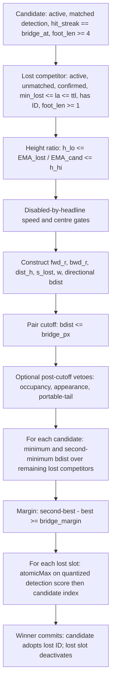

# P0 — runtime bridge decision-path identifiability and attribution

<!-- doc-status: sealed-execution -->
<!-- doc-promotion: none -->
<!-- doc-date: 2026-07-13 -->
<!-- doc-module: semantic -->

> **Execution authority.** The owner initiated P0 in the task instruction dated
> 2026-07-13.  This seal authorizes only the source and frozen-artifact audit
> declared below.  It is not terminal acceptance and authorizes neither a new
> capture, a sweep, a threshold choice, B1, nor a production change.

## 1. Frozen policy and sources

P0 audits only `configs/presets/mamba_whole_graph.yaml`, the current headline
runtime path.  The required effective bridge policy is:

| Knob | Frozen value |
| --- | ---: |
| `relink_bridge_enabled` | `true` |
| `relink_bridge_px` | `0.25` |
| `relink_bridge_margin` | `0.05` |
| `relink_bridge_h_lo`, `relink_bridge_h_hi` | `0.75`, `1.33` |
| `relink_bridge_spatial_gate`, `relink_bridge_max_speed` | `0`, `0` |
| `relink_bridge_dir_bonus` | `0.8` |
| ReID | off |

Frozen evidence under examination is D0's `capture.csv.gz` and its capture
manifest, the D0/S0 canonical packets, and R1's canonical packet.  No other
preset, capture, run, or historical ablation may supplement a missing field.

## 2. Canonical production decision DAG

The native `BridgeFidelityEvent` is written after C/D/E but before F.  Thus an
event record is an observation of an eligible, pre-score-gate-passing pair, not
of the complete raw pair universe and not of a proposal or commit.

## 3. Outcome-blind protocol

The runner reads source, manifests, SHA-256 values, and capture **headers** only
until the P4 funnel is frozen.  It never opens `pairs.csv` values and never
accesses `gt_*`, `accepted`, or any FP/GT label field.  If source/preset
alignment fails, P4 and P5 are marked `not entered`; no result is inferred from
downstream MOT output.

## 4. Replay-level rules

L0 requires a scalar observation. L1 additionally requires a replayable
`bdist <= px` predicate. L2 requires complete `(frame, candidate)` competitor
groups and the margin calculation. L3 additionally requires pre-score input
coverage, detection-score quantization, claim groups, and commit state. Missing
fields only lower the level; they are never reconstructed by approximation.

## 5. Ordered terminal and stop rule

`P0_CAPTURE_SEMANTICS_INVALID` takes precedence whenever the capture provenance
cannot be aligned to the frozen headline policy or source control flow.  The
runner then writes the field matrix and an explicitly unobserved funnel, stops
before label reveal, and awaits owner acceptance.  No terminal automatically
opens a capture, B1, score work, or a threshold study.
