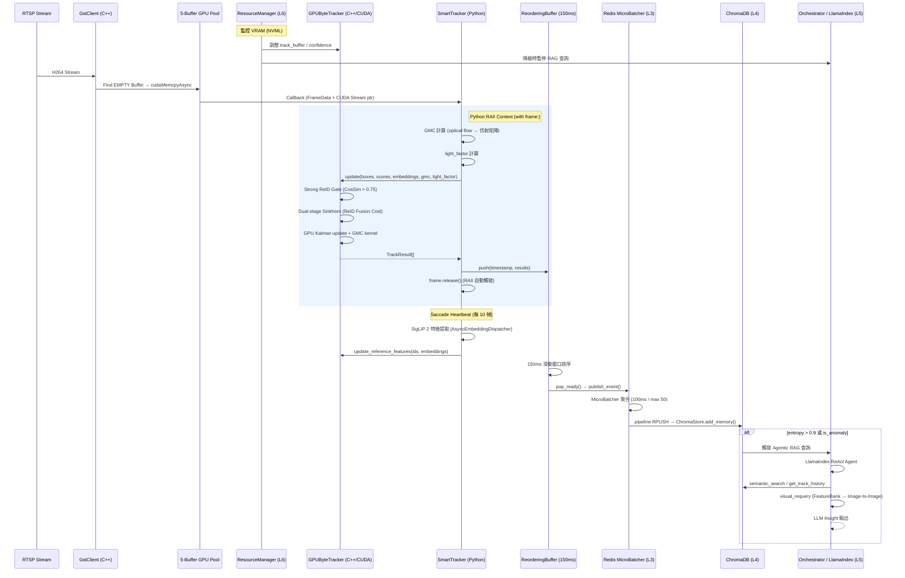

# Saccade 工業級資料管線全流程 (Pipeline Flow)

本文件詳細說明從 RTSP 串流攝取到最後語義推理的完整資料流向。本架構採用 **工業級零拷貝 V2**、**有序暫存隊列**、**階梯式資源管理**與 **Agentic RAG**，確保在邊緣設備上的極致效能與穩定性。

---

## 1. 系統全流程圖 (System-Wide Flow)

---

## 2. 詳細流程步驟

### 第一階段：影格攝取與硬體加速（C++ L1）
1. **採集與解碼**: GstClient 透過 nvh264dec 產生 NV12 影格。
2. **智慧抽樣**: 像素差異比對（SAD < 2.0）即時丟棄低資訊幀，降低無效計算。
3. **狀態機管理**: 遍歷 5-Buffer 狀態機。無可用緩衝區時執行 Drop Frame。
4. **並行搬運**: Buffer 專屬 CUDA Stream 執行非同步 H2D 搬運，狀態切換為 `READY`。
5. **RTSP Watchdog**: 超過閾值無新幀時，`watchdog_loop()` 指數退避重建 pipeline。

### 第二階段：資源監測與自適應降級（L6）
6. **VRAM 監控**: `ResourceManager` 透過 NVML 實時分析 GPU 負載。
7. **階梯式降級**:
    - **REDUCED (>85%)**: 縮減緩衝池大小。
    - **FAST_PATH (>92%)**: 暫停 SigLIP 2 特徵提取（L2）與 RAG 查詢（L5）。
    - **EMERGENCY (>96%)**: 解析度熱切換 640→320、Target Culling（Confidence < 0.4）、track_buffer 30→10。

### 第三階段：追蹤核心（GPUByteTracker + SmartTracker）
8. **GMC 計算**: Python 層用 OpenCV optical flow 計算逐幀仿射矩陣，傳入 C++ `gmc_kernel` 修正 Kalman 狀態。
9. **Light Compensation**: 根據幀亮度計算 `light_factor`，動態調整 R 矩陣，穩定夜間軌跡。
10. **Strong ReID Gate**: CosSim > 0.75 時強制配對，無視空間距離，對抗相機晃動。
11. **雙階段 Sinkhorn 匹配**: high/low score 分兩輪匹配，代價矩陣 = `(1-w)*IoU + w*CosSim`。
12. **Saccade Heartbeat**: 每 10 幀觸發一次 SigLIP 2 原生解析度特徵更新，避免 EMA 被模糊幀污染。

### 第四階段：有序緩衝與儲存（L3-L4）
13. **ReorderingBuffer**: 結果進入 150ms 滑動窗口重排，解決並行亂序。
14. **In-filling**: 影格跳躍 >40ms 時，Tracker 利用動量預測虛擬 BBox，維持 Kalman 平滑度。
15. **MicroBatcher**: 100ms 視窗聚合 Redis 寫入，QPS ~300 → ~30。
16. **ChromaDB 持久化**: 批次寫入向量索引；定期 snapshot 備份至本地壓縮檔。

### 第五階段：Agentic RAG 語義推理（L5）
17. **觸發條件**: `entropy > 0.9` 或 `is_anomaly=True`，`run_in_executor` 包裝防止阻塞主迴圈。
18. **ReAct Agent**: LlamaIndex 協調三個 Tool：
    - `semantic_search`：搜尋歷史相似場景。
    - `get_track_history`：取得特定目標軌跡。
    - `visual_requery`：從 FeatureBank 拉 SigLIP 2 embedding → ChromaDB Image-to-Image 搜尋。
19. **跨鏡頭 Re-ID**: `FeatureBank.find_cross_camera_matches()` 矩陣運算，讓多路串流共享特徵索引比對同一人物。

---

## 3. 核心技術防禦矩陣

| 技術組件 | 防禦對象 | 核心效益 |
| :--- | :--- | :--- |
| **State-Machine Pool** | 資料競爭 (Race Condition) | 確保多執行緒下影格資料完整性。 |
| **ExternalStream** | CPU 阻塞 (Sync Overhead) | 資料相依性由 GPU 硬體調度，提升吞吐量。 |
| **RAII (`__exit__`)** | 資源洩漏 (Buffer Leak) | 確保即使 Python 邏輯出錯，緩衝區也能正確回收。 |
| **ReorderingBuffer** | 亂序輸出 (Out-of-order) | 容忍 150ms 抖動，保證追蹤軌跡時間連續性。 |
| **Target Culling** | 追蹤池溢出 (Track Overflow) | 在臨界點主動釋放非核心追蹤狀態。 |
| **Stepped Degradation** | 系統崩潰 (OOM / Overload) | 在資源極限下優雅降級，優先保證核心感知。 |
| **Strong ReID Gate** | ID Switch（相機晃動）| CosSim > 0.75 強制連結，外觀優先於空間距離。 |
| **Saccade Heartbeat** | EMA 污染（模糊幀）| 稀疏更新，IDt 削減 64%，ReID 開銷降低 90%。 |
| **MicroBatcher** | Redis I/O 過載 | 批次聚合，QPS ~300 → ~30。 |
| **RTSP Watchdog** | 串流中斷無感知 | 超時自動重建 pipeline，指數退避重試。 |

---

最後更新：2026-04-25
