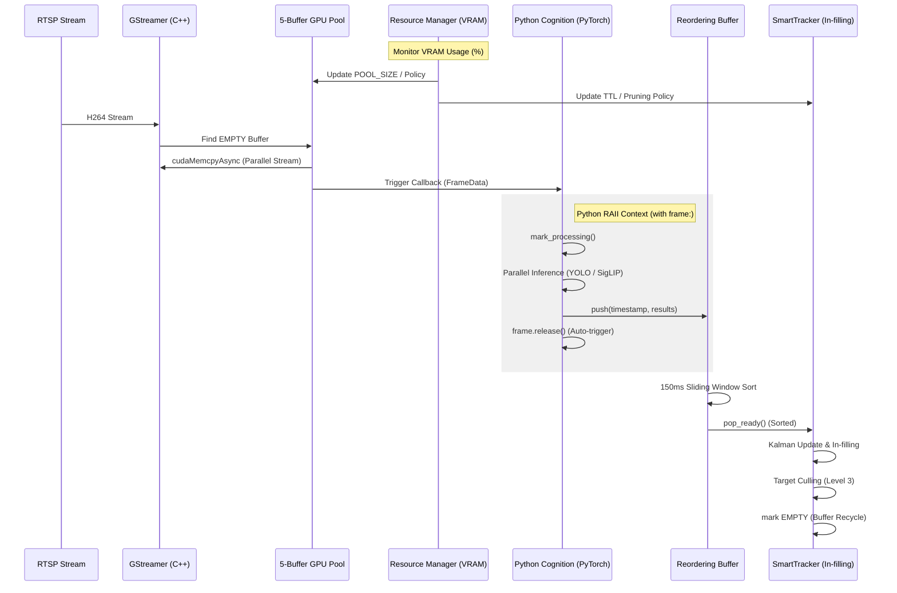

# Saccade 工業級資料管線全流程 (Pipeline Flow)

本文件詳細說明從 RTSP 串流攝取到最後語義儲存的完整資料流向。本架構採用 **工業級零拷貝 V2**、**有序暫存隊列** 與 **階梯式資源管理**，確保在邊緣設備上的極致效能與穩定性。

---

## 1. 系統全流程圖 (System-Wide Flow)

---

## 2. 詳細流程步驟 (Detailed Steps)

### 第一階段：影格攝取與硬體加速 (C++ L1)
1.  **採集與解碼**: GStreamer 透過硬體解碼器 (nvh264dec) 產生 NV12 影格。
2.  **狀態檢查**: C++ 遍歷 5-Buffer 狀態機。若無可用緩衝區（由 `ResourceManager` 動態決定可用數量），則執行 **Drop Frame**。
3.  **並行搬運**: 使用 Buffer 專屬的 CUDA Stream 執行非同步 H2D 搬運。狀態切換為 `READY` 並推送到 Python。

### 第二階段：資源監測與自適應降級 (Cognition L6)
4.  **VRAM 監控**: `ResourceManager` 實時分析 GPU 負載。
5.  **階梯式降級 (Stepped Degradation)**:
    *   **Level 1 (>85%)**: 縮減緩衝池大小，優化記憶體。
    *   **Level 2 (>92%)**: 進入 **Fast Path**，關閉 SigLIP 特徵提取，僅保留偵測。
    *   **Level 3 (>96%)**: **Emergency Mode**。觸發解析度熱切換 (640 -> 320)，並下令 Tracker 執行 **目標清理 (Target Culling)**，縮減追蹤緩衝 (TTL 30 -> 5)。

### 第三階段：Python 非同步處理與 RAII (L1-L6)
6.  **RAII 上下文管理**: Python 使用 `with frame:` 語句確保資源生命週期。
    *   `__enter__`: 自動觸發 `mark_processing()`，鎖定緩衝區。
    *   `__exit__`: 無論是否發生異常，自動觸發 `release()`，解鎖緩衝區。
7.  **並行推理 (Batch Mode)**: 使用 `torch.cuda.ExternalStream` 執行 YOLO/SigLIP。
    *   **優先權批次 (Priority Batching)**: `DriftHandler` 會根據優先權（New > Warm-up > Stable）與物件顯著性（面積大小）挑選 $N \le 8$ 的物件進入 Batch。
    *   **$N_{opt}$ 效能鎖定**: 當系統處於降級狀態時，強制將 Batch 限制在 TensorRT 最優區間，確保推理速度不發生抖動。
8.  **有序緩衝 (Reordering)**: 結果進入 150ms 滑動窗口進行重排，解決並行導致的順序錯亂。

### 第四階段：追蹤與補丁機制 (Industrial Tracker)
9.  **追蹤與清理**: 影格依序進入 `SmartTracker`。若處於 Level 3，會優先銷毀低置信度目標以節省 VRAM。
10. **補丁預測 (In-filling)**: 若偵測到影格跳躍 (>40ms)，Tracker 利用動量 (Velocity) 預測虛擬 BBox，維持 Kalman Filter 平滑度。
11. **延遲預警**: 若影格延遲超過 200ms，觸發 `LATENCY_SPIKE`，連動 `ResourceManager` 進行降級。

---

## 3. 核心技術防禦矩陣 (Robustness Matrix)

| 技術組件 | 防禦對象 | 核心效益 |
| :--- | :--- | :--- |
| **State-Machine Pool** | 資料競爭 (Race Condition) | 確保多執行緒下影格資料的完整性與一致性。 |
| **ExternalStream** | CPU 阻塞 (Sync Overhead) | 資料相依性由 GPU 硬體調度，提升系統整體吞吐量。 |
| **RAII (__exit__)** | 資源洩漏 (Buffer Leak) | 確保即使 Python 邏輯出錯，緩衝區也能被正確回收。 |
| **Reordering Buffer** | 亂序輸出 (Out-of-order) | 容忍 150ms 抖動，保證追蹤軌跡的時間連續性。 |
| **Target Culling** | 追蹤池溢出 (Track Overflow) | 在臨界點主動釋放非核心追蹤狀態，防止 VRAM 崩潰。 |
| **Stepped Degradation** | 系統崩潰 (OOM / Overload) | 在資源極限環境下「優雅降級」，優先保證核心感知。 |

---

最後更新：2026-04-14 (Saccade Architecture Team)
