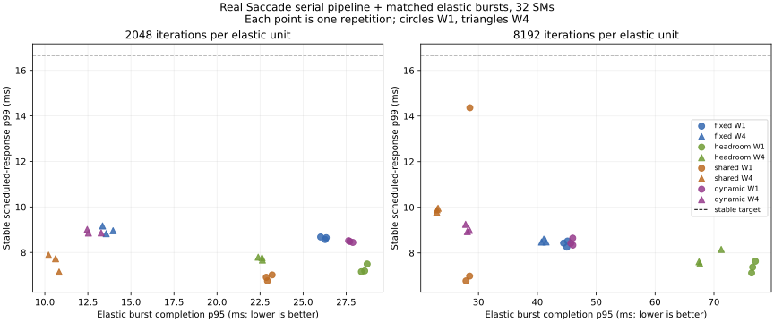

# #419 full-pipeline mixed-workload scheduling frontier

<!-- doc-status: active -->
<!-- doc-promotion: none -->
<!-- doc-date: 2026-09-16 -->
<!-- doc-module: cross -->

## Decision

**Temporal borrowing works with the real serial pipeline and improves large-burst
completion versus fixed reservation. It does not establish an efficiency win over
matched sharing at the frozen 16.667 ms service target.** All **51 timing runs**
meet the p99 / 1% miss criterion, with **4 observed misses in 15,300 frames**.

At 8192 iterations / window 4, dynamic borrowing reduces burst p95 completion
by **30.7–32.2%** versus same-repetition fixed reservation, while adding
**0.389–0.778 ms** to stable p99. Against matched sharing it has
**0.638–0.969 ms lower stable p99**, but **21.2–23.1% longer burst p95**.
This is an intermediate latency/completion tradeoff, not dominance on both axes.
Sharing meets the declared target and completes bursts faster at every matched
unit/window/repetition point. A stricter target chosen after seeing this table
would require a new held-out experiment.

| Policy, 8192 / W4 | Stable p99 ms | Elastic burst p95 ms | Target passes |
|---|---:|---:|---:|
| fixed | 8.476–8.601 | 40.714–41.477 | 3/3 |
| headroom | 7.518–8.152 | 67.462–71.234 | 3/3 |
| shared | 9.776–9.959 | 22.900–23.133 | 3/3 |
| dynamic | 8.933–9.255 | 27.816–28.467 | 3/3 |

Ranges span three repetition quantiles; they are not confidence intervals.
The [complete record](resource_mixed_20260916.json) retains every timing and
audited row, and the [independent audit](resource_mixed_20260916.audit.json)
checks the frozen contract, raw admission intervals and evidence-copy timing.

## What the frontier establishes

1. **The fixed-reservation advantage depends on admission granularity.** Dynamic
   W4 lowers burst p95 by 5.0–7.6% for small units and 30.7–32.2% for large units.
   Dynamic W1 is instead 5.2–6.5% slower than fixed for small units and
   1.5–3.5% slower for large units. Borrowing alone is not enough to select a
   policy; the window remains part of the measured operating point.
2. **Transition cost is visible and measured.** Dynamic request-to-admission
   p99 is 0.183–0.727 ms across the tested points; its largest observed value
   is 0.893 ms. At large-unit W4, p99 is 0.643–0.727 ms and the maximum is
   0.893 ms. These are empirical bounds for this run, not guaranteed deadlines.
   Each frame's scheduled response includes that interval. Paired p99 differences
   also include other policy effects and must not be attributed wholly to drain.
3. **Borrowing actually executed work.** Timing runs completed 62,700 units on
   the borrowed stable pool. The independent host replay finds 827 frame requests
   with previously enqueued borrowed work whose completion had not yet been
   observed; this is not an exact GPU-active count. The four dynamic CUPTI twins
   contain 20,715 borrowed launches with zero overlapping stable kernels.
4. **Static headroom buys latency margin at a completion cost.** At large-unit
   W4, 24 stable SMs give p99 7.518–8.152 ms versus fixed's 8.476–8.601 ms,
   while elastic burst p95 rises to 67.462–71.234 ms versus 40.714–41.477 ms.
   Both pass the chosen target in all three repetitions. Additional target
   compliance from headroom is not demonstrated at this offered load.
5. **Throughput is arrival-limited here.** Every mixed timing run completes all
   12,800 elastic units before final stable completion. Total throughput is
   59.91–59.94 stable frames/s paired with 2,556.09–2,557.40 elastic units/s;
   compare unit sizes separately. All-bursts completion spans 4.910–4.975 s,
   including the fixed 4.9 s arrival span. The useful difference is burst
   completion latency, not a claimed sustained-throughput or SM-utilization gain.
6. **Matched sharing remains a strong control.** It has shorter burst p95 in
   all 12 same-repetition unit/window comparisons. At large units, sharing W1
   also has a burst-completion range overlapping dynamic W4, so the single W4
   comparison cannot select routing over tuning the shared admission window.
   The full plot preserves the shared W1 tail outlier and the W4 latency tradeoff.
7. **Keep unfavorable tails.** Shared 8192/W1 repetition 0 has two misses
   (frames 279/281); shared 8192/W4 repetition 2 has one (frame 173); dynamic
   2048/W4 repetition 2 has one (frame 173, response 23.388 ms). At these four
   misses, request-to-admission is only 0.011–0.026 ms; the longer interval is
   after admission. Its cause is unassigned. None of these samples is removed.

The requested positive result against both fixed reservation and matched sharing
is **not established at the predefined target**. The experiment does establish
real-stack feasibility, measurable temporal borrowing, and a conditional
full-pipeline latency/completion frontier. The narrower next question is whether
a separately justified tighter target or a held-out interference workload makes
the observed tradeoff useful. Compare dynamic W4 with **both shared W1 and W4**
and fixed W4; preserve the original target result instead of relabelling it.

The follow-up [hardware replay](resource_hardware_20260916.md) uses the sealed
CUPTI twins and block stamps to explain pool use, execution overlap, borrowed
SM coverage and elastic block residency. It does not change this timing verdict.

## Complete timing tables

Each mixed row aggregates three 300-frame repetitions; misses are summed over
900 frames, while target compliance is checked separately for each repetition.
Audited timings are excluded. All three unpressured controls also pass, with
stable p99 8.116–8.341 ms and zero observed misses.

| Policy | Iterations | Window | Stable p95 ms | Stable p99 ms | Misses / 900 | Passes | Route p99 ms | Largest route ms |
|---|---:|---:|---:|---:|---:|---:|---:|---:|
| fixed | 2048 | 1 | 7.753–7.888 | 8.568–8.680 | 0 | 3/3 | 0.077–0.095 | 0.204 |
| headroom | 2048 | 1 | 6.781–6.866 | 7.153–7.493 | 0 | 3/3 | 0.084–0.144 | 0.167 |
| shared | 2048 | 1 | 6.016–6.373 | 6.750–7.013 | 0 | 3/3 | 0.100–0.130 | 0.159 |
| dynamic | 2048 | 1 | 7.794–7.893 | 8.441–8.516 | 0 | 3/3 | 0.183–0.232 | 0.511 |
| fixed | 2048 | 4 | 8.180–8.252 | 8.825–9.166 | 0 | 3/3 | 0.206–0.223 | 0.474 |
| headroom | 2048 | 4 | 6.947–7.082 | 7.667–7.792 | 0 | 3/3 | 0.161–0.221 | 0.319 |
| shared | 2048 | 4 | 6.408–7.108 | 7.140–7.883 | 0 | 3/3 | 0.233–0.395 | 0.536 |
| dynamic | 2048 | 4 | 8.026–8.143 | 8.855–9.010 | 1 | 3/3 | 0.348–0.381 | 0.858 |
| fixed | 8192 | 1 | 7.900–8.003 | 8.255–8.521 | 0 | 3/3 | 0.095–0.152 | 0.173 |
| headroom | 8192 | 1 | 6.795–7.030 | 7.121–7.635 | 0 | 3/3 | 0.112–0.145 | 0.184 |
| shared | 8192 | 1 | 6.405–6.735 | 6.772–14.365 | 2 | 3/3 | 0.107–0.121 | 0.147 |
| dynamic | 8192 | 1 | 7.892–8.102 | 8.341–8.648 | 0 | 3/3 | 0.279–0.320 | 0.495 |
| fixed | 8192 | 4 | 7.958–8.120 | 8.476–8.601 | 0 | 3/3 | 0.220–0.227 | 0.455 |
| headroom | 8192 | 4 | 6.887–7.046 | 7.518–8.152 | 0 | 3/3 | 0.202–0.250 | 0.560 |
| shared | 8192 | 4 | 9.146–9.236 | 9.776–9.959 | 1 | 3/3 | 0.197–0.220 | 0.438 |
| dynamic | 8192 | 4 | 8.152–8.383 | 8.933–9.255 | 0 | 3/3 | 0.643–0.727 | 0.893 |

For static and shared policies, the route column is the same controller's
request-to-admission control cost; it is not borrowed-lane reclamation.

| Policy | Iterations | Window | Burst p95 ms | Elastic units/s | All bursts done s | Stable FPS |
|---|---:|---:|---:|---:|---:|---:|
| fixed | 2048 | 1 | 26.020–26.345 | 2556.13–2556.43 | 4.925–4.926 | 59.91–59.92 |
| headroom | 2048 | 1 | 28.385–28.721 | 2556.96–2557.00 | 4.927–4.928 | 59.93–59.93 |
| shared | 2048 | 1 | 22.862–23.203 | 2557.04–2557.25 | 4.922–4.923 | 59.93–59.94 |
| dynamic | 2048 | 1 | 27.641–27.888 | 2556.09–2556.63 | 4.926–4.927 | 59.91–59.92 |
| fixed | 2048 | 4 | 13.352–13.964 | 2556.41–2556.56 | 4.913–4.913 | 59.92–59.92 |
| headroom | 2048 | 4 | 22.392–22.635 | 2556.71–2557.19 | 4.919–4.922 | 59.92–59.93 |
| shared | 2048 | 4 | 10.215–10.827 | 2557.15–2557.37 | 4.910–4.910 | 59.93–59.94 |
| dynamic | 2048 | 4 | 12.465–13.271 | 2556.27–2556.51 | 4.911–4.912 | 59.91–59.92 |
| fixed | 8192 | 1 | 44.456–45.135 | 2556.32–2556.64 | 4.944–4.945 | 59.91–59.92 |
| headroom | 8192 | 1 | 76.396–77.033 | 2556.82–2556.97 | 4.974–4.975 | 59.93–59.93 |
| shared | 8192 | 1 | 27.880–28.535 | 2557.13–2557.40 | 4.927–4.928 | 59.93–59.94 |
| dynamic | 8192 | 1 | 45.682–46.031 | 2556.50–2556.62 | 4.944–4.945 | 59.92–59.92 |
| fixed | 8192 | 4 | 40.714–41.477 | 2556.46–2556.60 | 4.939–4.941 | 59.92–59.92 |
| headroom | 8192 | 4 | 67.462–71.234 | 2556.83–2557.01 | 4.966–4.968 | 59.93–59.93 |
| shared | 8192 | 4 | 22.900–23.133 | 2556.99–2557.23 | 4.922–4.923 | 59.93–59.94 |
| dynamic | 8192 | 4 | 27.816–28.467 | 2556.35–2556.41 | 4.927–4.928 | 59.91–59.92 |

## Question and evidence boundary

Does elastic routing retain a useful latency/completion tradeoff when the stable
service is the real Saccade pipeline? This study compares fixed reservation,
matched sharing, static headroom and temporal borrowing under identical burst
arrivals. It follows the [synthetic routing study](resource_routing_20260916.md)
and reuses the [verified pipeline execution owner](resource_partition_20260915.md).

The stable workload runs `mamba_whole_graph_m` on MOT17-04-SDP: GPU JPEG decode,
TensorRT detection, PyTorch features, native tracking/GMC and CUDA Graphs. This
is the production serial evaluator with a diagnostic admission wrapper. No
production source or policy default changes. Double buffering is not tested.
Elastic work consists of finite, independently verifiable compute units; it is
not another perception pipeline or a memory-bandwidth stressor.

The stateful pipeline and its captured graphs remain in their original Green
Context. Dynamic routing lends that context to **future elastic kernels between
frames**, freezes their admission at the next scheduled arrival, drains the
borrowed stream, then admits the frame. It does not rebind existing graphs,
migrate active kernels or resize Green Contexts. Stable capacity is protected
while a frame executes; this implementation does not preserve a permanently
unborrowed spatial floor throughout idle intervals.

## Frozen comparison

The [harness contract](../../../scripts/benchmarks/resource_mixed/README.md)
was written before the pilots. The target and workloads were not adjusted after
observing their results.

| Policy | Stable pool | Elastic routing | Total envelope |
|---|---:|---|---:|
| Fixed reservation | 16 SM | Two streams in a separate 16-SM pool | 32 SM |
| Static headroom | 24 SM | Two streams in a separate 8-SM pool | 32 SM |
| Matched sharing | 32 SM, high priority | Two normal-priority streams in that pool | 32 SM |
| Dynamic borrowing | 16 SM, high priority | One stream in the separate 16-SM pool; one borrows the stable pool between frames | 32 SM |
| Unpressured control | 16 SM | None | 16 SM |

Owner-created stable streams use the highest driver priority; elastic streams
use priority zero. Runtime-internal auxiliary streams retain library behavior.

Four 8-SM groups are generated by one split and combined into each policy's
pools. Actual SM counts and direct/graph SM-ID sets must agree; disjoint routes
must have empty intersection and a 32-SM union. This uses the resource-combination
mechanism described in NVIDIA's [Green Context API](https://docs.nvidia.com/cuda/cuda-driver-api/cuda_driver_api/group__CUDA__GREEN__CONTEXTS.html).
The remaining 14 of the device's 46 SMs are outside these Green workloads, not
certified idle device-wide. Cache, bandwidth, copy engines and power management
remain shared. Static headroom here means a larger permanent stable
reservation (24 rather than 16 SM), not a separately activated standby lane.

- **Stable target:** absolute 60 FPS arrivals, response p99 <= 1000/60 ms and
  observed deadline-miss fraction <= 1% per repetition. No frame dropping or
  deadline resets when late. Fifty warmup frames precede 300 retained frames.
- **Stable response:** scheduled arrival to output plus completion of all owned
  pipeline streams before lending capacity. Ordinary arrival-to-output is also
  retained. The conservative stream barrier is the same under every policy;
  it excludes elastic streams and is not a device-wide shared-pool barrier.
- **Elastic arrivals:** 50 bursts of 256 independent units, every 100 ms from
  the measurement origin. Each unit runs 256 blocks x 256 threads, either
  2048 or 8192 dependent FP32 FMA iterations and a block reduction. The two
  unit sizes are separate workloads, never compared as equal units/s.
- **Admission:** windows 1 and 4 per elastic stream; every policy has two
  streams and the same total count limit. Dynamic can use only its permanent
  elastic stream while stable service is active. No lookahead reclaim.
- **Repetitions:** three shuffled repetitions, seed 431, across 16 mixed
  conditions plus the control. One audited condition twin is run before its
  first timing measurement; later timing repetitions must match its owner
  signature and MOT output. Audited timing is excluded from the frontier.
- **Transition:** request-to-host-observed borrowed-stream drain and
  request-to-stable-admission. These do not measure exact first GPU execution.
  CUPTI validates borrowed/stable kernel non-overlap in its own clock domain.
- **Efficiency:** completed elastic units before the stable cutoff per second,
  burst completion percentiles, all-bursts completion time and final drain.
  Total throughput is the pair of stable FPS and elastic units/s. These unlike
  work units are not added into a single throughput number.

## Validation and retained artifacts

The replay checks expected frame IDs and scheduled arrivals, deadline accounting,
context and stream ownership, direct/graph SM membership, queue limits, all
12,800 elastic outputs per mixed run, work conservation and output hashes.
Every elastic block result is checked against native CPU FMA and independently
recomputed FP32 arithmetic in NumPy. CUPTI twins must contain graph kernels,
place stable kernels and memsets in the stable context, place elastic kernels
in the allowed context, retain all expected elastic launches and report no
dropped records. Dynamic twins must show no overlapping borrowed/stable kernels.
A separate copy-timing audit requires the GPU evidence transfer to begin after
final stable completion, allowing for host/CUPTI calibration uncertainty.

The native and Python host clocks are paired in a measured bracket. Conservative
elastic cutoff counting uses the end of that bracket. No GPU timestamp is
subtracted from a host timestamp. Source snapshots, library hashes, input/model/
native-library hashes, commands, per-frame timestamps, per-unit observations,
per-block GPU stamps and 100-ms device telemetry are retained.

- Main archive: `~/.local/state/saccade/perf/resource-419-mixed-final-20260916/`.
- Excluded pilots: `resource-419-mixed-pilot-20260916`,
  `resource-419-mixed-preflight-20260916`, and
  `resource-419-mixed-preflight2-20260916` under the same parent.
- The incomplete `resource-419-mixed-20260916` main attempt is excluded in
  full: its worker transferred GPU evidence at final elastic completion, which
  could precede final stable completion. The corrected worker transfers evidence
  only after the evaluator finishes. Target, workload and seed are unchanged.
- The first construction pilot failed because re-splitting a remaining resource
  was rejected by the driver. The final harness combines groups from one split;
  it does not reuse that failed point as evidence.

## Limits

One sequence prefix, one interactive RTX 5070 Ti Laptop / WSL2 host, three short
measurement repetitions. Tail percentiles describe these observed runs; they
are not confidence bounds or a rare-event estimate. Clocks and power are not
locked. The elastic worker polls bounded queues with a 20-microsecond host
sleep; small-unit/window-1 results include that submission/observation cost
and must not be interpreted as hardware capacity limits. Telemetry is device-wide context and cannot attribute SM utilization.
The audited condition twin proves routing for that execution; matching owner
signatures do not prove that every unaudited timing run had identical internals.

This study can establish a full-pipeline mixed-workload frontier for the declared
serial service and compute bursts. It cannot select a production policy,
establish hardware SM-utilization mechanisms, prove hard real-time guarantees,
or cover double-buffer operation, arbitrary interference, memory-heavy elastic
jobs, multiple sequences or edge devices. Umbrella issue #419 remains open.

## Final verification

- Full checksum and metric replay passed **68 runs / 36 paired comparisons**.
- **51 timing runs / 15,300 measured frames**, plus **17 audited condition
  twins / 5,100 measured frames**; 614,400 verified elastic units in timing runs.
- All 68 MOT outputs are byte-identical. Input/model/native-library identities
  before and after are identical. Execution source HEAD:
  `c2756d415c681686be4474c82bf5fa24231804ad`; archive snapshots identify the uncommitted harness.
- Audited traces contain **1,698,300 graph-launched kernels**. Descriptive source
  coverage includes 1,356,600 TensorRT, 260,100 native, 222,853 PyTorch, 30,600
  cuFFT and 5,100 nvJPEG kernels. Context IDs, not name heuristics, determine
  routing validity. All measured stable kernels and memsets pass context checks.
- The separate copy audit confirms all **16** diagnostic 75-MiB transfers start
  **2.128–2.209 s after** final stable completion. The excluded attempt's first
  audited transfer started 81.682 ms before final stable completion.
- Maximum native/Python host clock bracket: **17.183 microseconds**.
- Ruff lint/format, generated script/test indexes, document master map, stale-path
  checks and `git diff --check` passed. These are local checks, not remote CI.
- **42 focused tests passed**, including context escape, graph absence, GPU
  owner overlap, output corruption, deadline accounting, protected-interval
  admission and premature evidence-copy rejection.

Reproduce the sweep and replay using the
[harness commands](../../../scripts/benchmarks/resource_mixed/README.md#execution-and-replay).
`audit.py` rechecks the frozen main contract and `audit_copies.py` checks the
post-service transfer boundary. Their source hashes accompany the audit outputs.
