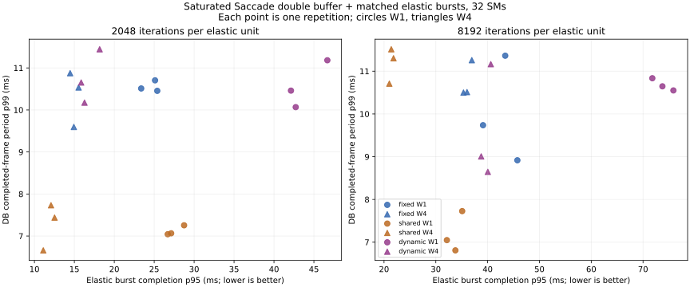

# #419 double-buffer mixed-workload routing frontier

<!-- doc-status: active -->
<!-- doc-promotion: none -->
<!-- doc-date: 2026-09-17 -->
<!-- doc-module: cross -->

> Revision 2 (2026-09-18) fixes the two harness limits named in [Limits](#limits)
> and re-declares the target: [resource_mixed_db_20260918.md](resource_mixed_db_20260918.md).
> Its finding 2 below (dynamic's in-service elastic completion worse than fixed)
> did not survive the lane fix; the stable-side findings reproduce.

## Decision

**Under the production double-buffer schedule, borrowing at verified DB
boundaries lends almost nothing while the pipeline is in service.** With a
saturated 16-SM stable partition, the controller's per-cycle open window is
**0.053–0.156 ms (p99)**, and the three timing repetitions of each dynamic
point admit only **20–93 borrowed units** during the 1.65–1.78 s service
horizon, out of 12,800 offered; **495 of 50,390** borrowed units across all
twelve dynamic timing runs were enqueued before the stable cutoff. The rest
executed after the last frame completed. Dynamic routing therefore matches
fixed reservation on every stable axis within repetition spread (DB fps ratio
0.932–1.056, stable p99 delta −2.737…+1.151 ms) and does not improve elastic
completion during service.

**The frozen 16.667 ms / 1% target is not a clean discriminator at 16 SMs.**
It was carried over from the serial study; DB decode-to-output latency at
16 SMs sits on the threshold. The unpressured 16-SM control passes **1/3**
repetitions (p99 14.674–17.106 ms); 16-SM policies pass **10/27**; the
32-SM shared pool passes **9/12**. Passes and misses at 16 SMs are separated
by tens of microseconds and must not be read as policy effects. No target
was changed after observing the sweep.

**The one place where partitioning is decisive is large units with a
four-unit window.** Shared 32-SM sharing then misses in all three repetitions
(stable p99 **20.461–21.679 ms**, 18–26 misses of 300), while fixed (p99
16.660–18.037 ms) and dynamic (15.300–17.811 ms) keep the tail near the
threshold. Everywhere else, sharing gives the best DB throughput
(228–273 fps versus 168–184) and lowest stable p99 (11.432–14.953 ms).

| Policy, 8192 / W4 | DB fps | Stable p99 ms | Frame period p99 ms | Burst p95 ms | Target passes |
|---|---:|---:|---:|---:|---:|
| fixed 16+16 | 169.7–180.5 | 16.660–18.037 | 10.500–11.257 | 35.338–36.949 | 1/3 |
| dynamic 16+16+borrow | 168.3–179.5 | 15.300–17.811 | 8.646–11.164 | 38.756–40.613 | 2/3 |
| shared 32 | 219.1–238.2 | 20.461–21.679 | 10.708–11.512 | 21.024–21.834 | 0/3 |
| control 16 (no elastic) | 179.7–183.6 | 14.674–17.106 | 8.222–10.681 | — | 1/3 |

Ranges span three repetition quantiles; they are not confidence intervals.
The [complete record](resource_mixed_db_20260917.json) retains every timing
and audited row, and the [independent audit](resource_mixed_db_20260917.audit.json)
checks the frozen contract, production completion periods and raw host/native
borrow intervals.

## What the frontier establishes

1. **The safe DB boundary leaves no lendable time at 16 SMs.** The controller
   synchronizes every owner stream after `track(N)` and the enqueued
   `detect(N+1)`, opens borrowing, and reclaims before the next admission.
   With a 5.4–6.3 ms completed-frame period the open window p99 is
   0.053–0.156 ms and the lease p99 (open plus drain) is 0.12–0.64 ms.
   Small units fit a few per cycle; 8192-iteration units barely fit one.
   Borrowed work enqueued during service is 0.16–0.73% of the offered load.
2. **Dynamic's in-service elastic completion is worse than fixed, and the
   harness construction explains the direction.** Burst p95 ratios versus
   fixed are 1.049–1.885. In this harness both policies own two elastic
   streams; in dynamic the second stream is the borrowed lane on the stable
   context, which is closed for almost the whole service window, so the
   elastic pool runs on one admission lane while fixed runs on two. This is a
   property of the frozen construction, verifiable from `run_point.py`, not a
   measured hardware cause. A descriptive rep-0 split of burst completion into
   bursts released before and after the last frame (not part of the sealed
   derivation) shows the gap concentrated in the in-service bursts: at 8192/W1
   median 66.1 ms dynamic versus 37.9 ms fixed before, 28.5 versus 30.3 after;
   at 8192/W4 the post-service medians are 16.0 ms dynamic versus 31.1 ms
   fixed, i.e. the lent partition does double elastic capacity once the
   stable side is idle.
3. **Elastic throughput is arrival-bound in this design and does not
   discriminate.** Fifty bursts at 100 ms span 4.9 s; the retained DB service
   horizon is 1.10–1.79 s. Every policy completes 22–36% of the offered units
   before the stable cutoff at 2,563–2,720 units/s, which is the arrival
   rate, and all policies finish all bursts at 4.906–4.933 s. The pair
   (DB fps, elastic units/s) therefore reduces to DB fps; burst completion
   latency is the only elastic axis this sweep resolves. The elastic load was
   copied from the serial contract without rescaling to the shorter DB
   horizon.
4. **Transition cost scales with unit size and is the reclaim cost the stable
   side pays every cycle.** Dynamic request-to-admission p99 is 0.114–0.347 ms
   for 2048-iteration units and 0.196–0.654 ms for 8192-iteration units; the
   largest observed value is 0.877 ms. Drain p99 at 8192/W4 is 0.558–0.581 ms.
   Fixed and shared show 0.042–0.143 ms on the same instrumented path with no
   borrowed stream to drain.
5. **Sharing loses the tail exactly where unit size and window interact.**
   Shared 32-SM at 8192/W4 has the best median (7.98–8.64 ms) and the worst
   p99 (20.461–21.679 ms); its frame-period std is 1.71–1.87 ms against
   0.69–1.04 ms for the partitioned policies. At 8192/W1 and both 2048 points
   sharing passes 3/3. The window, not only the unit size, determines
   whether normal-priority elastic streams can stretch high-priority stable
   frames on a shared context.

## Complete timing tables

Each cell is the range over three shuffled repetitions (seed 433). Stable
latency is decode-to-completed-output; frame period is between consecutive
completed outputs; fps is retained frames over the production interval.

| Point | Policy | DB fps | Stable p50 ms | Stable p99 ms | Period p99 ms | Misses / 300 | Burst p95 ms | Passes |
|---|---|---:|---:|---:|---:|---:|---:|---:|
| 2048 / W1 | fixed | 174.9–176.8 | 11.91–12.10 | 16.842–17.031 | 10.454–10.704 | 4, 4, 4 | 23.370–25.382 | 0/3 |
| 2048 / W1 | dynamic | 172.4–181.8 | 11.63–12.30 | 16.226–17.882 | 10.066–11.182 | 4, 9, 2 | 42.127–46.684 | 1/3 |
| 2048 / W1 | shared | 252.1–265.6 | 8.10–8.49 | 11.908–12.797 | 7.043–7.255 | 0, 3, 0 | 26.694–28.743 | 3/3 |
| 2048 / W4 | fixed | 168.1–181.4 | 11.61–12.74 | 15.764–18.756 | 9.596–10.875 | 2, 12, 8 | 14.473–15.530 | 1/3 |
| 2048 / W4 | dynamic | 171.3–179.7 | 11.72–12.29 | 16.429–18.205 | 10.174–11.444 | 5, 16, 2 | 15.854–18.169 | 1/3 |
| 2048 / W4 | shared | 244.3–273.1 | 7.84–8.65 | 11.432–13.515 | 6.659–7.732 | 0, 0, 1 | 11.108–12.523 | 3/3 |
| 8192 / W1 | fixed | 170.2–184.2 | 11.46–12.43 | 15.769–18.297 | 8.916–11.361 | 2, 3, 7 | 39.110–45.741 | 2/3 |
| 8192 / W1 | dynamic | 172.1–181.2 | 11.64–12.30 | 16.614–17.312 | 10.550–10.835 | 3, 6, 5 | 71.790–75.859 | 1/3 |
| 8192 / W1 | shared | 228.2–248.4 | 7.87–8.91 | 13.350–14.953 | 6.809–7.727 | 0, 1, 0 | 32.133–35.088 | 3/3 |
| 8192 / W4 | fixed | 169.7–180.5 | 11.69–12.49 | 16.660–18.037 | 10.500–11.257 | 12, 12, 3 | 35.338–36.949 | 1/3 |
| 8192 / W4 | dynamic | 168.3–179.5 | 11.72–12.60 | 15.300–17.811 | 8.646–11.164 | 0, 2, 9 | 38.756–40.613 | 2/3 |
| 8192 / W4 | shared | 219.1–238.2 | 7.98–8.64 | 20.461–21.679 | 10.708–11.512 | 23, 18, 26 | 21.024–21.834 | 0/3 |
| control | 16 SM, no elastic | 179.7–183.6 | 11.46–11.64 | 14.674–17.106 | 8.222–10.681 | 6, 5, 1 | — | 1/3 |

Paired same-repetition ratios, dynamic over the named policy:

| Point | Versus | Burst p95 ratio | Stable p99 delta ms | DB fps ratio | Period p99 ratio |
|---|---|---:|---:|---:|---:|
| 2048 / W1 | fixed | 1.702–1.839 | −0.805…+1.039 | 0.986–1.033 | 0.940–1.070 |
| 2048 / W1 | shared | 1.486–1.749 | +3.429…+5.974 | 0.652–0.721 | 1.387–1.588 |
| 2048 / W4 | fixed | 1.061–1.170 | −1.419…+0.934 | 0.991–1.019 | 0.936–1.110 |
| 2048 / W4 | shared | 1.347–1.451 | +2.914…+5.677 | 0.658–0.706 | 1.316–1.600 |
| 8192 / W1 | fixed | 1.569–1.885 | −0.985…+0.960 | 0.984–1.026 | 0.929–1.215 |
| 8192 / W1 | shared | 2.046–2.361 | +2.270…+3.492 | 0.693–0.777 | 1.402–1.563 |
| 8192 / W4 | fixed | 1.049–1.149 | −2.737…+1.151 | 0.932–1.056 | 0.800–1.063 |
| 8192 / W4 | shared | 1.843–1.871 | −6.379…−2.766 | 0.752–0.798 | 0.751–0.988 |

Dynamic borrowing during service, per timing run (three repetitions):

| Point | Borrowed enqueued before cutoff | Open window p99 ms | Transition p99 ms | Lease p99 ms |
|---|---:|---:|---:|---:|
| 2048 / W1 | 22, 22, 25 | 0.053–0.076 | 0.114–0.237 | 0.12–0.27 |
| 2048 / W4 | 20, 23, 35 | 0.141–0.152 | 0.259–0.347 | 0.26–0.35 |
| 8192 / W1 | 36, 42, 46 | 0.072–0.084 | 0.196–0.289 | 0.22–0.27 |
| 8192 / W4 | 64, 67, 93 | 0.123–0.156 | 0.571–0.654 | 0.58–0.64 |

## Question and evidence boundary

The [serial study](resource_mixed_20260916.md) showed temporal borrowing
works for the serial pipeline. This experiment asks whether the same
borrowing is useful under the production double-buffer schedule, where
`detect(N+1)` overlaps postprocess, GMC and tracking for frame N inside one
verified Green Context, and lending must wait for a boundary where no stable
GPU work is in flight.

The answer is bounded by the controller. The diagnostic boundary synchronizes
every owner stream once per frame for every policy, including fixed, shared
and the control, so all policies lose whatever asynchronous carry-over the
unconstrained production loop has between cycles. Comparisons across policies
share that cost; absolute DB fps here is not the production number and is not
compared with the [partition study](resource_partition_20260915.md).

The audited condition twins are the only runs with CUPTI attached; their
timing is retained but excluded from every table above. Timing runs and twins
share owner signatures (actual SM count, stream priorities, thread context
switches, `set_device` reasserts, probe placement, DB route class); matching
signatures do not prove identical internals for unaudited runs.

## Frozen comparison

The [harness contract](../../../scripts/benchmarks/resource_mixed_db/README.md)
was written before the pilot and not changed afterwards.

- One sequence, MOT17-04-SDP, 350 frames, 50 warmup, 300 retained,
  saturated arrivals. Target: stable p99 ≤ 16.667 ms and ≤ 1% misses.
- Fixed: stable 16 SM / elastic 16 SM. Shared: one 32-SM context, high-priority
  stable streams, two normal-priority elastic streams. Dynamic: the fixed
  split plus one elastic stream on the stable context, opened only at verified
  DB boundaries. Control: 16-SM DB with no elastic load.
- Elastic load: 50 bursts × 256 units at 100 ms, 256 blocks × 256 threads,
  2048 or 8192 dependent FP32 FMA iterations, window 1 or 4 per lane; every
  output equals CPU FP32 replay.
- Three shuffled repetitions, seed 433; one CUPTI-audited twin per condition
  before repetition zero's timing run. No point removed, no target adjusted.

## Validation and retained artifacts

`summarize.py` re-derives every row from raw records and rejects any hash,
schema, identity, coverage, twin-signature or MOT-output mismatch. `audit.py`
independently replays the frozen target, completion periods and host/native
borrow intervals. CUPTI placement and borrow/stable overlap are checked per
audited twin by `report.py` from context IDs, not kernel names.

- Main archive: `~/.local/state/saccade/perf/resource-419-mixed-db-20260917/`.
  No pilot archive exists; the first execution of the sealed contract is the
  retained sweep.
- Source snapshots, library hashes, input/model/native identities before and
  after, per-frame start/cycle/output timestamps, controller transitions and
  windows, per-unit records, per-block GPU stamps and 100-ms telemetry are
  retained in the archive.

## Limits

One sequence prefix, one interactive RTX 5070 Ti Laptop / WSL2 host, three
short repetitions; tail percentiles describe these runs only. The elastic
offered load outlasts the DB service horizon by roughly 3×, so burst
completion p95 mixes in-service and post-service bursts and elastic units/s
equals the arrival rate; a DB-scaled load is required before elastic
throughput can be compared. The stable target sits on the 16-SM DB latency
threshold and cannot separate 16-SM policies. The dynamic elastic pool has one
active admission lane during service against two for fixed and shared; that
confound is in the frozen construction and biases in-service burst completion
against dynamic. The controller boundary is not the production scheduler.
Telemetry is device-wide and cannot attribute SM utilization.

This study establishes that verified-boundary borrowing under the saturated
double-buffer schedule at 16 SMs has negligible lendable time and no
in-service elastic benefit, and that a 32-SM shared context loses the stable
tail at large-unit / window-4 load where partitions hold it. It cannot select
a production policy, prove hard real-time behaviour, or speak to lower stable
utilization, other sequences, memory-heavy elastic jobs or other hosts.
Umbrella issue #419 remains open.

## Final verification

- Full checksum and metric replay passed **52 runs / 24 paired comparisons**.
- **39 timing runs / 11,700 measured frames / 220 deadline misses**, plus
  **13 audited twins / 3,900 frames**; 460,800 verified elastic units in
  timing runs, 50,390 on the borrowed lane, 492 of them completed before the
  stable cutoff.
- All 52 MOT outputs are byte-identical. Input/model/native-library
  identities before and after are identical. Execution source HEAD:
  `208384c3f1f8d98af913e250be3e89a7630d3b1f` (harness commit on the same
  branch); archive snapshots match it.
- Audited traces contain **1,301,670 graph-launched kernels**; descriptive
  source coverage is 1,039,219 TensorRT, 199,850 native, 174,879 PyTorch,
  23,484 cuFFT and 3,900 nvJPEG. The four dynamic twins show **zero**
  borrowed/stable kernel overlaps. All measured stable kernels pass context
  checks.
- Maximum native/Python host clock bracket: **8.135 microseconds**.
- Ruff lint/format, generated script/test indexes, document master map,
  stale-path checks and `git diff --check` passed locally; not remote CI.
- **5 focused contract tests passed** (route absence, window linkage,
  completion-before-boundary, copy-audit boundary, valid replay).
