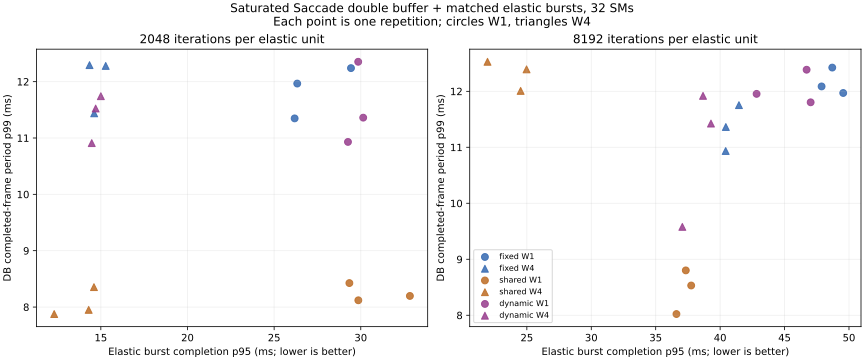

# #419 double-buffer mixed-workload routing frontier, revision 2 (matched lanes, DB-scaled load)

<!-- doc-status: active -->
<!-- doc-promotion: none -->
<!-- doc-date: 2026-09-18 -->
<!-- doc-module: cross -->

## Decision

**With the two construction limits of the [2026-09-17 study](resource_mixed_db_20260917.md)
removed, this sweep resolves no consistent stable or elastic penalty for
dynamic borrowing at verified double-buffer boundaries relative to fixed
reservation.** Three repetitions and descriptive ranges cannot establish
equivalence, and the contract declared no equivalence margin; the claim is
that no material difference was resolved at this resolution. Same-repetition
burst p95 ratios (dynamic over fixed) are **0.894–1.151** across the four
workload points, DB fps ratios **0.992–1.017**, and stable p99 deltas
**−5.374…+0.619 ms** (the −5.374 ms is one fixed repetition's stall, see
below). The borrowed lane admits **19–98 units per run** out of 5,120 offered
(0.4–1.9%), all of which complete before the stable cutoff; **531 of 184,320**
elastic units in the timing runs ran on the borrowed lane. The 09-17 result
that dynamic's in-service elastic completion was *worse* than fixed (burst p95
ratio 1.049–1.885) does not survive the lane fix: it was the one-lane-versus-two
construction, not borrowing.

**The DB-scaled load now measures only in-service behaviour.** Twenty bursts
at 50 ms release the last burst at 0.95 s; every timing run's service horizon
is 1.22–1.90 s; all 184,320 units complete by 0.960–0.999 s and **zero bursts
finish after the last frame** in any run. Elastic throughput before the cutoff
is therefore 5,120 units over the horizon (2,689–4,183 units/s) and is a
function of DB fps alone, as the contract predeclared; burst completion is the
elastic axis this sweep resolves.

**The re-declared 20 ms / 1% target separates the shared-context tail loss
from everything else.** Control passes **3/3**, 16-SM policies **23/24**,
shared 32 SM **9/12**; the only systematic failure is shared at 8192/W4
(**0/3**, p99 22.926–23.591 ms, 16–20 misses of 300), 2.9 ms beyond the
target, where fixed (18.241–18.988 ms) and dynamic (17.765–19.067 ms) hold.
The single other miss is one fixed 8192/W1 repetition with a 36.2 ms frame and
a 29.0 ms completion period (p99 24.855 ms, 7 misses); its two sibling
repetitions pass at 18.206 and 19.396 ms and no policy pattern explains it.
Everywhere else sharing still gives the best DB throughput (199.9–245.1 fps
versus 157.5–168.9) and the lowest stable p99 (13.332–16.273 ms).

| Policy, 8192 / W4 | DB fps | Stable p99 ms | Frame period p99 ms | Burst p95 ms | Late bursts | Target passes |
|---|---:|---:|---:|---:|---:|---:|
| fixed 16+16 | 159.7–166.4 | 18.241–18.988 | 10.934–11.753 | 40.431–41.461 | 0 | 3/3 |
| dynamic 16+16+borrow | 160.3–165.1 | 17.765–19.067 | 9.579–11.919 | 37.067–39.289 | 0 | 3/3 |
| shared 32 | 199.9–205.3 | 22.926–23.591 | 12.008–12.527 | 21.947–24.978 | 0 | 0/3 |
| control 16 (no elastic) | 162.4–169.9 | 18.180–19.122 | 11.226–11.906 | — | — | 3/3 |

Ranges span three repetition quantiles; they are not confidence intervals.
The [complete record](resource_mixed_db_20260918.json) retains every timing
and audited row, and the [independent audit](resource_mixed_db_20260918.audit.json)
checks the frozen contract, lane construction, production completion periods
and raw host/native borrow intervals.

## What changed from the 2026-09-17 study and why

The 09-17 document's Limits section named two harness constructions that had
to be fixed before any follow-up and said the target must be re-declared. This
revision changes exactly those three things and nothing else in the contract.

1. **Elastic load scaled to the DB horizon.** 50 bursts × 100 ms (4.9 s of
   arrivals against a 1.1–1.8 s service horizon) became 20 bursts × 50 ms
   (last release 0.95 s). `report.py` now fails closed if the last release
   falls after the stable cutoff and counts bursts that complete after the
   last frame instead of folding them into burst p95.
2. **Matched admission lanes.** Every elastic policy now owns the same two
   lanes on the elastic context; dynamic adds a third, borrowed lane on the
   stable context. On 09-17 dynamic's *second* lane was the borrowed lane, so
   the elastic pool ran on one admission lane during service against two for
   fixed and shared. The lane table is recorded per run and checked by both
   `report.py` and `audit.py`. The native engine (`elastic.cu`) was
   generalised to an explicit lane count and borrowed-lane index; the two-lane
   entry used by the sealed serial study is kept as a wrapper with the same
   behaviour, and that study's archive snapshots its own source.
3. **Target 20 ms / 1%.** Derived before the pilot from the 09-17 unpressured
   16-SM control (p99 14.674–17.106 ms): 20 ms cleared its worst repetition
   by more than the 2.4 ms repetition spread. Misses against 16.667 ms are
   still recorded as a descriptive column.

## What the revised frontier establishes

1. **No stable-side cost of borrowing is resolved at 16 SMs.** Dynamic's
   open window p99 is 0.077–0.210 ms per cycle and the lease (open plus
   drain) p99 0.26–0.82 ms; request-to-admission p99 is 0.229–0.805 ms
   against 0.040–0.170 ms for fixed and shared on the same instrumented path.
   DB fps ratio versus fixed is 0.992–1.017 and period p99 ratio 0.815–1.049.
2. **The lent time is real but small, and it lands where the 09-17 study
   said it would.** 531 borrowed units across twelve timing runs, every one
   enqueued and completed before the cutoff (the tail window after the last
   frame is recorded separately and admitted nothing that mattered here). Per
   run this is 0.4–1.9% of the offered load, most at 8192/W4 (72–98 units).
3. **With matched lanes, dynamic's elastic completion tracks fixed and is
   slightly better for large units.** Burst p95 ratio versus fixed is
   0.894–0.972 in all six 8192-iteration repetitions and 0.982–1.151 in the
   six 2048-iteration repetitions. Both directions are within one or two
   burst-lengths of the per-lane service time and no mechanism is attributed.
4. **Sharing still loses the tail exactly at 8192/W4 and only there.** Shared
   32-SM frame-period std is 2.24–2.36 ms at that point against 0.93–1.19 ms
   for the partitioned policies; at the other three points sharing passes
   9/9 with the best p99. The 09-17 pattern reproduces under the new load and
   target.
5. **Absolute numbers moved between the two days and are not comparable.**
   The 09-18 unpressured control ran 162.4–169.9 fps / p99 18.180–19.122 ms
   against 179.7–183.6 / 14.674–17.106 on 09-17, with the same median SM clock
   (2,647–2,662 MHz during the active window on both days), power
   (112–118 W) and temperature (max 63–66 °C) in the retained telemetry. The shift is host
   side and is not attributed; it also means today's control clears the 20 ms
   target by 0.9 ms rather than the 2.9 ms the derivation assumed, so 16-SM
   passes at 18–19.6 ms should not be read as comfortable. Only within-sweep
   paired comparisons carry.

## Complete timing tables

Each cell is the range over three shuffled repetitions (seed 433). Stable
latency is decode-to-completed-output; frame period is between consecutive
completed outputs; fps is retained frames over the production interval.
"Late bursts" counts bursts whose last unit completed after the final frame.

| Point | Policy | DB fps | Stable p50 ms | Stable p99 ms | Period p99 ms | Misses >20 / 300 | Misses >16.667 | Burst p95 ms | Burst max ms | Late bursts | Passes |
|---|---|---:|---:|---:|---:|---:|---:|---:|---:|---:|---:|
| 2048 / W1 | fixed | 163.3–167.7 | 12.69–13.05 | 18.565–19.071 | 11.348–12.240 | 0, 1, 0 | 10, 12, 14 | 26.184–29.435 | 29.818–36.313 | 0, 0, 0 | 3/3 |
| 2048 / W1 | dynamic | 162.4–168.2 | 12.68–13.22 | 17.943–19.257 | 10.931–12.353 | 0, 0, 1 | 9, 8, 14 | 29.261–30.140 | 31.375–34.340 | 0, 0, 0 | 3/3 |
| 2048 / W1 | shared | 235.7–245.1 | 8.81–9.30 | 13.332–14.355 | 8.120–8.425 | 0, 0, 0 | 0, 0, 0 | 29.342–32.834 | 31.418–33.095 | 0, 0, 0 | 3/3 |
| 2048 / W4 | fixed | 160.8–168.0 | 12.65–13.30 | 18.292–19.611 | 11.438–12.293 | 0, 3, 2 | 9, 15, 21 | 14.347–15.281 | 15.781–17.203 | 0, 0, 0 | 3/3 |
| 2048 / W4 | dynamic | 161.7–168.9 | 12.66–13.30 | 18.249–19.175 | 10.910–11.742 | 0, 0, 2 | 9, 12, 19 | 14.475–15.000 | 14.781–17.465 | 0, 0, 0 | 3/3 |
| 2048 / W4 | shared | 236.2–241.7 | 8.68–9.11 | 14.106–14.726 | 7.876–8.353 | 3, 0, 0 | 3, 0, 0 | 12.308–14.603 | 13.365–15.521 | 0, 0, 0 | 3/3 |
| 8192 / W1 | fixed | 157.5–166.7 | 12.80–13.43 | 18.206–24.855 | 11.970–12.424 | 0, 7, 0 | 12, 14, 18 | 47.874–49.553 | 48.285–51.292 | 0, 0, 0 | 2/3 |
| 8192 / W1 | dynamic | 160.3–165.5 | 12.90–13.35 | 18.311–19.481 | 11.804–12.385 | 0, 0, 1 | 9, 18, 12 | 42.830–47.025 | 44.303–51.434 | 0, 0, 0 | 3/3 |
| 8192 / W1 | shared | 205.0–210.9 | 9.15–9.59 | 15.997–16.273 | 8.022–8.802 | 0, 0, 0 | 2, 1, 3 | 36.610–37.754 | 39.071–42.292 | 0, 0, 0 | 3/3 |
| 8192 / W4 | fixed | 159.7–166.4 | 12.81–13.38 | 18.241–18.988 | 10.934–11.753 | 0, 0, 2 | 12, 9, 18 | 40.431–41.461 | 41.561–41.793 | 0, 0, 0 | 3/3 |
| 8192 / W4 | dynamic | 160.3–165.1 | 12.83–13.40 | 17.765–19.067 | 9.579–11.919 | 1, 1, 0 | 14, 12, 7 | 37.067–39.289 | 39.085–40.293 | 0, 0, 0 | 3/3 |
| 8192 / W4 | shared | 199.9–205.3 | 8.82–9.23 | 22.926–23.591 | 12.008–12.527 | 16, 20, 18 | 36, 38, 37 | 21.947–24.978 | 22.087–25.409 | 0, 0, 0 | 0/3 |
| control | 16 SM, no elastic | 162.4–169.9 | 12.58–13.02 | 18.180–19.122 | 11.226–11.906 | 0, 3, 0 | 7, 8, 11 | — | — | — | 3/3 |

Paired same-repetition ratios, dynamic over the named policy:

| Point | Versus | Burst p95 ratio | Stable p99 delta ms | DB fps ratio | Period p99 ratio |
|---|---|---:|---:|---:|---:|
| 2048 / W1 | fixed | 1.014–1.151 | −0.621…+0.185 | 0.995–1.003 | 0.913–1.009 |
| 2048 / W1 | shared | 0.891–1.017 | +3.588…+5.353 | 0.681–0.689 | 1.334–1.466 |
| 2048 / W4 | fixed | 0.982–1.009 | −1.053…−0.043 | 1.000–1.007 | 0.887–1.007 |
| 2048 / W4 | shared | 1.012–1.194 | +3.522…+4.965 | 0.682–0.699 | 1.372–1.463 |
| 8192 / W1 | fixed | 0.895–0.959 | −5.374…+0.106 | 0.992–1.017 | 0.986–0.997 |
| 8192 / W1 | shared | 1.170–1.251 | +2.038…+3.484 | 0.782–0.786 | 1.383–1.490 |
| 8192 / W4 | fixed | 0.894–0.972 | −1.222…+0.619 | 0.992–1.004 | 0.815–1.049 |
| 8192 / W4 | shared | 1.573–1.689 | −5.710…−3.858 | 0.802–0.805 | 0.765–0.993 |

Dynamic borrowing during service, per timing run (three repetitions). With
the DB-scaled load every borrowed unit was both enqueued and completed before
the stable cutoff, so the two counts coincide:

| Point | Borrowed enqueued before cutoff | Borrowed total | Open window p99 ms | Transition p99 ms | Lease p99 ms |
|---|---:|---:|---:|---:|---:|
| 2048 / W1 | 19, 19, 26 | 19, 19, 26 | 0.082–0.092 | 0.268–0.805 | 0.30–0.82 |
| 2048 / W4 | 48, 27, 28 | 48, 27, 28 | 0.148–0.210 | 0.309–0.395 | 0.35–0.40 |
| 8192 / W1 | 42, 35, 29 | 42, 35, 29 | 0.085–0.103 | 0.229–0.383 | 0.26–0.41 |
| 8192 / W4 | 88, 98, 72 | 88, 98, 72 | 0.077–0.192 | 0.583–0.748 | 0.62–0.76 |

## Question and evidence boundary

The question is unchanged from the [09-17 study](resource_mixed_db_20260917.md):
is borrowing at a safe double-buffer boundary useful when `detect(N+1)`
overlaps postprocess, GMC and tracking for frame N inside one verified Green
Context? That study could not answer the elastic half because its load
outlasted the service horizon and its dynamic pool had one admission lane.
This revision answers it under the same controller boundary, which
synchronizes every owner stream once per frame for every policy, including
fixed, shared and the control. Absolute DB fps here is not the production
number and is not compared with the [partition study](resource_partition_20260915.md).

The audited condition twins are the only runs with CUPTI attached; their
timing is retained but excluded from every table above. Timing runs and twins
share owner signatures (actual SM count, stream priorities, thread context
switches, `set_device` reasserts, probe placement, DB route class); matching
signatures do not prove identical internals for unaudited runs.

## Frozen comparison

The [harness contract](../../../scripts/benchmarks/resource_mixed_db/README.md)
(v2, 2026-09-18) was written before the pilot and not changed afterwards.

- One sequence, MOT17-04-SDP, 350 frames, 50 warmup, 300 retained,
  saturated arrivals. Target: stable p99 ≤ 20 ms and ≤ 1% misses.
- Fixed: stable 16 SM / elastic 16 SM, two elastic lanes. Shared: one 32-SM
  context, high-priority stable streams, two normal-priority elastic lanes.
  Dynamic: the fixed split plus a third, borrowed lane on the stable context,
  opened only at verified DB boundaries. Control: 16-SM DB with no elastic load.
- Elastic load: 20 bursts × 256 units at 50 ms, 256 blocks × 256 threads,
  2048 or 8192 dependent FP32 FMA iterations, window 1 or 4 per lane; every
  output equals CPU FP32 replay; last release must precede the stable cutoff.
- Three shuffled repetitions, seed 433; one CUPTI-audited twin per condition
  before repetition zero's timing run. No point removed, no target adjusted.

## Validation and retained artifacts

`summarize.py` re-derives every row from raw records and rejects any hash,
schema, identity, coverage, twin-signature or MOT-output mismatch. `audit.py`
independently replays the frozen target, lane construction, completion
periods and host/native borrow intervals. CUPTI placement and borrow/stable
overlap are checked per audited twin by `report.py` from context IDs, not
kernel names.

- Main archive: `~/.local/state/saccade/perf/resource-419-mixed-db-20260918/`.
- Pilot archive (one repetition, fixed and dynamic at 8192/W4 plus control,
  run to confirm the new checks pass on real data; not part of the sealed
  derivation): `~/.local/state/saccade/perf/resource-419-mixed-db-pilot-20260918/`.
- Source snapshots, library hashes, input/model/native identities before and
  after, per-frame start/cycle/output timestamps, controller transitions and
  windows, lane table, per-unit records, per-block GPU stamps and 100-ms
  telemetry are retained in the archive.

## Limits

One sequence prefix, one interactive RTX 5070 Ti Laptop / WSL2 host, three
short repetitions; tail percentiles describe these runs only. The host ran
7–10% slower than on 09-17 at identical GPU clocks, so the 20 ms target's
margin over the unpressured control is 0.9 ms here rather than the 2.9 ms it
was derived with; passes and misses at 16 SMs are separated by about 1 ms and
should not be read as policy effects, while the shared 8192/W4 miss is 2.9 ms
beyond the target in all three repetitions. Elastic throughput is
arrival-bound by construction and does not discriminate; only burst
completion does. Small-unit dynamic completion ranges from 2% faster to 15% slower
than fixed and large-unit is 3–11% faster; no mechanism is attributed to
either. The controller
boundary is not the production scheduler. Telemetry is device-wide and cannot
attribute SM utilization. The one fixed 8192/W1 stall is recorded, not
explained.

This revision establishes that, once the load fits the service horizon and
the policies own matched admission lanes, verified-boundary borrowing under
the saturated double-buffer schedule at 16 SMs tracks fixed reservation
within the observed sweep on stable and elastic axes (no consistent penalty
resolved; not an equivalence result), lends 0.4–1.9% of the offered load,
and that a 32-SM shared context still loses the stable tail only at large-unit
window-4 load. It cannot select a production policy, prove hard real-time
behaviour, or speak to lower stable utilization, other sequences, memory-heavy
elastic jobs or other hosts. Umbrella issue #419 remains open.

## Final verification

- Full checksum and metric replay passed **52 runs / 24 paired comparisons**.
- **39 timing runs / 11,700 measured frames / 81 deadline misses (>20 ms)**,
  plus **13 audited twins / 3,900 frames**; 184,320 verified elastic units in
  timing runs, all completed before the stable cutoff, 531 on the borrowed
  lane, all 531 completed before the cutoff.
- All 52 MOT outputs are byte-identical. Input/model/native-library
  identities before and after are identical. Execution source HEAD:
  `482145fa4327e8749f7538d9689a19f1c5031334` (harness commit on the same
  branch); archive snapshots match it.
- Audited traces contain **1,301,508 graph-launched kernels**; descriptive
  source coverage is 1,039,079 TensorRT, 199,833 native, 174,879 PyTorch,
  23,479 cuFFT and 3,900 nvJPEG. The four dynamic twins show **zero**
  borrowed/stable kernel overlaps. All measured stable kernels pass context
  checks. All 12 diagnostic evidence copies occur ≥ 2,434 ms after stable
  completion.
- Maximum native/Python host clock bracket: **9.318 microseconds**.
- **9 focused contract tests passed** (route absence, window linkage,
  completion-before-boundary, copy-audit boundary, valid replay, lane table,
  borrowed-SM membership, late release rejected, late completion counted).
