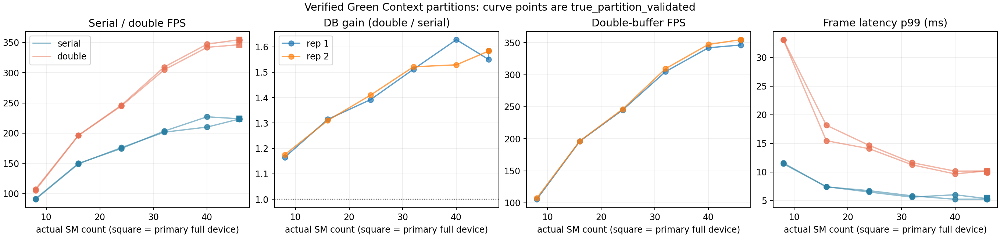

# #419 phase B — full pipeline inside verified Green Context SM partitions

<!-- doc-status: active -->
<!-- doc-promotion: none -->
<!-- doc-date: 2026-09-15 -->
<!-- doc-module: cross -->

## Scope and interpretation

This is the phase-B execution record for [#419](https://github.com/raylei50653/saccade/issues/419).
Phase A ([resource_sensitivity_20260915.md](resource_sensitivity_20260915.md))
delivered the paired serial/double-buffer measurement surface, showed that the
bounded residency-pressure proxy cannot be read as available-SM scaling, and
showed that `cuCtxSetCurrent(cuCtxFromGreenCtx(...))` alone does not route
ordinary PyTorch streams. Phase B routes the **entire** production pipeline —
GPU JPEG decode, TensorRT detector, PyTorch ops, native tracker kernels, the
double-buffer detector lane, and every CUDA graph launch — into one CUDA Green
Context per point, proves that routing per point with a CUPTI activity trace,
and measures serial/double-buffer throughput, frame latency, completion period
and jitter against the **context-reported** SM count.

It answers true execution-resource scaling only. It does **not** claim
deterministic latency, MIG-equivalent isolation, an edge-device result, or a
mechanism (occupancy, clocks, scheduler, cache, power) for the observed curve.
Detector/tracker spatial reservation (D/T split) is left to the next phase.
Production presets, defaults and sources are unchanged; every routing change
lives in the diagnostic owner. #419 stays open.

## Reproduction and frozen scope

```bash
.venv/bin/python scripts/benchmarks/resource_partition/sweep.py \
  --output /absolute/new/resource-419-partition \
  --preset mamba_whole_graph_m --sequences MOT17-04-SDP \
  --levels full 46 40 32 24 16 8 --repeats 2 --max-frames 300
.venv/bin/python scripts/benchmarks/resource_partition/report.py \
  /absolute/new/resource-419-partition \
  --proxy-record docs/reference/benchmarks/resource_sensitivity_20260915.json \
  --json-output resource_partition_20260915.json --markdown-output tables.md
```

The [harness README](../../../scripts/benchmarks/resource_partition/README.md)
defines the owner, the fail-closed checks, timing and artifacts. Every table
below is generated by `report.py` from `summary.json`; nothing is hand-copied.

| Axis | Recorded scope |
|---|---|
| Runtime source | `7109a110df7995b2d818aaf822d591ec75451933` (main after #426); the `resource_partition/` scripts are local changes whose SHA-256 is in `sweep.json` and whose exact copies are in `execution_sources/` |
| Device | RTX 5070 Ti Laptop, 46 SM, 12 GiB, WSL2; NVIDIA-SMI 615.71.09 / KMD 616.56; CUDA UMD 13.4; nvcc 13.4; CUPTI 2026.3.0; torch 2.11.0+cu130; TensorRT 10.16.1.11; cuda-bindings 13.2.0 |
| Workload | `mamba_whole_graph_m`, MOT17-04-SDP frames 1–300, warmup 1–50, `--detect-barrier event`, default GPU (nvJPEG) decode; double mode adds `--double-buffer` |
| Budgets | Requested 8/16/24/32/40/46 SM Green Contexts plus `full` (primary context routed through the same owner); the device reports minimum partition 8, alignment 8, and rounds requests up (12→16, 20→24, 44→46); 48 is rejected |
| Repetitions | 2, levels shuffled per repetition (`--seed 419`), mode order alternating; every point run twice: audited twin (CUPTI on) then measurement (CUPTI off), identical commands |
| Samples | 250 frame-latency and 249 completion-period samples per run; 28 measurement runs + 28 audited twins |
| Tracker-stage latency | Unobserved on this non-profiling path; reported `null`, never substituted |
| Telemetry | 100 ms `nvidia-smi` samples; only samples inside measured completion windows are summarized (7–27 per run) |
| Local raw archive | `~/.local/state/saccade/perf/resource-419-partition-20260915/` (216 MB incl. 28 CUPTI traces), `SHA256SUMS` verified |

The sequence prefix is a capability/scaling characterization, not the
seven-sequence headline benchmark; full-sequence GT metrics on this prefix are
not quality estimates. Two repetitions cannot resolve rare tails. No deadline
was specified, so no deadline-miss claim is made.

## Execution owner and what it proves

`scripts/benchmarks/resource_partition/green_owner.py` installs before any
Saccade import and owns the Green Context, every `torch.cuda.Stream()` (an
`ExternalStream` subclass whose handle comes from `cuGreenCtxStreamCreate`),
the main/default stream, the current context on the main thread and on every
thread started afterwards, and — because the double-buffer lane, graph capture
streams and TensorRT's `execute_async_v3(current_stream)` all obtain their
stream through those two entry points — the detector lane, the graph capture
context and the TensorRT execution stream. Native tracker kernels receive the
current owned stream explicitly; their NULL-stream `cudaMemset`/`cudaMemcpy`
calls inherit the current Green Context.

Three facts measured on this host during integration shaped the owner and are
re-verified per run:

1. **A CUDA graph executes in the context of its capture stream, not its
   replay stream.** An SM-id probe captured on a Green stream and replayed on a
   primary pool stream still ran on the partition's SMs, and vice versa.
   Every capture in the pipeline therefore has to happen on an owned stream,
   which the `torch.cuda.Stream` replacement guarantees and the probe checks.
2. **TorchInductor-generated code calls `torch.cuda.set_device(0)` on every
   compiled call, and `cudaSetDevice` reverts the thread's current context to
   the primary context.** Ordinary tensor ops, device guards, `.to()`, events
   and `ExternalStream` creation do not. Before the owner wrapped `set_device`,
   the first frame's tracker-side `cudaMemset`/`cudaMemcpy` on the NULL stream
   landed in the primary context (1 memset, 5 copies; 0 kernels) and the run
   was correctly rejected. With the re-assertion (5 per run) nothing escapes.
3. **`cudaStreamCreate` under a current Green Context returns a Green
   stream**, so runtime-internal streams (nvJPEG, TensorRT) follow the current
   context; pre-existing PyTorch pool streams do not, which is why the pool is
   never used.

Verification is two independent checks per audited run, both required:

- **SM-id probe**: 4096 resident spin blocks on the owned main stream, directly
  and through a captured graph, before and after the evaluation, reached
  exactly the context-reported SM count at every budget (`8/8→8/8` … `46/46→46/46`).
- **CUPTI activity audit**: 111,539–111,862 kernel records per sequence window
  (first frame's latency start to last completion), **100% in the Green
  Context** at every budget, including 99,867–99,890 graph-launched kernels;
  0 escaped kernels, 0 escaped memsets, 0 dropped records. The kernel-name
  heuristic shows the coverage in one serial window: 80,864 TensorRT, 15,412
  native tracker/GMC, 13,161 PyTorch (`at::native`), 1,800 cuFFT (GMC
  cross-power spectrum) and 304 nvJPEG kernels. Records before the first frame
  (model loading) were also all inside the owned context.

A measurement row is `true_partition_validated` only when its own owner checks
pass, its audited twin passes every check, and the twin is consistent with it
(byte-identical output, equal owned-stream count, thread switches,
`set_device` re-assertions, actual SM count and double-buffer route). All 24
Green Context measurement rows validated; the 4 `full` rows are
`routing_validated` but, being the whole device, are never a partition.
`resource_partition_20260915.json` retains `true_partition_validated`,
`actual_sm_count` and `routing_verification` per row.

The audit itself costs throughput (measurement/twin FPS 1.02–1.18, mean 1.09,
serial more than double), which is why the timing rows come from the
unaudited measurement run rather than the audited one.

## Results

**Result: the full pipeline is correctly encapsulated by a Green Context at
every creatable budget, and the double-buffer gain declines smoothly with the
actual SM count rather than collapsing at a knee.** Outcome A of the phase-B
plan applies. Relative to the mean full-device gain of 1.567, the retained
fraction of the DB gain `(gain − 1) / (1.567 − 1)` is 0.30 at 8 SMs, 0.55 at
16, 0.71 at 24, 0.91 at 32 and ≈1.0 at 40 and 46. Serial throughput per SM
falls monotonically (11.4 → 4.9 FPS/SM from 8 to 46 SMs) and serial FPS is
within 10% of full-device above 32 SMs, while double-buffer FPS keeps rising
to 40 SMs and is within 2% of full-device only from 40 SMs. The 46-SM Green
Context and the primary full-device baseline are indistinguishable at this
resolution (223 vs 224 serial FPS; 354 vs 346–355 DB FPS). All 56 MOT
outputs (measurements and twins) are byte-identical to each other and to
phase A's SHA-256 `10a1537ef165cd909b1503720b9a9a0278922982cba16a2317f68131bc5fddd5`;
this is an observation on this prefix, not a determinism proof.



### Throughput and paired DB gain per verified budget

| Actual SMs | Rep | Serial FPS | DB FPS | DB gain | Serial rel. to 46 (primary) | DB rel. to 46 (primary) | Validated |
|---|---:|---:|---:|---:|---:|---:|---|
| 8 (green) | 1 | 90.64 | 105.61 | 1.165 | 0.406 | 0.305 | yes |
| 8 (green) | 2 | 91.36 | 107.38 | 1.175 | 0.408 | 0.303 | yes |
| 16 (green) | 1 | 149.22 | 196.12 | 1.314 | 0.668 | 0.566 | yes |
| 16 (green) | 2 | 149.93 | 196.39 | 1.310 | 0.669 | 0.554 | yes |
| 24 (green) | 1 | 176.02 | 245.04 | 1.392 | 0.788 | 0.708 | yes |
| 24 (green) | 2 | 174.61 | 246.17 | 1.410 | 0.780 | 0.694 | yes |
| 32 (green) | 1 | 201.63 | 304.78 | 1.512 | 0.903 | 0.880 | yes |
| 32 (green) | 2 | 203.39 | 309.39 | 1.521 | 0.908 | 0.873 | yes |
| 40 (green) | 1 | 210.07 | 341.98 | 1.628 | 0.940 | 0.988 | yes |
| 40 (green) | 2 | 227.09 | 347.22 | 1.529 | 1.014 | 0.979 | yes |
| 46 (primary) | 1 | 223.39 | 346.31 | 1.550 | 1.000 | 1.000 | n/a (baseline) |
| 46 (green) | 1 | 223.18 | 353.55 | 1.584 | 0.999 | 1.021 | yes |
| 46 (primary) | 2 | 223.98 | 354.56 | 1.583 | 1.000 | 1.000 | n/a (baseline) |
| 46 (green) | 2 | 223.76 | 354.61 | 1.585 | 0.999 | 1.000 | yes |

The two 40-SM serial repetitions differ by 8% (210 vs 227 FPS) with a wider
period σ in the first (0.54 vs 0.34 ms); both are retained and neither is
averaged away. Every other budget's repetitions agree within 2%.

### Same-run latency, period and jitter (ms; p50 / p95 / p99)

Period σ is the population standard deviation of **completion intervals**,
not of frame latency.

| Actual SMs | Rep | Mode | Frame latency | Period | Period σ |
|---|---:|---|---|---|---:|
| 8 (green) | 1 | double | 19.92 / 25.97 / 33.10 | 9.16 / 10.67 / 22.36 | 2.98 |
| 8 (green) | 1 | serial | 10.09 / 10.94 / 11.43 | 10.99 / 11.80 / 12.16 | 0.41 |
| 8 (green) | 2 | double | 19.87 / 26.21 / 33.07 | 9.14 / 10.19 / 22.53 | 2.56 |
| 8 (green) | 2 | serial | 9.97 / 10.84 / 11.57 | 10.86 / 11.68 / 12.40 | 0.39 |
| 16 (green) | 1 | double | 11.00 / 14.34 / 18.17 | 4.97 / 5.58 / 11.97 | 1.20 |
| 16 (green) | 1 | serial | 6.05 / 6.91 / 7.43 | 6.61 / 7.46 / 7.99 | 0.35 |
| 16 (green) | 2 | double | 10.97 / 13.67 / 15.46 | 4.96 / 5.75 / 9.23 | 0.91 |
| 16 (green) | 2 | serial | 6.02 / 6.65 / 7.41 | 6.59 / 7.17 / 7.94 | 0.31 |
| 24 (green) | 1 | double | 8.72 / 12.76 / 14.64 | 3.94 / 4.55 / 9.99 | 1.19 |
| 24 (green) | 1 | serial | 5.12 / 5.86 / 6.50 | 5.61 / 6.35 / 6.95 | 0.33 |
| 24 (green) | 2 | double | 8.75 / 11.97 / 14.07 | 3.93 / 4.74 / 9.25 | 1.01 |
| 24 (green) | 2 | serial | 5.12 / 6.03 / 6.74 | 5.61 / 6.51 / 7.17 | 0.38 |
| 32 (green) | 1 | double | 7.12 / 10.24 / 11.63 | 3.15 / 3.92 / 7.79 | 0.88 |
| 32 (green) | 1 | serial | 4.44 / 5.27 / 5.61 | 4.88 / 5.67 / 6.03 | 0.34 |
| 32 (green) | 2 | double | 6.96 / 10.27 / 11.25 | 3.11 / 3.74 / 7.69 | 0.85 |
| 32 (green) | 2 | serial | 4.38 / 5.04 / 5.83 | 4.83 / 5.48 / 6.31 | 0.36 |
| 40 (green) | 1 | double | 6.40 / 9.42 / 10.15 | 2.80 / 3.64 / 6.79 | 0.74 |
| 40 (green) | 1 | serial | 4.18 / 5.61 / 6.02 | 4.63 / 6.09 / 6.47 | 0.54 |
| 40 (green) | 2 | double | 6.24 / 9.00 / 9.66 | 2.77 / 3.60 / 6.43 | 0.72 |
| 40 (green) | 2 | serial | 3.87 / 4.54 / 5.24 | 4.31 / 5.00 / 5.68 | 0.34 |
| 46 (green) | 1 | double | 6.15 / 9.03 / 9.83 | 2.71 / 3.55 / 6.31 | 0.74 |
| 46 (green) | 1 | serial | 4.01 / 4.53 / 5.23 | 4.42 / 4.95 / 5.65 | 0.29 |
| 46 (green) | 2 | double | 6.20 / 9.05 / 10.20 | 2.72 / 3.33 / 6.57 | 0.75 |
| 46 (green) | 2 | serial | 4.00 / 4.68 / 5.25 | 4.39 / 5.12 / 5.65 | 0.31 |
| 46 (primary) | 1 | double | 6.35 / 8.97 / 10.17 | 2.75 / 3.64 / 6.76 | 0.76 |
| 46 (primary) | 1 | serial | 3.99 / 4.68 / 5.34 | 4.40 / 5.17 / 5.77 | 0.33 |
| 46 (primary) | 2 | double | 6.14 / 9.18 / 10.01 | 2.69 / 3.41 / 6.59 | 0.77 |
| 46 (primary) | 2 | serial | 3.94 / 4.82 / 5.52 | 4.35 / 5.24 / 5.94 | 0.39 |

Double buffering trades latency for period at every budget, and the trade
worsens as the budget shrinks: the double/serial frame-p99 ratio is 1.7–1.9 at
40–46 SMs, 1.9–2.1 at 32, 2.1–2.4 at 16–24 and 2.9 at 8 SMs, where DB frame
p99 reaches 33 ms against 11.5 ms serial while DB period p99 (22.4 ms) also
exceeds serial period p99 (12.2 ms). Serial period σ stays 0.3–0.4 ms at every
budget except the first 40-SM repetition; DB period σ grows from 0.7 ms
(40–46 SMs) to 2.6–3.0 ms (8 SMs).

### Routing verification per measured point

| Point | Owned streams | Thread switches | set_device re-asserts | Probe SMs (direct/graph, before→after) | Twin kernels in ctx / total | Twin graph kernels | Twin escapes | Output = twin | Validated |
|---|---:|---:|---:|---|---:|---:|---:|---|---|
| `r0_sm8_double` | 7 | 3 | 5 | 8/8→8/8 | 111862 / 111862 | 99890 | 0 | yes | yes |
| `r0_sm8_serial` | 7 | 3 | 5 | 8/8→8/8 | 111539 / 111539 | 99867 | 0 | yes | yes |
| `r1_sm8_double` | 7 | 3 | 5 | 8/8→8/8 | 111862 / 111862 | 99890 | 0 | yes | yes |
| `r1_sm8_serial` | 7 | 3 | 5 | 8/8→8/8 | 111540 / 111540 | 99868 | 0 | yes | yes |
| `r0_sm16_double` | 7 | 3 | 5 | 16/16→16/16 | 111862 / 111862 | 99890 | 0 | yes | yes |
| `r0_sm16_serial` | 7 | 3 | 5 | 16/16→16/16 | 111540 / 111540 | 99868 | 0 | yes | yes |
| `r1_sm16_double` | 7 | 3 | 5 | 16/16→16/16 | 111862 / 111862 | 99890 | 0 | yes | yes |
| `r1_sm16_serial` | 7 | 3 | 5 | 16/16→16/16 | 111541 / 111541 | 99869 | 0 | yes | yes |
| `r0_sm24_double` | 7 | 3 | 5 | 24/24→24/24 | 111862 / 111862 | 99890 | 0 | yes | yes |
| `r0_sm24_serial` | 7 | 3 | 5 | 24/24→24/24 | 111541 / 111541 | 99869 | 0 | yes | yes |
| `r1_sm24_double` | 7 | 3 | 5 | 24/24→24/24 | 111862 / 111862 | 99890 | 0 | yes | yes |
| `r1_sm24_serial` | 7 | 3 | 5 | 24/24→24/24 | 111540 / 111540 | 99868 | 0 | yes | yes |
| `r0_sm32_double` | 7 | 3 | 5 | 32/32→32/32 | 111862 / 111862 | 99890 | 0 | yes | yes |
| `r0_sm32_serial` | 7 | 3 | 5 | 32/32→32/32 | 111552 / 111552 | 99880 | 0 | yes | yes |
| `r1_sm32_double` | 7 | 3 | 5 | 32/32→32/32 | 111862 / 111862 | 99890 | 0 | yes | yes |
| `r1_sm32_serial` | 7 | 3 | 5 | 32/32→32/32 | 111541 / 111541 | 99869 | 0 | yes | yes |
| `r0_sm40_double` | 7 | 3 | 5 | 40/40→40/40 | 111862 / 111862 | 99890 | 0 | yes | yes |
| `r0_sm40_serial` | 7 | 3 | 5 | 40/40→40/40 | 111542 / 111542 | 99870 | 0 | yes | yes |
| `r1_sm40_double` | 7 | 3 | 5 | 40/40→40/40 | 111862 / 111862 | 99890 | 0 | yes | yes |
| `r1_sm40_serial` | 7 | 3 | 5 | 40/40→40/40 | 111540 / 111540 | 99868 | 0 | yes | yes |
| `r0_sm46_double` | 7 | 3 | 5 | 46/46→46/46 | 111862 / 111862 | 99890 | 0 | yes | yes |
| `r0_sm46_serial` | 7 | 3 | 5 | 46/46→46/46 | 111542 / 111542 | 99870 | 0 | yes | yes |
| `r1_sm46_double` | 7 | 3 | 5 | 46/46→46/46 | 111862 / 111862 | 99890 | 0 | yes | yes |
| `r1_sm46_serial` | 7 | 3 | 5 | 46/46→46/46 | 111541 / 111541 | 99869 | 0 | yes | yes |
| `r0_smfull_double` | 7 | 3 | 5 | 46/46→46/46 | 111862 / 111862 | 99890 | 0 | yes | baseline |
| `r0_smfull_serial` | 7 | 3 | 5 | 46/46→46/46 | 111541 / 111541 | 99869 | 0 | yes | baseline |
| `r1_smfull_double` | 7 | 3 | 5 | 46/46→46/46 | 111862 / 111862 | 99890 | 0 | yes | baseline |
| `r1_smfull_serial` | 7 | 3 | 5 | 46/46→46/46 | 111543 / 111543 | 99871 | 0 | yes | baseline |

Both modes create 7 owned streams per run, all on the main thread (the
registry with handles is in each `partition_point.json`); in double mode the
detector lane's handle is recorded per sequence and verified to be one of them
and of the owned class. Serial kernel totals vary by 1–13 kernels between runs;
the double totals are identical across runs. The cause of the serial variation
was not investigated.

### Sampled telemetry inside measured windows (ranges of per-run means)

| Actual SMs | Mean power (W) | Mean SM clock (MHz) | Mean GPU utilization (%) | Samples per run |
|---|---:|---:|---:|---|
| 8 (green) | 93.6–99.7 | 2651.3–2722.9 | 89.0–99.2 | 23–27 |
| 16 (green) | 104.3–119.6 | 2417.2–2648.8 | 83.3–98.5 | 12–17 |
| 24 (green) | 109.7–133.3 | 2370.0–2659.3 | 79.8–98.0 | 9–14 |
| 32 (green) | 112.0–139.0 | 2261.9–2495.3 | 74.7–96.7 | 7–12 |
| 40 (green) | 109.5–141.5 | 2105.1–2541.6 | 71.6–91.6 | 7–12 |
| 46 (green) | 107.2–140.1 | 2100.9–2557.5 | 71.3–93.4 | 7–11 |
| 46 (primary) | 114.2–140.4 | 2042.7–2482.9 | 72.5–87.4 | 7–11 |

Mean SM clock is higher at small budgets (≈2.65–2.72 GHz at 8 SMs versus
≈2.10–2.56 GHz at 40–46 SMs) and power is lower. The per-SM throughput
numbers above therefore mix an SM-count effect with a clock effect that this
study did not hold fixed; no clock, power or scheduler mechanism is inferred.
Windows of 0.7–2.8 s hold only 7–27 telemetry samples.

## Proxy versus true partition

| Surface | Setting | Serial FPS (mean of reps) | DB FPS (mean) | DB gain (mean) |
|---|---|---:|---:|---:|
| proxy 5 ms pulses | K=0 | 213.73 | 336.04 | 1.572 |
| proxy 5 ms pulses | K=8 | 5.73 | 5.88 | 1.027 |
| proxy 5 ms pulses | K=16 | 5.53 | 5.72 | 1.035 |
| proxy 5 ms pulses | K=24 | 5.25 | 5.21 | 0.993 |
| proxy 5 ms pulses | K=32 | 5.19 | 5.02 | 0.969 |
| true partition | 46 SM (green) | 223.47 | 354.08 | 1.584 |
| true partition | 46 SM (primary) | 223.68 | 350.43 | 1.567 |
| true partition | 40 SM (green) | 218.58 | 344.60 | 1.578 |
| true partition | 32 SM (green) | 202.51 | 307.08 | 1.516 |
| true partition | 24 SM (green) | 175.32 | 245.60 | 1.401 |
| true partition | 16 SM (green) | 149.58 | 196.26 | 1.312 |
| true partition | 8 SM (green) | 91.00 | 106.49 | 1.170 |

The phase-A proxy is severely distorted as an SM-budget surrogate: with K=8
residency blocks the pipeline ran at 5.7 FPS and DB gain ≈1.03, whereas a real
8-SM partition runs at 91 FPS with DB gain 1.17; the proxy's flat ≈1.0 gain
across K=8…32 does not exist under true partitioning (1.17 → 1.52). The two
surfaces do not measure the same quantity and the proxy curve should not be
cited for SM scaling. Its own qualification (waveform and synchronization
dependence) stands as recorded in phase A.

## Reading against the #419 decision rules

- **Graceful scaling versus knee.** DB gain declines smoothly and
  monotonically with actual SM count (1.58 → 1.52 → 1.40 → 1.31 → 1.17 from
  46 to 8 SMs) and does not collapse to 1 at any creatable budget. There is no
  measurable concurrency knee in DB gain on this 8-SM-aligned grid; a knee
  below 8 SMs, or between grid points, cannot be excluded by this data.
- **Where the headroom lies.** Serial throughput saturates first (within 10%
  of full-device from 32 SMs), double-buffer throughput later (within 2% only
  from 40 SMs). Roughly half of the full-device DB gain survives at 16 SMs and
  about 30% at 8 SMs, so double buffering does not *require* high SM
  headroom, but most of its benefit is realized only above ≈32 SMs.
- **Shared-resource sensitivity.** Proxy and true-partition curves disagree
  materially (above); the proxy is not usable as an SM surrogate.
- **Tail-latency trade-off.** Not studied here (no D/T reservation). The
  data does show that the DB latency penalty grows as the budget shrinks.
- **Mechanism.** Not inferred. SM clock varied with budget; the curve alone
  cannot separate SM count from clock, occupancy, cache or scheduling effects.

## Limitations

- One 300-frame prefix of one sequence, two repetitions; not a rare-tail or
  cross-scene estimate. The 40-SM serial repetitions disagree by 8%.
- A Green Context partitions SM execution resources only. L2, memory
  bandwidth, copy engines, the NVJPG engine and power/clock management remain
  shared and were not controlled; clocks demonstrably differed across budgets.
- The routing proof is a CUPTI activity trace of the audited twin, not of the
  measurement run itself. The twin runs the identical command, produces
  byte-identical output and identical owner evidence, but any run-to-run
  routing difference invisible to the owner's own checks (stream registry,
  per-frame context ownership, SM-id probes) would not be caught.
- The kernel-name coverage heuristic is descriptive only; the verdict rests on
  context IDs.
- The owner re-asserts its context after each `torch.cuda.set_device`; any
  other library call that changes the current context without going through
  that entry point would be caught by the audit but not prevented.
- WSL2 host; no self-hosted runner executed this study.

## Acceptance

- [x] Green Context execution owner / routing layer implemented
  (`green_owner.py`; explicit streams, context, thread hook, `set_device`
  re-assertion, SM-id probes, CUPTI audit).
- [x] PyTorch, TensorRT, native CUDA, double-buffer lane and graph launch
  ownership verified per point by context ID; source coverage reported.
- [x] Any escape fails closed: escaped kernels/memsets, unowned streams,
  unowned main-thread context at any completed frame, probe mismatch, dropped
  records, twin inconsistency all clear `true_partition_validated`.
- [x] Six non-full budgets (8/16/24/32/40/46 SM) completed full-pipeline
  execution, all validated.
- [x] Serial and double-buffer compared on the same actual SM budgets, same
  repetition.
- [x] Latency, period, jitter and throughput retained from the same run;
  tracker-stage latency `null`.
- [x] Input identity before/after equal; output SHA-256 and source/library
  hashes retained.
- [x] Proxy and true partition presented separately.
- [x] No mechanism attribution, edge claim or D/T isolation claim.
- [x] #419 remains open for D/T reservation / frontier work.

## Code validation

- Point reports were re-derived once from the retained evidence after the
  kernel-name heuristic was refined (mangled `at::native` and cuFFT names);
  every verdict and failed-check list was asserted unchanged and no
  measurement file was touched.
- 20 focused contract tests (`tests/unit/eval/test_resource_partition.py`)
  cover fail-closed behaviour of the reporter and summarizer on synthetic
  evidence, plus the 20 phase-A resource-report tests and existing
  double-buffer timing tests.
- Ruff lint/format, generated script/test indexes and master map, and
  `git diff --check` pass locally; see the PR for the `pre_push` record.
- These are local checks on a controlled host, not remote CI.

## Research continuation

The subsequent [elastic scheduling exploration](resource_elastic_20260915.md)
broadens the next question to minimum reservation, borrowable headroom and
dynamic routing, with fixed D/T splitting retained as a comparison case. Its
synthetic two-pool, priority and burst-granularity measurements are separate
evidence; they do not extend the full-pipeline validation claimed above.
