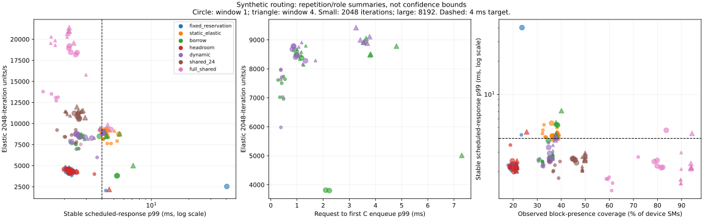

# #419 dynamic execution-resource routing

<!-- doc-status: active -->
<!-- doc-promotion: none -->
<!-- doc-date: 2026-09-16 -->
<!-- doc-module: cross -->

## Decision

**Future-work routing is viable in this synthetic setting at a declared service
target, but it does not dominate static policies on every axis.** With a
permanent 8-SM stable floor, an 8-SM elastic lane, and an 8-SM borrowed lane,
2048-iteration elastic units and a four-unit per-lane window deliver
**1.83–2.00×** fixed reservation's elastic throughput in matched repetition/role
comparisons. Both policies satisfy the 4 ms / 1% service criterion in all six
summaries. Dynamic stable p99 is **2.580–3.475 ms**, versus fixed reservation's
**2.081–2.417 ms**; request-to-first-C-enqueue p99 is **1.022–1.707 ms**.

This meets a service-threshold objective, with a measurable latency cost. The
24-SM shared priority control achieves **10,918–11,431 elastic units/s** versus
dynamic routing's **8,167–8,910**, and stable p99 **2.023–2.699 ms**. Thus the
experiment does not select spatial routing over sharing. Sharing also does
not provide the explicit disjoint 8-SM floor supplied by the partitioned routes.

The window-4 small-unit point is a descriptive operating point selected after
viewing the complete sweep, not a held-out optimum. All tested points, failures
and repetitions are retained below. The next question is whether the spatial
floor becomes useful under a held-out interference workload where matched
sharing loses the stable target.

## Research question

Can future work move between a permanent stable floor and an elastic execution
lane, preserving a chosen service target while increasing elastic throughput?
This phase implements a software owner change on pre-created Green Context
lanes and measures the first stable launches on the reclaimed lane.

The previous [time-budget study](resource_time_budget_20260915.md) measured
admitted-prefix drain with static destinations. This experiment follows the
user's routing direction directly; the earlier proposed calibration-robustness
follow-up remains unperformed. It does not silently promote a calibrated
admission bound into a service guarantee.

## Contract and comparisons

The [harness contract](../../../scripts/benchmarks/resource_routing/README.md)
freezes workload, policy, timing, evidence and reproduction commands.

- Three disjoint 8-SM lanes: permanent stable A, elastic B, and routable C.
  Fixed reservation holds A+C for stable work; permanent elastic allocation
  gives B+C to elastic work. Borrowing transfers C on every stable job;
  pressure-based routing transfers it only for eight-unit jobs. Headroom keeps
  C idle until high stable demand. Total partitioned envelope is 24 SMs with
  22 device SMs outside the experiment's Green workloads.
- A matched 24-SM shared priority pool and the separate 46-SM shared priority
  baseline test whether spatial reservation itself is useful. The matched
  pool comes from an independent split; physical IDs need not match the three
  small pools. A/B roles swap; C stays fixed.
- Fixed-time stable arrivals alternate low/high demand, 16 per trial, at 8 ms
  intervals. Stable work totals 72 identical independent kernels. Elastic
  service remains saturated until stable service finishes; windows 1/4 and
  unit sizes 2048/8192 iterations vary the admitted work horizon.
- Service target declared before the main sweep: p99 ≤4 ms and observed
  deadline-miss fraction ≤1% in each repetition/role summary. Throughput gains
  alone cannot select a policy that fails this criterion.
- Host: RTX 5070 Ti Laptop, 46 SM, WSL2, interactive display host. Exact
  compiler/device/source identities and 100-ms telemetry are archived. Clocks,
  power and host scheduling are uncontrolled.

## Evidence boundaries

Stable response includes lateness from the scheduled arrival. Reclaim is
request-to-host-observed C drain; transition is request-to-first stable enqueue
on C. Per-block GPU intervals independently verify that stable execution on C
follows its last prior elastic block. No host/GPU timestamp subtraction is used.
Only future kernels change destination; Green Context SM sets remain fixed.
This is a measured lane-routing primitive, not live kernel migration or context
resizing. NVIDIA documents the partition/stream mechanism in its
[Green Context API](https://docs.nvidia.com/cuda/cuda-driver-api/cuda_driver_api/group__CUDA__GREEN__CONTEXTS.html).

Observed per-SM block interval unions are a coverage proxy, **not measured total
SM utilization or occupancy**. Device telemetry is descriptive and includes
unrelated device work. Production graphs, TensorRT jobs, a memory-sensitive
stable workload, capacity-count sweeps and a held-out workload remain outside
this experiment. This phase can establish synthetic routing feasibility and a
conditional measured tradeoff; it cannot establish general dynamic dominance,
hard deadlines or production readiness.

## Results

The [machine-readable replay](resource_routing_20260916.json),
[independent audit](resource_routing_20260916.audit.json), and
[frontier figure](resource_routing_20260916.svg) retain all 168 condition
summaries. Each summary uses 10 trials / 160 stable arrivals. Ranges span six
repetition/role summaries per policy/unit/window; they are not confidence
intervals or rare-tail guarantees.

### Service criterion

Number of repetition/role summaries meeting **both** p99 ≤4 ms and observed
miss fraction ≤1%. A 160-arrival summary has limited tail resolution; no misses
in a summary is not a zero-risk claim.

| Policy | 2048 / W1 | 2048 / W4 | 8192 / W1 | 8192 / W4 |
|---|---:|---:|---:|---:|
| fixed_reservation | 5/6 | 6/6 | 5/6 | 6/6 |
| static_elastic | 0/6 | 0/6 | 1/6 | 0/6 |
| borrow | 6/6 | 6/6 | 3/6 | 0/6 |
| headroom | 5/6 | 6/6 | 6/6 | 5/6 |
| dynamic | 6/6 | 6/6 | 6/6 | 1/6 |
| shared_24 | 6/6 | 6/6 | 6/6 | 6/6 |
| full_shared | 6/6 | 6/6 | 5/6 | 5/6 |

### What changes the frontier

1. **Bounded reclaim is observed, not guaranteed.** Small-unit dynamic W1 has
   reclaim/route p99 **0.382–0.457 ms**, stable p99 **2.214–3.661 ms**, and zero
   observed deadline misses. W4 increases route p99 to **1.022–1.707 ms** while
   increasing throughput. With 8192-iteration units at W4, dynamic reclaim p99
   grows to **3.578–3.902 ms** and only **1/6** summaries passes the service
   criterion. Borrow-on-every-arrival W4 passes **0/6** at that size.
2. **Borrowing uses real execution capacity.** The independent audit finds
   **5,742 requests with pending elastic C work** and **3,563 jobs with stable
   C blocks after prior elastic C blocks**, with no observed GPU owner overlap.
   There are 11,520 lane requests including idle-lane controls. Some requests
   finish stable work entirely on A, so request counts must not be substituted
   for actual execution transitions.
3. **Headroom trades throughput for immediate access.** Small-unit W4 headroom
   has stable p99 **2.179–2.379 ms** and elastic throughput **4,251–4,712 units/s**.
   Permanently assigning C to elastic work yields **8,403–9,208 units/s**, but
   stable p99 **4.114–5.055 ms** and **0/6** criterion passes. Dynamic routing
   recovers much of that throughput while passing **6/6**. Fixed reservation
   and headroom are nearly equivalent for this workload: a one-unit low-demand
   job cannot exploit C, and both use C for high demand. This does not establish
   an independent advantage of headroom over that fixed reservation.
4. **A latency cost remains.** At the highlighted small-unit W4 point, dynamic
   p99 exceeds its matched fixed-reservation p99 by **0.247–1.341 ms**. Its gain
   is 1.83–2.00× throughput under the threshold, not unchanged tail behavior
   or strict Pareto dominance. Both use a 24-SM envelope; dynamic reserves 8
   permanently and borrows 8, while fixed reservation dedicates 16 to stable.
5. **Keep unfavorable tails.** A fixed-reservation 8192/W1 summary has p99
   **40.376 ms**, 12/160 deadline misses and dispatch-lateness p99 **28.335 ms**.
   It remains in the tables (`r0-c2`, physical swap 1). Its cause is unassigned;
   lateness is an observation, not proof of a host-only cause. Other short
   condition batches also show drift. This prevents a general tail-isolation
   claim and makes post-hoc removal or an inflated throughput ratio inappropriate.
6. **Full-device allocation is unnecessary for the observed target.** Selected
   partitioned points meet it with 24/46 SMs available to these kernels. The
   remaining 22 SMs are outside the tested Green workloads, not certified idle
   device-wide. The observed block-presence coverage remains a proxy; a true
   total-SM-utilization frontier is still unmeasured.

### Complete measured table

Ranges across repetition/role summaries; descriptive, not confidence intervals.

| Policy | Iterations | Window | Stable p99 ms | Reclaim p99 ms | Route p99 ms | Elastic units/s | Observed SM coverage % |
|---|---:|---:|---:|---:|---:|---:|---:|
| fixed_reservation | 2048 | 1 | 2.052–4.303 | 0.000–0.001 | 0.012–0.020 | 2048.031–4206.168 | 17.940–23.409 |
| fixed_reservation | 2048 | 4 | 2.081–2.417 | 0.001–0.003 | 0.012–0.027 | 4206.859–4699.991 | 21.212–21.465 |
| fixed_reservation | 8192 | 1 | 2.151–40.376 | 0.000–0.000 | 0.013–0.029 | 2530.772–4550.479 | 19.464–23.667 |
| fixed_reservation | 8192 | 4 | 2.024–2.300 | 0.000–0.001 | 0.013–0.019 | 4499.941–4779.828 | 21.205–21.426 |
| static_elastic | 2048 | 1 | 4.069–5.305 | — | — | 7627.107–8169.136 | 32.192–33.788 |
| static_elastic | 2048 | 4 | 4.114–5.055 | — | — | 8402.899–9208.297 | 38.127–38.463 |
| static_elastic | 8192 | 1 | 3.913–5.490 | — | — | 8736.630–9252.168 | 35.985–36.772 |
| static_elastic | 8192 | 4 | 4.035–4.450 | — | — | 8668.110–9371.550 | 38.437–38.808 |
| borrow | 2048 | 1 | 2.231–2.608 | 0.312–0.898 | 0.276–0.543 | 6961.082–7733.100 | 30.526–32.221 |
| borrow | 2048 | 4 | 2.704–2.904 | 1.105–1.746 | 1.008–1.338 | 8136.039–8794.737 | 36.464–36.540 |
| borrow | 8192 | 1 | 2.597–5.319 | 0.921–2.407 | 0.912–2.237 | 3798.908–8652.981 | 34.631–38.423 |
| borrow | 8192 | 4 | 4.119–7.136 | 3.704–6.685 | 3.552–7.299 | 5015.041–9047.567 | 37.683–40.083 |
| headroom | 2048 | 1 | 2.176–3.481 | 0.000–0.001 | 0.013–0.025 | 3997.085–4102.861 | 18.322–18.850 |
| headroom | 2048 | 4 | 2.179–2.379 | 0.001–0.001 | 0.013–0.021 | 4251.105–4712.226 | 21.165–21.478 |
| headroom | 8192 | 1 | 1.996–2.499 | 0.000–0.000 | 0.014–0.024 | 4234.387–4574.021 | 19.669–20.462 |
| headroom | 8192 | 4 | 2.058–4.581 | 0.000–0.001 | 0.019–0.029 | 2184.291–4716.397 | 21.240–25.619 |
| dynamic | 2048 | 1 | 2.214–3.661 | 0.382–0.457 | 0.382–0.457 | 5979.856–7980.504 | 30.450–34.652 |
| dynamic | 2048 | 4 | 2.580–3.475 | 1.022–1.707 | 1.022–1.707 | 8166.870–8909.554 | 36.495–36.551 |
| dynamic | 8192 | 1 | 2.468–3.314 | 0.821–1.322 | 0.821–1.326 | 8276.826–8783.047 | 34.761–35.436 |
| dynamic | 8192 | 4 | 3.876–4.195 | 3.578–3.902 | 3.260–3.776 | 8884.404–9423.247 | 37.599–37.761 |
| shared_24 | 2048 | 1 | 1.744–2.499 | — | — | 7806.101–9253.190 | 34.985–39.484 |
| shared_24 | 2048 | 4 | 2.023–2.699 | — | — | 10918.459–11430.767 | 48.644–48.870 |
| shared_24 | 8192 | 1 | 2.402–2.640 | — | — | 10511.318–11217.121 | 44.629–46.334 |
| shared_24 | 8192 | 4 | 2.517–2.933 | — | — | 10705.031–11980.907 | 49.829–49.921 |
| full_shared | 2048 | 1 | 1.346–2.710 | — | — | 7532.446–13792.859 | 58.731–71.973 |
| full_shared | 2048 | 4 | 1.555–2.979 | — | — | 15792.633–20293.486 | 89.633–89.877 |
| full_shared | 8192 | 1 | 2.170–4.734 | — | — | 9285.919–19208.470 | 78.643–83.660 |
| full_shared | 8192 | 4 | 2.129–4.445 | — | — | 9827.937–21387.466 | 93.884–94.349 |

## Reproduction and retained evidence

- Pilot: `~/.local/state/saccade/perf/resource-419-routing-pilot-20260916/`;
  56 trials, 896 stable arrivals, excluded from main results. All conditions
  passed producer checks and raw replay before the main sweep began.
- Main: `~/.local/state/saccade/perf/resource-419-routing-20260916/`;
  completed 3 repetitions × 56 conditions × 10 retained trials, plus one
  excluded warmup per condition. Source snapshots are execution authority.
- [Replay code](../../../scripts/benchmarks/resource_routing/report.py) checks
  checksums, complete coverage, destinations, SM membership, work conservation,
  queue bounds, ownership transfer ordering, output equality, and saved metrics.

## Validation and continuation

- Full checksum/source/coverage replay passed all **168 conditions / 1,680
  trials**. The independent audit passed **26,880 arrivals / 120,960 stable
  units**, with **694** total deadline misses retained across all policies.
- Eleven contract tests passed. Four rehashed disposable pilot variants with
  altered metrics, duplicate conditions, pool identity or source identity were
  rejected. Measurement archives were not modified by fault injection.
- Ruff, generated script/test indexes, document master map, stale-path checks
  and `git diff --check` passed. Index generation used a temporary Git index.
- Publication is tracked separately from the measured execution and its
  immutable source snapshots. This diagnostic study keeps umbrella issue
  #419 open; it does not complete the broader resource-routing investigation.

The bounded next experiment should retain these three lanes and the frozen
service target, introduce a **held-out memory-sensitive stable/interference
pair**, and compare dynamic W1/W4 directly with matched sharing and fixed
reservation. Measure whether routing supplies an advantage sharing lacks,
then vary floor/borrowable capacity counts. Keep hardware SM-active attribution
as a distinct measurement obligation; do not relabel block coverage. A real
pipeline trial additionally needs independent jobs or validated graph segments
and per-destination captures before interpreting routing as production service.

The [full-pipeline mixed-workload continuation](resource_mixed_20260916.md)
tests the real serial Saccade service with fixed reservation, matched sharing,
static headroom and temporal borrowing. It keeps pipeline graphs in one context
and routes elastic kernels into idle stable capacity; it does not claim live
migration of the stateful pipeline or preservation of this synthetic study's
permanently unborrowed floor.
