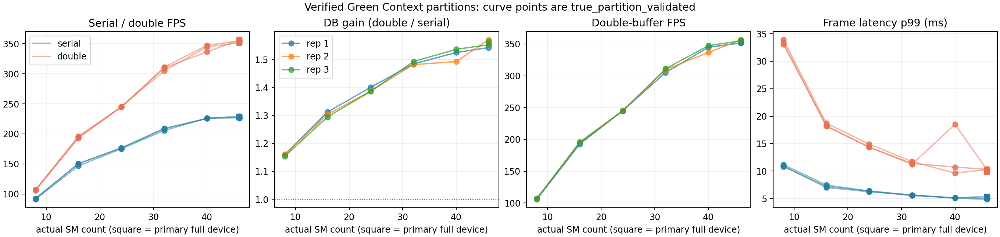

# #419 closure — serial vs double-buffer SM-scaling frozen benchmark

<!-- doc-status: active -->
<!-- doc-promotion: none -->
<!-- doc-date: 2026-09-20 -->
<!-- doc-module: cross -->

## Scope and interpretation

This is the closure record for the SM-scaling half of
[#419](https://github.com/raylei50653/saccade/issues/419): serial versus
double-buffer (`detect(N+1) || tracker(N)`) throughput, frame latency,
completion period and jitter measured at the same full-pipeline boundary
(decode → detector → tracker → completed output, #35/#376) inside verified CUDA
Green Context partitions on the unconstrained device plus every creatable
constrained budget. It re-runs the phase-B harness
([resource_partition_20260915.md](resource_partition_20260915.md)) with one
more repetition, applies a knee rule that was fixed **before** the run (below),
and freezes the result as a benchmark record that a later optimization can be
compared against with `frozen_benchmark.py compare`.

It answers two things only: whether a double-buffer overlap knee exists on the
creatable budget grid of this device, and what the resource frontier (minimum
verified SM budget meeting a declared service target) is today. It does not
add or evaluate any routing policy, does not attribute the curve to a mechanism
(occupancy, clocks, scheduler, cache, power), and is not an edge-device claim.
Production presets, defaults and sources are unchanged.

## Pre-declaration

Written and committed before the closure sweep started. The constants live in
`scripts/benchmarks/resource_partition/frozen_benchmark.py` and are part of
the frozen record's schema; changing them is a new schema version, not an
edit.

**Sweep.** `mamba_whole_graph_m`, MOT17-04-SDP frames 1–300 (warmup 1–50,
250 timed frames), `--detect-barrier event`, default GPU decode; requested
budgets `full 46 40 32 24 16 8`; **3 repetitions**, levels shuffled per
repetition (`--seed 419`), mode order alternating; every point run as an
audited twin (CUPTI on, produces the routing verdict) and a measurement (CUPTI
off, produces the timing). Only `true_partition_validated` rows enter the
curve; the `full` primary-context rows are the reference and never a partition.
Run under the `machine-bench` lease.

**Curve.** Per validated Green Context budget `r`, `g(r)` = mean over
repetitions of the paired DB gain `FPS_double / FPS_serial` (same repetition);
`g_full` = the same mean for the primary full-device rows. Retained fraction
`f(r) = (g(r) − 1) / (g_full − 1)`. Segment slope between adjacent grid points
`s_i = (f(r_{i+1}) − f(r_i)) / (r_{i+1} − r_i)`.

**Knee rule.** A knee exists at `r_i` iff, for some segment `i` that has at
least one higher segment, both hold:

1. `s_i ≥ 2 × max_{j>i} s_j` — the retained-gain decline per SM in the segment starting at `r_i` is
   at least twice the steepest decline anywhere above it (if every higher
   slope is ≤ 0, any positive `s_i` qualifies); and
2. `f(r_i) < 0.5` — less than half the full-device DB gain survives at the low
   end of that segment.

Otherwise the outcome is **graceful scaling** if `f(r) ≥ 0.8` at every
constrained budget, else **smooth decline**. Separately, any budget with
`g(r) ≤ 1.05` is listed as having lost the overlap. The rule is evaluated on
the repetition means and again per repetition; the record states whether the
per-repetition verdicts agree. Fewer than three validated budgets or
`g_full ≤ 1` make the rule inapplicable and are reported as such.

The rule was written with knowledge of the 09-15 two-repetition curve, which it
classifies as *smooth decline* (steepest segment 8→16 SM at 0.031/SM versus
0.025/SM for 24→32; `f(8) = 0.30`). It is therefore a pre-declaration for the
closure run only, not a blind one, and a closure verdict other than *smooth
decline* would be reported as a disagreement with 09-15, not averaged away.

**Frontier targets** (each evaluated per mode; a budget meets a target only if
**every** repetition meets both bounds; the frontier value is the smallest
verified Green Context budget that meets it, with the full device reported
beside it):

| Target | FPS ≥ | Frame p99 ≤ |
|---|---:|---:|
| T1 | 300 | — |
| T2 | 200 | 10 ms |
| T3 | 150 | 15 ms |
| T4 | 100 | 25 ms |

These are probes of the frontier, not service commitments; no production
deadline exists (#419), so no deadline-miss rate is claimed.

**Comparison contract for future use.** `frozen_benchmark.py compare` refuses
(exit 2) unless preset, sequences, frame bounds, warmup, barrier, requested
levels, device name/SM count/partition alignment and the criteria constants are
identical; it records (does not reject) differences in runtime `HEAD`, harness
source hashes, driver and library versions. It reports candidate/reference
ratios of means per budget and mode, DB-gain deltas, whether repetition ranges
overlap, both knee verdicts and frontier movement. Cross-session absolutes on
this host have drifted 7–10% at identical clocks
([resource_mixed_db_20260918.md](resource_mixed_db_20260918.md)), so a
before/after claim needs a **same-session control** (the reference source
re-run alongside the candidate, passed as `--control`); without one the
comparison is emitted with `host_drift: null` and says so.

## Reproduction

```bash
.venv/bin/python tools/resctl.py run --timeout 3600 machine-bench -- \
  .venv/bin/python scripts/benchmarks/resource_partition/sweep.py \
  --output /absolute/new/resource-419-scaling-closure \
  --preset mamba_whole_graph_m --sequences MOT17-04-SDP \
  --levels full 46 40 32 24 16 8 --repeats 3 --max-frames 300
.venv/bin/python scripts/benchmarks/resource_partition/report.py \
  /absolute/new/resource-419-scaling-closure \
  --json-output resource_scaling_closure_20260920.study.json --markdown-output study_tables.md
.venv/bin/python scripts/benchmarks/resource_partition/frozen_benchmark.py build \
  /absolute/new/resource-419-scaling-closure \
  --study-record resource_scaling_closure_20260920.study.json \
  --json-output resource_scaling_closure_20260920.json --markdown-output tables.md
# later, for an optimization candidate:
.venv/bin/python scripts/benchmarks/resource_partition/frozen_benchmark.py compare \
  --reference docs/reference/benchmarks/resource_scaling_closure_20260920.json \
  --candidate /absolute/candidate-sweep [--control /absolute/same-session-reference-sweep] \
  --json-output comparison.json --markdown-output comparison.md
```

## Execution record

| Axis | Recorded scope |
|---|---|
| Runtime source | `94c1c9ca` (this branch: main `81f81b9e` + the pre-declaration commit; production sources unchanged) |
| Device | RTX 5070 Ti Laptop, 46 SM, 12 GiB, WSL2; KMD 616.92 (09-15 ran on 616.56); CUDA UMD 13.4; nvcc 13.4; torch 2.11.0+cu130; TensorRT 10.16.1.11; cuda-bindings 13.2.0 |
| Workload | `mamba_whole_graph_m`, MOT17-04-SDP frames 1–300, warmup 1–50, `--detect-barrier event`, default GPU decode; double mode adds `--double-buffer` |
| Budgets | Requested 8/16/24/32/40/46 SM Green Contexts plus `full`; every requested count equals the context-reported actual count |
| Repetitions | 3 (levels shuffled per repetition, `--seed 419`, mode order alternating); 42 measurement runs + 42 audited twins, 14 min 09 s under the `machine-bench` lease |
| Samples | 250 frame-latency and 249 completion-period samples per run |
| Routing proof | every twin: 111,538–111,864 kernel records in the sequence window, **100% in the owned context**, 99,854–99,890 graph-launched, 0 escaped kernels/memsets, 0 dropped records; SM-id probes reached exactly the requested count before and after every run |
| Twin consistency | all 42 pairs byte-identical output, equal owned-stream count (7), thread switches (3), `set_device` re-assertions (5), actual SM count and DB route; measurement/twin FPS 1.029–1.189 |
| Outputs | all 84 MOT outputs SHA-256 `10a1537ef165cd909b1503720b9a9a0278922982cba16a2317f68131bc5fddd5`, equal to phase A/B (observation on this prefix, not a determinism proof) |
| Input identity | before = after |
| Raw archive | `~/.local/state/saccade/perf/resource-419-scaling-closure-20260920/` (310 MB incl. 42 CUPTI traces), `SHA256SUMS` written after the sweep; controller log beside it |
| Committed records | [`resource_scaling_closure_20260920.json`](resource_scaling_closure_20260920.json) (frozen benchmark, the `compare` reference), [`resource_scaling_closure_20260920.study.json`](resource_scaling_closure_20260920.study.json) (full per-point evidence incl. routing verification and raw SHA-256 manifest) |

Every table below is generated (`frozen_benchmark.py build` and `report.py`)
from `summary.json`; nothing is hand-typed.

## Results

**Result: no double-buffer overlap knee exists on this device's creatable budget
grid; the pre-declared rule returns `smooth_decline` on the repetition means and
in each of the three repetitions.** The paired DB gain falls monotonically from
1.555 (full device) / 1.557 (46-SM Green Context) through 1.518 (40), 1.486
(32), 1.391 (24), 1.303 (16) to 1.158 at 8 SMs; the retained fraction of the
full-device gain is 0.93 / 0.88 / 0.70 / 0.55 / 0.29. The steepest segment is
8→16 SM at 0.033 retained/SM against 0.021/SM for 24→32 (ratio 1.5, below the
declared 2×), and no budget's gain is within 0.05 of 1.0. Serial throughput is
within 1% of the full device from 40 SMs and at 91% at 32; double-buffer
throughput is at 97% at 40 SMs and 87% at 32. The 46-SM Green Context and the
primary full device agree within 1% in both modes. Against the 09-15
two-repetition curve the verdict is unchanged; the 09-15 gains are 0.01–0.06
higher at every budget (details under *Cross-session comparison*).



### Per-budget aggregates over repetitions (mean [min–max])

| Actual SMs | Reps | Serial FPS | DB FPS | DB gain | Retained gain | Serial frame p50/p95/p99 (ms) | DB frame p50/p95/p99 (ms) | Serial period σ (ms) | DB period σ (ms) | Validated |
|---|---:|---:|---:|---:|---:|---|---|---:|---:|---|
| 8 (green) | 3 | 91.92 [91.14–92.59] | 106.49 [105.79–106.85] | 1.158 [1.154–1.161] | 0.29 | 9.91 / 10.60 / 10.97 | 20.00 / 26.54 / 33.46 | 0.31 [0.26–0.38] | 2.76 [2.58–2.96] | yes |
| 16 (green) | 3 | 149.21 [146.70–150.70] | 194.48 [192.52–195.80] | 1.303 [1.295–1.312] | 0.55 | 6.07 / 6.76 / 7.23 | 11.10 / 14.57 / 18.38 | 0.33 [0.28–0.36] | 1.34 [1.28–1.45] | yes |
| 24 (green) | 3 | 176.04 [175.09–176.60] | 244.86 [244.45–245.19] | 1.391 [1.386–1.400] | 0.70 | 5.13 / 5.76 / 6.32 | 8.78 / 12.30 / 14.53 | 0.32 [0.27–0.34] | 1.10 [1.02–1.17] | yes |
| 32 (green) | 3 | 207.63 [205.54–208.97] | 308.56 [305.02–311.05] | 1.486 [1.482–1.493] | 0.88 | 4.28 / 4.98 / 5.60 | 6.98 / 10.22 / 11.46 | 0.32 [0.31–0.33] | 0.89 [0.86–0.94] | yes |
| 40 (green) | 3 | 225.93 [225.57–226.13] | 342.95 [336.62–347.39] | 1.518 [1.492–1.536] | 0.93 | 3.91 / 4.62 / 5.11 | 6.29 / 9.16 / 12.95 | 0.31 [0.30–0.32] | 1.03 [0.74–1.57] | yes |
| 46 (green) | 3 | 227.45 [226.15–229.40] | 354.22 [351.75–356.04] | 1.557 [1.552–1.565] | 1.00 | 3.92 / 4.58 / 5.04 | 6.14 / 9.14 / 10.29 | 0.31 [0.28–0.35] | 0.72 [0.68–0.76] | yes |
| 46 (primary) | 3 | 227.87 [227.14–228.56] | 354.39 [351.53–356.78] | 1.555 [1.542–1.571] | 1.00 (ref) | 3.88 / 4.61 / 5.26 | 6.15 / 9.20 / 10.00 | 0.36 [0.29–0.44] | 0.71 [0.70–0.73] | n/a (baseline) |

### Knee reading (pre-declared rule)

Verdict: **smooth_decline**; per-repetition verdicts agree: yes; budgets with DB gain ≤ 1.05: none.

| Segment (SMs) | Retained at low end | Retained at high end | Retained slope per SM |
|---|---:|---:|---:|
| 8→16 | 0.285 | 0.547 | 0.0326 |
| 16→24 | 0.547 | 0.704 | 0.0197 |
| 24→32 | 0.704 | 0.876 | 0.0214 |
| 32→40 | 0.876 | 0.933 | 0.0072 |
| 40→46 | 0.933 | 1.004 | 0.0118 |

| Rep | Verdict | Knee SMs |
|---:|---|---|
| 1 | smooth_decline | None |
| 2 | smooth_decline | None |
| 3 | smooth_decline | None |

### Service-level frontier (minimum verified SM budget; every repetition must meet the target)

| Target | FPS ≥ | Frame p99 ≤ (ms) | Serial min SMs | Serial full device | DB min SMs | DB full device |
|---|---:|---:|---|---|---|---|
| T1 | 300 | — | none | misses | 32 | meets |
| T2 | 200 | 10.0 | 32 | meets | none | misses |
| T3 | 150 | 15.0 | 24 | meets | 24 | meets |
| T4 | 100 | 25.0 | 16 | meets | 16 | meets |

Reading the frontier: 300 FPS is reachable only with double buffering and
needs 32 SMs; 200 FPS under a 10 ms frame p99 is reachable only serially (32
SMs) because the DB frame p99 sits at 9.8–10.4 ms even on the full device;
150 FPS / 15 ms and 100 FPS / 25 ms are met by both modes from 24 and 16 SMs.
These are the values a future optimization has to move.

### Latency, period and jitter

Double buffering trades frame latency for completion period at every budget
and the trade worsens as the budget shrinks: the DB/serial frame-p99 ratio is
2.0 at 46 and 32 SMs, 2.3 at 24, 2.5 at 16 and 3.1 at 8 SMs, where DB frame
p99 reaches 33.5 ms and DB period p99 (23.0 ms) exceeds serial period p99
(11.9 ms). Serial period σ is 0.26–0.44 ms at every budget; DB period σ grows
from 0.68–0.76 ms at 46 SMs to 2.58–2.96 ms at 8 SMs. One run is an outlier:
40-SM DB repetition 2 has frame p99 18.5 ms and period σ 1.57 ms against
9.6–10.7 ms and 0.74–0.77 ms in the other two repetitions, with 2% lower FPS.
It is retained in every aggregate (which is why the 40-SM DB p99 mean and σ
range are wide) and is not averaged away or explained.

### Same-run latency, period and jitter (ms; p50 / p95 / p99)

| Actual SMs | Rep | Mode | Frame latency | Period | Period σ |
|---|---:|---|---|---|---:|
| 8 (green) | 1 | double | 20.05 / 26.87 / 33.92 | 9.25 / 10.18 / 23.32 | 2.96 |
| 8 (green) | 1 | serial | 9.98 / 10.92 / 11.17 | 10.85 / 11.80 / 12.12 | 0.38 |
| 8 (green) | 2 | double | 19.97 / 26.38 / 33.04 | 9.23 / 9.75 / 22.60 | 2.58 |
| 8 (green) | 2 | serial | 9.90 / 10.49 / 10.86 | 10.80 / 11.41 / 11.80 | 0.29 |
| 8 (green) | 3 | double | 19.99 / 26.36 / 33.42 | 9.23 / 9.76 / 22.96 | 2.74 |
| 8 (green) | 3 | serial | 9.85 / 10.39 / 10.90 | 10.75 / 11.26 / 11.84 | 0.26 |
| 16 (green) | 1 | double | 11.14 / 15.02 / 18.72 | 5.04 / 5.88 / 12.98 | 1.45 |
| 16 (green) | 1 | serial | 6.21 / 7.00 / 7.47 | 6.74 / 7.50 / 8.05 | 0.36 |
| 16 (green) | 2 | double | 11.07 / 13.99 / 18.27 | 5.00 / 5.50 / 12.32 | 1.28 |
| 16 (green) | 2 | serial | 6.00 / 6.64 / 7.21 | 6.57 / 7.22 / 7.73 | 0.36 |
| 16 (green) | 3 | double | 11.08 / 14.71 / 18.14 | 5.02 / 5.58 / 12.32 | 1.30 |
| 16 (green) | 3 | serial | 6.01 / 6.63 / 7.02 | 6.58 / 7.22 / 7.63 | 0.28 |
| 24 (green) | 1 | double | 8.80 / 12.30 / 14.90 | 3.96 / 4.53 / 10.17 | 1.12 |
| 24 (green) | 1 | serial | 5.16 / 5.91 / 6.36 | 5.65 / 6.35 / 6.84 | 0.34 |
| 24 (green) | 2 | double | 8.76 / 11.88 / 14.35 | 3.98 / 4.45 / 9.83 | 1.02 |
| 24 (green) | 2 | serial | 5.10 / 5.70 / 6.39 | 5.59 / 6.24 / 6.86 | 0.34 |
| 24 (green) | 3 | double | 8.79 / 12.72 / 14.35 | 3.97 / 4.56 / 9.73 | 1.17 |
| 24 (green) | 3 | serial | 5.12 / 5.66 / 6.23 | 5.61 / 6.15 / 6.69 | 0.27 |
| 32 (green) | 1 | double | 7.05 / 10.60 / 11.73 | 3.12 / 4.02 / 8.08 | 0.94 |
| 32 (green) | 1 | serial | 4.34 / 5.03 / 5.53 | 4.77 / 5.47 / 6.01 | 0.33 |
| 32 (green) | 2 | double | 6.92 / 10.12 / 11.25 | 3.10 / 3.84 / 7.44 | 0.88 |
| 32 (green) | 2 | serial | 4.25 / 5.05 / 5.64 | 4.71 / 5.47 / 6.13 | 0.33 |
| 32 (green) | 3 | double | 6.97 / 9.94 / 11.40 | 3.12 / 3.79 / 7.58 | 0.86 |
| 32 (green) | 3 | serial | 4.25 / 4.86 / 5.64 | 4.72 / 5.31 / 6.13 | 0.31 |
| 40 (green) | 1 | double | 6.32 / 9.08 / 9.62 | 2.79 / 3.58 / 6.71 | 0.77 |
| 40 (green) | 1 | serial | 3.89 / 4.64 / 5.14 | 4.33 / 5.12 / 5.56 | 0.32 |
| 40 (green) | 2 | double | 6.29 / 9.38 / 18.51 | 2.76 / 3.84 / 6.69 | 1.57 |
| 40 (green) | 2 | serial | 3.94 / 4.70 / 5.05 | 4.36 / 5.10 / 5.47 | 0.30 |
| 40 (green) | 3 | double | 6.25 / 9.03 / 10.72 | 2.77 / 3.44 / 6.65 | 0.74 |
| 40 (green) | 3 | serial | 3.91 / 4.52 / 5.13 | 4.33 / 5.00 / 5.54 | 0.30 |
| 46 (green) | 1 | double | 6.12 / 9.16 / 10.37 | 2.72 / 3.34 / 6.62 | 0.73 |
| 46 (green) | 1 | serial | 3.95 / 4.53 / 5.18 | 4.36 / 4.94 / 5.62 | 0.31 |
| 46 (green) | 2 | double | 6.18 / 9.07 / 10.17 | 2.71 / 3.37 / 6.28 | 0.68 |
| 46 (green) | 2 | serial | 3.87 / 4.51 / 4.87 | 4.30 / 4.93 / 5.30 | 0.28 |
| 46 (green) | 3 | double | 6.12 / 9.19 / 10.32 | 2.69 / 3.29 / 6.89 | 0.76 |
| 46 (green) | 3 | serial | 3.92 / 4.69 / 5.08 | 4.33 / 5.10 / 5.47 | 0.35 |
| 46 (primary) | 1 | double | 6.16 / 9.43 / 10.30 | 2.71 / 3.38 / 6.42 | 0.73 |
| 46 (primary) | 1 | serial | 3.86 / 4.76 / 5.38 | 4.28 / 5.20 / 5.78 | 0.34 |
| 46 (primary) | 2 | double | 6.14 / 8.87 / 9.84 | 2.72 / 3.32 / 6.69 | 0.71 |
| 46 (primary) | 2 | serial | 3.87 / 4.55 / 5.29 | 4.31 / 5.05 / 5.71 | 0.44 |
| 46 (primary) | 3 | double | 6.15 / 9.28 / 9.86 | 2.73 / 3.34 / 6.49 | 0.70 |
| 46 (primary) | 3 | serial | 3.90 / 4.53 / 5.12 | 4.32 / 4.92 / 5.52 | 0.29 |

### Same-run completion period (ms; mean of per-rep p50 / p95 / p99)

| Actual SMs | Serial period | DB period | Serial frames/run | DB frames/run |
|---|---|---|---|---|
| 8 (green) | 10.80 / 11.49 / 11.92 | 9.24 / 9.90 / 22.96 | 250/250/250 | 250/250/250 |
| 16 (green) | 6.63 / 7.32 / 7.80 | 5.02 / 5.66 / 12.54 | 250/250/250 | 250/250/250 |
| 24 (green) | 5.62 / 6.25 / 6.80 | 3.97 / 4.51 / 9.91 | 250/250/250 | 250/250/250 |
| 32 (green) | 4.73 / 5.42 / 6.09 | 3.11 / 3.88 / 7.70 | 250/250/250 | 250/250/250 |
| 40 (green) | 4.34 / 5.08 / 5.52 | 2.77 / 3.62 / 6.68 | 250/250/250 | 250/250/250 |
| 46 (green) | 4.33 / 4.99 / 5.46 | 2.71 / 3.33 / 6.59 | 250/250/250 | 250/250/250 |
| 46 (primary) | 4.30 / 5.06 / 5.67 | 2.72 / 3.34 / 6.53 | 250/250/250 | 250/250/250 |

### Per-repetition throughput

| Actual SMs | Rep | Serial FPS | DB FPS | DB gain | Serial rel. to 46 (primary) | DB rel. to 46 (primary) | Validated |
|---|---:|---:|---:|---:|---:|---:|---|
| 8 (green) | 1 | 91.14 | 105.79 | 1.161 | 0.400 | 0.301 | yes |
| 8 (green) | 2 | 92.03 | 106.82 | 1.161 | 0.405 | 0.299 | yes |
| 8 (green) | 3 | 92.59 | 106.85 | 1.154 | 0.405 | 0.301 | yes |
| 16 (green) | 1 | 146.70 | 192.52 | 1.312 | 0.644 | 0.548 | yes |
| 16 (green) | 2 | 150.23 | 195.80 | 1.303 | 0.661 | 0.549 | yes |
| 16 (green) | 3 | 150.70 | 195.12 | 1.295 | 0.659 | 0.550 | yes |
| 24 (green) | 1 | 175.09 | 245.19 | 1.400 | 0.768 | 0.698 | yes |
| 24 (green) | 2 | 176.60 | 244.94 | 1.387 | 0.777 | 0.687 | yes |
| 24 (green) | 3 | 176.43 | 244.45 | 1.386 | 0.772 | 0.689 | yes |
| 32 (green) | 1 | 205.54 | 305.02 | 1.484 | 0.902 | 0.868 | yes |
| 32 (green) | 2 | 208.97 | 309.62 | 1.482 | 0.920 | 0.868 | yes |
| 32 (green) | 3 | 208.38 | 311.05 | 1.493 | 0.912 | 0.877 | yes |
| 40 (green) | 1 | 226.13 | 344.84 | 1.525 | 0.992 | 0.981 | yes |
| 40 (green) | 2 | 225.57 | 336.62 | 1.492 | 0.993 | 0.944 | yes |
| 40 (green) | 3 | 226.09 | 347.39 | 1.536 | 0.989 | 0.979 | yes |
| 46 (primary) | 1 | 227.90 | 351.53 | 1.542 | 1.000 | 1.000 | n/a (baseline) |
| 46 (green) | 1 | 226.15 | 351.75 | 1.555 | 0.992 | 1.001 | yes |
| 46 (primary) | 2 | 227.14 | 356.78 | 1.571 | 1.000 | 1.000 | n/a (baseline) |
| 46 (green) | 2 | 229.40 | 356.04 | 1.552 | 1.010 | 0.998 | yes |
| 46 (primary) | 3 | 228.56 | 354.86 | 1.553 | 1.000 | 1.000 | n/a (baseline) |
| 46 (green) | 3 | 226.81 | 354.88 | 1.565 | 0.992 | 1.000 | yes |

Serial repetitions agree within 3% at every budget (widest 2.7% at 16 SMs);
DB repetitions within 2% except the 40-SM outlier (3.1%). The 8% disagreement
of the 09-15 40-SM serial pair did not recur.

### Sampled telemetry inside measured windows (mean of per-run means [min–max])

| Actual SMs | Mode | Power (W) | SM clock (MHz) | GPU utilization (%) | Samples per run |
|---|---|---|---|---|---|
| 8 (green) | serial | 90.7 [89.1–93.4] | 2709.8 [2682.7–2723.5] | 90.2 [90.0–90.5] | 26–27 |
| 8 (green) | double | 94.6 [92.4–98.7] | 2658.2 [2607.7–2703.2] | 99.3 [99.3–99.3] | 22–23 |
| 16 (green) | serial | 94.8 [91.6–100.3] | 2504.4 [2471.2–2562.2] | 83.5 [82.5–84.1] | 16–16 |
| 16 (green) | double | 117.3 [117.2–117.6] | 2342.9 [2262.3–2407.4] | 97.8 [96.7–98.5] | 12–13 |
| 24 (green) | serial | 109.2 [104.1–112.6] | 2491.0 [2351.4–2598.5] | 80.5 [80.2–80.7] | 13–14 |
| 24 (green) | double | 114.4 [99.8–130.7] | 2252.6 [2151.7–2405.0] | 94.3 [92.2–97.2] | 9–10 |
| 32 (green) | serial | 104.0 [92.9–114.5] | 2244.4 [2193.6–2289.0] | 74.8 [73.2–76.4] | 11–12 |
| 32 (green) | double | 130.2 [117.1–136.9] | 2143.1 [2041.4–2239.4] | 94.9 [92.8–96.0] | 8–8 |
| 40 (green) | serial | 103.9 [90.8–113.7] | 2363.6 [2236.7–2468.5] | 73.1 [71.9–73.7] | 11–11 |
| 40 (green) | double | 117.3 [83.2–141.8] | 2035.1 [1935.7–2163.9] | 86.6 [78.0–94.3] | 7–7 |
| 46 (green) | serial | 104.9 [91.0–114.8] | 2325.2 [2245.0–2375.9] | 73.2 [72.6–74.2] | 10–11 |
| 46 (green) | double | 112.2 [110.3–114.0] | 1986.1 [1854.1–2062.1] | 88.7 [87.3–90.3] | 7–7 |
| 46 (primary) | serial | 98.4 [95.7–102.2] | 2440.1 [2346.6–2516.0] | 73.9 [70.9–75.8] | 10–11 |
| 46 (primary) | double | 112.9 [100.1–128.2] | 2060.5 [1916.4–2295.0] | 83.6 [81.0–85.1] | 7–7 |

Mean SM clock is higher at small budgets (2.66–2.71 GHz at 8 SMs versus
1.99–2.06 GHz for DB at 46 SMs) and power is lower; power spans inside a
budget are wide where a window holds only 7 samples. Per-SM throughput
therefore mixes an SM-count effect with an uncontrolled clock effect; no
clock, power or scheduler mechanism is inferred, as declared.

## Cross-session comparison (comparer exercised, not a before/after claim)

`frozen_benchmark.py compare` was run with this record as reference and the
09-15 phase-B sweep as candidate. The scopes match (same preset, frames,
levels, device, alignment, criteria); recorded differences are `HEAD`, harness
source hashes, driver 616.56 vs 616.92, 2 vs 3 repetitions and the absent
toolchain record. No same-session control exists, so `host_drift` is `null`
and the ratios below are cross-session absolutes.

### Candidate / reference per budget (means; ranges overlap = repetition min–max intervals intersect)

| Actual SMs | Serial FPS ratio | DB FPS ratio | Serial p99 ratio | DB p99 ratio | Serial period σ ratio | DB period σ ratio | DB gain Δ | DB gain ranges overlap |
|---|---:|---:|---:|---:|---:|---:|---:|---|
| 8 (green) | 0.990 | 1.000 | 1.048 | 0.989 | 1.304 | 1.004 | +0.012 | no |
| 16 (green) | 1.002 | 1.009 | 1.026 | 0.915 | 0.993 | 0.788 | +0.009 | yes |
| 24 (green) | 0.996 | 1.003 | 1.047 | 0.987 | 1.122 | 0.997 | +0.010 | yes |
| 32 (green) | 0.975 | 0.995 | 1.021 | 0.998 | 1.097 | 0.971 | +0.030 | no |
| 40 (green) | 0.967 | 1.005 | 1.103 | 0.765 | 1.419 | 0.708 | +0.061 | yes |
| 46 (green) | 0.982 | 1.000 | 1.039 | 0.974 | 0.959 | 1.023 | +0.027 | no |
| 46 (primary) | 0.982 | 0.989 | 1.032 | 1.009 | 1.014 | 1.069 | +0.011 | yes |

### Frontier movement (minimum verified SM budget; negative Δ = fewer SMs needed)

| Target | Serial before → after | Δ | DB before → after | Δ |
|---|---|---:|---|---:|
| T1 | none → none | n/a | 32 → 32 | +0 |
| T2 | 32 → 32 | +0 | none → none | n/a |
| T3 | 24 → 24 | +0 | 24 → 24 | +0 |
| T4 | 16 → 16 | +0 | 16 → 16 | +0 |

Both sessions agree on the knee verdict and on every frontier value. Serial
FPS on 09-15 was 0.97–1.00 of today's and DB FPS 0.99–1.01, so the two
sessions are within 3% — unlike the 7–10% drift recorded between 09-17 and
09-18 — and the 09-15 DB gain is higher by 0.01–0.06 with non-overlapping
repetition ranges at 8, 32 and 46 (green) SMs. This is a description of two
sessions of the same source; it neither establishes a drift model nor
removes the same-session-control requirement for optimization claims.

## Reading against the #419 decision rules

- **Graceful scaling versus knee.** Neither the graceful (`f ≥ 0.8`
  everywhere) nor the knee condition holds: **smooth decline**, agreed by all
  three repetitions. Double buffering keeps ≈30% of its gain at 8 SMs and
  ≈55% at 16; most of it is realized only from 32 SMs. A knee below 8 SMs or
  between grid points cannot be excluded — 8-SM alignment is the device's.
- **Shared-resource sensitivity.** Not re-measured; the proxy verdict of
  phase B stands and the proxy is not cited here.
- **Tail-latency trade-off / isolation.** Not in scope (D/T reservation and
  routing frontiers are the separate 09-16…09-18 records).
- **Mechanism.** Not inferred.

## Limitations

- One 300-frame prefix of one sequence, three repetitions on one WSL2 host;
  not a rare-tail, cross-scene or edge-hardware estimate. The 40-SM DB
  outlier shows three repetitions still leave single-run tail excursions
  unresolved.
- Green Contexts partition SM execution only; L2, memory bandwidth, copy and
  NVJPG engines and clock/power management stayed shared and demonstrably
  varied with budget.
- The routing proof is the audited twin's CUPTI trace, not the measurement
  run's (identical command, output and owner evidence).
- The knee rule was declared knowing the 09-15 curve; it is a pre-declaration
  for this run only.
- Frontier targets are probes; the DB T2 miss depends on a 10 ms bound that no
  production deadline defines.
- A before/after comparison against this record is only as good as its
  same-session control; the comparer records but cannot correct host drift.

## Acceptance (#419 checklist items this record closes)

- [x] Reproducible serial vs double-buffer resource sweep exists (harness +
  this reproduction block).
- [x] Unconstrained baseline plus six constrained levels (8/16/24/32/40/46 SM)
  measured, all `true_partition_validated`.
- [x] `DB_gain(r)` and absolute throughput reported per budget and repetition.
- [x] Frame p50/p95/p99, period p50/p95/p99 and period σ from the same runs.
- [x] Power / SM clock / utilization retained per run inside measured windows.
- [x] True-partition points validate the phase-B curve (proxy remains
  labelled a proxy in phase A/B).
- [x] Knee question answered under a pre-declared rule: no knee on the
  creatable grid.
- [x] The artifact is reusable as a before/after optimization benchmark:
  frozen record + scope-checked comparer + frontier view, with the control
  requirement stated.
- [ ] Shared-vs-reserved D/T trade-off and edge-hardware validation are not
  part of this record (see the 09-16…09-18 routing records; edge remains a
  non-claim).

## Code validation

- 6 contract tests (`tests/unit/eval/test_resource_frozen_benchmark.py`)
  cover the knee rule on synthetic curves (graceful / smooth / knee / ramp /
  steep-but-retained), aggregation and frontier from a synthetic summary,
  fail-closed on unvalidated points or too few budgets, comparison ratios,
  frontier movement, the drift note and the control path, and scope/criteria
  refusal; the 20 existing partition tests still pass.
- `frozen_benchmark.py build` reproduces `smooth_decline` on the archived
  09-15 sweep; `compare` was exercised against it (above).
- Ruff lint/format, generated script/test indexes and master map pass
  locally; see the PR for the `pre_push` record.
