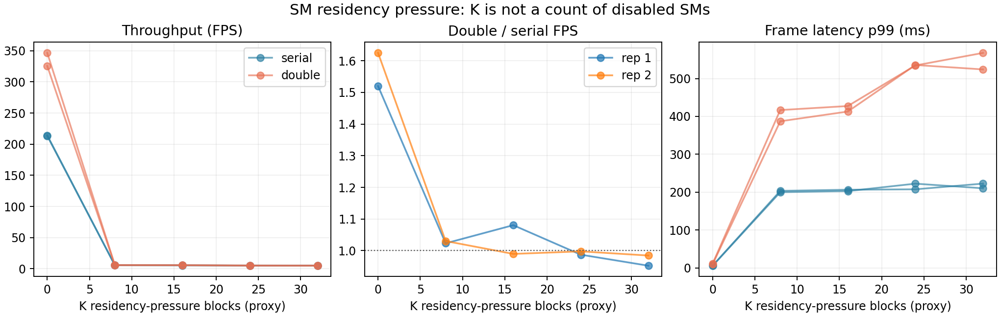

# #419 GPU resource sensitivity — residency proxy and Green Context feasibility

<!-- doc-status: active -->
<!-- doc-promotion: none -->
<!-- doc-date: 2026-09-15 -->
<!-- doc-module: cross -->

## Scope and interpretation

This is the execution record for [#419](https://github.com/raylei50653/saccade/issues/419),
work package F of #420. It establishes a reusable full-pipeline measurement
surface and tests a bounded SM-residency pressure proxy. **It does not yet
establish an execution-resource frontier, an SM knee, or an edge-device claim.**

The source-grounded timing boundary follows #35 and the output-completion repair
in #376: decode → detection → tracking → completed output. Ordinary double-buffer
eligibility is preserved. The existing #358 dose experiment measures marginal
added-work exposure; its S is not reused as an SM-scaling exponent.

## Reproduction and frozen scope

```bash
.venv/bin/python scripts/benchmarks/resource_sensitivity/sweep.py \
  --output /absolute/new/resource-419-run \
  --preset mamba_whole_graph_m --sequences MOT17-04-SDP \
  --levels 0 8 16 24 32 --repeats 2 --max-frames 300
```

The [harness README](../../../scripts/benchmarks/resource_sensitivity/README.md)
defines commands, fields, fail-closed validation, timing and reuse rules.

| Axis | Recorded scope |
|---|---|
| Runtime source | `5e3a45e471e9c86e957787beb67ca85fa16c896a`; diagnostic scripts are local changes |
| Device | RTX 5070 Ti Laptop, 46 SM, 12 GiB, WSL2 |
| Current stack | NVIDIA-SMI 615.71.09 / Windows KMD 616.56; CUDA UMD 13.4; torch 2.11.0+cu130 |
| Workload | `mamba_whole_graph_m`, MOT17-04-SDP frames 1–300, warmup 1–50 |
| Scheduling | Both modes explicitly use `--detect-barrier event`; double adds `--double-buffer` |
| Decode | Default GPU JPEG decode, included in frame latency and throughput |
| Pressure | K=0/8/16/24/32; 5,000 µs pulses; two repetitions, seeded level order, alternating mode order |
| Quantiles | 250 frame-latency samples and 249 completion-period samples per run; report repetitions separately |
| Tracker-stage latency | Unobserved on this nonprofiling path; never substituted with frame latency |
| Telemetry | 100 ms nvidia-smi sampling; report only samples inside measured completion windows |
| Local raw archive | `~/.local/state/saccade/perf/resource-419-20260915/` |

The raw archive retains commands, manifests, CUDA source/binary hashes, actual
block SM IDs/timestamps, frame latency samples/completion timestamps, MOT output
files, complete console logs and telemetry. `execution_sources/` preserves the
exact runner/blocker/Green-probe sources used for the run. The input identity was
added during this exploratory session and is checked again at completion;
this is not a claim of a preregistered input seal. Future harness runs capture
and compare input fingerprints before and after the sweep.

The sequence prefix is a capability/pressure characterization. It is not the
full seven-sequence headline benchmark. The evaluator's full-sequence GT metrics
on this prefix are not quality estimates; retain output hashes for inertness and
use #421's compatible quality contract before comparing training/module variants.
Two repetitions and 250 samples per run do not precisely estimate rare tails.
No fixed service-level target was specified, so the default report has no deadline
claim; `summarize.py --deadline-ms ...` can calculate empirical misses afterward.

## Proxy qualification and limitations

The CUDA blocker requests 52,224 bytes of dynamic shared memory per one-thread
block, greater than half of the device's 102,400 shared bytes per SM. CUDA's
occupancy API reports one blocker block per SM. Each kernel records `%smid` and
`%globaltimer`; the report requires K distinct SMs with overlapping residency.
The loop sleeps with `__nanosleep` and avoids repeated global-memory traffic.

This is **shared-memory residency pressure**. Other kernels can use the remaining
shared memory and execution resources on those same SMs. Neither K nor the
measured mean resident block count determines `N_available = 46 - K`.

A truly persistent kernel in the primary context would prevent device-wide
synchronization from completing. The bounded pulse/restart design avoids that
hang, but its pulse duration, host collection/relaunch gaps and interaction with
synchronization are additional experimental axes. CUDA documents that primary
context synchronization also waits for its Green Contexts, so placing this same
blocker in a full-device Green Context would not by itself remove that boundary.
See [NVIDIA context synchronization documentation](https://docs.nvidia.com/cuda/cuda-driver-api/group__CUDA__CTX.html).

The report retains GPU-timestamp K-way simultaneous-residency fraction, mean
resident blocks, restart-gap distribution and the fraction of measured time
spanned by the selected pulses. These qualify the waveform; **they are not a
measurement of detector/tracker kernel overlap**. K=0 has no blocker thread,
so K=0 versus K>0 includes CPU/proxy overhead as well as GPU pressure.

## Results

**Result: the current bounded-residency proxy is waveform-sensitive and cannot
be used to identify an SM knee.** Under this waveform DB gain
falls close to 1, but the fixed-K pulse control and direct synchronization test
show that this curve cannot be read as available-SM scaling. A real execution
partition remains unvalidated for the full pipeline.

The selected evidence contains **20 primary points + 4 pulse-control points**,
6,000 post-warmup frame latencies. One second-repetition K=8 serial point overlapped
a GPU unit-test verification window; its whole serial/DB pair was excluded and
repeated after the initial sweep. The originals, exclusion window, exact replacement
times and original manifest are retained in `excluded_gpu_test_overlap/`,
`verification_window.json` and `rerun_audit.json`. The table uses the replacements.

[Machine-readable results](resource_sensitivity_20260915.json) retain unrounded
values and telemetry ranges; the raw archive retains all samples. Check the raw
files from `~/.local/state/saccade/perf/` with:

```bash
sha256sum -c resource-419-20260915/SHA256SUMS
```



### Absolute throughput and paired DB gain (5 ms pulses)

Rep labels are one-based here; raw JSON uses zero-based `rep`.

| K | Rep | Serial FPS | DB FPS | DB gain |
|---:|---:|---:|---:|---:|
| 0 | 1 | 214.17 | 325.54 | 1.520 |
| 0 | 2 | 213.29 | 346.54 | 1.625 |
| 8 | 1 | 5.64 | 5.77 | 1.023 |
| 8 | 2 | 5.82 | 5.99 | 1.030 |
| 16 | 1 | 5.35 | 5.78 | 1.081 |
| 16 | 2 | 5.71 | 5.65 | 0.990 |
| 24 | 1 | 5.36 | 5.29 | 0.987 |
| 24 | 2 | 5.13 | 5.12 | 0.998 |
| 32 | 1 | 5.16 | 4.92 | 0.953 |
| 32 | 2 | 5.21 | 5.13 | 0.985 |

### Same-run latency, period and jitter (5 ms pulses)

All timing cells are milliseconds; the triple is p50 / p95 / p99. Period σ is
population standard deviation of **completion intervals**, not frame latency.

| K | Rep | Mode | Frame latency p50 / p95 / p99 | Period p50 / p95 / p99 | Period σ |
|---:|---:|---|---|---|---:|
| 0 | 1 | serial | 4.15 / 4.89 / 5.92 | 4.56 / 5.29 / 6.31 | 0.40 |
| 0 | 1 | double | 6.65 / 9.44 / 11.34 | 2.90 / 4.48 / 6.97 | 0.85 |
| 0 | 2 | serial | 4.15 / 5.03 / 5.62 | 4.56 / 5.46 / 6.03 | 0.39 |
| 0 | 2 | double | 6.30 / 9.02 / 9.82 | 2.74 / 3.64 / 6.32 | 0.67 |
| 8 | 1 | serial | 169.39 / 190.94 / 203.30 | 179.78 / 201.33 / 213.77 | 17.06 |
| 8 | 1 | double | 365.47 / 402.06 / 416.69 | 175.99 / 204.12 / 210.74 | 32.12 |
| 8 | 2 | serial | 162.68 / 180.61 / 199.76 | 173.03 / 191.07 / 210.17 | 14.41 |
| 8 | 2 | double | 342.70 / 372.68 / 387.05 | 167.76 / 189.33 / 194.75 | 14.05 |
| 16 | 1 | serial | 175.40 / 200.80 / 206.31 | 185.94 / 211.22 / 216.78 | 18.99 |
| 16 | 1 | double | 359.63 / 412.48 / 427.36 | 175.20 / 205.94 / 214.25 | 29.38 |
| 16 | 2 | serial | 168.19 / 189.14 / 202.68 | 178.61 / 199.47 / 210.70 | 26.60 |
| 16 | 2 | double | 361.89 / 395.37 / 412.83 | 177.35 / 199.91 / 209.39 | 16.89 |
| 24 | 1 | serial | 177.67 / 194.43 / 207.40 | 187.96 / 204.95 / 218.01 | 18.78 |
| 24 | 1 | double | 382.38 / 441.97 / 534.59 | 188.21 / 218.38 / 243.91 | 25.27 |
| 24 | 2 | serial | 184.99 / 211.54 / 222.33 | 195.42 / 222.05 / 232.71 | 24.60 |
| 24 | 2 | double | 396.34 / 434.51 / 535.74 | 194.67 / 217.69 / 229.91 | 22.29 |
| 32 | 1 | serial | 185.59 / 211.12 / 222.49 | 196.15 / 221.55 / 232.91 | 34.76 |
| 32 | 1 | double | 408.71 / 471.18 / 567.64 | 201.13 / 233.76 / 250.74 | 27.68 |
| 32 | 2 | serial | 182.97 / 200.00 / 210.09 | 193.34 / 210.22 / 220.50 | 18.95 |
| 32 | 2 | double | 410.28 / 455.63 / 524.04 | 199.50 / 227.12 / 238.47 | 39.54 |

### Pressure and sampled telemetry

The interval filter uses each point's clock anchor. Below are **ranges of per-run
means**, not per-frame energy statistics. Full per-run min/max and raw CSV are
retained. Baseline windows have few 100 ms telemetry samples because the timed
prefix completes in roughly a second; this limits thermal/clock interpretation.

| Condition | Mean power (W) | Mean SM clock (MHz) | Mean memory clock (MHz) | Mean GPU utilization (%) |
|---|---:|---:|---:|---:|
| K=0 | 103.7–118.1 | 2211.3–2399.8 | 14001.0–14001.0 | 71.2–97.0 |
| K>0, 5 ms | 58.1–70.2 | 2752.6–2780.9 | 9001.0–13946.2 | 96.3–97.0 |

Every selected pressure run verified K distinct, simultaneously resident SM IDs
and one-block occupancy. GPU-timestamp simultaneous residency occupied
**95.1–96.3%** of the selected pulse spans; those spans covered
**99.98–99.99%** of the measured completion intervals.
Clocks, power and utilization differ across the proxy and baseline. No single
resource mechanism is inferred from these metadata or the K curve.

### Fixed-K waveform control and synchronization dependency

The follow-up changes requested pulse length from 5 ms to 0.5 ms at **K=16**,
with its own K=0 serial/DB anchor, otherwise the same preset/prefix/flags. This is
an exploratory follow-up prompted by the initial slowdown, not a preregistered
mechanism test. Raw archive: `~/.local/state/saccade/perf/resource-419-pulse-control-20260915/`.

| K | Pulse (ms) | Serial FPS | DB FPS | DB gain |
|---:|---:|---:|---:|---:|
| 0 | none | 216.35 | 343.01 | 1.585 |
| 16 | 0.5 | 39.97 | 41.07 | 1.027 |

| K | Mode | Frame latency p50 / p95 / p99 (ms) | Period p50 / p95 / p99 (ms) | Period σ (ms) |
|---:|---|---|---|---:|
| 0 | serial | 4.08 / 4.98 / 5.75 | 4.50 / 5.40 / 6.22 | 0.43 |
| 0 | double | 6.37 / 9.57 / 10.17 | 2.77 / 3.66 / 6.65 | 0.77 |
| 16 | serial | 23.23 / 26.00 / 27.35 | 24.50 / 27.42 / 28.65 | 10.32 |
| 16 | double | 48.83 / 54.03 / 55.92 | 23.75 / 26.82 / 28.30 | 10.29 |

At K=16, 0.5 ms pulses achieved roughly 40–41 FPS instead of 5–6 FPS. Their measured
simultaneous-residency fraction is **76.6–77.3%**, so duty changes too:
this is evidence of **waveform sensitivity**, not an isolation of the entire
slowdown to synchronization, nor a matched-effective-capacity comparison.

A separate 100 ms K=16 pulse control warmed a tiny independent PyTorch stream
operation before measurement. Its operation plus own-stream event wait took
**0.186 ms**; the subsequent primary-context
`torch.cuda.synchronize()` took **89.845 ms** waiting for
remaining work. This directly demonstrates the blocker synchronization dependency
in the toy control. It does **not** quantify its contribution inside Saccade or
measure full-pipeline kernel overlap.

Reproduce that control after the sweep, without concurrent measurement work:

```bash
.venv/bin/python scripts/benchmarks/resource_sensitivity/synchronization_probe.py \
  --library /path/to/sweep/blocker.so --output /path/to/sync-control.json
.venv/bin/python scripts/benchmarks/resource_sensitivity/sweep.py \
  --output /absolute/new/pulse-control --levels 0 16 --pulse-us 500 \
  --repeats 1 --max-frames 300
```

### Output inertness and validation

All **24 selected MOT outputs are byte-identical**, including serial versus DB
and both waveforms, SHA-256
`10a1537ef165cd909b1503720b9a9a0278922982cba16a2317f68131bc5fddd5`.
This is an observation on this prefix, not a general determinism or quality claim.
Input fingerprints captured during the primary sweep matched the post-run check;
the final harness's control sweep passed its before/after input-identity check.
The reporter verified exact requested frame bounds (51–300), the actual DB route,
occupancy, simultaneous residency, telemetry windows and absence of the excluded
GPU-test window in the selected main results.


## Green Context feasibility

The local `green_probe.json` verifies:

| Requested SMs | Context-reported SMs | Green stream context correct | External-stream PyTorch kernel | Ordinary new PyTorch stream in Green Context |
|---:|---:|---|---|---|
| 8 | 8 | yes | passed | no |
| 16 | 16 | yes | passed | no |
| 24 | 24 | yes | passed | no |
| 32 | 32 | yes | passed | no |

The device reports a minimum partition size of 8 and alignment of 8. These are
queried values, not assumptions that arbitrary SM counts are supported. Existing
PyTorch pool streams also remain outside the selected Green Context.

`cuCtxSetCurrent(cuCtxFromGreenCtx(...))` is therefore **not a drop-in Saccade-wide
partition**. The toy explicitly uses `torch.cuda.ExternalStream`; the production
pipeline creates its detector lane with `torch.cuda.Stream()`, and native CUDA /
TensorRT plus background execution require their own ownership verification.

This probe verifies API/context resources and a toy launch, not actual native
tracker/detector launch coverage. No full-pipeline true-partition point or shared
vs reserved detector/tracker comparison is claimed. The next integration must
explicitly route every relevant stream and graph launch, verify observed resources
for those streams/contexts, and preserve #376 completion ordering. Merely changing
the current context or seeing a successful toy kernel is insufficient.

NVIDIA's [Green Context API](https://docs.nvidia.com/cuda/cuda-driver-api/cuda_driver_api/group__CUDA__GREEN__CONTEXTS.html)
defines resource splitting and Green stream creation. It partitions execution
resources, not all shared memory/cache/power effects; even a verified future
split must not be called deterministic latency or MIG-equivalent isolation.

## Acceptance and continuation

The reusable proxy surface and its local characterization are delivered; **#419's
actual SM-scaling/frontier question remains open**. No GitHub closure or production
configuration change is implied by this report.


- Reusable paired serial/DB runner, explicit proxy labels, same-run timing,
  telemetry and capability probe are implemented.
- Five requested proxy levels and same-repetition DB gains are measured in this
  study; inspect the results for qualification, rather than treating any curve
  as an actual capacity frontier.
- True-partition validation and D/T reservation remain integration work. The
  current capability evidence demonstrates why transparent context switching
  cannot certify them. No isolation or frontier conclusion is entered into #420.
- Reuse this surface for future variants with matched input/quality identities;
  keep proxy waveform comparisons separate from actual SM partition comparisons.

## Code validation

- 34 focused tests passed: 20 resource-report validation tests and 14 existing
  double-buffer timing/ownership tests.
- Full-repository Ruff lint/format and mypy checks passed.
- Generated script/document indexes, stale-path checks and `git diff --check` passed.
- Native blocker compiled and ran at all four nonzero K values; the final sweep
  CLI completed its independent pulse-control sweep including input identity checks.
- These are local implementation/measurement checks, not remote CI or a merged PR.
