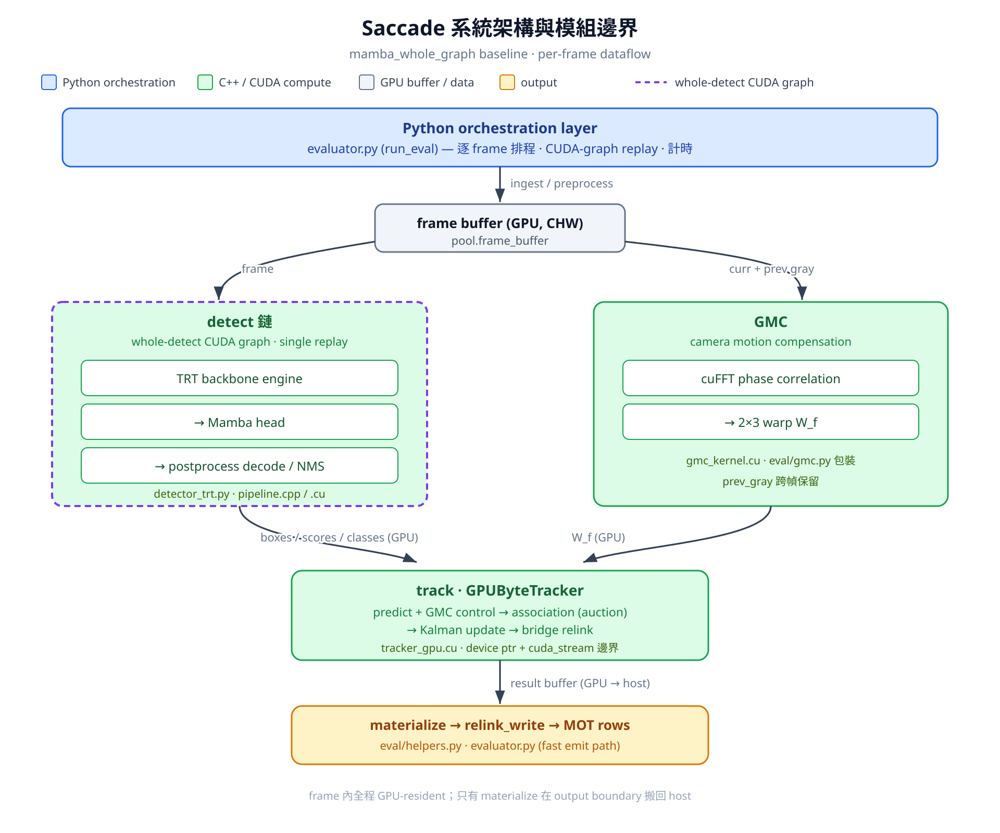
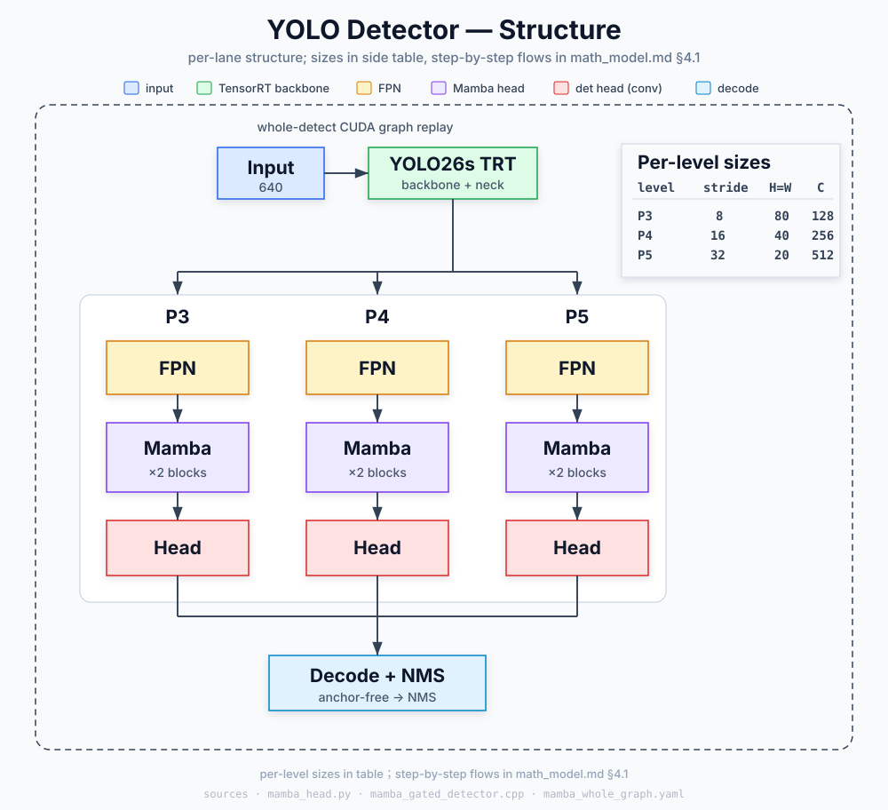

# Saccade 全局數學模型參考

> 最後 source audit：2026-07-09。
>
> 範圍：目前 MOT17 headline presets：
> `mamba_whole_graph`（s）與 `mamba_whole_graph_m`（m）；主線範例
> `uv run scripts/eval/mot17.py --preset mamba_whole_graph --detector SDP`。
> 這份文件描述已落地的實作，不是 proposal。
>
> Drift 對照（P3 audit）：
> [docs/research/tracker-decision/audit/math_model_drift_2026-07-09.md](../research/tracker-decision/audit/math_model_drift_2026-07-09.md)。
> Active decision contract：
> [docs/research/tracker-decision/README.md](../research/tracker-decision/README.md)。
>
> 主要 source anchors：
> [configs/presets/mamba_whole_graph.yaml](../../configs/presets/mamba_whole_graph.yaml)、
> [configs/presets/mamba_whole_graph_m.yaml](../../configs/presets/mamba_whole_graph_m.yaml)、
> [src/saccade/perception/eval/pipeline.py](../../src/saccade/perception/eval/pipeline.py)
> （tracker `set_params` / `set_occ_params` / `set_relink_params` inject）、
> [src/saccade/perception/eval/evaluator.py](../../src/saccade/perception/eval/evaluator.py)
> （frame stage orchestration）、
> [src/tracking/tracker_gpu.cu](../../src/tracking/tracker_gpu.cu)、
> [include/tracking/kalman_gpu.cuh](../../include/tracking/kalman_gpu.cuh)、
> [src/tracking/gmc_kernel.cu](../../src/tracking/gmc_kernel.cu)、
> [src/tracking/relink_gate.cu](../../src/tracking/relink_gate.cu)。

---

## 0. 系統架構與模組邊界

整條 pipeline 分成兩層：**Python orchestration layer**（排程、buffer 管理、CUDA
graph replay、eval 邏輯）與 **C++/CUDA compute layer**（detector engine、postprocess、
GMC、tracker association）。Python 不在 hot path 上做數值計算；它把工作以 GPU tensor /
device pointer 的形式下發到 C++/CUDA，並只在 output boundary 把結果搬回 host。

關鍵：detect 與 GMC 是從**同一個 frame buffer 分岔的兩條平行支線**——GMC 吃的是
frame 灰階影像（+ 上一幀），**不是** detect 的輸出。`track` 才把兩條支線的結果
（detection boxes + warp `W_f`）匯合。whole-detect CUDA graph 只涵蓋 detect 鏈，
不含 GMC。



> 圖檔：[math_model_architecture.png](math_model_architecture.png)（GitHub 可渲染）／
> 可縮放原始檔 [math_model_architecture.svg](math_model_architecture.svg)。
>
> Detector 細部補充圖：[yolo_model_architecture.svg](yolo_model_architecture.svg)。
> 它是上圖 detect 鏈（`TRT backbone engine → Mamba head → postprocess decode/NMS`）
> 的放大版，不取代整體系統架構圖。



文字版（同一架構）：

```text
┌──────────────────────────────────────────────────────────────────────┐
│  Python orchestration layer                                            │
│  evaluator.py (run_eval) — 逐 frame 排程、CUDA-graph replay、計時        │
└──────────────────────────────┬─────────────────────────────────────────┘
                               │ ingest/preprocess
                               ▼
                    frame buffer (GPU, CHW)
                   ╱                        ╲
   ┌──────────────────────────────┐   ┌────────────────────────┐
   │ detect 鏈                     │   │ GMC                    │
   │ (whole-detect CUDA graph,     │   │ default: C++ extension │
   │  single replay)               │   │ gmc.cpp + kernel.cu    │
   │  TRT backbone engine          │   │ prev gray + curr gray  │
   │   → Mamba head                │   │ → 2x3 warp W_f         │
   │   → postprocess decode/NMS    │   │ PyGraphedGMC fallback    │
   │  detector_trt.py / pipeline.* │   │ (prev_gray 跨幀保留)    │
   └──────────────┬───────────────┘   └───────────┬────────────┘
       boxes/scores/classes (GPU)                 │ W_f (GPU)
                  ╲                               ╱
                   ▼                             ▼
            ┌──────────────────────────────────────┐
            │ track  GPUByteTracker (tracker_gpu.cu)│
            │ predict+GMC control → assoc(auction)  │
            │ → Kalman update → bridge relink       │
            └────────────────────┬──────────────────┘
                                 ▼ result buffer (GPU→host)
                    materialize → relink_write → MOT rows
```

### 0.1 模組與傳遞方式

| Stage | 模組（Python facade / C++·CUDA core） | 輸入 → 輸出 | 傳遞方式 |
|:--|:--|:--|:--|
| detect | `detector_trt.py` `TRTYoloDetector` / TRT engine + Mamba head | frame CHW tensor → raw boxes/scores/classes tensor | GPU tensor，整段 backbone+head+postprocess decode 由 whole-detect CUDA graph 單次 replay（§1） |
| postprocess | `saccade_tracking_ext.PerceptionPipeline` (C++) / `pipeline.cpp` | raw det → 過濾/NMS 後 boxes/scores/classes | GPU buffer，留在 device |
| GMC | `saccade_tracking_ext.GMC` / `gmc.cpp` + `gmc_kernel.cu` (cuFFT)；extension 不可用時才用 `eval/gmc.py` `PyGraphedGMC` | prev+curr gray → `2x3` warp `W_f` | GPU tensor（§5） |
| track | `tracking/tracker_gpu.py` `GPUByteTracker` / `saccade_tracking_ext.GPUByteTracker` = `tracker_gpu.cu` | boxes/scores/classes/`W_f` → `trk_to_det` 等 GPU state | **device pointer + stream**（見 §0.2） |
| materialize | `eval/helpers.py` `materialize_gpu_track_results*` | GPU result buffer → host rows | GPU→host，僅 output boundary 一次 copy |
| output | `evaluator.py` `relink_write` | track rows → MOT result lines | host（fast emit path，§12） |

### 0.2 Python ↔ C++ 邊界（傳遞合約）

關鍵在 `track` stage 的邊界（[tracker_gpu.py](../../src/saccade/perception/tracking/tracker_gpu.py)
`GPUByteTracker.update`）：

- frame 內所有中間量都是 **GPU-resident torch tensor**，不落 host。
- 進入 C++ tracker 時，Python 把每個 tensor `.contiguous()` 後取 `.data_ptr()`
  （raw CUDA device pointer），連同 `torch.cuda.current_stream().cuda_stream`
  一起傳給 `self.tracker.update(boxes_ptr, scores_ptr, classes_ptr, gmc_ptr, stream)`。
- Python **必須保留這些 tensor 的引用**直到 kernel 下發完成，否則 `data_ptr()`
  指向的 buffer 會被 GC 釋放。
- C++ tracker 跨 frame 持有自己的 GPU state（Kalman `states`/`covs`、auction
  `prices`、foot-history ring、relink bank、`trk_to_det`/`det_to_trk`），這些
  **不每幀往返 host**；只有 `materialize` 在 output boundary 把精簡 result buffer
  搬回 host。
- ReID 啟用時 appearance 路徑會多排一條 side CUDA stream，在 `track` 前同步；
  baseline `reid_mode: off` 不走（§2）。

詳細的 stage 順序與 source 對照見 §2 與 §13，逐項數學見 §4–§12。

---

## 1. 現行 Baseline 合約

目前推薦 headline baseline 是 `mamba_whole_graph`（s）。容量路徑
`mamba_whole_graph_m`（m）共用同一套 association 主閾值與 cost form，
差異集中在 motion / bridge gates（見 §1.1）。

| 區域 | baseline 值（s） | 實際效果 |
|:--|:--|:--|
| Detector input | `tiling: native_640`, `preprocess: none` | 單一路徑 native 640 detector，不做 gamma/contrast preprocessing |
| Detector model | `mamba_ckpt: runs/mamba_gt_v14replica_t3_t1/best.ckpt` | preset 使用的 Mamba head checkpoint |
| Graph capture | `use_whole_graph: true`, `use_cuda_graph: true`, `use_tracker_graph: true` | whole detect graph；可用時也使用 tracker graph |
| GMC | `gmc: true`, `gmc_downscale: 4`, `gmc_fg_mask: false` | GPU phase-correlation 估計相機平移 |
| Appearance | `reid_mode: "off"` | baseline 不使用 per-frame appearance association |
| Bridge relink | `relink_bridge_enabled: true` | tracker-core bidirectional foot bridge 啟用 |
| Main association | `match_thresh: 0.50`, `new_track_thresh: 0.28` | ByteTrack-like 多階段 gate |
| Kalman noise | `kalman_r_scale: 2.8` | GPU Kalman measurement noise scale（m 見 §1.1） |
| OAO | `oao_tau: 0.50`, `oao_ramp_frames: 25` | duration-ramped occlusion-aware association penalty |
| Front-occluder | `occ_state_enabled: true`, `occ_cost_weight: 0.50`, `occ_iou_thresh: 0.45`, `occ_foot_gap: 0.15`, `occ_ttl: 4` | **production-on** under-foot depth consistency penalty（§7.6） |
| Input-set policy | `private_continuation_enabled: true`（+ NMS/prior IoU knobs） | 在 track 前擴充 det 候選集（**不是** GPUByteTracker setter；§9） |
| Cost form | `multiplicative_cost: true`, `sinkhorn_lambda: 10`, `stability_cost_w: 0.20` | log-linear cost，加上 size-stability reward |

### 1.1 `mamba_whole_graph_m` delta（相對 s）

s/m 共用：`match_thresh`、`new_track_thresh`、`confirm_*`、`oao_*`、
`multiplicative_cost` / `sinkhorn_lambda` / `stability_cost_w`、
`private_continuation_*`、`occ_state_*`、`relink_bridge_enabled`。

| 旋鈕 | s (`mamba_whole_graph`) | m (`mamba_whole_graph_m`) | 意圖 |
|:--|:--|:--|:--|
| `kalman_r_scale` | 2.8 | **3.5** | ↑R → 更信任 **predict**（量測較噪時）；maha gate 變寬 |
| `relink_bridge_px` | 0.25 | **0.4** | m 較鬆 height-normalized bridge 距離 |
| `relink_bridge_h_lo` / `_h_hi` | 0.75 / 1.33 | **0.6 / 1.7** | m 較寬高度比 gate（小框 recovery） |
| `relink_bridge_dir_bonus` | 0.8 | **0.0**（explicit） | m 關閉方向 bonus；s 保留 |

完整 pipeline 路徑合約見
[docs/research/pipeline/](../research/pipeline/)；決策面 ACTIVE/LATENT/NO-GO 見
[tracker-decision](../research/tracker-decision/README.md)。

幾個容易誤讀的分支：

- `reid_mode: off` 代表 headline cost matrix 不使用 appearance embedding。
  ReID-capable kernel 仍存在，但不是這個 baseline 的主路徑。
- `id_stability_filter: false`、`person_geometry_prior: false`、
  `detection_quality_scaling: false`、`geometry_suspect_support: false`
  讓 hot path 集中在 detector output、GMC、tracker association、bridge relink。
- `relink_enabled` 與 `relink_bridge_enabled` 是不同機制。baseline 使用
  tracker-core bridge，不是 birth-time appearance lost-bank relinker。
- **`occ_state_enabled` 在 headline path 為 on**（preset 顯式寫入 + schema
  default true + `pipeline.py` `set_occ_params`）。Native C++ member 預設
  `false` 會被 inject 覆寫；不要把 member default 當成 production baseline。
- **`private_continuation_*` 改的是 association 的輸入 det set**（score-clamp
  使候選可 CONTINUE、不可 BIRTH ghost），不是 tracker setter。

---

## 2. Frame-Level Dataflow

對每個 frame `f`，`evaluator.py` 目前 profile 的 top-level stages：

```text
fetch
ingest_preprocess
detect
postprocess
reid_bank_sync
reid_budget
reid_crop
reid_extract
lazy_reid
gmc
track
materialize
bg_relink_wait
relink_write
frame_total
```

在目前 no-ReID baseline 中，實際主線可讀成：

```text
frame tensor
  -> detect
  -> postprocess
  -> GMC warp
  -> GPU tracker update
  -> materialize output
  -> relink_write / MOT rows
```

source 注意事項：

- 真正的 eval implementation source of truth 是
  [evaluator.py](../../src/saccade/perception/eval/evaluator.py)。
  [runner.py](../../src/saccade/perception/eval/runner.py) 只是 re-export
  `run_eval`。
- ReID 啟用時，ReID work 會先排到 side CUDA stream，並在 `track` 前同步；
  但 `reid_mode: off` 時這些 stage 只是結構上存在，baseline 不使用。
- 經 source 查證的資料流與 stage source map 見 [DATAFLOW.md](../DATAFLOW.md)
  與 [pipeline_flow.md](pipeline_flow.md)。

---

## 3. 符號

Frame 與 detection：

| 符號 | 意義 |
|:--|:--|
| `f` | 目前 frame index |
| `I_f` | 目前 RGB/CHW frame tensor |
| `D_f = {d_j}` | frame `f` postprocess 後的 detection set |
| `b_j = (x1_j, y1_j, x2_j, y2_j)` | detection box，座標在 original-frame pixels |
| `s_j` | detection confidence score |
| `cls_j` | detection class id |
| `T_f = {t_i}` | association 前 active 或 lost tracker slots |
| `x_i` | track slot `i` 的 8D Kalman state |
| `P_i` | track slot `i` 的 8x8 covariance |
| `W_f` | GMC 產生的 2x3 camera warp；GPU phase-correlation path 是 `[1,0,tx;0,1,ty]` |

Tracker state：

| 符號 | 意義 |
|:--|:--|
| `x = (cx, cy, a, h, vx, vy, va, vh)` | center、aspect ratio、height 與對應速度 |
| `w = a * h` | state implied box width |
| `B(x)` | 從 state 還原的 box：`(cx-w/2, cy-h/2, cx+w/2, cy+h/2)` |
| `z = (cx, cy, a, h)` | detection box 轉成的 Kalman measurement |
| `M` | Kalman measurement matrix，等於 `[I4, 0]` |
| `IoU(i,j)` | `B(x_i)` 與 `b_j` 的 IoU |
| `c_ij` | track `i` 與 detection `j` 的 final association cost |
| `p_ij` | 從 cost 轉成的 auction probability/value |
| `A_ij` | association base quality；避免與 Kalman process noise matrix `Q` 混用 |
| `Π_ij` | 單一 track-det 的 penalty 總和（正 penalty − 負 reward），進入乘法 cost 的指數項 |

### 3.1 符號 ↔ 實際名詞對照

下表把上面與 §5–§11 公式中的抽象符號，鎖回真實的 config 欄位、env、代碼錨點與
`mamba_whole_graph`（frozen_v2）baseline 值。`cu:N` 指 `src/tracking/tracker_gpu.cu:N`。

**GMC（§5）**

| 符號 | 用途 | config / env | 代碼錨點 | baseline |
|:--|:--|:--|:--|:--|
| `W_f` | 相機運動補償 warp，作為 control input 加到 predict | — | `predict_gmc_sinv_fused_kernel` | translation-only |
| `PCR` | phase-corr 峰值可信度（peak/RMS） | — | `gmc_kernel.cu` | — |
| `τ_PCR` / `γ_gmc` | 低可信度時縮小位移 | `SACCADE_GMC_PCR_THRESH` | `gmc_kernel.cu:169` | py fallback `5.0` |

**Kalman（§6）**

| 符號 | 用途 | config / env | 代碼錨點 | baseline |
|:--|:--|:--|:--|:--|
| `x, z, F, M` | 8D constant-velocity state / 4D measurement | — | `kalman_gpu.cuh` | — |
| `σ_p = h⁻/20` | 位置過程噪聲隨框高縮放 | `std_weight_position`（hardcoded） | `kalman_gpu.cuh:155` | 1/20 |
| `σ_v = h⁻/160` | 速度過程噪聲隨框高縮放 | `std_weight_velocity`（hardcoded） | `kalman_gpu.cuh:156` | 1/160 |
| `r_scale` | 測量噪聲整體縮放 | `kalman_r_scale` | — | s=2.8；m=3.5（§1.1） |
| `m_NSA` / `λ_light` | NSA / 亮度噪聲調節（baseline 關） | — | — | 1 / 0 |
| `τ_maha` | IoU 弱時仍可入選的 Mahalanobis gate | `maha_gate` | `stage1_cost_fused_kernel` | 見實作 |

**Association cost（§7）**

| 符號 | 用途 | config / env | 代碼錨點 | baseline |
|:--|:--|:--|:--|:--|
| `A_ij` | IoU(+ReID) 綜合配對質量 | — | `stage1_cost_fused_kernel` | = IoU（無 ReID） |
| `q_iou` / `w_fuse` | 低分檢測降權 | `fuse_score_weight` | `stage1_cost_fused_kernel` | 0.0（關） |
| `c_ij` | 最終 association cost（乘法式） | `multiplicative_cost` | — | true |
| `Π_ij` | 把 OAO/vel/occ/stability 匯成乘法指數項 | — | 代碼變數 `penalty` | — |
| `λ` | cost→value 的 softmin 溫度 | `sinkhorn_lambda` | — | 10 |
| `o_i` / `τ_OAO` | 被遮擋 track 降低對高分檢測的配對意願 | `oao_tau` / `oao_ramp_frames` | `compute_track_occlusion_kernel`；crowd `/0.25`@cu:500 | 0.50 / 25 |
| `P_vel` / `w_vel` | 懲罰與預測速度反向的配對 | `vel_dir_weight` | `cu` | 關 |
| `P_occ_front` / `w_occ` | front-occluder 深度一致懲罰 | `occ_state_enabled` / `occ_cost_weight` / `occ_*` | `stage1_cost_fused_kernel` + `set_occ_params` | **開**（`w_occ=0.50`） |
| `R_stability` / `w_stab` | 高度一致 reward（**成本側**） | `stability_cost_w` | §7.7 | 0.20 |

**Auction（§8）**

| 符號 | 用途 | config / env | 代碼錨點 | baseline |
|:--|:--|:--|:--|:--|
| `p_ij` | 進入 auction 的概率值 `e^{-λc}·G_aspect` | — | `fused_sinkhorn_multistage_kernel` | — |
| `G_aspect` / `r_j` | auction value 上抑制異常長寬比框 | （hardcoded 0.8 / 0.15） | `fused_sinkhorn_multistage_kernel` ~`cu:917–919` | — |
| （勿混）quality aspect | det quality-scaling 的 Gaussian aspect（2.5/1.2） | `detection_quality_scaling`（baseline 關） | ~`cu:204–206` | **不同機制**；勿當 `G_aspect` 錨點 |
| `Δρ_i` / `ε` | best-vs-second 競標 margin | — | `parallel_auction_shmem_kernel` | — |
| `w_fresh` | 新鮮度 bid bias（age 越小越高） | `SACCADE_FRESHNESS_W` | `cu:2650` | 0.0（關） |
| `w_{stab,bid}` | 高度一致 bid bias（**競標側**，≠ `w_stab`） | `SACCADE_STABILITY_W` | `cu:2666` | 0.1（**開**） |
| S0 DDA cost cap | confirmed×high 的更緊 stage | `SACCADE_ENABLE_DDA` / `SACCADE_DDA_MAX_COST` | `cu:2404` / `cu:2405` | on / 0.12 |
| stage thresholds | 分數級聯邊界（S1/S1b/S1c/S2） | `match_thresh` / `high_thresh` / `mid_thresh` / `track_thresh` / `stage2_match_thresh` | `run_stage` | 0.50 / 0.45 / 0.10 / 0.05 / 0.50 |

**Lifecycle（§9）**

| 符號 | 用途 | config / env | 代碼錨點 | baseline |
|:--|:--|:--|:--|:--|
| birth / confirm | tentative→confirmed 與保留條件 | `new_track_thresh` / `confirm_streak` / `confirm_score_thresh` / `track_buffer` | `cu` | 0.28 / 3 / 0.50 / 30 |

**Bridge relink（§10）**

| 符號 | 用途 | config / env | 代碼錨點 | baseline |
|:--|:--|:--|:--|:--|
| `d_bridge` / `τ_bridge` | 速度加權雙向 full-gap 外推殘差 vs 門檻（已 `h_ref` 正規化；§10.3） | `relink_bridge_px` | `cu` | s=0.25；m=0.4 |
| `w_dir` / `α` | 方向一致時向 cross-track 誤差偏移 | `relink_bridge_dir_bonus` | §10.4 | s=0.8；m=0.0 |
| `h_lo` / `h_hi` | 高度比 gate | `relink_bridge_h_lo` / `_h_hi` | §10.5 | s=0.75/1.33；m=0.6/1.7 |
| `m_bridge` | best-vs-second margin | `relink_bridge_margin` | §10.5 | 0.05 |
| spatial gate | spatial 距離 gate（baseline 關） | `relink_bridge_spatial_gate` | §10.5 | 0.0 |

**Semantic relink gate（§11，baseline 關）**

| 符號 | 用途 | config / env | 代碼錨點 | baseline |
|:--|:--|:--|:--|:--|
| `w_sim` / `w_iou` / `w_maha` | joint relink score 三項權重 | `semantic_w_sim_base` / `_iou_base` / `_maha_base` | `relink_gate.cu` | off |

> 提醒：`w_stab`（§7.7，`stability_cost_w=0.20`，**成本側 reward**）與
> `w_{stab,bid}`（§8.2，`SACCADE_STABILITY_W=0.1`，**auction bid bias**）是
> **兩個不同的旋鈕**，數值與作用點都不同，雖然都用高度一致性 `|h_i−h_j|/h_j`。

### 3.2 方法出處 / 命名對照

把各機制接回命名概念，方便對照文獻：

- **GMC** = phase correlation（cross-power spectrum + Hanning window），輸出 translation-only warp。
- **Kalman** = SORT / DeepSORT 風格 constant-velocity filter，state `(c_x, c_y, a, h, ·̇)`。
- **Assignment** = Bertsekas auction（單輪平行貪婪）跑在 softmin-temperature top-k 之上；
  detection 分數分段 = ByteTrack 風格 low/high-score cascade。
  注意 `sinkhorn_lambda` 是歷史命名——這裡只用 `e^{-λc}` 當 value，**不是**完整
  Sinkhorn 迭代 solve（見 §8 開頭說明）。
- **Aspect penalty** = 長寬比品質權重（套在 auction value）。
- **OAO** = occlusion-aware（track-track overlap）配對抑制 + duration ramp。
- **Bridge relink** = 速度加權雙向 full-gap 外推（speed-weighted bidirectional
  full-gap extrapolation，§10.3），項目自有機制，非標準 appearance ReID。
  「中點外推（midpoint）」是 legacy gap/2 公式，只存在於 semantic relink gate 的
  mirror 實作（§11 `relink_gate.cu` / Python `_midpoint_bridge_dist`），
  **不是** production bridge kernel 的公式。
- **Semantic relink gate** = appearance + Mahalanobis + IoU 的 joint gate（baseline 關）。

---

## 4. Detection 與 Postprocess 模型

detect 鏈分兩段：detector（TRT backbone + Mamba head，§4.1，輸出 raw
boxes/scores/classes）與 native postprocess（§4.2，過濾/NMS）。兩段都在
whole-detect CUDA graph 內單次 replay（§1）。

### 4.1 Detector 內部結構（FPN → Mamba head → Decode）

放大圖見 [yolo_model_architecture.svg](yolo_model_architecture.svg)（高層模組地圖）；
這裡用幾個小流程圖把每一段拆開看。**總覽**：

```text
frame 640×640
   │
[TRT backbone + neck]              YOLO26s TensorRT engine
   │  FPN 特徵 F_3, F_4, F_5
[Mamba head]   repeat lane ×(P3,P4,P5)    Flow B
   │  cls_N, reg_N（per level，raw）
[Decode]                          anchor-free dist2bbox + sigmoid，Flow D
   │
[filter + NMS]                    C++ postprocess，§4.2
   │
boxes / scores / classes
```

P3/P4/P5 三條 lane 結構**完全相同**，只差尺度常數；先把參數收進一張表，後面流程
只畫一次（輸入固定 640，§1 `tiling: native_640`）：

| level `N` | stride `s_N` | `H_N = W_N = 640/s_N` | backbone 通道 `C_N` | token 數 `L_N = (H_N/4)²` |
|:--|:--|:--|:--|:--|
| P3 | 8 | 80 | 128 | 400 |
| P4 | 16 | 40 | 256 | 100 |
| P5 | 32 | 20 | 512 | 25 |

（`s_N = 2^N`、`C_N = 2^(N+4)`；源 `in_channels=(128,256,512)`、`strides=(8,16,32)`，
[mamba_head.py](../../src/saccade/perception/temporal_yolo/mamba_head.py):1177/1225。）

**Flow B — 單一 lane 內部（`d_model=128`, `spatial_reduction=4`, `num_blocks=2`,
`d_state=16`，源 mamba_head.py:1220–1226）。** 重點是 U-Net 式的 skip：`X_N` 一邊
進 down→Mamba→up，一邊**跳接**直接和 `U_N` concat，所以 head 輸入是 256 ch：

```text
F_N : C_N×H_N×W_N
   │
[Conv1x1]  input_proj, C_N→128
   │
   X_N : 128×H_N×W_N ───────────────────────┐  skip
   │                                         │
[Down4]  stride-4 conv → 128×(H_N/4)×(W_N/4) │
   │                                         │
[flatten]  → Z_N : L_N tokens × 128          │
   │                                         │
[MambaBlock] ┐                               │
[MambaBlock] ┘ ×2   (SSM, d_state=16)        │
   │                                         │
[Up4]  上採樣 ×4 → U_N : 128×H_N×W_N         │
   │                                         │
   └────────────► concat ◄───────────────────┘
                    │
                  Y_N : 256×H_N×W_N   （→ Flow C）
```

先 `Down4` 把 SSM 序列壓到 `L_N ≤ 400`（控 scan 成本，coarse grid 仍保 long-range
依賴），上採樣後再和未壓縮的 `X_N` concat 把細節補回（mamba_head.py:1208–1211）。

**Flow C — Head（per level，純卷積，無 Mamba；mamba_head.py:1365–1385）。**

```text
Y_N : 256×H_N×W_N
   ├─[cls head]  Conv3x3 256→128 → SiLU → Conv1x1 128→80  → cls_N : 80×H_N×W_N
   └─[reg head]  Conv3x3 256→128 → SiLU → Conv1x1 128→4   → reg_N :  4×H_N×W_N
```

輸出通道 `no = nc + 4·reg_max = 80 + 4 = 84`（`reg_max=1`，box 直接是 4 維距離，
無 DFL softmax；mamba_head.py:1258）。

**Flow D — Decode（anchor-free，跨三尺度合併；
[mamba_gated_detector.cpp](../../src/perception/mamba_gated_detector.cpp):158
`decode_feats`）。**

```text
cls_N (80×H_N×W_N), reg_N (4×H_N×W_N)   for N∈{3,4,5}
   │  flatten(2) + concat over levels
   ▼
cls_all : 80×N , reg_all : 4×N          N = 80²+40²+20² = 8400 anchors
   │
   │  anchor = grid 中心 (x+0.5, y+0.5)，每點帶 stride 8/16/32
   ▼
reg=(lt,rb) ─dist2bbox→ c=anchor+(rb−lt)/2, wh=lt+rb ─×stride→ xyxy（像素）
cls ─sigmoid→ max over 80 類 → score, class_id（argmax）
   │
   ▼
conf filter (score≥conf_thr 且 w,h>0) → NMS(IoU≥nms_thr)   （§4.2）
   ▼
boxes / scores / classes
```

> baseline 的 frozen Mamba head checkpoint 是
> `runs/mamba_gt_v14replica_t3_t1/best.ckpt`（§1）；ReID embedding 支線
> `emb_dim=0`（off），故 head 只出 cls/reg 兩支。

### 4.2 Postprocess Contract

Detector 輸出 raw boxes、scores、classes。Native postprocess 由
[PerceptionPipeline](../../include/tracking/pipeline.hpp) 提供，C++ implementation
在 [src/tracking/pipeline.cpp](../../src/tracking/pipeline.cpp)。核心 contract：

```text
(raw boxes, raw scores, raw classes)
  -> score/class/geometry filtering
  -> compact/gather
  -> NMS
  -> fixed or counted output buffers
```

目前 preset 中：

- `track_person_only: false`：tracking 前不把所有 class collapse 成 person。
- `person_geometry_prior: false`：strict person-shape prior 關閉。
- `detection_quality_scaling: false`：不以 geometry quality 乘 detection score。
- `geometry_suspect_support: false`：headline baseline 不使用 suspect-support logic。

因此 tracker 直接消費 post-NMS boxes/scores，並由 tracker stage score gates
決定各 detection 進入哪一段 association：

```text
track_thresh <= low-score boxes considered by the last association stage
mid_thresh   <= mid-confidence stage lower bound
high_thresh  <= high-confidence stage lower bound
new_track_thresh <= unmatched detection may spawn a new track
```

實際 thresholds 由 [pipeline.py](../../src/saccade/perception/eval/pipeline.py)
在 tracker setup 時呼叫 `set_params(...)` / `set_occ_params(...)` /
`set_relink_params(...)` 注入（約 `pipeline.py:951+`），並在
[tracker_gpu.cu](../../src/tracking/tracker_gpu.cu) 中 clamp/store。
[evaluator.py](../../src/saccade/perception/eval/evaluator.py) 負責 frame-level
stage 排程與 CUDA-graph replay，不是這些 setter 的主要 call site。

---

## 5. GMC：Camera Motion Compensation

GPU GMC path 用 phase correlation 估計 frame-to-frame translation。實作在
[src/tracking/gmc_kernel.cu](../../src/tracking/gmc_kernel.cu)，wrapper 在
[include/tracking/gmc.hpp](../../include/tracking/gmc.hpp)。

### 5.1 Grayscale Downscale

輸入是 CHW float `[0,1]`。對 downscaled pixel `(x,y)`：

$$
s_x = \left\lfloor x \cdot \frac{W_{\mathrm{src}}}{W_{\mathrm{dst}}} \right\rfloor,
\qquad
s_y = \left\lfloor y \cdot \frac{H_{\mathrm{src}}}{H_{\mathrm{dst}}} \right\rfloor
$$

$$
G(x,y) = 0.299 R(s_x,s_y) + 0.587 G_c(s_x,s_y) + 0.114 B(s_x,s_y)
$$

FFT 前套 Hanning window：

$$
w_x = \frac{1}{2}\left(1-\cos\frac{2\pi x}{W_{\mathrm{dst}}-1}\right),
\qquad
w_y = \frac{1}{2}\left(1-\cos\frac{2\pi y}{H_{\mathrm{dst}}-1}\right)
$$

$$
G_w(x,y) = G(x,y) w_x w_y
$$

> **注意**：C++ GMC 使用 §5.1 的 floor-based 降採樣。Python fallback
> `PyGraphedGMC` 使用 `F.interpolate(mode="nearest")`；在此固定輸出尺寸的
> nearest mapping 同樣是此 floor mapping，兩者取樣座標一致。

### 5.2 Cross-Power Spectrum

令 `A = FFT(prev_gray)`、`B = FFT(curr_gray)`。kernel 計算：

$$
C(k) = \overline{A(k)} B(k),
\qquad
R(k) = \frac{C(k)}{|C(k)| + 10^{-6}},
\qquad
r = \mathrm{IFFT}(R)
$$

`r` 的 peak 給出 wrapped displacement。若 `peak_x > w/2` 則減去 `w`；
若 `peak_y > h/2` 則減去 `h`。

### 5.3 Confidence And Warp

phase-correlation score：

$$
\mathrm{PCR} = \frac{\max r}{\mathrm{RMS}(r)}
$$

$$
\gamma_{\mathrm{gmc}} =
\begin{cases}
\mathrm{clamp}(\mathrm{PCR}/\tau_{\mathrm{PCR}}, 0, 1), & \mathrm{PCR} < \tau_{\mathrm{PCR}} \\
1, & \mathrm{otherwise}
\end{cases}
$$

若 wrapped displacement 任一方向超過 downscaled image dimension 的 25%，該
位移視為不可信。處置方式因路徑而異：

- C++ `peak_to_translation_warp_kernel`（graph path，經由
  `launch_phase_correlation_into_warp` 進入）：輸出 identity warp（`t_x=t_y=0`）。
- C++ `launch_phase_correlation`（standalone path）：kernel 回傳原始 wrapped
  displacement，由 host 端 `GMC::estimate()` 進行二次檢查後回傳空 result，
  eval 端等同該 frame 無 GMC warp。
- Python `PyGraphedGMC`：同樣套用 25% displacement cap；不可信時寫入
  identity warp。
- Python `TilePhaseCorrAffineGMC`：若沒有 affine/global fallback 會回 `None`，
  等同無 GMC warp。

否則：

$$
t_x = p_x \cdot d \cdot \gamma_{\mathrm{gmc}},
\qquad
t_y = p_y \cdot d \cdot \gamma_{\mathrm{gmc}}
$$

$$
W_f =
\begin{bmatrix}
1 & 0 & t_x \\
0 & 1 & t_y
\end{bmatrix}
$$

> **注意**：Python fallback `PyGraphedGMC` 與 C++ graph path 一樣使用
> §5.3 的軟 confidence scaling，而不是 hard PCR gate；其 constructor 可傳入
> `pcr_thresh`（目前 evaluator fallback 以預設 `5.0` 建立）。它沒有對應
> `SACCADE_GMC_PCR_THRESH` 的環境變數讀取；C++ path 則可由該環境變數調整。

sign convention：`W_f` 是 prev-frame predicted track 到 current-frame coordinates
的 warp。positive `t_x` 代表把 predicted track center 往 current frame 右方推。
這與 [tracker_gpu.cu](../../src/tracking/tracker_gpu.cu) 的
`predict_gmc_sinv_fused_kernel(...)` 一致：GMC translation 先作為 deterministic
control input 加到 position，再做 Kalman predict，讓 velocity state 只學 object
residual motion，而不是相機運動。

---

## 6. Kalman 模型

GPU Kalman 參考實作：[include/tracking/kalman_gpu.cuh](../../include/tracking/kalman_gpu.cuh)。
state 與 measurement：

$$
x = (c_x, c_y, a, h, v_x, v_y, v_a, v_h)^T,
\qquad
z = (c_x, c_y, a, h)^T
$$

### 6.1 Prediction

Transition 是 constant velocity：

$$
F =
\begin{bmatrix}
I_4 & I_4 \\
0 & I_4
\end{bmatrix},
\qquad
x' = Fx,
\qquad
P' = FPF^T + Q(h^-)
$$

程式中等價於：

```text
cx += vx
cy += vy
a  += va
h  += vh
```

這裡 $h^-$ 是 prediction 後 state height；`get_Q(...)` 使用的是呼叫
`predict(...)` 後的 `x[3]`。process noise 隨 $h^-$ 縮放：

$$
\sigma_p = \frac{h^-}{20},
\qquad
\sigma_v = \frac{h^-}{160}
$$

$$
\mathrm{diag}(Q) =
(\sigma_p^2, \sigma_p^2, 10^{-4}, \sigma_p^2,
 \sigma_v^2, \sigma_v^2, 10^{-10}, \sigma_v^2)
$$

### 6.2 Measurement Update

measurement matrix：

$$
M = \begin{bmatrix} I_4 & 0 \end{bmatrix}
$$

measurement noise 使用 update 前 track state 的 predicted height $h^-$，不是
detection height。`light_factor` 在目前 MOT17 baseline path 由 caller 傳 `0.0`；
因此下面的 $\lambda_{\mathrm{light}}=0$。NSA Kalman 停用時
`m_NSA = 1`。

$$
m_R = r_{\mathrm{scale}} \cdot m_{\mathrm{NSA}} \cdot
(1 + 2\lambda_{\mathrm{light}})
$$

$$
\mathrm{diag}(R) =
\left(
\left(\frac{h^-}{20}\right)^2m_R,
\left(\frac{h^-}{20}\right)^2m_R,
10^{-2}m_R,
\left(\frac{h^-}{20}\right)^2m_R
\right)
$$

更新方程：

$$
S = MPM^T + R,
\qquad
K = PM^T S^{-1},
\qquad
y = z - Mx
$$

$$
x \leftarrow x + Ky,
\qquad
P \leftarrow (I - KM)P
$$

headline s preset 設定 `kalman_r_scale: 2.8`；m preset 為 `3.5`（§1.1）。
NSA Kalman 是可配置分支；停用時 `nsa_multiplier = 1`。

### 6.3 Mahalanobis Gate

對 detection measurement `z_j`，即使 IoU 弱，只要 Mahalanobis distance
小於 `maha_gate` 仍可進入 candidate：

$$
d^2_{ij} = (z_j - M\tilde{x}_i)^T S_i^{-1}(z_j - M\tilde{x}_i)
$$

其中 $\tilde{x}_i$ 是已套用 GMC control input 並完成 predict 後的 state。
IoU gate 也使用同一個 $\tilde{x}_i$：

$$
\mathrm{IoU}_{ij} = \mathrm{IoU}(B(\tilde{x}_i), b_j)
$$

因此 association candidate gate 是：

$$
\mathrm{candidate}_{ij} \iff
\mathrm{IoU}_{ij} > \tau_{\mathrm{iou}}
\;\lor\;
d^2_{ij} < \tau_{\mathrm{maha}}
$$

source path 是 [tracker_gpu.cu](../../src/tracking/tracker_gpu.cu) 中的
`predict_gmc_sinv_fused_kernel(...)`、`compute_S_inv(...)` 與 `mahal_sq_det(...)`。
gate 的 $S_i^{-1}$ 由 `compute_S_inv` 計算，`r_scale` 參數由
`predict_gmc_sinv_fused_kernel` 傳入（與 §6.2 update 使用相同的
`kalman_r_scale`）。

---

## 7. Association Cost

目前 headline path 是 no-ReID fast path：

- [stage1_cost_fused_kernel](../../src/tracking/tracker_gpu.cu)：IoU /
  Mahalanobis gating 與 cost 一次完成。
- [compute_conditional_cost_kernel](../../src/tracking/tracker_gpu.cu)：appearance
  embeddings 啟用時使用的變體。

### 7.1 Candidate Gate

對每個 track `i` 與 detection `j`：

$$
\mathrm{IoU}_{ij} = \mathrm{IoU}(B(\tilde{x}_i), b_j)
$$

$$
\mathrm{candidate}_{ij} \iff
\mathrm{IoU}_{ij} > \tau_{\mathrm{iou}}
\;\lor\;
d^2_{ij} < \tau_{\mathrm{maha}}
$$

若兩個 gate 都不過：

$$
c_{ij} = 1
$$

sparse candidate list 只 enqueue 最終 cost 落在最寬鬆 association threshold
內的 candidate：

$$
c_{\max} =
\max(c_{\mathrm{DDA}}, \tau_{\mathrm{match}}, \tau_{\mathrm{stage2}})
$$

$$
\mathrm{enqueue}_{ij} \iff c_{ij} \le c_{\max}
$$

這點很重要：auction 讀的是 per-track compact top candidates，不是完整 dense
matrix。

### 7.2 Base Quality

detection score fusion：

$$
q^{\mathrm{iou}}_{ij}
= \mathrm{IoU}_{ij}\left(1 - w_{\mathrm{fuse}}(1-s_j)\right)
$$

baseline `fuse_score_weight: 0.0`，所以 `q_iou = IoU_ij`。

> **注意**：上式是 `w_fuse > 0` 的通式裡 `s_j` 直接代入的形式，僅在 track 尚未
> confirmed 時成立。實作中（[tracker_gpu.cu](../../src/tracking/tracker_gpu.cu)
> `stage1_cost_fused_kernel`）若 `fuse_score_weight > 0` 且 track 已 confirmed
> （`hit_streak >= confirm_streak`），`(1-s_j)` 會被換成相對 score-drop：
> $\mathrm{drop} = \max(0, \bar{s}_i - s_j)$、$p_{\mathrm{rel}} = \mathrm{drop}/\max(\bar{s}_i, 0.01)$，
> 其中 $\bar{s}_i$ 是 track 的平均 detection score；再乘上 crowd damping
> $(1 - \min(1, o_i/0.25))$。baseline `fuse_score_weight: 0.0` 不觸發此分支，
> 故 `q_iou = IoU_ij` 不受影響。

無 ReID 時：

$$
A_{ij} = q^{\mathrm{iou}}_{ij}
$$

ReID 啟用且 embedding 乾淨時：

$$
\cos_{ij} = \max(0, e_i^T e_j)
$$

$$
A_{ij} =
\begin{cases}
w_{\cos}\cos_{ij} + w_{\mathrm{iou}}q^{\mathrm{iou}}_{ij} + w_s s_j,
& \cos_{ij} \ge \tau_{\cos} \land q^{\mathrm{iou}}_{ij} \ge \tau_{\mathrm{iou,low}} \\
q^{\mathrm{iou}}_{ij},
& \mathrm{otherwise}
\end{cases}
$$

[scripts/eval/config/reid.py](../../scripts/eval/config/reid.py) 中預設 appearance
blend 是 `w_cos=0.55`、`w_iou=0.30`、`w_score=0.15`，但目前
`reid_mode: off` baseline 不使用。

### 7.3 Multiplicative Cost

目前 preset 啟用：

```yaml
multiplicative_cost: true
sinkhorn_lambda: 10
stability_cost_w: 0.20
```

active cost form：

$$
c_{ij} =
\mathrm{clamp}\left(1 - A_{ij}e^{-\Pi_{ij}}, 0, 1\right)
$$

`Penalty_ij` 是正 penalty 與負 reward 的總和：

$$
\Pi_{ij}
= P_{\mathrm{OAO}}(i,j)
+ P_{\mathrm{vel}}(i,j)
+ P_{\mathrm{occ\_front}}(i,j)
- R_{\mathrm{stability}}(i,j)
$$

legacy additive path 仍存在：

$$
c_{ij} = 1 - A_{ij} + \sum_k P_k
$$

但 baseline 不使用。

### 7.4 OAO Penalty

OAO coefficient 由 [compute_track_occlusion_kernel](../../src/tracking/tracker_gpu.cu)
根據 predicted track-track overlap 計算。

預設 max-overlap mode：

$$
o^{\mathrm{base}}_i
= \max_{k \ne i,\; k\ \mathrm{active}}
\mathrm{IoU}\left(B(x_i), B(x_k)\right)
$$

optional union mode 會把 track box rasterize 成 8x8 grid 並量測 covered cells。
crowd、height、foot gates 也存在，但 baseline 只設定 `oao_tau` 與
`oao_ramp_frames`。

duration ramp：

$$
d_i \leftarrow \text{consecutive frames with } o^{\mathrm{base}}_i > 0
$$

$$
o_i = o^{\mathrm{base}}_i
\min\left(1, \frac{d_i}{N_{\mathrm{ramp}}}\right)
$$

matching penalty：

$$
P_{\mathrm{OAO}}(i,j)
= \tau_{\mathrm{OAO}}\, o_i\, g_s(s_j)
$$

$$
g_s(s_j) =
\begin{cases}
1, & w_{\mathrm{OAO,score}} \le 0 \\
\max(0, 1 - w_{\mathrm{OAO,score}}s_j), & \mathrm{otherwise}
\end{cases}
$$

baseline：

```text
oao_tau = 0.50
oao_ramp_frames = 25
oao_score_w = default/off unless set elsewhere
```

### 7.5 Velocity Direction Penalty

若 `vel_dir_weight > 0` 且 predicted velocity 有意義：

$$
v_i = (v_{x,i}, v_{y,i}),
\qquad
\Delta_{ij} = \mathrm{center}(b_j) - (c_{x,i}, c_{y,i})
$$

$$
\cos\theta_{ij}
= \frac{v_i^T\Delta_{ij}}{\lVert v_i\rVert \lVert\Delta_{ij}\rVert}
$$

$$
P_{\mathrm{vel}}(i,j)
= w_{\mathrm{vel}}\max(0, -\cos\theta_{ij})
$$

baseline preset 未啟用 `vel_dir_weight`，但 kernel 中保留此 term。

### 7.6 Front-Occluder Cost

headline path **啟用** occlusion-state machine（`occ_state_enabled: true`）。
front-occluder TTL 加入 depth consistency penalty：

$$
y^{\mathrm{foot}}_i = c_{y,i} + \frac{h_i}{2}
$$

$$
u_{ij} =
\frac{y^{\mathrm{foot}}_i - y_{2,j}}{\max(h_i, 10^{-3})}
$$

$$
P_{\mathrm{occ\_front}}(i,j)
= w_{\mathrm{occ}}\max(0, u_{ij})
$$

s/m 共用 baseline knobs（preset 顯式寫入，與 schema 一致）：

```yaml
occ_state_enabled: true
occ_iou_thresh: 0.45
occ_foot_gap: 0.15
occ_ttl: 4
occ_cost_weight: 0.50   # w_occ
```

Inject：`pipeline.py` → `set_occ_params(...)` → `tracker_gpu.cu`
`stage1_cost_fused_kernel`（`occ_front_ttl` + `occ_cost_weight`）。
Native C++ member 預設 `occ_state_enabled_=false` 會被這條 path 覆寫；
不要把 member default 讀成 production-off。

### 7.7 Stability Reward

active baseline 使用 size-consistency reward：

$$
h_j = y_{2,j} - y_{1,j},
\qquad
\Delta h_{ij} = |h_i - h_j|,
\qquad
\lambda_{\mathrm{eff}} = \max(\lambda, 1)
$$

$$
R_{\mathrm{stability}}(i,j)
=
\frac{w_{\mathrm{stab}}/\lambda_{\mathrm{eff}}}
{1 + \Delta h_{ij}/\max(h_j, 10^{-3})}
$$

因為 reward 除以 `lambda`，進入 `exp(-lambda * cost)` 後，bid boost
大致不會隨 `lambda` 改變而失衡。

---

## 8. Sparse Top-K 與 Auction Assignment

assignment implementation 不是 full dense Sinkhorn solve。active GPU path：

```text
cost candidates per track
  -> fused multi-stage sparse top-k   (一次算出 5 個 stage 的 top-k)
  -> for stage in [S0, S1, S1b, S1c, S2]:   (依優先序串行)
       reset prices
       single-round parallel auction over this stage's top-k
       commit winners (matched track/det 帶到下一 stage)
```

關鍵結構（[tracker_gpu.cu](../../src/tracking/tracker_gpu.cu) host driver
`run_stage(0..4)`）：

- **5 個 stage 是依優先序的貪婪級聯**，不是合併成單一 auction。順序為
  S0 → S1 → S1b → S1c → S2（見 §8.1 表）。
- **Carry-over**：每個 stage 的 auction 只看前面 stage 還沒配掉的 track/det
  （auction kernel 內以 `trk_to_det[t] == -1` 與 `det_to_trk[d] != -1` 過濾），
  所以 S0 先吃掉最確定的配對，剩下的才往下流。
- **每個 stage 只跑一輪 bid + commit**，price buffer 在每個 stage 開頭 reset 成 0，
  沒有 price-raising 迭代到收斂。因此這實質上是**單輪平行貪婪配對**：§8.2 的
  $\Delta\rho$（best-vs-second margin）在這裡只用來決定**同一輪內多個 track 競標
  同一個 detection 時誰勝出**，不是跨輪累積抬價。

### 8.1 Stage Definitions

[fused_sinkhorn_multistage_kernel](../../src/tracking/tracker_gpu.cu) 對五個 stage
輸出 top-k detection candidates：

| Stage | Track state | Detection score range | Cost cap |
|:--|:--|:--|:--|
| S0 DDA | confirmed (`state == 2`) | `[high_thresh, 1.1)` | `dda_max_cost` |
| S1 high | confirmed | `[high_thresh, 1.1)` | `match_thresh` |
| S1b mid | confirmed | `[mid_thresh, high_thresh)` | `match_thresh` |
| S1c tentative | tentative (`state == 1`) | `[mid_thresh, 1.1)` | `match_thresh` |
| S2 low | confirmed | `[track_thresh, mid_thresh)` | `stage2_match_thresh` |

DDA 是 source 中的歷史 stage label，不在程式裡展開全名；數學合約是：
confirmed tracks 對 high-score detections 先經過一個更緊的 Stage 0，
`cost <= dda_max_cost`。它由 `SACCADE_ENABLE_DDA` 控制，`dda_max_cost`
預設來自 `SACCADE_DDA_MAX_COST`，未設定時為 `0.12`。

放入 top-k 的 value：

$$
p_{ij} = e^{-\lambda c_{ij}} G_{\mathrm{aspect}}(b_j)
$$

aspect penalty：

$$
r_j = \frac{\mathrm{width}_j}{\mathrm{height}_j}
$$

$$
G_{\mathrm{aspect}}(b_j) =
\begin{cases}
\max(0.5, 1 - (r_j - 0.8)), & r_j > 0.8 \\
\max(0.5, 1 - 5(0.15-r_j)), & r_j < 0.15 \\
1, & \mathrm{otherwise}
\end{cases}
$$

### 8.2 Auction Bid

auction 讀取 top-k probabilities。對 track `i` 與 candidate detection `j`，
給定 detection 目前 price `rho_j`：

$$
v_{ij} = p_{ij} - \rho_j
$$

$$
j^* = \arg\max_j v_{ij},
\qquad
v^{(2)}_i = \mathrm{secondmax}_j v_{ij}
$$

$$
\Delta\rho_i =
\begin{cases}
\epsilon, & \text{no second candidate} \\
v_{ij^*} - v^{(2)}_i + \epsilon, & \text{otherwise}
\end{cases}
$$

$$
\mathrm{bid}_i = \rho_{j^*} + \Delta\rho_i
$$

bid biases（每個都在 absolute bid 上相加，因為 per-track 的固定 offset 在
best-vs-second margin 中會抵消，且多數競標是單候選 margin == ε）：

$$
\mathrm{bid}_i \mathrel{+}=
\frac{w_{\mathrm{fresh}}}{1+\mathrm{age}_i}
$$

$$
\mathrm{bid}_i \mathrel{+}=
\frac{w_{\mathrm{stab,bid}}}{1 + |h_i-h_j|/h_j}
$$

kernel（`parallel_auction_shmem_kernel`）實際讀取的只有這兩個 bias，預設值不一致，
**不要一律當成 off**：

| Bias | env | 預設 | baseline |
|:--|:--|:--|:--|
| freshness $w_{\mathrm{fresh}}$ | `SACCADE_FRESHNESS_W` | `0.0` | 關 |
| stability $w_{\mathrm{stab,bid}}$ | `SACCADE_STABILITY_W` | `0.1` | **開** |

stability bid bias 在 baseline 是**開的**（`0.1`，kernel 內 `stability_w > 0`
觸發；comment 註明 IDs −42 / IDF1 neutral），偏好 predicted height 與 detection
height 接近的 track。

> 備註：曾有第三個 env `SACCADE_HISTORY_W`（hit-streak bias，意圖讓連續命中較久的
> track bid 較高），但 `history_w` / `hit_streak` 只被傳進 kernel 簽名、**body 從未
> 讀取**（沒有對應的 `if (history_w > 0)` 分支），是 dead parameter。已移除整條路徑
> （kernel 簽名、host env 讀取、host call、`assoc_basis.py` 的 `ENV_OVERRIDES`
> registry），移除為 bit-exact no-op。auction bid bias 現在只有 freshness 與
> stability 兩個。

實作細節：

- shared-memory price cache 做 intra-block conflict resolution。
- block winners 用 global `atomicMax`。
- packed `(float_bid_bits, tie_breaker)` keys 確保 deterministic commit。
- 另外用 commit kernel 避免 `trk_to_det` / `det_to_trk` race 造成不一致。

---

## 9. Track Lifecycle 與 Birth

assignment 後 tracker 更新 state：

```text
matched confirmed/tentative track
  -> Kalman update with detection z_j
  -> hit streak increments
  -> age/time_since_update resets

unmatched active track
  -> remains active/lost while age <= track_buffer
  -> removed after max age

unmatched detection with score >= new_track_thresh
  -> creates tentative track
```

baseline 使用：

```text
new_track_thresh = 0.28
confirm_streak = 3
confirm_score_thresh = 0.50
track_buffer = 30
per_seq_adapt = false
```

`confirm_streak` 與 `confirm_score_thresh` 代表新的 tentative track 必須累積足夠
連續 evidence，才會被視為 confirmed output。若干 birth-gate experiments 位於
[scripts/eval/config/lifecycle.py](../../scripts/eval/config/lifecycle.py)，但目前
preset 沒有啟用。

### 9.1 Private continuation（input-set policy）

headline s/m 啟用 private continuation。它**不是** association cost 或
GPUByteTracker setter，而是 track 前的 **detection input-set 擴充**：

```yaml
private_continuation_enabled: true
private_candidate_nms_iou: 0.70
private_prior_iou_threshold: 0.30
```

被 NMS 壓抑、但與既有 track 有足夠空間重疊的 private candidates 會追加進
det set，並把 score **clamp 到 `new_track_thresh` 以下**，使它們可以
CONTINUE 既有 track，但不能 BIRTH 新 ghost track。實作入口在 detection
filters / stages（含 native append 路徑），見
[tracker-decision active contract](../research/tracker-decision/README.md)。

---

## 10. Bridge Relink 模型

active baseline 啟用 tracker-core bidirectional bridge relink。下列為 **s**
（`mamba_whole_graph`）值；**m** 差異見 §1.1。

```yaml
relink_bridge_enabled: true
relink_bridge_px: 0.25          # m: 0.4
relink_bridge_margin: 0.05      # s/m same
relink_bridge_h_lo: 0.75        # m: 0.6
relink_bridge_h_hi: 1.33        # m: 1.7
relink_bridge_spatial_gate: 0.0
relink_bridge_dir_bonus: 0.8    # m: 0.0 (explicit off)
relink_bridge_anchor: adaptive  # effective default
relink_bridge_anchor_rate: 0.03 # effective default
```

注意：`relink_bridge_px` 是歷史命名；s 的 `0.25` / m 的 `0.4` 都不是 pixel。
它會與 §10.3 的 $d_{\mathrm{bridge}}$ 比較，而 $d_{\mathrm{bridge}}$ 已除以
`h_ref`，所以單位是 reference-height-normalized distance。

實作在 [tracker_gpu.cu](../../src/tracking/tracker_gpu.cu)。它不同於
[relink_gate.cu](../../src/tracking/relink_gate.cu) 的 appearance gate table。

### 10.1 Center/Height History 與 Anchor

每個 observed slot 保存 center/height history ring：

$$
\mathrm{sample}_i = (c_{x,i}, c_{y,i}, h_i)
$$

$$
\bar{h}_i \leftarrow 0.95\bar{h}_i + 0.05h_i
$$

只有 observed tracks（`age == 0`）更新 history；coasting lost tracks 保留最後
的 history。ring 本身不直接儲存 foot point；它儲存 `(c_x,c_y,h)`，再依 anchor
mode 推導 bridge 使用的 $(a_x,a_y)$ 與速度。

baseline 的 effective default 是 `relink_bridge_anchor: adaptive`、
`relink_bridge_anchor_rate: 0.03`。對四個 sample，$x$ 永遠使用 center；$y$ 的
候選序列為：

$$
y^{\mathrm{top}} = c_y - h/2,
\qquad
y^{\mathrm{bot}} = c_y + h/2,
\qquad
y^{\mathrm{ctr}} = c_y
$$

若平均相鄰 height 變化相對於平均 height 不超過 `anchor_rate`，adaptive path
退化為 center。否則它以 top/bottom 各自的四點線性回歸殘差為權重，選擇較穩定的
edge：

$$
w_e = \frac{1}{\mathrm{RSS}_{\mathrm{line}}(y^e)/(\bar h^2+10^{-3})+0.01},
\qquad e\in\{\mathrm{top},\mathrm{bot}\}
$$

$$
a_y = \frac{w_{\mathrm{top}}y^{\mathrm{top}} + w_{\mathrm{bot}}y^{\mathrm{bot}}}
{w_{\mathrm{top}}+w_{\mathrm{bot}}}
$$

`anchor: center` 固定使用 $y^{\mathrm{ctr}}$；`anchor: foot` 固定使用
$y^{\mathrm{bot}}$。下節的 $\ell,c,v_\ell,v_c$ 都是這個 anchor transform 後的
量，而不是一律 box center 或 foot。

### 10.2 Candidate And Lost Pair

新穩定的 candidate track 可在以下條件下採用 lost confirmed track id：

```text
candidate hit_streak == bridge_at
candidate has at least 4 history samples
lost track is active but unmatched this frame
lost state == confirmed
bridge_min_lost <= lost_age <= bridge_ttl
```

### 10.3 Velocity Regression

對四個等時間間隔的 scalar anchor sample `(p0, p1, p2, p3)`，4-point
regression velocity：

$$
v = \frac{3p_3 + p_2 - p_1 - 3p_0}{10}
$$

bridge 會計算：

$$
\ell = \text{lost exit anchor},\qquad
c = \text{candidate entry anchor}
$$

$$
v_\ell = \text{lost-side velocity},\qquad
v_c = \text{candidate-side velocity},\qquad
g = \mathrm{lost\_age}
$$

$$
h_{\mathrm{ref}} =
\max\left(\frac{\bar{h}_{\ell}+\bar{h}_c}{2}, 1\right)
$$

full-gap extrapolation residuals：

$$
r_{\mathrm{fwd}} =
\frac{\lVert(\ell + v_\ell g) - c\rVert}{h_{\mathrm{ref}}},
\qquad
r_{\mathrm{bwd}} =
\frac{\lVert(c - v_c g) - \ell\rVert}{h_{\mathrm{ref}}}
$$

$$
d_h = \frac{\lVert \ell - c\rVert}{h_{\mathrm{ref}}},
\qquad
s_\ell = \frac{\lVert v_\ell\rVert}{h_{\mathrm{ref}}},
\qquad
w = \sqrt{\mathrm{clamp}(s_\ell/0.12, 0, 1)}
$$

$$
d_{\mathrm{bridge}}
= w\frac{r_{\mathrm{fwd}} + r_{\mathrm{bwd}}}{2}
+ (1-w)d_h
$$

### 10.4 Direction Bonus

`relink_bridge_dir_bonus > 0` 時，如果 lost 與 candidate velocity 方向相近
（`cos_sim > 0.5`），bridge 可往 cross-track error 方向 blend：

$$
\eta_v =
\mathrm{clamp}
\left(
\frac{\min(\lVert v_\ell\rVert,\lVert v_c\rVert)}
{\max(0.005h_{\mathrm{ref}}, 10^{-3})},
0, 1
\right)
$$

$$
\eta_g = \mathrm{clamp}(g/30, 0, 1)
$$

$$
\alpha =
\min(w_{\mathrm{dir}}\cos^2\theta \,\eta_v\,\eta_g, 1)
$$

$$
d_{\mathrm{bridge}}
\leftarrow
(1-\alpha)d_{\mathrm{bridge}}
+ \alpha d_{\mathrm{cross}}
$$

s baseline 設定 `bridge_dir_bonus: 0.8`；m 為 `0.0`（§1.1）。

### 10.5 Gates And Commit

bridge 接受條件：

$$
d_{\mathrm{bridge}} \le \tau_{\mathrm{bridge}}
$$

$$
\frac{\bar{h}_{\ell}}{\bar{h}_c}
\in [h_{\mathrm{lo}}, h_{\mathrm{hi}}]
$$

$$
d^{(2)}_{\mathrm{bridge}} - d^{(1)}_{\mathrm{bridge}}
\ge m_{\mathrm{bridge}}
\quad \text{if margin is enabled}
$$

optional physical speed、spatial、gap-occupancy gates 也存在。baseline
`bridge_spatial_gate: 0.0`，且不啟用 occupancy expansion。

接受後，candidate 採用 lost track id，lost slot 被 deactivate。若多個
candidate claim 同一個 lost id，較高 detection score 贏，candidate index
作 tie-breaker。

這是**兩階段 winner**：candidate 先以 candidate-local 最小 $d_{\mathrm{bridge}}$
選 lost（margin 作用於此階段的 best-vs-second）；多個 candidate 搶同一 lost 時
以 quantized detection score 原子決勝，**不重新比較** $d_{\mathrm{bridge}}$。
claim 輸家不會改試 second-best lost。整體是 two-level greedy，**不是**全局最優
assignment（無 Hungarian / bipartite re-ranking）。commit 只改
`track_ids[cand]` 與 `active[lost]`；candidate 的 Kalman state、foot ring、
EMA height、hit_streak 不被改寫。

---

## 11. Semantic Relink Gate 模型

目前 baseline 不使用 semantic appearance relink，但若要延伸 relink 行為，仍需
理解 GPU gate。

[relink_gate.cu](../../src/tracking/relink_gate.cu) 每個 query/candidate pair
輸出六欄：

| Column | Quantity |
|:--|:--|
| `kalman_d2` | squared Mahalanobis distance；bidirectional mode 預設 2D |
| `bridge_dist` | midpoint bridge distance，依 reference height normalize |
| `center_norm` | `spatial_metrics(...)` 的 normalized center distance |
| `iou` | query box 與 candidate last box 的 IoU |
| `speed_exceeds` | physical speed gate violation |
| `dir_behind` | query 位於 candidate velocity 後方 |

scoring kernel 計算：

$$
s_{\mathrm{maha}}
= \max\left(0, 1 - \frac{d^2_{\mathrm{maha}}}{\tau_{\mathrm{maha}}}\right)
$$

unified dynamic score 啟用時：

$$
a =
\begin{cases}
\min(1, (n_{\mathrm{passed}}-1)/8), & n_{\mathrm{passed}} > 1 \\
0, & \mathrm{otherwise}
\end{cases}
$$

$$
w_{\mathrm{sim}} =
w^{0}_{\mathrm{sim}} + \Delta_{\mathrm{amb}}a + \Delta_{\mathrm{age}}r_{\mathrm{lost}}
$$

$$
w_{\mathrm{iou}} =
w^{0}_{\mathrm{iou}} - \Delta_{\mathrm{amb}}a - \Delta_{\mathrm{age}}r_{\mathrm{lost}},
\qquad
w_{\mathrm{maha}} = w^{0}_{\mathrm{maha}}
$$

weights clamp 成非負後 normalize，joint score：

$$
S_{\mathrm{joint}}
= w_{\mathrm{sim}}S_{\mathrm{sim}}
+ w_{\mathrm{iou}}\mathrm{IoU}
+ w_{\mathrm{maha}}s_{\mathrm{maha}}
$$

optional Kalman penalty：

$$
S_{\mathrm{joint}}
\leftarrow
S_{\mathrm{joint}}
- w_K\left(1-e^{-0.5d^2_K}\right)
$$

reciprocal margin 會拒絕 best-vs-second 不夠明確的 match。這仍不是 headline
baseline，除非啟用 semantic/hybrid relink。

---

## 12. Output 與 Offline Postprocessing

`materialize` 在 output boundary 讀 GPU result buffers。`relink_write` 接著 emit
MOT rows 或執行配置好的 identity-resolution side effects。current fast path：

```text
no semantic relinker
no appearance bank injection
no dynamic ReID
no ID-stability filter
```

所以 `relink_write` 可使用 fast MOT emit path。

sequence 處理完後可能執行 output-level operations：

- `interpolate_tracklets: true`
- `interpolate_max_gap: 35`
- `interpolate_min_track_len: 5`
- `interpolate_min_h: 0`

這些是 output cleanup/interpolation，不是 online association terms。現行 eval
在寫出 sequence result file 前會修改 `results_lines`，因此用這些 result files
計算的 reported MOT metrics 包含 interpolation 後處理。

---

## 13. 實作 Source Map

| 模型區塊 | Source |
|:--|:--|
| Preset values | [configs/presets/mamba_whole_graph.yaml](../../configs/presets/mamba_whole_graph.yaml), [mamba_whole_graph_m.yaml](../../configs/presets/mamba_whole_graph_m.yaml) |
| Config parsing | [src/saccade/perception/eval/config.py](../../src/saccade/perception/eval/config.py), [scripts/eval/config](../../scripts/eval/config) |
| Tracker param inject | [src/saccade/perception/eval/pipeline.py](../../src/saccade/perception/eval/pipeline.py)（`set_params` / `set_occ_params` / `set_relink_params`） |
| Eval stage order | [src/saccade/perception/eval/evaluator.py](../../src/saccade/perception/eval/evaluator.py) |
| Decision surface (ACTIVE/LATENT/NO-GO) | [docs/research/tracker-decision/](../research/tracker-decision/) |
| Native postprocess facade | [include/tracking/pipeline.hpp](../../include/tracking/pipeline.hpp), [src/tracking/pipeline.cpp](../../src/tracking/pipeline.cpp) |
| GMC math | [src/tracking/gmc_kernel.cu](../../src/tracking/gmc_kernel.cu), [include/tracking/gmc.hpp](../../include/tracking/gmc.hpp) |
| Kalman math | [include/tracking/kalman_gpu.cuh](../../include/tracking/kalman_gpu.cuh) |
| Cost, sparse top-k, auction, bridge | [src/tracking/tracker_gpu.cu](../../src/tracking/tracker_gpu.cu), [include/tracking/tracker_gpu.hpp](../../include/tracking/tracker_gpu.hpp) |
| Python tracker wrapper | [src/saccade/perception/tracking/tracker_gpu.py](../../src/saccade/perception/tracking/tracker_gpu.py) |
| Semantic relink / gate | [src/saccade/perception/eval/relink.py](../../src/saccade/perception/eval/relink.py), [src/tracking/relink_gate.cu](../../src/tracking/relink_gate.cu), [include/tracking/relink_gate.hpp](../../include/tracking/relink_gate.hpp) |

具體修改流程見 [math_model_implementation.md](math_model_implementation.md)。
